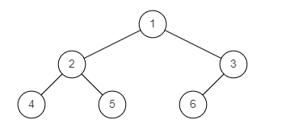
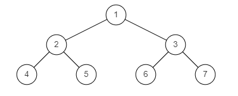
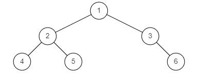

# 判断是否是完全二叉树

## 0.题目

给定一个二叉树，确定他是否是一个完全二叉树。

完全二叉树的定义：若二叉树的深度为 h，除第 h 层外，其它各层的结点数都达到最大个数，第 h 层所有的叶子结点都连续集中在最左边，这就是完全二叉树。（第 h 层可能包含 [1~2h] 个节点）

数据范围：节点数满足 1 <= n <= 100

样例图1：


样例图2：


样例图3：



示例1
```
输入：
{1,2,3,4,5,6}
返回值：
true
```
示例2
```
输入：
{1,2,3,4,5,6,7}
返回值：
true
```
示例3
```
输入：
{1,2,3,4,5,#,6}
返回值：
false
```


## 1.我的解题
使用的层序遍历，调试了几次加了好几次判断才完成。

```java
package learn.note.algorithm.binarytree;

import java.util.LinkedList;
import java.util.Queue;

/**
 * 是否是完全二叉树
 * @author WangWenLei
 * @DATE: 2022/3/18
 **/
public class Bm35_IsCompleteTree {
    public static void main(String[] args) {
        TreeNode tree = CreateTree.createTree();
        boolean completeTree = isCompleteTree(tree);
    }

    public static boolean isCompleteTree (TreeNode root) {
        if (root == null) {
            return true;
        }
        Queue<TreeNode> queue = new LinkedList<>();
        queue.add(root);
        boolean isLeaf = false;
        while (!queue.isEmpty()) {
            TreeNode poll = queue.poll();
            if (poll == null && !queue.isEmpty()) {
                return false;
            } else if (poll == null) {
                return true;
            }
            if (poll.left != null && poll.right != null) {
                queue.add(poll.left);
                queue.add(poll.right);
            } else if (poll.left != null) {
                queue.add(poll.left);
                queue.add(null);
            } else if (poll.right != null){
                return false;
            } else {
                isLeaf = true;
            }
            boolean hasNode = poll.left != null || poll.right != null;
            if (isLeaf && hasNode) {
                return false;
            }
        }
        return true;
    }
}

```

## 2.学习他人解法
### 2.1层次解法
判断逻辑真简洁
```java
public boolean isCompleteTree (TreeNode root) {
    //标记空节点
    boolean left =  true;
    if(root == null)
            return true;
    Queue<TreeNode> queue = new LinkedList<>();
    queue.offer(root);
    while(!queue.isEmpty()){
        TreeNode nowNode = queue.poll();
        //说明当前节点是空节点
        if(nowNode == null){
            left = false;
        }else{
            // 遇到空节点直接返回false
            if(left == false)
                return false;
            queue.offer(nowNode.left);
            queue.offer(nowNode.right);
        }
    }
    return true;
}
```

### 2.2深度遍历
原理：完全二叉树结点个数满足

$
count(i_{left}) = i^2
$

$
count(i_{right}) = i^2 + 1
$

啥意思呢：就是说只要结点到达了i这个地方，如果想要是完全二叉树必须有`count(i_{left})或count(i_{left})`这么这么多结点。

那么如下代码就清晰了：统计了2个数
1. 总计有多少结点，每次迭代返回就是在统计
2. ans统计若要要满足当前这棵树成为完全二叉树需要多少结点。

结论如果这棵树的结点与完全二叉树需要结点一致则这棵树是完全二叉树。

```java
public class Solution {
    int ans = 0;
    int dfs(TreeNode root, int idx){
        if(root == null) return 0;
        ans = Math.max(ans, idx);
      //遍历左右子树
        return 1 + dfs(root.left, idx * 2) + dfs(root.right, idx * 2 + 1);
    }
    public boolean isCompleteTree (TreeNode root) {
      // dfs判断节点的序号是否等于编号
        return dfs(root, 1) == ans;
    }
}
```