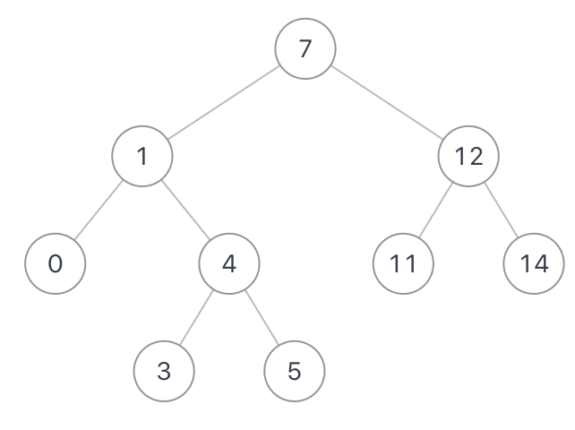

# 二叉搜索树的最近公共祖先

## 0.题目
给定一个二叉搜索树, 找到该树中两个指定节点的最近公共祖先。
1.对于该题的最近的公共祖先定义:对于有根树T的两个节点p、q，最近公共祖先LCA(T,p,q)表示一个节点x，满足x是p和q的祖先且x的深度尽可能大。在这里，一个节点也可以是它自己的祖先.
2.二叉搜索树是若它的左子树不空，则左子树上所有节点的值均小于它的根节点的值； 若它的右子树不空，则右子树上所有节点的值均大于它的根节点的值
3.所有节点的值都是唯一的。
4.p、q 为不同节点且均存在于给定的二叉搜索树中。
数据范围:
3<=节点总数<=10000
0<=节点值<=10000

如果给定以下搜索二叉树: {7,1,12,0,4,11,14,#,#,3,5}，如下图:



示例1
```
输入：
{7,1,12,0,4,11,14,#,#,3,5},1,12
返回值：
7
说明：
节点1 和 节点12的最近公共祖先是7   
```
示例2

```
输入：
{7,1,12,0,4,11,14,#,#,3,5},12,11
返回值：
12
说明：
因为一个节点也可以是它自己的祖先.所以输出12   
```

## 1.思路
根据二叉搜索树的特性，一个结点值比左子树结点值都大，结点值比右子树值都小
那么，

结点值比p、q都小就去它的左子树

结点值比p、q都大就去它的右子树

其余情况，或跟p相等或跟q相等。即为要么p是q的祖先，要么q是p的祖先，直接返回这个节点即可

没找到就去它的子找，找到就返回，返回后什么也不做，一直返回到栈的最底层跳出方法

> 考虑：
> 1. 题目约束p、q在树内
> 2. 题目约束至少3个结点

## 2.代码
```java
public class Bm37_LowestCommonAncestor {
    public static void main(String[] args) {
        TreeNode tree = CreateTree.createTree();
        System.out.println();
    }

    public int lowestCommonAncestor (TreeNode root, int p, int q) {
        return lowestCommon(root,p,q).val;
    }

    public TreeNode lowestCommon (TreeNode root, int p, int q) {
        if (root == null) {
            return new TreeNode(0);
        }
        if (root.val > p && root.val > q) {
            return lowestCommon (root.left, p, q) ;
        } else if (root.val < p && root.val < q) {
            return lowestCommon (root.right, p, q) ;
        } else {
            return root;
        }
    }
}
```