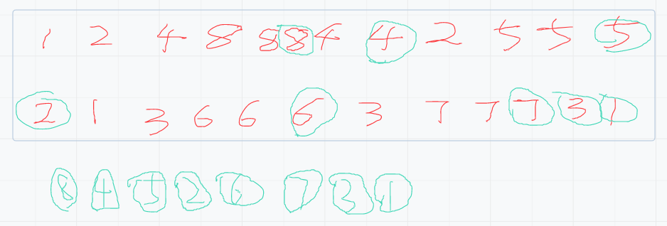

# （三）二叉树之后序遍历

## 0.前言

## 1.递归遍历
### 1.1思路
递归树在第三区直接打印，即为后序遍历



### 1.2代码
```java
package learn.note.algorithm.binarytree;

import java.util.ArrayList;
import java.util.List;
import java.util.Stack;

/**
 * @author WangWenLei
 * @DATE: 2022/3/9
 **/
public class Main {
    public static TreeNode createTree () {
        TreeNode node1 = new TreeNode(1);
        TreeNode node2 = new TreeNode(2);
        TreeNode node3 = new TreeNode(3);
        TreeNode node4 = new TreeNode(4);
        TreeNode node5 = new TreeNode(5);
        TreeNode node6 = new TreeNode(6);
        TreeNode node7 = new TreeNode(7);
        TreeNode node8 = new TreeNode(8);

        node1.left = node2;
        node1.right = node3;
        node2.left = node4;
        node2.right = node5;
        node3.left = node6;
        node3.right = node7;
        node4.left = node8;

        return node1;
    }

    public static void main(String[] args) {
        TreeNode root = createTree();
//        int[] ints = preorderTraversal(root);
        int[] ints = postorderTraversal(root);
        for ( int i = 0 ; i < ints.length ; i++) {
            if (i == (ints.length - 1)) {
                System.out.println(ints[i]);
            } else {
                System.out.print(ints[i] + ",");
            }
        }
    }

    /**
     * 后序遍历-递归
     * @param root 根节点
     * @return 所有节点的数组
     */
    public static int[] postorderTraversal (TreeNode root) {
        List<TreeNode> list = new ArrayList<>();
        postorderTraversal(root,list);
        int [] data = new int[list.size()];
        for (int i = 0 ; i < list.size() ;i ++) {
            data[i] = list.get(i).val;
        }
        return data;
    }

    public static void postorderTraversal (TreeNode root,List<TreeNode> list) {
        if (root == null) {
            return;
        }
        postorderTraversal(root.left,list);
        postorderTraversal(root.right,list);
        list.add(root);
    }
}

```

## 2.非递归遍历

### 2.1思路

### 2.2代码