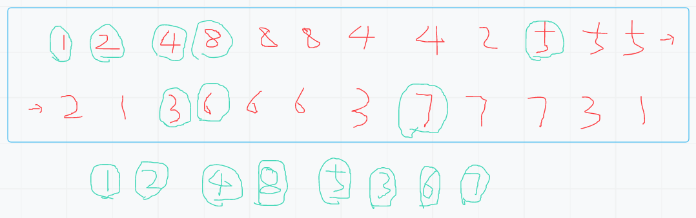
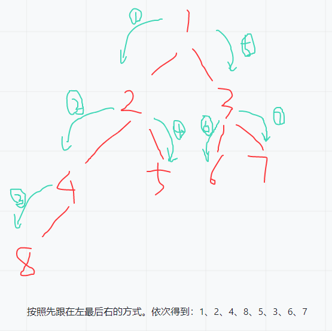

# （一）二叉树遍历之先序遍历

## 0.前言
先序遍历：二叉树先根，再左结点，最后有结点。树中没个结点都是如此，输出的遍历的顺序为先序遍历。

## 1.递归遍历
### 1.1思路
在开始之前，先来了解递归结构。
```java
public static void process(TreeNode root) {
    if (root == null) { return; }
    // 一区
    process(root.left);
    // 二区
    process(root.right);
    // 三区
}
```
每个针对二叉树的递归结构，都能划分为3个区域。函数进入到左子树调用递归开始为第一区、左子树调用递归结束到右子树调用递归开始为第二区、右子树调用递归结束到方法结束为第三区。
所有的节点都会经历这3个区域。这样我们就可以在这些区域搞些事情。



第一区输出（即为一进入这个节点我就打印），得到的就是先序遍历的结果。



### 1.2代码
```java
package learn.note.algorithm.binarytree;

import java.util.ArrayList;
import java.util.List;

/**
 * @author WangWenLei
 * @DATE: 2022/3/9
 **/
public class Main {
    public static TreeNode createTree () {
        TreeNode node1 = new TreeNode(1);
        TreeNode node2 = new TreeNode(2);
        TreeNode node3 = new TreeNode(3);
        TreeNode node4 = new TreeNode(4);
        TreeNode node5 = new TreeNode(5);
        TreeNode node6 = new TreeNode(6);
        TreeNode node7 = new TreeNode(7);
        TreeNode node8 = new TreeNode(8);

        node1.left = node2;
        node1.right = node3;
        node2.left = node4;
        node2.right = node5;
        node3.left = node6;
        node3.right = node7;
        node4.left = node8;

        return node1;
    }

    public static void main(String[] args) {
        TreeNode root = createTree();
        int[] ints = preorderTraversal(root);
        System.out.println(ints);
    }

    /**
     * 前序遍历-递归
     * @param root 根节点
     * @return 所有节点的数组
     */
    public static int[] preorderTraversal (TreeNode root) {
        List<TreeNode> list = new ArrayList<>();
        preorderTraversal(root,list);
        int [] data = new int [list.size()];
        for (int i = 0 ; i < list.size() ; i++) {
            data[i] = list.get(i).val;
        }
        return data;
    }

    public static void preorderTraversal(TreeNode root, List<TreeNode> list) {
        if (root == null) {
            return;
        }
        list.add(root);
        preorderTraversal(root.left,list);
        preorderTraversal(root.right,list);
    }
}

```

## 2.非递归遍历

### 2.1思路
非递归就得自己压栈，所以需要栈结构.
执行思路：
1. 先把头结点压入栈中
2. 弹出就打印
3. 先压入右结点，再压入左结点
4. 循环往复直到栈空

### 2.2代码
```java
/**
    * 前序遍历-非递归
    * @param root 根节点
    * @return 所有节点的数组
    */
public static int[] preorderTraversalNoRecursion (TreeNode root) {
    List<TreeNode> list = new ArrayList<>();
    if (root == null) {
        return new int[]{};
    }
    Stack<TreeNode> stack = new Stack<>();
    stack.push(root);
    while (!stack.empty()) {
        TreeNode node = stack.pop();
        list.add(node);
        if (node.right != null) {
            stack.push(node.right);
        }
        if (node.left != null) {
            stack.push(node.left);
        }
    }
    int [] data = new int [list.size()];
    for (int i = 0 ; i < list.size() ; i++) {
        data[i] = list.get(i).val;
    }
    return data;
}
```


