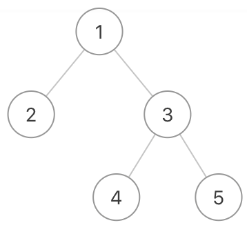
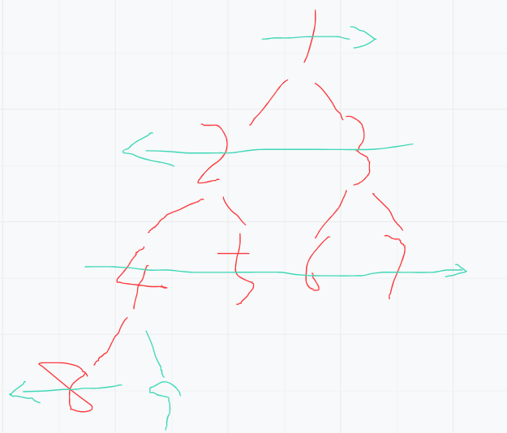
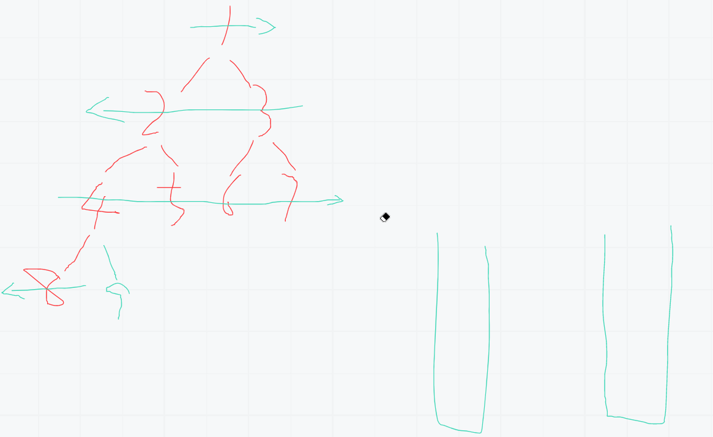

# 二叉树遍历之蛇形打印

## 0.题目
给定一个二叉树，返回该二叉树的之字形层序遍历，（第一层从左向右，下一层从右向左，一直这样交替）

数据范围：0 < n < 15000≤n≤1500,树上每个节点的val满足 |val| <= 1500∣val∣<=1500
要求：空间复杂度：O(n)O(n)，时间复杂度：O(n)O(n)
例如：
给定的二叉树是{1,2,3,#,#,4,5}



该二叉树之字形层序遍历的结果是
[
[1],
[3,2],
[4,5]
]

## 1.思路

理解题意打印顺序如下：



瞅着图，上一行与下一行的顺序相反。为了理解简单一下我们弄2个栈，一个栈存从左向右顺序的s1，一个存从右向左顺序的s2。
1. 首先先把头结点压入s1
2. 从s1中弹出结点就打印。先压右结点到s2，再压左结点到s2。循环把s1弹空
3. 结算s1成果，s1全部弹空标识本行结束
4. 从s2中弹出结点就打印。先压左结点到s1，再压右结点到s1。循环把s2弹空
5. 结算s2成果，s2全部弹空标识本行结束
6. 周而复始，完成全部行

看下流程：




## 2.代码
```java
package learn.note.algorithm.binarytree;

import java.util.*;

/**
 * 蛇形打印遍历二叉树
 * @author WangWenLei
 * @DATE: 2022/3/11
 **/
public class Bm27_Print {
    public static TreeNode createTree () {
        TreeNode node1 = new TreeNode(1);
        TreeNode node2 = new TreeNode(2);
        TreeNode node3 = new TreeNode(3);
        TreeNode node4 = new TreeNode(4);
        TreeNode node5 = new TreeNode(5);
        TreeNode node6 = new TreeNode(6);
        TreeNode node7 = new TreeNode(7);
        TreeNode node8 = new TreeNode(8);
        TreeNode node9 = new TreeNode(9);

        node1.left = node2;
        node1.right = node3;
        node2.left = node4;
        node2.right = node5;
        node3.left = node6;
        node3.right = node7;
        node4.left = node8;
        node4.right = node9;

        return node1;
    }

    public static void main(String[] args) {
        ArrayList<ArrayList<Integer>> print = print(createTree());
        System.out.println(print);
    }

    public static ArrayList<ArrayList<Integer>> print(TreeNode pRoot) {
        if (pRoot == null) {
            return new ArrayList<>();
        }

        ArrayList<ArrayList<Integer>> lists = new ArrayList<>();
        ArrayList<Integer> list = new ArrayList<>();
        Stack<TreeNode> s1 = new Stack<>();
        Stack<TreeNode> s2 = new Stack<>();
        s1.push(pRoot);

        while (!s1.isEmpty() || !s2.isEmpty()) {
            while (!s1.isEmpty()) {
                TreeNode pop = s1.pop();
                list.add(pop.val);
                if (pop.left != null) {
                    s2.add(pop.left);
                }
                if (pop.right != null) {
                    s2.add(pop.right);
                }
            }
            if (!list.isEmpty()) {
                lists.add(list);
                list = new ArrayList<>();
            }

            while (!s2.isEmpty()) {
                TreeNode pop = s2.pop();
                list.add(pop.val);
                if (pop.right != null) {
                    s1.add(pop.right);
                }
                if (pop.left != null) {
                    s1.add(pop.left);
                }

            }
            if (!list.isEmpty()) {
                lists.add(list);
                list = new ArrayList<>();
            }
        }

        return lists;
    }

}

```