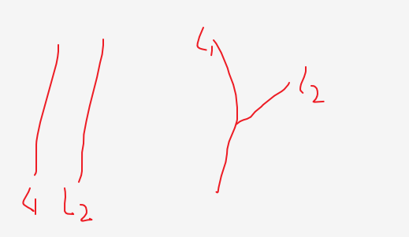

# 两个链表的第一个公共结点

## 描述

输入两个无环的单向链表，找出它们的第一个公共结点，如果没有公共节点则返回空。（注意因为传入数据是链表，所以错误测试数据的提示是用其他方式显示的，保证传入数据是正确的）

数据范围： n ≤ 1000n≤1000

要求：空间复杂度 O(1)，时间复杂度 O(n)

## 解题思路
两个链表的状态只有2中，相交、不想交



### 空间复杂度O(n)版本
通过上面分析得到第一交点，以后每个都是他们的交点
1. 使用Hash结构存一个链表中的每个节点
2. 循环另一个链表遇到第一个在Hash结构中的节点就是交点
3. 没有得到，表示两个链表没有相交

### 空间复杂度O(1)版本
1. 通过上面分析得到第一交点，以后每个都是他们的交点。
2. 那么我们让长的链表先跑出一部分，让与短的长度一致。
3. 再同步往后走，得到交点或没有交点。

## 实现代码
### 空间复杂度O(n)版本
使用Hash结构
```java
import java.util.Map;
import java.util.HashMap;
public class Solution {
    public ListNode FindFirstCommonNode(ListNode pHead1, ListNode pHead2) {
        Map<ListNode,ListNode> map = new HashMap<>();
        ListNode next = pHead1;
        while (next != null) {
            map.put(next,next);
            next = next.next;
        }
        next = pHead2;
        while (next != null) {
            ListNode cur = map.get(next);
            if (cur != null) {
                return cur;
            }
            next = next.next;
        }
        return null;
    }
}
```

### 空间复杂度O(1)版本
```java
public class Solution {
    public ListNode FindFirstCommonNode(ListNode pHead1, ListNode pHead2) {
        if (pHead1 == null || pHead2 == null) {
            return null;
        }
        ListNode next1 = pHead1;
        int num1 = 0;
        while (next1 != null) {
            num1 ++;
            next1 = next1.next;
        }
        ListNode next2 = pHead2;
        int num2 = 0;
        while (next2 != null) {
            num2 ++;
            next2 = next2.next;
        }

        // 链表先跑出一部分
        next1 = pHead1;
        next2 = pHead2;
        if (num1 > num2) {
            int s = num1 - num2;
            for (int i = 0 ; i < s ; i++) {
                next1 = next1.next;
            }
        } else if (num2 > num1) {
            int s = num2 - num1;
            for (int i = 0 ; i < s ; i++) {
                next2 = next2.next;
            }
        }

        // 再同步往后走
        while (next1 != null && next2 != null) {
            if (next2 == next1) {
                return next1;
            } else {
                next1 = next1.next;
                next2 = next2.next;
            }
        }
        return null;
    }
}
```