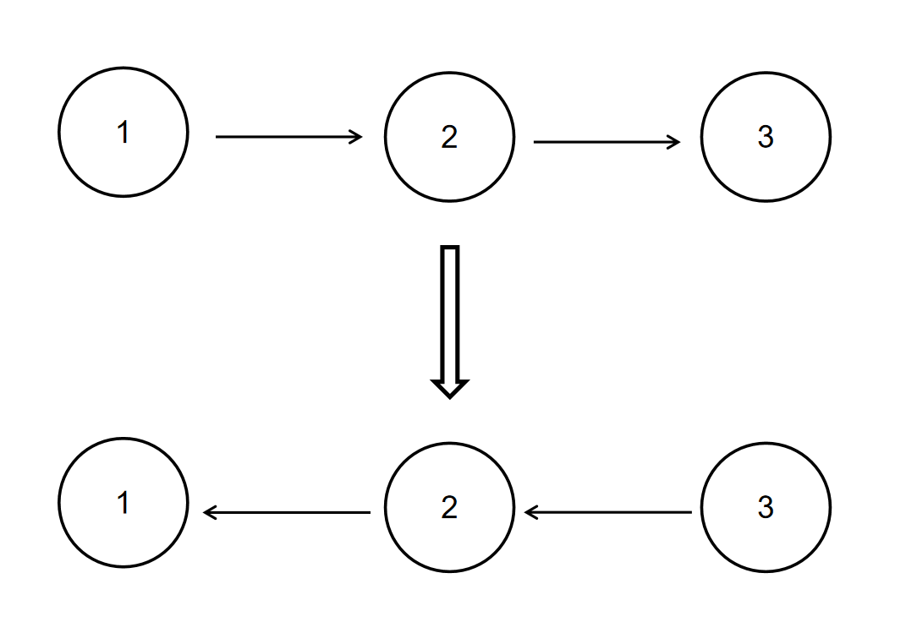

# 链表反转

## 1.描述
给定一个单链表的头结点pHead(该头节点是有值的，比如在下图，它的val是1)，长度为n，反转该链表后，返回新链表的表头。

数据范围： 0\leq n\leq10000≤n≤1000
要求：空间复杂度 O(1)O(1) ，时间复杂度 O(n)O(n) 。

如当输入链表{1,2,3}时，
经反转后，原链表变为{3,2,1}，所以对应的输出为{3,2,1}。
以上转换过程如下图所示：

示例1
```java
    输入：
    {1,2,3}
    返回值：
    {3,2,1}
```
示例2
```java
    输入：
    {}
    返回值：
    {}
    说明：
    空链表则输出空 
```

## 2.解法一
使用栈来达到反转的目的，会占用空间
```java
public static ListNode stack(ListNode head) {
    if (head == null) return null;
    ListNode next = head;
    Stack<ListNode> stack = new Stack<>();
    while (next != null) {
        stack.push(next);
        next = next.next;
    }
    ListNode overHead = stack.pop();
    ListNode overNext = overHead;
    while (!stack.empty()) {
        overNext.next = stack.pop();
        overNext = overNext.next;
    }
    overNext.next = null;
    return overHead;
}
```

## 3.解法二
使用中间变量，不断调换达到反转的目的
```java
private static ListNode O1(ListNode head) {
    if (head == null) return null;
    ListNode cur = head;
    ListNode pre = null;
    while (cur != null) {
        ListNode next = cur.next;
        cur.next = pre;
        pre = cur;
        cur = next;
    }
    return pre;
}
```