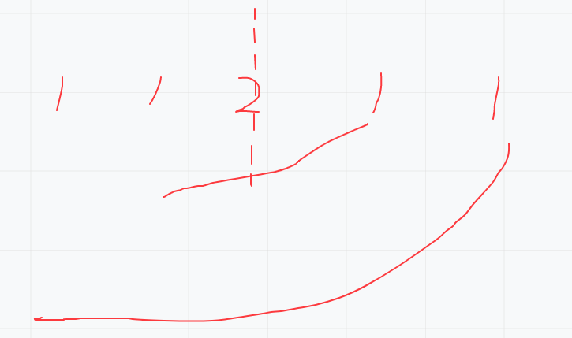

# 判断链表是否是回文结构

## 1.题目
给定一个链表，请判断该链表是否为回文结构。
回文是指该字符串正序逆序完全一致。
数据范围： 链表节点数 $0 \le n \le 10^50≤n≤10^5 $，链表中每个节点的值满足 $|val| \le 10^7∣val∣≤10 ^7$

示例1
输入：
{1}
返回值：
true
示例2
输入：
{2,1}
返回值：
false
说明：
2->1     
示例3
输入：
{1,2,2,1}
返回值：
true
说明：
1->2->2->1     

## 2.思路
把后半部分折过来如果相同就是回文结构。

怎么做呢？
1. **简单方法**：循环一遍链表，把每个元素压入栈中。重新从头开始同时弹栈进行比较直到栈空，每个元素都相同表示是回文结构，反之不是。
2. **节省一半空间方法**：快慢指针找到中点，把中点后半部分压入栈中。重新从头开始同时弹栈进行比较直到栈空，每个元素都相同表示是回文结构，反之不是。
3. **空间复杂度O(1)方法**：快慢指针找到中点，把中点后半部分逆序。逆序后，一个从头开始，一个从尾开始，进行比较。直到有一个为空，如果都相同为回文结构，有一个不相同不是回文结构，恢复链表结构返回。

## 3.代码
```java
package learn.note.algorithm.list.list02;

import learn.note.algorithm.list.ListNode;

import java.util.Stack;

/**
 * 判断链表是否是回文结构
 *  1.快慢指针
 * @Author Wang WenLei
 * @Date 2022/3/5 20:44
 * @Version 1.0
 **/
public class Main {
    private static ListNode createList() {
        ListNode node1 = new ListNode(1);
        ListNode node2 = new ListNode(1);
        ListNode node3 = new ListNode(2);
        ListNode node4 = new ListNode(2);
        ListNode node5 = new ListNode(1);
        ListNode node6 = new ListNode(1);

        node1.next = node2;
        node2.next = node3;
        node3.next = node4;
        node4.next = node5;
        node5.next = node6;
        return node1;
    }
    
    public static void main(String[] args) {
        ListNode list = createList();
//        boolean tag = getNode(list);
        boolean tag = getNodeO1(list);
        System.out.println(tag);
    }

    /**
     * 使用栈的方式
     * @param head 头结点
     * @return 是否是回文结构
     */
    private static boolean getNode(ListNode head) {
        if (head == null) return false;
        ListNode next = head;
        ListNode next2 = head.next;
        while (next2 != null && next2.next != null) {
            next2 = next2.next.next;
            next = next.next;
        }

        Stack<ListNode> stack = new Stack<>();
        while (next != null) {
            stack.push(next);
            next = next.next;
        }
        ListNode next3 = head;
        while (!stack.empty()) {
            if (next3.val != stack.pop().val) {
                return false;
            }
            next3 = next3.next;
        }
        return true;
    }

    private static boolean getNodeO1(ListNode head) {
        if (head == null) return false;

        // 0. 快慢指针找到中点
        ListNode fast = head.next;
        ListNode low = head;
        // 奇数个时的判断条件 && 偶数个时的判断条件
        while (fast != null && fast.next != null) {
            // 快指针一次走2步
            fast = fast.next.next;
            // 慢指针一次走1步
            low = low.next;
        }
        if (fast != null) {
            // 偶数个
            fast = low.next;
            low.next = null;
        } else {
            fast = low;
        }
        // 1. 把中点后链表逆序，不使用栈方式，完成后next就是头
        ListNode head2 = null;

        while (fast != null) {
            ListNode cur = fast.next;
            fast.next = head2;
            head2 = fast;
            fast = cur;
        }

        ListNode head1Next = head;
        ListNode head2Next = head2;
        boolean tag = true;
        while (head2Next != null && head1Next != null) {
            if (head2Next.val != head1Next.val) { tag = false;}
            head2Next = head2Next.next;
            head1Next = head1Next.next;
        }

        // 2. 恢复链表结构
        head1Next = head;
        head2Next = head2;
        ListNode reover = null;
        while (head2Next != null) {
            ListNode cur = head2Next.next;
            head2Next.next = reover;
            reover = head2Next;
            head2Next = cur;
        }
        while (head1Next.next != null) {
            head1Next = head1Next.next;
        }
        head1Next.next = reover;


        return tag;
    }
}

```