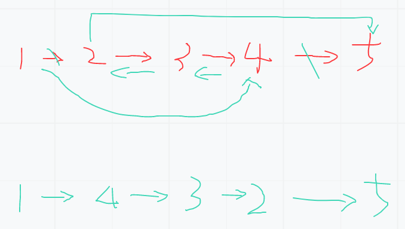

# 链表内指定区间翻转

## 题目
将一个节点数为 size 链表 m 位置到 n 位置之间的区间反转，要求时间复杂度 O(n)O(n)，空间复杂度 O(1)O(1)。
例如：
给出的链表为 1→ 2 → 3 → 4 → 5 → NULL1→2→3→4→5→NULL, m=2,n=4
返回 1→ 4→ 3→ 2→ 5→ NULL1→4→3→2→5→NULL.

数据范围： 链表长度 0 < size <= 10000<size≤1000，0 < m <= n <= size0<m≤n≤size，链表中每个节点的值满足 |val| <= 1000∣val∣≤1000
## 思路



## 解法
```java
package learn.note.algorithm.list.list03;

import learn.note.algorithm.list.ListNode;

/**
 * 链表内指定区间反转
 * 
 * @author WangWenLei
 * @DATE: 2022/3/8
 **/
public class Main {
    private static ListNode createList() {
        ListNode node1 = new ListNode(-3);
        ListNode node2 = new ListNode(-4);
        ListNode node3 = new ListNode(2);
        ListNode node4 = new ListNode(-3);
        ListNode node5 = new ListNode(-1);
        ListNode node6 = new ListNode(4);
        ListNode node7 = new ListNode(-4);
        ListNode node8 = new ListNode(4);

        node1.next = node2;
        node2.next = node3;
        node3.next = node4;
        node4.next = node5;
        node5.next = node6;
        node6.next = node7;
        node7.next = node8;
        return node1;
    }
    
    public static void main(String[] args) {
        ListNode list = createList();
        ListNode head = reverseBetween(list,2,7);
        System.out.println(head);
    }

    public static ListNode reverseBetween (ListNode head, int m, int n) {
        if(head == null) {
            return null;
        }
        if (head.next == null) {
            return head;
        }

        if (m != n) {
            ListNode next = head;
            int index = 0;
            ListNode mHead = null;
            ListNode nHead = null;
            while (next != null) {
                index ++ ;
                if (index == m - 1) {
                    mHead = next;
                }
                if (index == n + 1) {
                    nHead = next;
                }
                next = next.next;
            }

            ListNode head1 = null;
            next = head;
            index = 0;
            while (next != null) {
                index ++ ;
                ListNode cur = next.next;
                if (index >= m && index <= n) {
                    next.next = head1;
                    head1 = next;
                }
                next = cur;
            }
            next = head1 ;
            while (next.next != null) {
                next = next.next;
            }
            if (mHead == null && nHead == null) {
                head = head1;
            }
            if (mHead != null) {
                mHead.next = head1;
            } else {
                head = head1;
            }
            if (nHead != null){
                next.next = nHead;
            }

        }
        return head;
    }
}

```