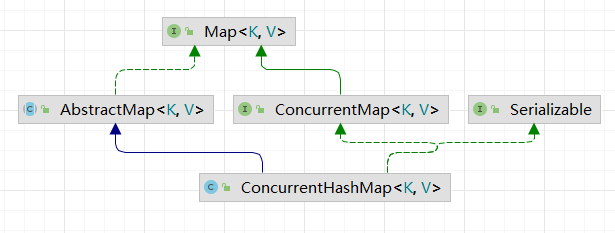

# ConcurrentMap
线程安全的Map

## 类图

## 介绍
此哈希表的主要设计目标是保持并发可读性（通常是方法 get()，但也包括迭代器和相关方法），同时尽量减少更新争用。次要目标是保持空间消耗与 java.util.HashMap 大致相同或更好，并支持许多线程在空表上的高初始插入率。

## ConcurrentMap与HashMap的区别

## ConcurrentMap是如何实现的

## ConcurrentMap是怎么分段分组的