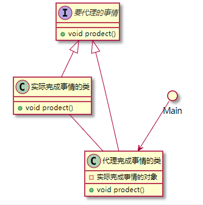
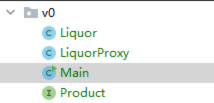
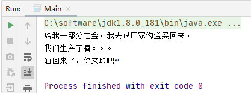
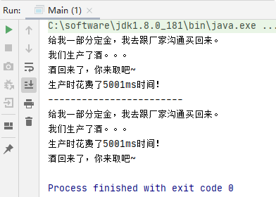
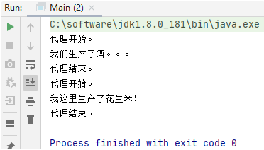
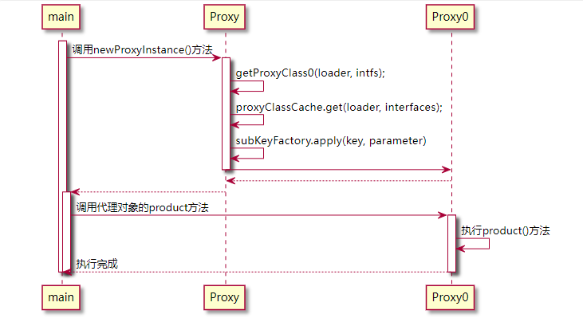

# Java的代理

Java的代理有2中，JDK动态代理和CGLIB代理

代理：代而理之

## 一、JDK动态代理

Java自带

### 1.1静态代理

#### 代理一个

我要买酒，现在肯定不是去酒厂直接买酒，我们要去酒厂的分销商（也就是酒厂的代理）去买，我们得到的也是酒，但我们还能在这个分销商这看到别的跟酒厂不一样的东西，比如，代理商给酒包的酒做了装饰更好看了价格更贵了，等。然后才面向我们销售产品，这个代理商做的事情就是代理。

##### 类关系



图中显示很明显我们的类和接口加起来需要4个



```java
/**
 * 抽象类
 * @author WangWenLei
 */
public interface Product {
    /**
     * 生产酒
     */
    void product();
}

/**
 * 酒厂
 * @author WangWenLei
 * @DATE: 2021/4/7
 **/
public class Liquor implements Product {
    @Override
    public void product(){
        System.out.println("我们生产了酒。。。");
    }
}

/**
 * 酒厂代理
 * @author WangWenLei
 * @DATE: 2021/4/7
 **/
public class LiquorProxy implements Product {
    Liquor liquor;

    public LiquorProxy(Liquor liquor) {
        this.liquor = liquor;
    }

    @Override
    public void product() {
        System.out.println("给我一部分定金，我去跟厂家沟通买回来。");
        liquor.product();
        System.out.println("酒回来了，你来取吧~");
    }
}

/**
 * 调用者
 * @author WangWenLei
 * @DATE: 2021/4/7
 **/
public class Main {
    public static void main(String[] args) {
        LiquorProxy liquorProxy = new LiquorProxy(new Liquor());
        liquorProxy.product();
    }
}
```

##### 实现效果



#### 代理多个

我在买酒时既不想去找酒厂沟通，还想知道我买到酒花费了多长时间，你得告我去取酒，你还得告诉我造酒花费了多长时间。

这里如果单独统计多长时间我们可以向上一节一样把他使用一个单独的代理来实现。但是面对现在的需求上节方法可行性差，要2个或多个任务一起，一个一个搞太复杂不好实现。

上节我们是把Liquor传入我们的代理类，现在我们既想代理卖酒又想统计时间，这里就不能是固定的Liquor，需要是他的抽象类对象，这样我们才能把同样是实现抽象类的类传进来，进行逐层的反复的使用。

```java
/**
 * 抽象类
 * @author WangWenLei
 */
public interface Product {
    /**
     * 生产酒
     */
    void product();
}

/**
 * 酒厂
 * @author WangWenLei
 * @DATE: 2021/4/7
 **/
public class Liquor implements Product {
    @Override
    public void product(){
        System.out.println("我们生产了酒。。。");
        try {
            // 线程休息5秒钟
            Thread.sleep(5000);
        } catch (InterruptedException e) {
            e.printStackTrace();
        }
    }
}

/**
 * 酒厂代理
 * @author WangWenLei
 * @DATE: 2021/4/7
 **/
public class LiquorProxy implements Product {
    Product product;

    public LiquorProxy(Product product) {
        this.product = product;
    }

    @Override
    public void product() {
        System.out.println("给我一部分定金，我去跟厂家沟通买回来。");
        product.product();
        System.out.println("酒回来了，你来取吧~");
    }
}

/**
 * 生产需要花费的时间
 * @author WangWenLei
 * @DATE: 2021/4/7
 **/
public class ProductTimeProxy implements Product{
    public ProductTimeProxy(Product product) {
        this.product = product;
    }

    Product product;
    @Override
    public void product() {
        //开始时间
        long start = System.currentTimeMillis();
        product.product();
        long end = System.currentTimeMillis();
        System.out.println("生产时花费了" + (end - start) + "ms时间！");
    }
}

/**
 * 调用者：代理酒厂还要统计花费多长时间
 * @author WangWenLei
 * @DATE: 2021/4/7
 **/
public class Main {
    public static void main(String[] args) {
        // 先沟通买酒后统计总时间
        Product product1 = new ProductTimeProxy(new LiquorProxy(new Liquor()));
        product1.product();

        System.out.println("------------------------");

        // 先统计造酒花费时间再沟通买酒
        Product product2 = new LiquorProxy(new ProductTimeProxy(new Liquor()));
        product2.product();
    }
}
```

##### 实现效果



### 1.2JDK动态代理

我买了酒还不满足，我想在买酒的地方买花生米，这就需要代理商不止代理的酒厂，还要代理花生米厂

静态代理是固定的一个类，现在需要不同的类，所以此时的类就不是固定的需要动态生成，故叫动态代理

#### 先来用一下

代理类实现`InvocationHandler`接口，重写`public Object invoke(Object proxy, Method method, Object[] args) throws Throwable{}`方法


```java
/**
 * 抽象类
 * @author WangWenLei
 */
public interface Product {
    /**
     * 生产酒
     */
    void product();
}

/**
 * 酒厂
 * @author WangWenLei
 * @DATE: 2021/4/7
 **/
public class Liquor implements Product {
    @Override
    public void product(){
        System.out.println("我们生产了酒。。。");
    }
}

/**
 * 花生米工厂
 * @author WangWenLei
 * @DATE: 2021/4/7
 **/
public class Peanut implements Product {
    @Override
    public void product() {
        System.out.println("我这里生产了花生米！");
    }
}

/**
 * 代理商
 * @author WangWenLei
 * @DATE: 2021/4/7
 **/
public class AnyProxy implements InvocationHandler {
    private final Object object;
    public AnyProxy(Object object) {
        this.object = object;
    }

    @Override
    public Object invoke(Object proxy, Method method, Object[] args) throws Throwable {
        System.out.println("代理开始。");
        Object invoke = method.invoke(object,args);
        System.out.println("代理结束。");
        return invoke;
    }
}

/**
 * 调用者
 * @author WangWenLei
 * @DATE: 2021/4/7
 **/
public class Main {
    public static void main(String[] args) {
        // 酒
        Product liquor = new Liquor();
        // 花生米
        Product peanut = new Peanut();

        // 代理酒做什么事情
        AnyProxy handler1 = new AnyProxy(liquor);
        // 代理花生米做什么事情
        AnyProxy handler2 = new AnyProxy(peanut);

        // 建立与酒的代理关系
        Product product1 = (Product) Proxy.newProxyInstance(liquor.getClass().getClassLoader(), liquor.getClass().getInterfaces(),handler1);
        // 建立与花生米的代理关系
        Product product2 = (Product) Proxy.newProxyInstance(peanut.getClass().getClassLoader(), peanut.getClass().getInterfaces(),handler2);

        // 调用代理方法
        product1.product();
        product2.product();
    }
}
```

#### 实现效果



### 1.3理解JDK动态代理

背后动作需要理解下，发现我们是没有调用invoke方法的，但实际打印出的效果是调用了这个方法，所以他肯定是在背后产生了一个逻辑让程序隐性调用了这个方法。

#### 首先我们看他生成代理类的内容

在main方法的第一句加上下面的代码，让产生保存生成代理类的代码

```java
// 设置固化生成的代理文件
System.getProperties().setProperty("sun.misc.ProxyGenerator.saveGeneratedFiles","true");
```

运行程序后会发现在我们的根目录，出现了com的文件夹


#### 分析代理类代码

```java
//
// Source code recreated from a .class file by IntelliJ IDEA
// (powered by FernFlower decompiler)
// 说：资源代码是由IDEA通过FernFlower反编译提供创建的.class文件
//

// 代理类生成包名
package com.sun.proxy;

import com.wenwen.blog.service.learn.proxy.v3.Product;
import java.lang.reflect.InvocationHandler;
import java.lang.reflect.Method;
import java.lang.reflect.Proxy;
import java.lang.reflect.UndeclaredThrowableException;

// 代理类名 ： $Proxy0
// 继承 Proxy
// 实现 Product —— Product是我们自己的抽象类
public final class $Proxy0 extends Proxy implements Product {
    private static Method m1;
    private static Method m2;
    private static Method m3;
    private static Method m0;

    // *【0】发现 InvocationHandler 类型的 var1 虚参构成的构造方法：我们的代理商实现了InvocationHandler类，由newProxyInstance的
    // 的第4个参数传入
    public $Proxy0(InvocationHandler var1) throws  {
        super(var1);
    }

    // 每个类都有的equals，这个是通用用的，不用太关注
    public final boolean equals(Object var1) throws  {
        try {
            return (Boolean)super.h.invoke(this, m1, new Object[]{var1});
        } catch (RuntimeException | Error var3) {
            throw var3;
        } catch (Throwable var4) {
            throw new UndeclaredThrowableException(var4);
        }
    }

    // 每个类都有的toString，这个是通用用的，不用太关注
    public final String toString() throws  {
        try {
            return (String)super.h.invoke(this, m2, (Object[])null);
        } catch (RuntimeException | Error var2) {
            throw var2;
        } catch (Throwable var3) {
            throw new UndeclaredThrowableException(var3);
        }
    }

    // *【1】这个很重要
    // 发现没有，这个方法才是我们main中实际调用的方法
    public final void product() throws  {
        try {
            // 方法里调用了父类里的h参数的invoke方法
                // 这个类的父类是Proxy，Proxy的h是怎么来的：看上面本类的构造方法【0】的位置，那里调用的父类的构造方法，
                // 并传入InvocationHandler 类型的 var1。
                // 看下Proxy的构造方法:
                // protected InvocationHandler h;
                // protected Proxy(InvocationHandler h) {
                //     Objects.requireNonNull(h);
                //     this.h = h;
                // }
            // invoke方法，这里的这个方法就是我们写的AnyProxy里的invoke方法，传了3个参数
                // 1. this : main方法中newProxyInstance出来的当前类对象
                // 2. m3 :  Class.forName("com.wenwen.blog.service.learn.proxy.v3.Product").getMethod("product");
            	// 		实际要执行的代理方法，我们的酒厂或者花生米厂里方法名
                // 3. (Object[])null 传递的参数
            super.h.invoke(this, m3, (Object[])null);
        } catch (RuntimeException | Error var2) {
            throw var2;
        } catch (Throwable var3) {
            throw new UndeclaredThrowableException(var3);
        }
    }

    // 每个类都有的hashCode，这个是通用用的，不用太关注
    public final int hashCode() throws  {
        try {
            return (Integer)super.h.invoke(this, m0, (Object[])null);
        } catch (RuntimeException | Error var2) {
            throw var2;
        } catch (Throwable var3) {
            throw new UndeclaredThrowableException(var3);
        }
    }

    static {
        try {
            m1 = Class.forName("java.lang.Object").getMethod("equals", Class.forName("java.lang.Object"));
            m2 = Class.forName("java.lang.Object").getMethod("toString");
            m3 = Class.forName("com.wenwen.blog.service.learn.proxy.v3.Product").getMethod("product");
            m0 = Class.forName("java.lang.Object").getMethod("hashCode");
        } catch (NoSuchMethodException var2) {
            throw new NoSuchMethodError(var2.getMessage());
        } catch (ClassNotFoundException var3) {
            throw new NoClassDefFoundError(var3.getMessage());
        }
    }
}
```

### 1.4总结下

让我们用时序图整理下思路



整理下来发现：动态代理跟静态代理最终的原理一样。都是抽象类的两个聚合类，一个是代理，一个是实现。代理里调用了实现里面的方法。只是动态代理的代理类是动态生成的，可进行类的切换，切换后有Java进行生成代理类。


## 二、 CGLIB动态代理

