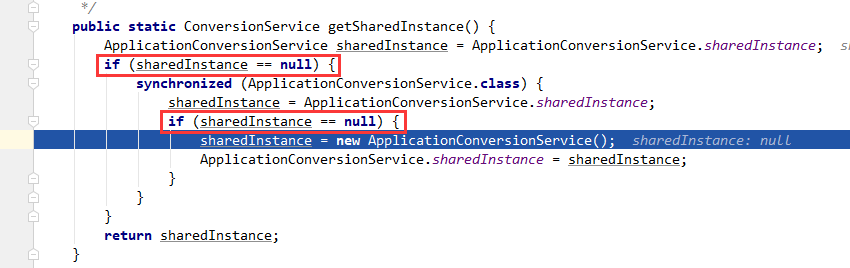

# synchronized关键字
```java {10,18,20}
protected Collection<ApplicationListener<?>> getApplicationListeners(
        ApplicationEvent event, ResolvableType eventType) {

    Object source = event.getSource();
    Class<?> sourceType = (source != null ? source.getClass() : null);
    ListenerCacheKey cacheKey = new ListenerCacheKey(eventType, sourceType);

    // Quick check for existing entry on ConcurrentHashMap...
    ListenerRetriever retriever = this.retrieverCache.get(cacheKey);
    if (retriever != null) {
        return retriever.getApplicationListeners();
    }

    if (this.beanClassLoader == null ||
            (ClassUtils.isCacheSafe(event.getClass(), this.beanClassLoader) &&
                    (sourceType == null || ClassUtils.isCacheSafe(sourceType, this.beanClassLoader)))) {
        // Fully synchronized building and caching of a ListenerRetriever
        synchronized (this.retrievalMutex) {
            retriever = this.retrieverCache.get(cacheKey);
            if (retriever != null) {
                return retriever.getApplicationListeners();
            }
            retriever = new ListenerRetriever(true);
            Collection<ApplicationListener<?>> listeners =
                    retrieveApplicationListeners(eventType, sourceType, retriever);
            this.retrieverCache.put(cacheKey, retriever);
            return listeners;
        }
    }
    else {
        // No ListenerRetriever caching -> no synchronization necessary
        return retrieveApplicationListeners(eventType, sourceType, null);
    }
}
```

又有看到两次判断




## synchronized的使用
关于下面一段代码，以下说法正确的是A、C
```java
public class Test {
    // 同步方法
    private synchronized void a() {
    }

    private void b() {
        // 同步块：用的是对象锁
        synchronized (this) {
        }
    }

    // 静态同步方法
    private synchronized static void c() {
    }
    private void d() {
        // 同步块：用的是类锁
        synchronized (Test.class) {
        }
    }
}
```
A:同一个对象，分别调用方法a和b，锁住的是同一个对象

B:同一个对象，分别调用方法a和c，锁住的是同一个对象

C:同一个对象，分别调用方法b和c，锁住的不是同一个对象

D:同一个对象，分别调用方法a、b、c，锁住的不是同一个对象

解析：
方法a为同步方法，方法b里面的是同步块，同步方法使用的锁是固有对象this，同步块使用的锁可以是任意对象，但是方法b里面的同步块使用的锁是对象this，所以方法a和方法b锁住的是同一个对象。

方法 c为静态同步方法，使用的锁是该类的字节码文件，也就是Test.class。方法d里面的也是同步块，只不过使用的锁是Test.class，所以方法c和方法d锁住的是同一个对象。

::: tip
* 有线程访问对象的同步代码块时，另外的线程可以访问该对象的非同步代码块
* 若锁住的是同一个对象，一个线程在访问对象的同步代码块时，另一个访问对象的同步代码块的线程会被阻塞。
* 若锁住的是同一个对象，一个线程在访问对象的同步方法时，另一个访问对象的同步方法的线程会被阻塞。
* 若锁住的是同一个对象，一个线程在访问对象的同步代码块时，另一个访问对象同步方法的线程会被阻塞，反之亦然。
* 同一个类的不同对象的锁互不干扰
* 类锁由于也是一种特殊的对象锁，因此表现和上述一致，而由于一个类只有一把对象锁，所以同一个类的不同对象使用类锁将会是同步的
* 类锁和对象锁互不干扰
:::