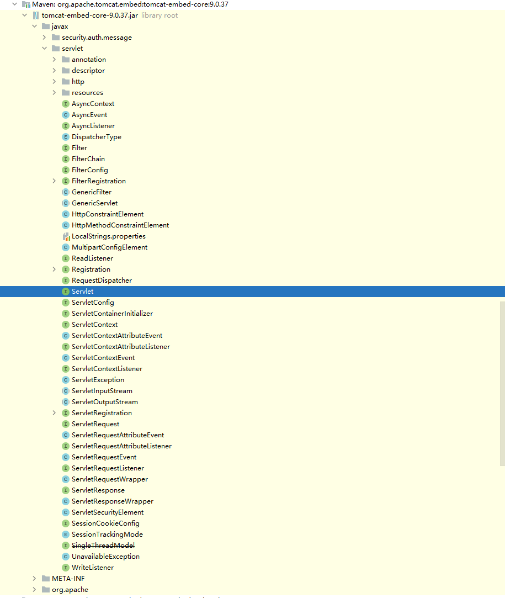
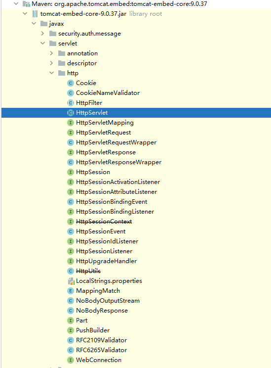
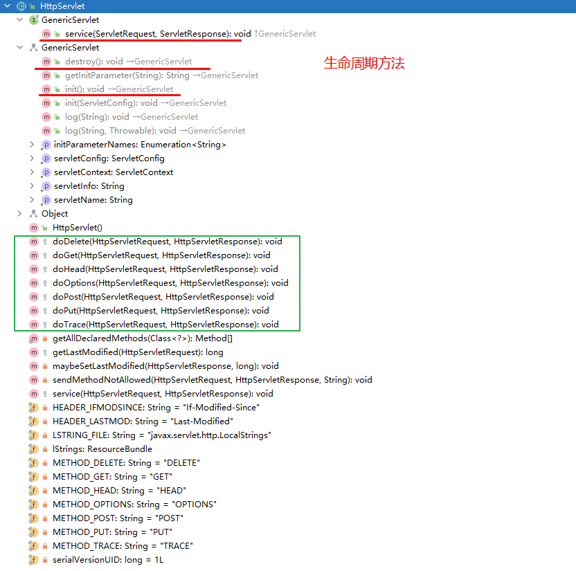

# Servlet源码阅读

通过全局搜索得到Servlet接口



这个包里包含Servlet涉及的全部内容。
> 使用版本:tomcat-embed-core-9.0.37
>
> 使用版本:tomcat-embed-core-9.0.37
>
> 使用版本:tomcat-embed-core-9.0.37

## Servlet接口
作用：定义所有servlet必须实现的方法，该接口定义了初始化 servlet、服务请求以及从服务器中删除 servlet 的方法。
除了生命周期方法之外，该接口还提供了getServletConfig方法，servlet 可以使用该方法获取任何启动信息，以及getServletInfo方法，该方法允许 servlet 返回有关自身的基本信息，例如作者、版本和版权。

要实现此接口，您可以编写扩展javax.servlet.http.HttpServlet的通用 servlet 或扩展javax.servlet.GenericServlet的 HTTP servlet

生命周期方法按以下顺序调用：
1. 构建 servlet，然后使用init()进行初始化。
2. 处理来自客户端对service()的任何调用。
3. servlet 停止服务，然后使用destroy()销毁，然后进行垃圾收集并完成。

```java
public interface Servlet {

    /**
     * servlet 容器在实例化 servlet 后恰好调用一次init方法。init方法必须成功完成，servlet 才能接收任何请求。
     */
    public void init(ServletConfig config) throws ServletException;

    /**
     * 返回一个ServletConfig对象，包含 servlet 的初始化和启动参数。
     */
    public ServletConfig getServletConfig();

    /**
     * 由 servlet 容器调用以允许 servlet 响应请求。Servlet 通常在可以同时处理多个请求的多线程 Servlet 容器中运行。
     */
    public void service(ServletRequest req, ServletResponse res)
            throws ServletException, IOException;

    /**
     *返回有关 servlet 的信息，例如作者、版本和版权
     */
    public String getServletInfo();

    /**
     * 由 servlet 容器调用以向 servlet 指示 servlet 正在停止服务。
     */
    public void destroy();
}

```

## GenericServlet抽象类
作用：定义一个通用的、独立于协议的 servlet。提供一个Servlet模板，只要继承GenericServlet的Servlet实现，都会同时拥有Servlet和ServletConfig的API，并且GenericServlet已经对ServletConfig的API部分做了简单实现，在没有特殊要求的情况下，其无需重写，可直接使用。

要编写通用 servlet，您只需要重写抽象service方法

GenericServlet抽象类实现了Servlet, ServletConfig。这使得GenericServlet在具有Servlet API的同时，还新增了ServletConfig API。

```java
package javax.servlet;

import java.io.IOException;
import java.util.Enumeration;

public abstract class GenericServlet implements Servlet, ServletConfig,
        java.io.Serializable {

    private static final long serialVersionUID = 1L;

    private transient ServletConfig config;

    /**
     * 不做任何事情，所有 servlet 初始化都由init方法之一完成。
     */
    public GenericServlet() {
        // NOOP
    }

    /**
     * 销毁方法
     */
    public void destroy() {
        // NOOP by default
    }

    /**
     * 根据指定Key获取Servlet初始化参数.
     */
    public String getInitParameter(String name) {
        return getServletConfig().getInitParameter(name);
    }

    /**
     * 获取Servlet初始化参数，结果在枚举中.
     */
    public Enumeration<String> getInitParameterNames() {
        return getServletConfig().getInitParameterNames();
    }

    /**
     * 获取ServletConfig实例.
     */
    public ServletConfig getServletConfig() {
        return config;
    }

    /**
     * 获取Servlet运行上线文对象ServletContent.
     */
    public ServletContext getServletContext() {
        return getServletConfig().getServletContext();
    }

    /**
     * 返回有关 servlet 的信息，例如作者、版本和版权，重写此方法以使其返回有意义的值。
     */
    public String getServletInfo() {
        return "";
    }

    /**
     * 给ServletConfig赋值，Servlet实例初始化
     */
    public void init(ServletConfig config) throws ServletException {
        this.config = config;
        this.init();
    }

    /**
     * 一种可以被覆盖的便捷方法，因此无需调用super.init(config)。重写即可
     */
    public void init() throws ServletException {
        // NOOP by default
    }

    /**
     * 将指定的消息写入 servlet 日志文件，并以 servlet 的名称为前缀。
     */
    public void log(String message) {
        getServletContext().log(getServletName() + ": " + message);
    }

    /**
     * 将给定Throwable异常的解释性消息和堆栈跟踪写入 servlet 日志文件，并以 servlet 的名称为前缀。
     */
    public void log(String message, Throwable t) {
        getServletContext().log(getServletName() + ": " + message, t);
    }

    /**
     * 由 servlet 容器调用以允许 servlet 响应请求。
     */
    public abstract void service(ServletRequest req, ServletResponse res)
            throws ServletException, IOException;

    /**
     * 返回此 servlet 实例的名称。
     */
    public String getServletName() {
        return config.getServletName();
    }
}

```

## HttpServlet抽象类
作用：提供一个抽象类，以创建适合网站的 HTTP servlet。要编写在 Web 上使用的 HTTP servlet，扩展javax.servlet.http.HttpServlet 。

HttpServlet的子类必须覆盖至少一种方法，doGet、doPost、doPut、doDelete、init和destroy、getServletInfo

几乎没有理由重写service方法。 service通过将标准 HTTP 请求分派给每个 HTTP 请求类型的处理程序方法（上面列出的do方法方法）来处理它们。同样，几乎没有理由重写doOptions和doTrace方法。

Servlet 通常在多线程服务器上运行，因此请注意 Servlet 必须处理并发请求并小心同步对共享资源的访问。

继承了GenericServlet抽象类



HttpServlet是专门为Web开发编写的Servlet模板类，在GenericServlet的基础上做了进一步的细分，就是我们常常看见的doXXX方法，
以及ServletRequest、ServletResponse到HttpServletRequest、HttpServletResponse的转换，整个类的设计更加符合基于HTTP的Web技术要求。

看下方法概览



```java
package javax.servlet.http;

import java.io.IOException;
import java.io.OutputStreamWriter;
import java.io.PrintWriter;
import java.io.UnsupportedEncodingException;
import java.lang.reflect.InvocationTargetException;
import java.lang.reflect.Method;
import java.text.MessageFormat;
import java.util.Enumeration;
import java.util.ResourceBundle;

import javax.servlet.DispatcherType;
import javax.servlet.GenericServlet;
import javax.servlet.ServletException;
import javax.servlet.ServletOutputStream;
import javax.servlet.ServletRequest;
import javax.servlet.ServletResponse;

public abstract class HttpServlet extends GenericServlet {

    private static final long serialVersionUID = 1L;
    /** 一些字符串的声明， METHOD是method 哈哈熟悉了吧，方法的意思*/
    private static final String METHOD_DELETE = "DELETE";
    private static final String METHOD_HEAD = "HEAD";
    private static final String METHOD_GET = "GET";
    private static final String METHOD_OPTIONS = "OPTIONS";
    private static final String METHOD_POST = "POST";
    private static final String METHOD_PUT = "PUT";
    private static final String METHOD_TRACE = "TRACE";
    /** HEADER是Header*/
    private static final String HEADER_IFMODSINCE = "If-Modified-Since";
    private static final String HEADER_LASTMOD = "Last-Modified";

    private static final String LSTRING_FILE =
        "javax.servlet.http.LocalStrings";
    private static final ResourceBundle lStrings =
        ResourceBundle.getBundle(LSTRING_FILE);
    /**
     * 什么都不做，因为这是一个抽象类
     */
    public HttpServlet() {
        // NOOP
    }

    /**
     * 允许 servlet 处理 GET 请求。GET 方法应该设计成是幂等的，可以安全地重复。
     */
    protected void doGet(HttpServletRequest req, HttpServletResponse resp)
        throws ServletException, IOException
    {
        String msg = lStrings.getString("http.method_get_not_supported");
        sendMethodNotAllowed(req, resp, msg);
    }

    /**
     * 返回上次修改HttpServletRequest对象的时间
     */
    protected long getLastModified(HttpServletRequest req) {
        return -1;
    }


    /**
     * 从受保护的service方法接收 HTTP HEAD 请求并处理该请求。当客户端只想查看响应的标头（例如 Content-Type 或 Content-Length）时，它会发送 HEAD 请求。
     */
    protected void doHead(HttpServletRequest req, HttpServletResponse resp)
        throws ServletException, IOException {

        if (DispatcherType.INCLUDE.equals(req.getDispatcherType())) {
            doGet(req, resp);
        } else {
            NoBodyResponse response = new NoBodyResponse(resp);
            doGet(req, response);
            response.setContentLength();
        }
    }


    /**
     * 允许 servlet 处理 POST 请求。
     */
    protected void doPost(HttpServletRequest req, HttpServletResponse resp)
        throws ServletException, IOException {

        String msg = lStrings.getString("http.method_post_not_supported");
        sendMethodNotAllowed(req, resp, msg);
    }

    /**
     * 由服务器调用（通过service方法）以允许 servlet 处理 PUT 请求。 PUT 操作允许客户端将文件放在服务器上，类似于通过 FTP 发送文件
     */
    protected void doPut(HttpServletRequest req, HttpServletResponse resp)
        throws ServletException, IOException {

        String msg = lStrings.getString("http.method_put_not_supported");
        sendMethodNotAllowed(req, resp, msg);
    }

    /**
     * 由服务器调用（通过service方法）以允许 servlet 处理 DELETE 请求。 DELETE 操作允许客户端从服务器中删除文档或网页。
     */
    protected void doDelete(HttpServletRequest req,
                            HttpServletResponse resp)
        throws ServletException, IOException {

        String msg = lStrings.getString("http.method_delete_not_supported");
        sendMethodNotAllowed(req, resp, msg);
    }


    private void sendMethodNotAllowed(HttpServletRequest req, HttpServletResponse resp, String msg) throws IOException {
        String protocol = req.getProtocol();
        // Note: Tomcat reports "" for HTTP/0.9 although some implementations
        //       may report HTTP/0.9
        if (protocol.length() == 0 || protocol.endsWith("0.9") || protocol.endsWith("1.0")) {
            resp.sendError(HttpServletResponse.SC_BAD_REQUEST, msg);
        } else {
            resp.sendError(HttpServletResponse.SC_METHOD_NOT_ALLOWED, msg);
        }
    }


    private static Method[] getAllDeclaredMethods(Class<?> c) {

        if (c.equals(javax.servlet.http.HttpServlet.class)) {
            return null;
        }

        Method[] parentMethods = getAllDeclaredMethods(c.getSuperclass());
        Method[] thisMethods = c.getDeclaredMethods();

        if ((parentMethods != null) && (parentMethods.length > 0)) {
            Method[] allMethods =
                new Method[parentMethods.length + thisMethods.length];
            System.arraycopy(parentMethods, 0, allMethods, 0,
                             parentMethods.length);
            System.arraycopy(thisMethods, 0, allMethods, parentMethods.length,
                             thisMethods.length);

            thisMethods = allMethods;
        }

        return thisMethods;
    }


    /**
     * OPTIONS：选项
     * 由服务器调用（通过service方法）以允许 servlet 处理对应类型的请求。 OPTIONS 请求确定服务器支持哪些 HTTP 方法并返回适当的标头。
     * 例如，如果 servlet 覆盖doGet ，则此方法返回以下标头：Allow: GET, HEAD, TRACE, OPTIONS
     * 除非 servlet 实现了新的 HTTP 方法，而不是那些由 HTTP 1.1 实现的方法，否则没有必要重写此方法。
     */
    protected void doOptions(HttpServletRequest req,
            HttpServletResponse resp)
        throws ServletException, IOException {

        Method[] methods = getAllDeclaredMethods(this.getClass());

        boolean ALLOW_GET = false;
        boolean ALLOW_HEAD = false;
        boolean ALLOW_POST = false;
        boolean ALLOW_PUT = false;
        boolean ALLOW_DELETE = false;
        boolean ALLOW_TRACE = true;
        boolean ALLOW_OPTIONS = true;

        // Tomcat specific hack to see if TRACE is allowed
        Class<?> clazz = null;
        try {
            clazz = Class.forName("org.apache.catalina.connector.RequestFacade");
            Method getAllowTrace = clazz.getMethod("getAllowTrace", (Class<?>[]) null);
            ALLOW_TRACE = ((Boolean) getAllowTrace.invoke(req, (Object[]) null)).booleanValue();
        } catch (ClassNotFoundException | NoSuchMethodException | SecurityException |
                IllegalAccessException | IllegalArgumentException | InvocationTargetException e) {
            // Ignore. Not running on Tomcat. TRACE is always allowed.
        }
        // End of Tomcat specific hack

        for (int i=0; i<methods.length; i++) {
            Method m = methods[i];

            if (m.getName().equals("doGet")) {
                ALLOW_GET = true;
                ALLOW_HEAD = true;
            }
            if (m.getName().equals("doPost"))
                ALLOW_POST = true;
            if (m.getName().equals("doPut"))
                ALLOW_PUT = true;
            if (m.getName().equals("doDelete"))
                ALLOW_DELETE = true;
        }

        String allow = null;
        if (ALLOW_GET)
            allow=METHOD_GET;
        if (ALLOW_HEAD)
            if (allow==null) allow=METHOD_HEAD;
            else allow += ", " + METHOD_HEAD;
        if (ALLOW_POST)
            if (allow==null) allow=METHOD_POST;
            else allow += ", " + METHOD_POST;
        if (ALLOW_PUT)
            if (allow==null) allow=METHOD_PUT;
            else allow += ", " + METHOD_PUT;
        if (ALLOW_DELETE)
            if (allow==null) allow=METHOD_DELETE;
            else allow += ", " + METHOD_DELETE;
        if (ALLOW_TRACE)
            if (allow==null) allow=METHOD_TRACE;
            else allow += ", " + METHOD_TRACE;
        if (ALLOW_OPTIONS)
            if (allow==null) allow=METHOD_OPTIONS;
            else allow += ", " + METHOD_OPTIONS;

        resp.setHeader("Allow", allow);
    }


    /**
     * TRACE 将随 TRACE 请求一起发送的标头返回给客户端，以便在调试中使用它们。无需重写此方法
     */
    protected void doTrace(HttpServletRequest req, HttpServletResponse resp)
        throws ServletException, IOException
    {

        int responseLength;

        String CRLF = "\r\n";
        StringBuilder buffer = new StringBuilder("TRACE ").append(req.getRequestURI())
            .append(" ").append(req.getProtocol());

        Enumeration<String> reqHeaderEnum = req.getHeaderNames();

        while( reqHeaderEnum.hasMoreElements() ) {
            String headerName = reqHeaderEnum.nextElement();
            buffer.append(CRLF).append(headerName).append(": ")
                .append(req.getHeader(headerName));
        }

        buffer.append(CRLF);

        responseLength = buffer.length();

        resp.setContentType("message/http");
        resp.setContentLength(responseLength);
        ServletOutputStream out = resp.getOutputStream();
        out.print(buffer.toString());
        out.close();
    }


    /**
     * 从公共service方法接收标准 HTTP 请求，并将它们分派到此类中定义的do Method方法。
     */
    protected void service(HttpServletRequest req, HttpServletResponse resp)
        throws ServletException, IOException {

        String method = req.getMethod();

        if (method.equals(METHOD_GET)) {
            // Get类型调用
            long lastModified = getLastModified(req);
            if (lastModified == -1) {
                // servlet 不支持 if-modified-since，不用处理复杂的逻辑
                doGet(req, resp);
            } else {
                long ifModifiedSince;
                try {
                    ifModifiedSince = req.getDateHeader(HEADER_IFMODSINCE);
                } catch (IllegalArgumentException iae) {
                    // 如果是无效的DateHeader依然像没有设置一样继续
                    ifModifiedSince = -1;
                }
                if (ifModifiedSince < (lastModified / 1000 * 1000)) {
                    // If the servlet mod time is later, call doGet()
                    // Round down to the nearest second for a proper compare
                    // A ifModifiedSince of -1 will always be less
                    maybeSetLastModified(resp, lastModified);
                    doGet(req, resp);
                } else {
                    resp.setStatus(HttpServletResponse.SC_NOT_MODIFIED);
                }
            }

        } else if (method.equals(METHOD_HEAD)) {
            // Head类型调用
            long lastModified = getLastModified(req);
            maybeSetLastModified(resp, lastModified);
            doHead(req, resp);

        } else if (method.equals(METHOD_POST)) {
            // Post类型调用
            doPost(req, resp);
        } else if (method.equals(METHOD_PUT)) {
            // Put类型调用
            doPut(req, resp);
        } else if (method.equals(METHOD_DELETE)) {
            // Delete类型调用
            doDelete(req, resp);
        } else if (method.equals(METHOD_OPTIONS)) {
            // Options类型调用
            doOptions(req,resp);
        } else if (method.equals(METHOD_TRACE)) {
            // Trace类型调用
            doTrace(req,resp);
        } else {
            // 没有 servlet 支持在此服务器上的任何位置请求的任何方法
            String errMsg = lStrings.getString("http.method_not_implemented");
            Object[] errArgs = new Object[1];
            errArgs[0] = method;
            errMsg = MessageFormat.format(errMsg, errArgs);
            resp.sendError(HttpServletResponse.SC_NOT_IMPLEMENTED, errMsg);
        }
    }


    /*
     * 如果尚未设置且值有意义，则设置 Last-Modified 实体标头字段。在 doGet 之前调用，以确保在写入响应数据之前设置标头。一个子类可能已经设置了这个头，所以我们检查一下。
     */
    private void maybeSetLastModified(HttpServletResponse resp,
                                      long lastModified) {
        if (resp.containsHeader(HEADER_LASTMOD))
            return;
        if (lastModified >= 0)
            resp.setDateHeader(HEADER_LASTMOD, lastModified);
    }


    /**
     * 将客户端请求分派到受保护的service方法。无需重写此方法。
     */
    @Override
    public void service(ServletRequest req, ServletResponse res)
        throws ServletException, IOException {

        HttpServletRequest  request;
        HttpServletResponse response;

        try {
            request = (HttpServletRequest) req;
            response = (HttpServletResponse) res;
        } catch (ClassCastException e) {
            throw new ServletException(lStrings.getString("http.non_http"));
        }
        service(request, response);
    }
}


/*
 * 无主体Response实现.
 */
class NoBodyResponse extends HttpServletResponseWrapper {
    private final NoBodyOutputStream noBody;
    private PrintWriter writer;
    private boolean didSetContentLength;

    // file private
    NoBodyResponse(HttpServletResponse r) {
        super(r);
        noBody = new NoBodyOutputStream(this);
    }

    // file private
    void setContentLength() {
        if (!didSetContentLength) {
            if (writer != null) {
                writer.flush();
            }
            super.setContentLength(noBody.getContentLength());
        }
    }


    // SERVLET RESPONSE interface methods

    @Override
    public void setContentLength(int len) {
        super.setContentLength(len);
        didSetContentLength = true;
    }

    @Override
    public void setContentLengthLong(long len) {
        super.setContentLengthLong(len);
        didSetContentLength = true;
    }

    @Override
    public void setHeader(String name, String value) {
        super.setHeader(name, value);
        checkHeader(name);
    }

    @Override
    public void addHeader(String name, String value) {
        super.addHeader(name, value);
        checkHeader(name);
    }

    @Override
    public void setIntHeader(String name, int value) {
        super.setIntHeader(name, value);
        checkHeader(name);
    }

    @Override
    public void addIntHeader(String name, int value) {
        super.addIntHeader(name, value);
        checkHeader(name);
    }

    private void checkHeader(String name) {
        if ("content-length".equalsIgnoreCase(name)) {
            didSetContentLength = true;
        }
    }

    @Override
    public ServletOutputStream getOutputStream() throws IOException {
        return noBody;
    }

    @Override
    public PrintWriter getWriter() throws UnsupportedEncodingException {

        if (writer == null) {
            OutputStreamWriter w;

            w = new OutputStreamWriter(noBody, getCharacterEncoding());
            writer = new PrintWriter(w);
        }
        return writer;
    }
}


/*
 * 与NoBodyResponse对应的输出流.
 */
class NoBodyOutputStream extends ServletOutputStream {

    private static final String LSTRING_FILE =
        "javax.servlet.http.LocalStrings";
    private static final ResourceBundle lStrings =
        ResourceBundle.getBundle(LSTRING_FILE);

    private final HttpServletResponse response;
    private boolean flushed = false;
    private int contentLength = 0;

    // file private
    NoBodyOutputStream(HttpServletResponse response) {
        this.response = response;
    }

    // file private
    int getContentLength() {
        return contentLength;
    }

    @Override
    public void write(int b) throws IOException {
        contentLength++;
        checkCommit();
    }

    @Override
    public void write(byte buf[], int offset, int len) throws IOException {
        if (buf == null) {
            throw new NullPointerException(
                    lStrings.getString("err.io.nullArray"));
        }

        if (offset < 0 || len < 0 || offset+len > buf.length) {
            String msg = lStrings.getString("err.io.indexOutOfBounds");
            Object[] msgArgs = new Object[3];
            msgArgs[0] = Integer.valueOf(offset);
            msgArgs[1] = Integer.valueOf(len);
            msgArgs[2] = Integer.valueOf(buf.length);
            msg = MessageFormat.format(msg, msgArgs);
            throw new IndexOutOfBoundsException(msg);
        }

        contentLength += len;
        checkCommit();
    }

    @Override
    public boolean isReady() {
        // TODO SERVLET 3.1
        return false;
    }

    @Override
    public void setWriteListener(javax.servlet.WriteListener listener) {
        // TODO SERVLET 3.1
    }

    private void checkCommit() throws IOException {
        if (!flushed && contentLength > response.getBufferSize()) {
            response.flushBuffer();
            flushed = true;
        }
    }
}
```