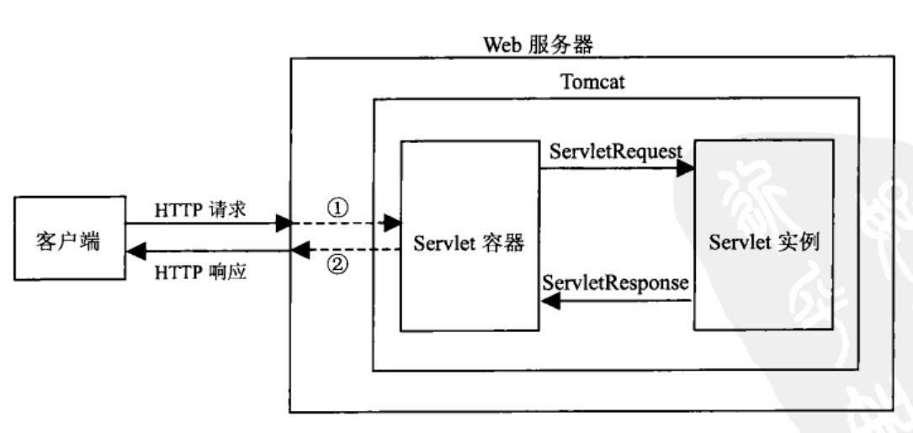

# Servlet是什么？

[摘自](https://www.csdn.net/tags/MtTaYgwsMTA3NTUtYmxvZwO0O0OO0O0O.html)

Servlet（小服务程序）是一个与协议无关的、跨平台的Web组件，它基于Java技术开发，由Servlet容器所管理。和运行在客户端浏览器中的Applet（小应用程序）相似，Servlet运行在服务器端，可以动态地扩展服务器的功能，并采用“请求一响应”模式提供Web服务。 Servlet的主要功能是交互式地浏览和修改数据，生成动态Web内容。Servlet是平台独立的Java类，即按照Servlet规范编写的Java类，所以具有Java语言的所有优点，如良好的可移植性及安全性等。 Servlet被编译为平台中立的字节码，可以被动态地加载到支持Java技术的Web服务器中运行，就如同Applet对客户端一样，区别在于Servlet运行并不需要图形用户界面。

## Java Servlet优点

1. Servlet可以和其他资源（数据库、文件、Applet和Java应用程序等）交互，把生成的响应内容返回给客户端。如果需要，还可以保存”请求一响应“过程中的信息。
2. 服务器采用Servlet可以完全授权对本地资源的访问，Servlet自身也会控制外部用户的访问数量及访问性质。
3. Servlet可以从本地硬盘，或者通过网络从远端硬盘来激活。
4. 通过Scrvlet Tag技术，可以在HTML页面中动态调用Servlet
5.  Servlet可以是其他服务的客户端程序。
6. 通过链接技术Servlet可以调用另一个或一系列Servlet来成为它的客户端。
7.  Servlet API与协议无关。

## Tomcat与Servlet之间的关系

当初在Apache开发时还未出现Servlet的概念，所以Apache不能内置支持Servlet。实际上除了Apache其他许多Web服务器软件都不能直接支持Servlet。为了支持Servlet，通常要单独开发程序，这种程序一般称为服务器小程序容器(Servlet Container)，有时也叫做服务器小程序引擎(Servlet Engine)。它是Web服务器或应用程序服务器的一部分，用于在发送的请求和响应之上提供网络服务，解码基于MIME的请求，格式化基于MIME的响应，它在Servlet的生命周期内包容和管理Servlet，是一个实时运行的外壳程序。运行时由Web服务器软件处理一般请求，并把Servlet调用传递给“容器”来处理。

Tomcat就是满足这种需要的JSP/Servlet引擎，是Sun公司的JSP/Servlet的官方实现。

按照工作模式的不同，Servlet容器可以分为以下3类：

1. 独立运行的Servlet容器。

   在这种模式下，Servlet容器作为构成Web服务器的一部分而存在。当使用基于Java的Web服务器时，就属于这种情况。这种方式是Tomcat的默认模式，然而大多数Web服务器并不是基于Java的，所以就产生了下面的两种其他类型。

2. 内置的Servlet容器

   Servlet容器由Web服务器插件和Java容器两部分组成。采用这种方式时，Web服务器插件需要在某个Web服务器内部地址空间中打开一个JVM（Java虚拟机），在此JVM上加载Java容器并运行Servlet。如果客户端调用Servlct，Web服务器插件首先获得此请求的控制并将它传递（使用JNI技术）给Java容器，然后Java容器把此请求交给Servlet来处理。这种方式运行速度较快，并且能够提供良好的性能，适用于单进程、多线程服务器，但是在伸缩性方面存在不足。

3. 外置的Servlet容器

   采用这种方式时，Servlet容器运行在Web服务器外部地址空问。先由Web服务器插件在某个Web服务器外部地址空间打开一个JVM（Java虚拟机），然后加载Java容器来运行Servlet。Web服务器插件和JVM之间使用IPC(进程间通信)机制(通常是TCP/IPSockets)。如果客户端调用Servlet，Web服务器插件首先获得此请求的控制并将它传递使用IPCs技术）给Java容器，然后Java容器把此请求交给Servlet来处理。这种方式对客户端请求的处理速度不如内置Servlet那样快，但是在其他方面（如可伸缩性、稳定性等）具有优势。

Tomcat属于Servlet容器，其工作模式也分为上述3种，所以Tomcat既可被用作独立运行的Servlet引擎（便于开发和调试），又可作为一个需要增强功能的Web服务器（如当前的Apache、IIS和Netscape服务器）插件。在配置Tomcat之前，就需要确定采用哪种工作模式，工作模式(1)比较简单，直接安装Tomcat即可，工作模式(2)和(3)有些复杂，除了安装Tomcat、Web服务器之外，还需要安装连接两者的中间连接件。

Java Servlet API是Servlet容器和Servlet之间的接口，它定义了Servlet的各种方法，还定义了Servlet容器传送给Servlet的对象类，其中最重要的是请求对象ServletRequest和响应对象ServletResponse。这两个对象都是由Servlet容器在客户端调用Servlet时产生的，Servlet容器把客户请求信息封装在ServletRequest对象中，然后把这两个对象都传送给要调用的Servlet，Servlet处理完后把响应结果写入ServletResponse，然后由Servlet容器把响应结果发送到客户端。Tomcat服务器接收客户端请求并作出响应的完整过程如图所示 。

其中，①处表示Web服务器接收到客户端发出的HTTP请求后，转发给Servlet容器，同时把控制返回Servlet容器；②处表示Servlet容器把响应对象ServletResponse中的处理结。果转发给Web服务器，通知Web服务器以HTTP响应的方式把结果发送到客户端，同时把控制返回Web服务器.