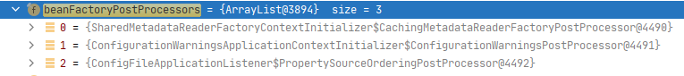
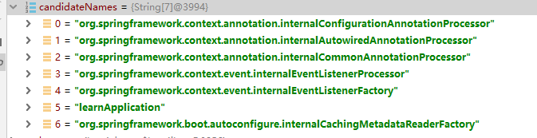
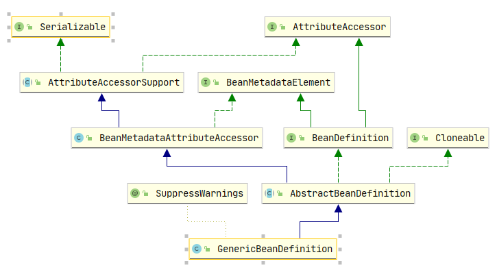
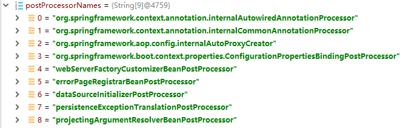

# Spingboot启动的refreshContext(context)

## 入口
```java
private void refreshContext(ConfigurableApplicationContext context) {
    refresh((ApplicationContext) context);
    if (this.registerShutdownHook) {
        try {
            context.registerShutdownHook();
        }
        catch (AccessControlException ex) {
            // Not allowed in some environments.
        }
    }
}
```
进入`refresh((ApplicationContext) context);`
```java
/**
    * Refresh the underlying {@link ApplicationContext}.
    * @param applicationContext the application context to refresh
    * @deprecated since 2.3.0 in favor of
    * {@link #refresh(ConfigurableApplicationContext)}
    */
@Deprecated
protected void refresh(ApplicationContext applicationContext) {
    Assert.isInstanceOf(ConfigurableApplicationContext.class, applicationContext);
    refresh((ConfigurableApplicationContext) applicationContext);
}
```
进入`refresh((ConfigurableApplicationContext) applicationContext);`
```java
/**
    * Refresh the underlying {@link ApplicationContext}.
    * @param applicationContext the application context to refresh
    */
protected void refresh(ConfigurableApplicationContext applicationContext) {
    applicationContext.refresh();
}
// 进入来到接口层，去到 ServletWebServerApplicationContext 的实现类
@Override
public final void refresh() throws BeansException, IllegalStateException {
    try {
        super.refresh();
    }
    catch (RuntimeException ex) {
        WebServer webServer = this.webServer;
        if (webServer != null) {
            webServer.stop();
        }
        throw ex;
    }
}
// 调用父类的 refresh()
```
子类实现调用父类的 refresh() 
```java
@Override
public void refresh() throws BeansException, IllegalStateException {
    synchronized (this.startupShutdownMonitor) {
        // 1. Prepare this context for refreshing.
        prepareRefresh();

        // 2. Tell the subclass to refresh the internal bean factory.
        ConfigurableListableBeanFactory beanFactory = obtainFreshBeanFactory();

        // 3. Prepare the bean factory for use in this context.
        prepareBeanFactory(beanFactory);

        try {
            // 4. Allows post-processing of the bean factory in context subclasses.
            postProcessBeanFactory(beanFactory);

            // 5. Invoke factory processors registered as beans in the context.
            invokeBeanFactoryPostProcessors(beanFactory);

            // 6. Register bean processors that intercept bean creation.
            registerBeanPostProcessors(beanFactory);

            // 7. Initialize message source for this context.
            initMessageSource();

            // 8. Initialize event multicaster for this context.
            initApplicationEventMulticaster();

            // 9. Initialize other special beans in specific context subclasses.
            onRefresh();

            // 10. Check for listener beans and register them.
            registerListeners();

            // 11. Instantiate all remaining (non-lazy-init) singletons.
            finishBeanFactoryInitialization(beanFactory);

            // 12. Last step: publish corresponding event.
            finishRefresh();
        }

        catch (BeansException ex) {
            if (logger.isWarnEnabled()) {
                logger.warn("Exception encountered during context initialization - " +
                        "cancelling refresh attempt: " + ex);
            }

            // Destroy already created singletons to avoid dangling resources.
            destroyBeans();

            // Reset 'active' flag.
            cancelRefresh(ex);

            // Propagate exception to caller.
            throw ex;
        }

        finally {
            // Reset common introspection caches in Spring's core, since we
            // might not ever need metadata for singleton beans anymore...
            resetCommonCaches();
        }
    }
}
```

## 逐个描述refresh()12步 
上面代码梳理已经找到refresh的源码位置，下面逐个描述。

### 第1步：prepareRefresh();
repare this context for refreshing.
准备此上下文以进行刷新
```java
protected void prepareRefresh() {
    // 清除本地元数据缓存（如果有），删除所有缓存的类元数据。
    this.scanner.clearCache();
    // 调用父类，写在下面
    super.prepareRefresh();
}
```
```java
/**
    * Prepare this context for refreshing, setting its startup date and
    * active flag as well as performing any initialization of property sources.
    * 准备此上下文以进行刷新、设置其启动日期和活动标志以及执行所有属性源的初始化。
    */
protected void prepareRefresh() {
    // Switch to active.
    this.startupDate = System.currentTimeMillis();
    this.closed.set(false);
    this.active.set(true);

    if (logger.isDebugEnabled()) {
        if (logger.isTraceEnabled()) {
            logger.trace("Refreshing " + this);
        }
        else {
            logger.debug("Refreshing " + getDisplayName());
        }
    }

    // Initialize any placeholder property sources in the context environment.
    // 初始化上下文环境中的所有占位符属性源。
    initPropertySources();

    // Validate that all properties marked as required are resolvable:
    // see ConfigurablePropertyResolver#setRequiredProperties
    // 验证标记为必需的所有属性都是可解析的
    getEnvironment().validateRequiredProperties();

    // Store pre-refresh ApplicationListeners...
    // 存储预刷新 ApplicationListeners
    if (this.earlyApplicationListeners == null) {
        this.earlyApplicationListeners = new LinkedHashSet<>(this.applicationListeners);
    }
    else {
        // Reset local application listeners to pre-refresh state.
        this.applicationListeners.clear();
        this.applicationListeners.addAll(this.earlyApplicationListeners);
    }

    // Allow for the collection of early ApplicationEvents,
    // to be published once the multicaster is available...
    // 允许收集早期的应用程序事件，一旦多播器可用就发布
    this.earlyApplicationEvents = new LinkedHashSet<>();
}
```

### 第2步：ConfigurableListableBeanFactory beanFactory = obtainFreshBeanFactory();
Tell the subclass to refresh the internal bean factory.
告诉子类刷新内部 bean 工厂，得到Bean工厂
```java
protected ConfigurableListableBeanFactory obtainFreshBeanFactory() {
    refreshBeanFactory();
    // 返回BeanFactory
    return getBeanFactory();
}
```
```java
protected final void refreshBeanFactory() throws IllegalStateException {
    // 如果当前值 refreshed 是预期值 false，则自动将值设置为给定的true 更新值
    if (!this.refreshed.compareAndSet(false, true)) {
        throw new IllegalStateException(
                "GenericApplicationContext does not support multiple refresh attempts: just call 'refresh' once");
    }
    // getId():applicton
    // 指定一个 id 用于序列化目的，如果需要，允许将此 BeanFactory 从此 id 反序列化回 BeanFactory 对象。
    this.beanFactory.setSerializationId(getId());
}
```
```java
@Override
public final ConfigurableListableBeanFactory getBeanFactory() {
    return this.beanFactory;
}
```


### 第3步：prepareBeanFactory(beanFactory);
Prepare the bean factory for use in this context.
准备 bean 工厂以在此上下文中使用
```java
protected void prepareBeanFactory(ConfigurableListableBeanFactory beanFactory) {
    // Tell the internal bean factory to use the context's class loader etc.
    // 告诉内部 bean 工厂使用上下文的类加载器等
    beanFactory.setBeanClassLoader(getClassLoader());
    beanFactory.setBeanExpressionResolver(new StandardBeanExpressionResolver(beanFactory.getBeanClassLoader()));
    beanFactory.addPropertyEditorRegistrar(new ResourceEditorRegistrar(this, getEnvironment()));

    // Configure the bean factory with context callbacks.
    // 使用上下文回调配置 bean 工厂
    beanFactory.addBeanPostProcessor(new ApplicationContextAwareProcessor(this));
    beanFactory.ignoreDependencyInterface(EnvironmentAware.class);
    beanFactory.ignoreDependencyInterface(EmbeddedValueResolverAware.class);
    beanFactory.ignoreDependencyInterface(ResourceLoaderAware.class);
    beanFactory.ignoreDependencyInterface(ApplicationEventPublisherAware.class);
    beanFactory.ignoreDependencyInterface(MessageSourceAware.class);
    beanFactory.ignoreDependencyInterface(ApplicationContextAware.class);

    // BeanFactory interface not registered as resolvable type in a plain factory.
    // BeanFactory 接口未在普通工厂中注册为可解析类型
    // MessageSource registered (and found for autowiring) as a bean.
    // MessageSource 作为 bean 注册（并为自动装配找到）
    beanFactory.registerResolvableDependency(BeanFactory.class, beanFactory);
    beanFactory.registerResolvableDependency(ResourceLoader.class, this);
    beanFactory.registerResolvableDependency(ApplicationEventPublisher.class, this);
    beanFactory.registerResolvableDependency(ApplicationContext.class, this);

    // Register early post-processor for detecting inner beans as ApplicationListeners.
    // 将用于检测内部 bean 的早期后处理器注册为 ApplicationListener
    beanFactory.addBeanPostProcessor(new ApplicationListenerDetector(this));

    // Detect a LoadTimeWeaver and prepare for weaving, if found.
    // 检测 LoadTimeWeaver 并准备编织（如果找到）
    if (beanFactory.containsBean(LOAD_TIME_WEAVER_BEAN_NAME)) {
        beanFactory.addBeanPostProcessor(new LoadTimeWeaverAwareProcessor(beanFactory));
        // Set a temporary ClassLoader for type matching.
        beanFactory.setTempClassLoader(new ContextTypeMatchClassLoader(beanFactory.getBeanClassLoader()));
    }

    // Register default environment beans.
    // 注册默认环境 bean
    if (!beanFactory.containsLocalBean(ENVIRONMENT_BEAN_NAME)) {
        beanFactory.registerSingleton(ENVIRONMENT_BEAN_NAME, getEnvironment());
    }
    if (!beanFactory.containsLocalBean(SYSTEM_PROPERTIES_BEAN_NAME)) {
        beanFactory.registerSingleton(SYSTEM_PROPERTIES_BEAN_NAME, getEnvironment().getSystemProperties());
    }
    if (!beanFactory.containsLocalBean(SYSTEM_ENVIRONMENT_BEAN_NAME)) {
        beanFactory.registerSingleton(SYSTEM_ENVIRONMENT_BEAN_NAME, getEnvironment().getSystemEnvironment());
    }
}
```

### 第4步：postProcessBeanFactory(beanFactory);
Allows post-processing of the bean factory in context subclasses.
调用在上下文中注册为 bean 的工厂处理器
实例化并调用所有已注册的 BeanFactoryPostProcessor bean，如果给定，则尊重显式顺序
这里创建的是AnnotationConfigServletWebServerApplicationContext类的上下文，所以执行的是这个类里的postProcessBeanFactory(beanFactory)方法
> BeanFactoryPostProcessor接口，可以在spring的bean创建之前，修改bean的定义属性。
> 也就是说，Spring允许BeanFactoryPostProcessor在容器实例化任何其它bean之前读取配置元数据，并可以根据需要进行修改。
> 例如:
> * 可以把bean的scope从singleton改为prototype
> * 也可以把property的值给修改掉。
> * 可以同时配置多个BeanFactoryPostProcessor，并通过设置'order'属性来控制各个BeanFactoryPostProcessor的执行次序。

<span style="color : green">
BeanFactoryPostProcessor是在spring容器加载了bean的定义文件之后，在bean实例化之前执行的。
接口方法的入参是ConfigurrableListableBeanFactory，使用该参数，可以获取到相关bean的定义信息
</span>

```java
protected void postProcessBeanFactory(ConfigurableListableBeanFactory beanFactory) {
    // 调用父类，注册 Servlet 上下文感知处理器
    super.postProcessBeanFactory(beanFactory);
    if (this.basePackages != null && this.basePackages.length > 0) {
        this.scanner.scan(this.basePackages);
    }
    if (!this.annotatedClasses.isEmpty()) {
        this.reader.register(ClassUtils.toClassArray(this.annotatedClasses));
    }
}
```
这里注册了3个



* SharedMetadataReaderFactoryContextInitializer$CachingetadataReaderFactoryPostProcessor
在definition的propertyValues中添加 metadataReaderFactory ：org.springframework.boot.autoconfigure.internalCachingMetadataReaderFactory
后add到regularPostProcessors
* ConfiguartionWarningsApplicationContextInitializer$ConfigurationWarningsPostProcessor
根据Checks打印Warn在日志里。后add到regularPostProcessors
* ConfigFileApplicationListener$PropertySourceOrderingPostProcessor
直接add到regularPostProcessors

scanner、reader的判断条件在启动时没有走到，在当前环境下

### 第5步：invokeBeanFactoryPostProcessors(beanFactory);
Invoke factory processors registered as beans in the context.
调用在context中注册为 bean 的工厂处理器。就是第4步注册的BeanFactoryPostProcess
> 执行过程有一个方法：doProcessConfigurationClass做如下事情
> SpringBoot @ComponentScan在这步处理
> SpringBoot @Import在这不处理
> SpringBoot @ImportResource在这步处理
> SpringBoot 处理@Bean在这步中
> 处理接口上的默认方法
> 如果有superclass，处理superclass。返回循环处理
```java

public static void invokeBeanFactoryPostProcessors(
        ConfigurableListableBeanFactory beanFactory, List<BeanFactoryPostProcessor> beanFactoryPostProcessors) {

    // 如果有的话，首先调用 BeanDefinitionRegistryPostProcessors
    Set<String> processedBeans = new HashSet<>();

    // AnnotationConfigServletWebServiceApplicationContext继承了ServletWebServiceApplicationContext
    // ServletWebServiceApplicationContext 继承了 GenericWebApplicationContext
    // GenericWebApplicationContext 继承了 GenericApplicationContext
    // GenericApplicationContext 实现了 BeanDefinitionRegistry ， 所以 此beanFactory instanceof BeanDefinitionRegistry 为true
    if (beanFactory instanceof BeanDefinitionRegistry) {
        BeanDefinitionRegistry registry = (BeanDefinitionRegistry) beanFactory;
        List<BeanFactoryPostProcessor> regularPostProcessors = new ArrayList<>();
        List<BeanDefinitionRegistryPostProcessor> registryProcessors = new ArrayList<>();

        for (BeanFactoryPostProcessor postProcessor : beanFactoryPostProcessors) {
            if (postProcessor instanceof BeanDefinitionRegistryPostProcessor) {
                BeanDefinitionRegistryPostProcessor registryProcessor =
                        (BeanDefinitionRegistryPostProcessor) postProcessor;
                // 注册 metadataReaderFactory、
                registryProcessor.postProcessBeanDefinitionRegistry(registry);
                registryProcessors.add(registryProcessor);
            }
            else {
                regularPostProcessors.add(postProcessor);
            }
        }

        // Do not initialize FactoryBeans here: We need to leave all regular beans
        // uninitialized to let the bean factory post-processors apply to them!
        // Separate between BeanDefinitionRegistryPostProcessors that implement
        // PriorityOrdered, Ordered, and the rest.
        // 不要在此处初始化 FactoryBeans：我们需要让所有常规 bean 保持未初始化状态，以便 bean 工厂后处理器应用到它们！
        // 将实现 PriorityOrdered、Ordered 和其余部分的 BeanDefinitionRegistryPostProcessor 分开。
        List<BeanDefinitionRegistryPostProcessor> currentRegistryProcessors = new ArrayList<>();

        // First, invoke the BeanDefinitionRegistryPostProcessors that implement PriorityOrdered.
        // 首先，调用实现 PriorityOrdered(优先排序) 的 BeanDefinitionRegistryPostProcessor。
        String[] postProcessorNames =
                beanFactory.getBeanNamesForType(BeanDefinitionRegistryPostProcessor.class, true, false);
        for (String ppName : postProcessorNames) {
            if (beanFactory.isTypeMatch(ppName, PriorityOrdered.class)) {
                currentRegistryProcessors.add(beanFactory.getBean(ppName, BeanDefinitionRegistryPostProcessor.class));
                processedBeans.add(ppName);
            }
        }
        sortPostProcessors(currentRegistryProcessors, beanFactory);
        registryProcessors.addAll(currentRegistryProcessors);
        invokeBeanDefinitionRegistryPostProcessors(currentRegistryProcessors, registry);
        currentRegistryProcessors.clear();

        // Next, invoke the BeanDefinitionRegistryPostProcessors that implement Ordered.
        // 接下来，调用实现 Ordered 的 BeanDefinitionRegistryPostProcessors。
        postProcessorNames = beanFactory.getBeanNamesForType(BeanDefinitionRegistryPostProcessor.class, true, false);
        for (String ppName : postProcessorNames) {
            if (!processedBeans.contains(ppName) && beanFactory.isTypeMatch(ppName, Ordered.class)) {
                currentRegistryProcessors.add(beanFactory.getBean(ppName, BeanDefinitionRegistryPostProcessor.class));
                processedBeans.add(ppName);
            }
        }
        sortPostProcessors(currentRegistryProcessors, beanFactory);
        registryProcessors.addAll(currentRegistryProcessors);
        // 调用 Bean 定义注册表后处理器，下面看详情
        invokeBeanDefinitionRegistryPostProcessors(currentRegistryProcessors, registry);
        currentRegistryProcessors.clear();

        // Finally, invoke all other BeanDefinitionRegistryPostProcessors until no further ones appear.
        // 最后，调用所有其他 BeanDefinitionRegistryPostProcessors 直到不再出现。
        boolean reiterate = true;
        while (reiterate) {
            reiterate = false;
            postProcessorNames = beanFactory.getBeanNamesForType(BeanDefinitionRegistryPostProcessor.class, true, false);
            for (String ppName : postProcessorNames) {
                if (!processedBeans.contains(ppName)) {
                    currentRegistryProcessors.add(beanFactory.getBean(ppName, BeanDefinitionRegistryPostProcessor.class));
                    processedBeans.add(ppName);
                    reiterate = true;
                }
            }
            sortPostProcessors(currentRegistryProcessors, beanFactory);
            registryProcessors.addAll(currentRegistryProcessors);
            invokeBeanDefinitionRegistryPostProcessors(currentRegistryProcessors, registry);
            currentRegistryProcessors.clear();
        }

        // Now, invoke the postProcessBeanFactory callback of all processors handled so far.
        // 现在，调用到目前为止处理的所有处理器的 postProcessBeanFactory 回调
        invokeBeanFactoryPostProcessors(registryProcessors, beanFactory);
        invokeBeanFactoryPostProcessors(regularPostProcessors, beanFactory);
    }

    else {
        // Invoke factory processors registered with the context instance.
        // 调用向上下文实例注册的工厂处理器。
        invokeBeanFactoryPostProcessors(beanFactoryPostProcessors, beanFactory);
    }

    // Do not initialize FactoryBeans here: We need to leave all regular beans
    // uninitialized to let the bean factory post-processors apply to them!
    // 不要在这里初始化 FactoryBeans：我们需要让所有常规 bean 
    // 未初始化，以便 bean 工厂后处理器应用到它们！
    String[] postProcessorNames =
            beanFactory.getBeanNamesForType(BeanFactoryPostProcessor.class, true, false);

    // Separate between BeanFactoryPostProcessors that implement PriorityOrdered,
    // Ordered, and the rest.
    // 将实现 PriorityOrdered、Ordered 的 BeanFactoryPostProcessor 和其余部分分开。
    List<BeanFactoryPostProcessor> priorityOrderedPostProcessors = new ArrayList<>();
    List<String> orderedPostProcessorNames = new ArrayList<>();
    List<String> nonOrderedPostProcessorNames = new ArrayList<>();
    for (String ppName : postProcessorNames) {
        if (processedBeans.contains(ppName)) {
            // skip - already processed in first phase above
            // 跳过 - 已在上述第一阶段处理
        }
        else if (beanFactory.isTypeMatch(ppName, PriorityOrdered.class)) {
            priorityOrderedPostProcessors.add(beanFactory.getBean(ppName, BeanFactoryPostProcessor.class));
        }
        else if (beanFactory.isTypeMatch(ppName, Ordered.class)) {
            orderedPostProcessorNames.add(ppName);
        }
        else {
            nonOrderedPostProcessorNames.add(ppName);
        }
    }

    // First, invoke the BeanFactoryPostProcessors that implement PriorityOrdered.
    // 首先，调用实现 PriorityOrdered 的 BeanFactoryPostProcessor。
    sortPostProcessors(priorityOrderedPostProcessors, beanFactory);
    invokeBeanFactoryPostProcessors(priorityOrderedPostProcessors, beanFactory);

    // Next, invoke the BeanFactoryPostProcessors that implement Ordered.
    // 接下来，调用实现 Ordered 的 BeanFactoryPostProcessors。
    List<BeanFactoryPostProcessor> orderedPostProcessors = new ArrayList<>(orderedPostProcessorNames.size());
    for (String postProcessorName : orderedPostProcessorNames) {
        orderedPostProcessors.add(beanFactory.getBean(postProcessorName, BeanFactoryPostProcessor.class));
    }
    sortPostProcessors(orderedPostProcessors, beanFactory);
    invokeBeanFactoryPostProcessors(orderedPostProcessors, beanFactory);

    // Finally, invoke all other BeanFactoryPostProcessors.
    // 最后，调用所有其他 BeanFactoryPostProcessor。
    List<BeanFactoryPostProcessor> nonOrderedPostProcessors = new ArrayList<>(nonOrderedPostProcessorNames.size());
    for (String postProcessorName : nonOrderedPostProcessorNames) {
        nonOrderedPostProcessors.add(beanFactory.getBean(postProcessorName, BeanFactoryPostProcessor.class));
    }
    invokeBeanFactoryPostProcessors(nonOrderedPostProcessors, beanFactory);

    // Clear cached merged bean definitions since the post-processors might have
    // modified the original metadata, e.g. replacing placeholders in values...
    // 清除缓存的合并 bean 定义，因为后处理器可能修改了原始元数据，例如替换值中的占位符...
    beanFactory.clearMetadataCache();
}
```

调用 Bean 定义注册表后处理器，详情经过连续下钻到这个方法
下面代码`String[] candidateNames = registry.getBeanDefinitionNames();`得到的结果：



```java
/**
    * 基于 Configuration  类的注册表构建和验证配置模型
    */
public void processConfigBeanDefinitions(BeanDefinitionRegistry registry) {
    List<BeanDefinitionHolder> configCandidates = new ArrayList<>();
    String[] candidateNames = registry.getBeanDefinitionNames();

    for (String beanName : candidateNames) {
        BeanDefinition beanDef = registry.getBeanDefinition(beanName);
        if (beanDef.getAttribute(ConfigurationClassUtils.CONFIGURATION_CLASS_ATTRIBUTE) != null) {
            if (logger.isDebugEnabled()) {
                logger.debug("Bean definition has already been processed as a configuration class: " + beanDef);
            }
        }
        else if (ConfigurationClassUtils.checkConfigurationClassCandidate(beanDef, this.metadataReaderFactory)) {
            configCandidates.add(new BeanDefinitionHolder(beanDef, beanName));
        }
    }

    // Return immediately if no @Configuration classes were found
    if (configCandidates.isEmpty()) {
        return;
    }

    // Sort by previously determined @Order value, if applicable
    configCandidates.sort((bd1, bd2) -> {
        int i1 = ConfigurationClassUtils.getOrder(bd1.getBeanDefinition());
        int i2 = ConfigurationClassUtils.getOrder(bd2.getBeanDefinition());
        return Integer.compare(i1, i2);
    });

    // Detect any custom bean name generation strategy supplied through the enclosing application context
    SingletonBeanRegistry sbr = null;
    if (registry instanceof SingletonBeanRegistry) {
        sbr = (SingletonBeanRegistry) registry;
        if (!this.localBeanNameGeneratorSet) {
            BeanNameGenerator generator = (BeanNameGenerator) sbr.getSingleton(
                    AnnotationConfigUtils.CONFIGURATION_BEAN_NAME_GENERATOR);
            if (generator != null) {
                this.componentScanBeanNameGenerator = generator;
                this.importBeanNameGenerator = generator;
            }
        }
    }

    if (this.environment == null) {
        this.environment = new StandardEnvironment();
    }

    // Parse each @Configuration class
    ConfigurationClassParser parser = new ConfigurationClassParser(
            this.metadataReaderFactory, this.problemReporter, this.environment,
            this.resourceLoader, this.componentScanBeanNameGenerator, registry);

    Set<BeanDefinitionHolder> candidates = new LinkedHashSet<>(configCandidates);
    Set<ConfigurationClass> alreadyParsed = new HashSet<>(configCandidates.size());
    do {
        parser.parse(candidates);
        parser.validate();

        Set<ConfigurationClass> configClasses = new LinkedHashSet<>(parser.getConfigurationClasses());
        configClasses.removeAll(alreadyParsed);

        // Read the model and create bean definitions based on its content
        if (this.reader == null) {
            this.reader = new ConfigurationClassBeanDefinitionReader(
                    registry, this.sourceExtractor, this.resourceLoader, this.environment,
                    this.importBeanNameGenerator, parser.getImportRegistry());
        }
        // 加载所有的Bean定义信息
        this.reader.loadBeanDefinitions(configClasses);
        alreadyParsed.addAll(configClasses);

        candidates.clear();
        if (registry.getBeanDefinitionCount() > candidateNames.length) {
            String[] newCandidateNames = registry.getBeanDefinitionNames();
            Set<String> oldCandidateNames = new HashSet<>(Arrays.asList(candidateNames));
            Set<String> alreadyParsedClasses = new HashSet<>();
            for (ConfigurationClass configurationClass : alreadyParsed) {
                alreadyParsedClasses.add(configurationClass.getMetadata().getClassName());
            }
            for (String candidateName : newCandidateNames) {
                if (!oldCandidateNames.contains(candidateName)) {
                    BeanDefinition bd = registry.getBeanDefinition(candidateName);
                    if (ConfigurationClassUtils.checkConfigurationClassCandidate(bd, this.metadataReaderFactory) &&
                            !alreadyParsedClasses.contains(bd.getBeanClassName())) {
                        candidates.add(new BeanDefinitionHolder(bd, candidateName));
                    }
                }
            }
            candidateNames = newCandidateNames;
        }
    }
    while (!candidates.isEmpty());

    // Register the ImportRegistry as a bean in order to support ImportAware @Configuration classes
    if (sbr != null && !sbr.containsSingleton(IMPORT_REGISTRY_BEAN_NAME)) {
        sbr.registerSingleton(IMPORT_REGISTRY_BEAN_NAME, parser.getImportRegistry());
    }

    if (this.metadataReaderFactory instanceof CachingMetadataReaderFactory) {
        // Clear cache in externally provided MetadataReaderFactory; this is a no-op
        // for a shared cache since it'll be cleared by the ApplicationContext.
        ((CachingMetadataReaderFactory) this.metadataReaderFactory).clearCache();
    }
}
```


SpringBoot使用GenericBeanDefinition类作为BeanDefinition的实现类，看下类之间关系



#### 注册BeanDefinition
```java
public static final String BEAN_NAME = "org.springframework.boot.autoconfigure."
			+ "internalCachingMetadataReaderFactory";
registry.registerBeanDefinition(BEAN_NAME, definition)

@Override
public void registerBeanDefinition(String beanName, BeanDefinition beanDefinition)
        throws BeanDefinitionStoreException {

    // org.springframework.boot.autoconfigure.internalCachingMetadataReaderFactory
    Assert.hasText(beanName, "Bean name must not be empty");
    Assert.notNull(beanDefinition, "BeanDefinition must not be null");

    if (beanDefinition instanceof AbstractBeanDefinition) {
        try {
            // 验证
            ((AbstractBeanDefinition) beanDefinition).validate();
        }
        catch (BeanDefinitionValidationException ex) {
            throw new BeanDefinitionStoreException(beanDefinition.getResourceDescription(), beanName,
                    "Validation of bean definition failed", ex);
        }
    }

    // 获取 执行定义，在创建上下文是赋值 没取到 internalCachingMetadataReaderFactory
    BeanDefinition existingDefinition = this.beanDefinitionMap.get(beanName);
    if (existingDefinition != null) {
        if (!isAllowBeanDefinitionOverriding()) {
            throw new BeanDefinitionOverrideException(beanName, beanDefinition, existingDefinition);
        }
        else if (existingDefinition.getRole() < beanDefinition.getRole()) {
            // e.g. was ROLE_APPLICATION, now overriding with ROLE_SUPPORT or ROLE_INFRASTRUCTURE
            if (logger.isInfoEnabled()) {
                logger.info("Overriding user-defined bean definition for bean '" + beanName +
                        "' with a framework-generated bean definition: replacing [" +
                        existingDefinition + "] with [" + beanDefinition + "]");
            }
        }
        else if (!beanDefinition.equals(existingDefinition)) {
            if (logger.isDebugEnabled()) {
                logger.debug("Overriding bean definition for bean '" + beanName +
                        "' with a different definition: replacing [" + existingDefinition +
                        "] with [" + beanDefinition + "]");
            }
        }
        else {
            if (logger.isTraceEnabled()) {
                logger.trace("Overriding bean definition for bean '" + beanName +
                        "' with an equivalent definition: replacing [" + existingDefinition +
                        "] with [" + beanDefinition + "]");
            }
        }
        this.beanDefinitionMap.put(beanName, beanDefinition);
    }
    else {
        // 已创建的Bean不是空的
        if (hasBeanCreationStarted()) {
            // Cannot modify startup-time collection elements anymore (for stable iteration)
            // 无法再修改启动时集合元素（用于稳定迭代）
            synchronized (this.beanDefinitionMap) {
                this.beanDefinitionMap.put(beanName, beanDefinition);
                List<String> updatedDefinitions = new ArrayList<>(this.beanDefinitionNames.size() + 1);
                updatedDefinitions.addAll(this.beanDefinitionNames);
                updatedDefinitions.add(beanName);
                this.beanDefinitionNames = updatedDefinitions;
                //删除手动单例名称
                removeManualSingletonName(beanName);
            }
        }
        else {
            // Still in startup registration phase
            // 仍处于启动注册阶段
            // 把 internalCachingMetadataReaderFactory 放进bean定义Map
            this.beanDefinitionMap.put(beanName, beanDefinition);
            // 添加名称
            this.beanDefinitionNames.add(beanName);
            removeManualSingletonName(beanName);
        }
        this.frozenBeanDefinitionNames = null;
    }

    if (existingDefinition != null || containsSingleton(beanName)) {
        resetBeanDefinition(beanName);
    }
    else if (isConfigurationFrozen()) {
        clearByTypeCache();
    }
}
```


### 第6步：registerBeanPostProcessors(beanFactory);
Register bean processors that intercept bean creation.
注册 BeanProcessors。

这里取到9个BeanPorcessors 



```java
// 实例化并注册所有 BeanPostProcessor bean，如果给定，则尊重显式顺序。必须在应用程序 bean 的任何实例化之前调用
public static void registerBeanPostProcessors(
        ConfigurableListableBeanFactory beanFactory, AbstractApplicationContext applicationContext) {

    String[] postProcessorNames = beanFactory.getBeanNamesForType(BeanPostProcessor.class, true, false);

    // Register BeanPostProcessorChecker that logs an info message when
    // a bean is created during BeanPostProcessor instantiation, i.e. when
    // a bean is not eligible for getting processed by all BeanPostProcessors.
    // 当bean 不符合被所有 BeanPostProcessor 处理的条件，在 BeanPostProcessor 实例化期间创建 bean 时记录信息消息
    // 即当bean 不符合被所有 BeanPostProcessor 处理的条件，注册 BeanPostProcessorChecker，，
    int beanProcessorTargetCount = beanFactory.getBeanPostProcessorCount() + 1 + postProcessorNames.length;
    beanFactory.addBeanPostProcessor(new BeanPostProcessorChecker(beanFactory, beanProcessorTargetCount));

    // Separate between BeanPostProcessors that implement PriorityOrdered,
    // Ordered, and the rest.
    // 将实现 PriorityOrdered、Ordered 和其余部分的 BeanPostProcessor 分开
    List<BeanPostProcessor> priorityOrderedPostProcessors = new ArrayList<>();
    List<BeanPostProcessor> internalPostProcessors = new ArrayList<>();
    List<String> orderedPostProcessorNames = new ArrayList<>();
    List<String> nonOrderedPostProcessorNames = new ArrayList<>();
    for (String ppName : postProcessorNames) {
        if (beanFactory.isTypeMatch(ppName, PriorityOrdered.class)) {
            BeanPostProcessor pp = beanFactory.getBean(ppName, BeanPostProcessor.class);
            priorityOrderedPostProcessors.add(pp);
            if (pp instanceof MergedBeanDefinitionPostProcessor) {
                internalPostProcessors.add(pp);
            }
        }
        else if (beanFactory.isTypeMatch(ppName, Ordered.class)) {
            orderedPostProcessorNames.add(ppName);
        }
        else {
            nonOrderedPostProcessorNames.add(ppName);
        }
    }

    // First, register the BeanPostProcessors that implement PriorityOrdered.
    // 首先，注册实现 PriorityOrdered 的 BeanPostProcessor。
    sortPostProcessors(priorityOrderedPostProcessors, beanFactory);
    registerBeanPostProcessors(beanFactory, priorityOrderedPostProcessors);

    // Next, register the BeanPostProcessors that implement Ordered.
    // 接下来，注册实现 Ordered 的 BeanPostProcessor。
    List<BeanPostProcessor> orderedPostProcessors = new ArrayList<>(orderedPostProcessorNames.size());
    for (String ppName : orderedPostProcessorNames) {
        BeanPostProcessor pp = beanFactory.getBean(ppName, BeanPostProcessor.class);
        orderedPostProcessors.add(pp);
        if (pp instanceof MergedBeanDefinitionPostProcessor) {
            internalPostProcessors.add(pp);
        }
    }
    sortPostProcessors(orderedPostProcessors, beanFactory);
    registerBeanPostProcessors(beanFactory, orderedPostProcessors);

    // Now, register all regular BeanPostProcessors.
    // 现在，注册所有常规的 BeanPostProcessor。
    List<BeanPostProcessor> nonOrderedPostProcessors = new ArrayList<>(nonOrderedPostProcessorNames.size());
    for (String ppName : nonOrderedPostProcessorNames) {
        BeanPostProcessor pp = beanFactory.getBean(ppName, BeanPostProcessor.class);
        nonOrderedPostProcessors.add(pp);
        if (pp instanceof MergedBeanDefinitionPostProcessor) {
            internalPostProcessors.add(pp);
        }
    }
    registerBeanPostProcessors(beanFactory, nonOrderedPostProcessors);

    // Finally, re-register all internal BeanPostProcessors.
    // 最后，重新注册所有内部 BeanPostProcessor。
    sortPostProcessors(internalPostProcessors, beanFactory);
    registerBeanPostProcessors(beanFactory, internalPostProcessors);

    // Re-register post-processor for detecting inner beans as ApplicationListeners,
    // moving it to the end of the processor chain (for picking up proxies etc).
    // 重新注册用于将内部 bean 检测为 ApplicationListeners 的后处理器， 
    // 将其移动到处理器链的末尾（用于拾取代理等）
    beanFactory.addBeanPostProcessor(new ApplicationListenerDetector(applicationContext));
}
```

### 第7步：initMessageSource();
Initialize message source for this context.
初始化此上下文的消息源
把消息源注册到beanFactory中
```java
protected void initMessageSource() {
    ConfigurableListableBeanFactory beanFactory = getBeanFactory();
    if (beanFactory.containsLocalBean(MESSAGE_SOURCE_BEAN_NAME)) {
        this.messageSource = beanFactory.getBean(MESSAGE_SOURCE_BEAN_NAME, MessageSource.class);
        // Make MessageSource aware of parent MessageSource.
        // 使 MessageSource 了解父 MessageSource。
        if (this.parent != null && this.messageSource instanceof HierarchicalMessageSource) {
            HierarchicalMessageSource hms = (HierarchicalMessageSource) this.messageSource;
            if (hms.getParentMessageSource() == null) {
                // Only set parent context as parent MessageSource if no parent MessageSource
                // registered already.
                // 如果没有父消息源 已经注册，则仅将父上下文设置为父消息源。
                hms.setParentMessageSource(getInternalParentMessageSource());
            }
        }
        if (logger.isTraceEnabled()) {
            logger.trace("Using MessageSource [" + this.messageSource + "]");
        }
    }
    else {
        // Use empty MessageSource to be able to accept getMessage calls.
        // 使用空 MessageSource 能够接受 getMessage 调用
        DelegatingMessageSource dms = new DelegatingMessageSource();
        dms.setParentMessageSource(getInternalParentMessageSource());
        this.messageSource = dms;
        beanFactory.registerSingleton(MESSAGE_SOURCE_BEAN_NAME, this.messageSource);
        if (logger.isTraceEnabled()) {
            logger.trace("No '" + MESSAGE_SOURCE_BEAN_NAME + "' bean, using [" + this.messageSource + "]");
        }
    }
}
```

 
### 第8步：initApplicationEventMulticaster();
Initialize event multicaster for this context.
初始化此context的事件多播器
```java {19}
// 工厂中 ApplicationEventMulticaster bean 的名称。 如果没有提供，则使用默认的
public static final String APPLICATION_EVENT_MULTICASTER_BEAN_NAME = "applicationEventMulticaster";
/**
    * 初始化 ApplicationEventMulticaster。 
    * 如果上下文中没有定义，则使用 SimpleApplicationEventMulticaster。
    * @see org.springframework.context.event.SimpleApplicationEventMulticaster
    */
protected void initApplicationEventMulticaster() {
    ConfigurableListableBeanFactory beanFactory = getBeanFactory();
    if (beanFactory.containsLocalBean(APPLICATION_EVENT_MULTICASTER_BEAN_NAME)) {
        this.applicationEventMulticaster =
                beanFactory.getBean(APPLICATION_EVENT_MULTICASTER_BEAN_NAME, ApplicationEventMulticaster.class);
        if (logger.isTraceEnabled()) {
            logger.trace("Using ApplicationEventMulticaster [" + this.applicationEventMulticaster + "]");
        }
    }
    else {
        this.applicationEventMulticaster = new SimpleApplicationEventMulticaster(beanFactory);
        // 把简单多播器注册到beanFactory中
        beanFactory.registerSingleton(APPLICATION_EVENT_MULTICASTER_BEAN_NAME, this.applicationEventMulticaster);
        if (logger.isTraceEnabled()) {
            logger.trace("No '" + APPLICATION_EVENT_MULTICASTER_BEAN_NAME + "' bean, using " +
                    "[" + this.applicationEventMulticaster.getClass().getSimpleName() + "]");
        }
    }
}
```
[SimpleApplicationEventMulticaster](./springevent.md)

 
### 第9步：onRefresh();
Initialize other special beans in specific context subclasses.
翻译：初始化特定上下文子类中的其他特殊 bean。
```java
protected void onRefresh() {
    super.onRefresh();
    try {
        // 创建Web服务
        createWebServer();
    }
    catch (Throwable ex) {
        throw new ApplicationContextException("Unable to start web server", ex);
    }
}
```

### 第10步：registerListeners();
Check for listener beans and register them.
翻译：注册检查侦听器 bean 们
```java
protected void registerListeners() {
    // Register statically specified listeners first.
    // 首先注册静态指定的监听器。
    for (ApplicationListener<?> listener : getApplicationListeners()) {
        getApplicationEventMulticaster().addApplicationListener(listener);
    }

    // Do not initialize FactoryBeans here: We need to leave all regular beans
    // uninitialized to let post-processors apply to them!
    // 不要在这里初始化 FactoryBeans：我们需要让所有常规 bean 
    // 未初始化，以便让后处理器应用于它们！
    String[] listenerBeanNames = getBeanNamesForType(ApplicationListener.class, true, false);
    for (String listenerBeanName : listenerBeanNames) {
        getApplicationEventMulticaster().addApplicationListenerBean(listenerBeanName);
    }

    // Publish early application events now that we finally have a multicaster...
    // 发布早期应用程序事件，因为我们终于有了一个多播器......
    Set<ApplicationEvent> earlyEventsToProcess = this.earlyApplicationEvents;
    this.earlyApplicationEvents = null;
    if (!CollectionUtils.isEmpty(earlyEventsToProcess)) {
        for (ApplicationEvent earlyEvent : earlyEventsToProcess) {
            getApplicationEventMulticaster().multicastEvent(earlyEvent);
        }
    }
}
```
 
### 第11步：finishBeanFactoryInitialization(beanFactory);
Instantiate all remaining (non-lazy-init) singletons.
翻译：实例化所有剩余的（非惰性初始化）单例。
```java
protected void finishBeanFactoryInitialization(ConfigurableListableBeanFactory beanFactory) {
    // Initialize conversion service for this context.
    // 为此上下文初始化转换服务。beanFactory是否包含conversionService 且 conversionService是否是ConversionService.class类型
    // 我这里启动是条件为false
    if (beanFactory.containsBean(CONVERSION_SERVICE_BEAN_NAME) &&
            beanFactory.isTypeMatch(CONVERSION_SERVICE_BEAN_NAME, ConversionService.class)) {
        beanFactory.setConversionService(
                beanFactory.getBean(CONVERSION_SERVICE_BEAN_NAME, ConversionService.class));
    }

    // Register a default embedded value resolver if no bean post-processor
    // (such as a PropertyPlaceholderConfigurer bean) registered any before:
    // at this point, primarily for resolution in annotation attribute values.
    // 如果之前没有注册过任何 bean 后处理器 
    //（例如 PropertyPlaceholderConfigurer bean），则注册一个默认的嵌入值解析器： 此时，主要用于解析注释属性值。
    // 我这里启动是条件为false
    if (!beanFactory.hasEmbeddedValueResolver()) {
        beanFactory.addEmbeddedValueResolver(strVal -> getEnvironment().resolvePlaceholders(strVal));
    }

    // Initialize LoadTimeWeaverAware beans early to allow for registering their transformers early.
    // 尽早初始化 LoadTimeWeaverAware bean，以便尽早注册它们的转换器。
    String[] weaverAwareNames = beanFactory.getBeanNamesForType(LoadTimeWeaverAware.class, false, false);
    for (String weaverAwareName : weaverAwareNames) {
        getBean(weaverAwareName);
    }

    // Stop using the temporary ClassLoader for type matching.
    // 停止使用临时 ClassLoader 进行类型匹配。
    beanFactory.setTempClassLoader(null);

    // Allow for caching all bean definition metadata, not expecting further changes.
    // 允许缓存所有 bean 定义元数据，而不是期望进一步的更改。
    beanFactory.freezeConfiguration();

    // Instantiate all remaining (non-lazy-init) singletons.
    // 实例化所有剩余的（非惰性初始化）单例。 看下面详解
    beanFactory.preInstantiateSingletons();
}
```

beanFactory.preInstantiateSingletons();详解，使用的DefaultListableBeanFactory的方法
```java
@Override
public void preInstantiateSingletons() throws BeansException {
    if (logger.isTraceEnabled()) {
        logger.trace("Pre-instantiating singletons in " + this);
    }

    // Iterate over a copy to allow for init methods which in turn register new bean definitions.
    // While this may not be part of the regular factory bootstrap, it does otherwise work fine.
    // 迭代一个副本以允许 init 方法依次注册新的 bean 定义。 
    // 虽然这可能不是常规工厂引导程序的一部分，但它确实可以正常工作。
    List<String> beanNames = new ArrayList<>(this.beanDefinitionNames);

    // Trigger initialization of all non-lazy singleton beans...
    for (String beanName : beanNames) {
        RootBeanDefinition bd = getMergedLocalBeanDefinition(beanName);
        // 判断条件：不是抽象的 且 是单例的 且 不是懒加载
        if (!bd.isAbstract() && bd.isSingleton() && !bd.isLazyInit()) {
            // 是工厂Bean
            if (isFactoryBean(beanName)) {
                Object bean = getBean(FACTORY_BEAN_PREFIX + beanName);
                if (bean instanceof FactoryBean) {
                    FactoryBean<?> factory = (FactoryBean<?>) bean;
                    boolean isEagerInit;
                    if (System.getSecurityManager() != null && factory instanceof SmartFactoryBean) {
                        isEagerInit = AccessController.doPrivileged(
                                (PrivilegedAction<Boolean>) ((SmartFactoryBean<?>) factory)::isEagerInit,
                                getAccessControlContext());
                    }
                    else {
                        isEagerInit = (factory instanceof SmartFactoryBean &&
                                ((SmartFactoryBean<?>) factory).isEagerInit());
                    }
                    if (isEagerInit) {
                        getBean(beanName);
                    }
                }
            }
            else {
                getBean(beanName);
            }
        }
    }

    // Trigger post-initialization callback for all applicable beans...
    for (String beanName : beanNames) {
        Object singletonInstance = getSingleton(beanName);
        if (singletonInstance instanceof SmartInitializingSingleton) {
            SmartInitializingSingleton smartSingleton = (SmartInitializingSingleton) singletonInstance;
            if (System.getSecurityManager() != null) {
                AccessController.doPrivileged((PrivilegedAction<Object>) () -> {
                    smartSingleton.afterSingletonsInstantiated();
                    return null;
                }, getAccessControlContext());
            }
            else {
                smartSingleton.afterSingletonsInstantiated();
            }
        }
    }
}
```

### 第12步：finishRefresh();
Last step: publish corresponding event.