# SpringBoot Start

Java的启动从main开始
```java
@SpringBootApplication
public class LearnApplication {
	public static void main(String[] args) {
		SpringApplication.run(LearnApplication.class, args);
	}
}
```
进入到run方法，run是SpringApplication类的静态方法
```java
public static ConfigurableApplicationContext run(Class<?> primarySource, String... args) {
    return run(new Class<?>[] { primarySource }, args);
}
```
传入两个参数，
    一个启动类构成的类数组
    一个main启动时传入的参数数组
```java
/**
    * 可用于使用默认设置从指定源运行SpringApplication的静态助手。
    * @param primarySource 要加载的主要来源
    * @param args 应用程序参数（通常从 Java 主方法传递）
    * @return 运行的 ApplicationContext 返回ConfigurableApplicationContext类型
    */
public static ConfigurableApplicationContext run(Class<?> primarySource,
        String... args) {
    return run(new Class<?>[] { primarySource }, args);
}
```
```java
/**
    * 静态助手，可用于使用默认设置和用户提供的参数从指定的源运行SpringApplication 。
    * @param primarySources the primary sources to load
    * @param args the application arguments (usually passed from a Java main method)
    * @return the running {@link ApplicationContext}
    */
public static ConfigurableApplicationContext run(Class<?>[] primarySources,
        String[] args) {
    return new SpringApplication(primarySources).run(args);
}
```

## 先来看SpringApplication的构造函数
从上面代码可以看到这里分了2步。一SpringApplication的构造函数，二调用run方法
```java
/**
    * 创建一个新的SpringApplication实例. 应用上下文将从指定的主要来源加载beans
    * （详情看SpringApplication文档，这个实例能被定制在调用run之前）
    * @param primarySources 指定的主要来源
    */
public SpringApplication(Class<?>... primarySources) {
    this(null, primarySources);
}

@SuppressWarnings({ "unchecked", "rawtypes" })
public SpringApplication(ResourceLoader resourceLoader, Class<?>... primarySources) {
    // resourceLoader在初始运行时传入的null
    this.resourceLoader = resourceLoader;
    // 断言primarySources（指定的主要来源，启动类）是否null，是-抛出IllegalArgumentException异常
    Assert.notNull(primarySources, "PrimarySources must not be null");
    // 构造成Set结构放入成员变量 this.primarySources
    this.primarySources = new LinkedHashSet<>(Arrays.asList(primarySources));
    // 推断 Web 应用程序类型
    this.webApplicationType = deduceWebApplicationType();
    //设置将应用于 Spring ApplicationContextInitializer的ApplicationContext 。
    // 拿到SPI方式配置的ApplicationContextInitializer上下文初始化器
    setInitializers((Collection) getSpringFactoriesInstances(
            ApplicationContextInitializer.class));
    // 给字段listeners赋值：拿到SPI方式配置的ApplicationListener应用监听器
    setListeners((Collection) getSpringFactoriesInstances(ApplicationListener.class));
    // 推导出main应用的类。通过调用栈得到包含main的类反射后返回回来
    this.mainApplicationClass = deduceMainApplicationClass();
}


/**
*推断Web应用程序类型方法做如下操作：
*1. 如果存在DispatcherHandler、不存在DispatcherServlet、不存在ResourceConfig
*   则该应用程序应作为反应式 Web 应用程序运行，并应启动嵌入式反应式 Web 服务器。
*2. 上述条件不符合，判断javax.servlet.Servlet、ConfigurableWebApplicationContext不存在，
*   如果其中一个成立该应用程序不应作为 Web 应用程序运行，也不应启动嵌入式 Web 服务器。
*3. 上述2个都没满足，返回 WebApplicationType.SERVLET
*   该应用程序应作为基于 servlet 的 Web 应用程序运行，并应启动嵌入式 servlet Web 服务器
*/
private WebApplicationType deduceWebApplicationType() {
    try {
        StackTraceElement[] stackTrace = new RuntimeException().getStackTrace();
        for (StackTraceElement stackTraceElement : stackTrace) {
            if ("main".equals(stackTraceElement.getMethodName())) {
                return Class.forName(stackTraceElement.getClassName());
            }
        }
    }
    catch (ClassNotFoundException ex) {
        // Swallow and continue
    }
    return null;
}
```
这里使用SPI方式
ApplicationContextInitalizer和ApplicationListener。这两个spring.factories里都有。

在spring-boot-autoconfigure-2.3.3.RELEASE.jar下

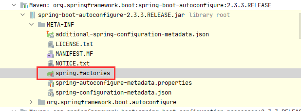

在spring-boot-2.3.3.RELEASE.jar下

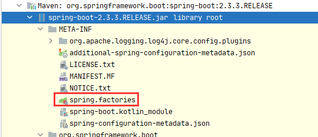

蒙了这加载哪个，Spring是怎么做的呢？
来验证下结果，上面两个文件里一个有10个，一个有1个，总计11个。看Spring最终有加载到内存有多少个我们把断点打在获取完的List上

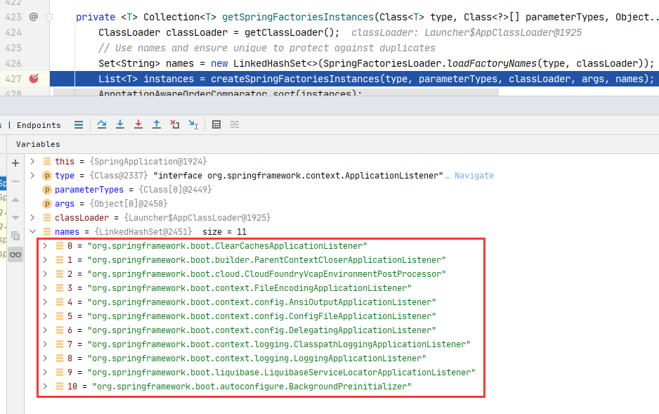

可以看见加载了11个。Spring会把所有spring.factories里解析出来的键值对都放在一个`Map<String,List<String>>`里
```yml
# Initializers
# 共享元数据读取器工厂上下文初始化器  和 条件评估报告记录监听器
org.springframework.context.ApplicationContextInitializer=\
org.springframework.boot.autoconfigure.SharedMetadataReaderFactoryContextInitializer,\
org.springframework.boot.autoconfigure.logging.ConditionEvaluationReportLoggingListener

# Application Listeners 后台预初始化器
org.springframework.context.ApplicationListener=\
org.springframework.boot.autoconfigure.BackgroundPreinitializer
```
上面SpringApplication构造方法里
getSpringFactoriesInstances(ApplicationListener.class)实现接口的类如下：
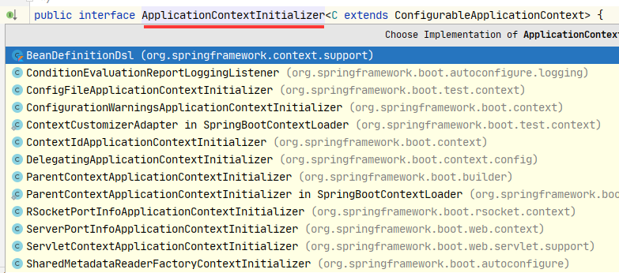
单独看下getSpringFactoriesInstances()这个方法
```java
private <T> Collection<T> getSpringFactoriesInstances(Class<T> type) {
    return getSpringFactoriesInstances(type, new Class<?>[] {});
}
private <T> Collection<T> getSpringFactoriesInstances(Class<T> type, Class<?>[] parameterTypes, Object... args) {
    // 获取类加载器
    ClassLoader classLoader = getClassLoader();
    // Use names and ensure unique to protect against duplicates
    // 使用名字并确保唯一防止重复
    // loadFactoryNames这个方法出现频率很高
    Set<String> names = new LinkedHashSet<>(SpringFactoriesLoader.loadFactoryNames(type, classLoader));
    List<T> instances = createSpringFactoriesInstances(type, parameterTypes, classLoader, args, names);
    AnnotationAwareOrderComparator.sort(instances);
    return instances;
}
```
看下loadFactoryNames方法
```java
/**
    * 使用给定的类加载器从"META-INF/spring.factories"加载给定类型的工厂实现的完全限定类名。
    * @param factoryType the interface or abstract class representing the factory
    * @param classLoader the ClassLoader to use for loading resources; can be
    * {@code null} to use the default
    * @throws IllegalArgumentException if an error occurs while loading factory names
    * @see #loadFactories
    */
public static List<String> loadFactoryNames(Class<?> factoryType, @Nullable ClassLoader classLoader) {
    String factoryTypeName = factoryType.getName();
    // 这个getOrDefault()表示从所有的META-INF/spring.factories文件组成的Map中
    //取到指定类型的所有全限定名的集合
    return loadSpringFactories(classLoader).getOrDefault(factoryTypeName, Collections.emptyList());
}

private static Map<String, List<String>> loadSpringFactories(@Nullable ClassLoader classLoader) {
    // 读缓存数据
    MultiValueMap<String, String> result = cache.get(classLoader);
    if (result != null) {
        return result;
    }

    try {
        // 得到classloader下的所有jar包中的spring.factories的文件。
        Enumeration<URL> urls = (classLoader != null ?
                classLoader.getResources(FACTORIES_RESOURCE_LOCATION) :
                ClassLoader.getSystemResources(FACTORIES_RESOURCE_LOCATION));
        result = new LinkedMultiValueMap<>();
        // 循环资源
        while (urls.hasMoreElements()) {
            URL url = urls.nextElement();
            UrlResource resource = new UrlResource(url);
            Properties properties = PropertiesLoaderUtils.loadProperties(resource);
            for (Map.Entry<?, ?> entry : properties.entrySet()) {
                String factoryTypeName = ((String) entry.getKey()).trim();
                // META-INF/spring.factories文件里面value有多个逗号隔开的字符串，需要循环取出每个
                for (String factoryImplementationName : StringUtils.commaDelimitedListToStringArray((String) entry.getValue())) {
                    // 放入响应Map中
                    result.add(factoryTypeName, factoryImplementationName.trim());
                }
            }
        }
        // 放入缓存
        cache.put(classLoader, result);
        return result;
    }
    catch (IOException ex) {
        throw new IllegalArgumentException("Unable to load factories from location [" +
                FACTORIES_RESOURCE_LOCATION + "]", ex);
    }
}
```
## 再来看调用run方法
从上面代码可以看到这里分了2步。一SpringApplication的构造函数，二调用run方法

```java
/**
    * Run the Spring application, creating and refreshing a new
    * {@link ApplicationContext}.
    * @param args the application arguments (usually passed from a Java main method)
    * @return a running {@link ApplicationContext}
    */
public ConfigurableApplicationContext run(String... args) {
    // 简单的秒表，允许对多个任务进行计时，显示每个命名任务的总运行时间和运行时间。
    StopWatch stopWatch = new StopWatch();
    // 启动一个未命名的计时任务。
    stopWatch.start();
    ConfigurableApplicationContext context = null;
    // 收集 用于支持自定义上报SpringApplication启动错误的回调接口
    Collection<SpringBootExceptionReporter> exceptionReporters = new ArrayList<>();
    // 配置无头属性,给System设置java.awt.headless=true的Property值
    configureHeadlessProperty();
    // springboot启动的几个主要过程的监听通知都是通过他来进行回调，
    // 这里就一个Linstener是EventPublishingRunListener类
    SpringApplicationRunListeners listeners = getRunListeners(args);
    // listeners是1个，内部getApplicationListeners()又有4个
    // 分别是：LoggingApplicationListeners、BackgroundPreinitializer、DelegationgApplicationListener、LiquibaseServiceLocatorApplicationListener
    // 属于ApplicationStartingEvent类型执行onApplicationStartingEvent()方法
    // LoggingApplicationListeners:检测并返回正在使用的日志系统。 支持 Logback 和 Java 日志记录。
    // BackgroundPreinitializer(这里判断条件都未成立):指示 Spring Boot 如何运行预初始化的系统属性。 当该属性设置为true时，不会发生预初始化，并且每个项目都会根据需要在前台进行初始化。 
    //                                          当该属性为false （默认）时，预初始化在后台的单独线程中运行。
    // DelegationgApplicationListener(这里判断条件都未成立):ApplicationListener委托给在 context.listener.classes 环境属性下指定的其他侦听器。
    // LiquibaseServiceLocatorApplicationListener: 这里没有加载到 liquibase.servicelocator.CustomResolverServiceLocator 类 就没有满足判断条件
    listeners.starting();
    try {
        ApplicationArguments applicationArguments = new DefaultApplicationArguments(args);
        // 准备环境，获取或常见默认的运行环境 new StandardServletEnvironment();
        ConfigurableEnvironment environment = prepareEnvironment(listeners, applicationArguments);
        configureIgnoreBeanInfo(environment);
        Banner printedBanner = printBanner(environment);
        context = createApplicationContext();
        exceptionReporters = getSpringFactoriesInstances(SpringBootExceptionReporter.class,
                new Class[] { ConfigurableApplicationContext.class }, context);
        prepareContext(context, environment, listeners, applicationArguments, printedBanner);
        refreshContext(context);
        afterRefresh(context, applicationArguments);
        stopWatch.stop();
        if (this.logStartupInfo) {
            new StartupInfoLogger(this.mainApplicationClass).logStarted(getApplicationLog(), stopWatch);
        }
        listeners.started(context);
        callRunners(context, applicationArguments);
    }
    catch (Throwable ex) {
        handleRunFailure(context, ex, exceptionReporters, listeners);
        throw new IllegalStateException(ex);
    }

    try {
        listeners.running(context);
    }
    catch (Throwable ex) {
        handleRunFailure(context, ex, exceptionReporters, null);
        throw new IllegalStateException(ex);
    }
    return context;
}
```

默认的运行环境

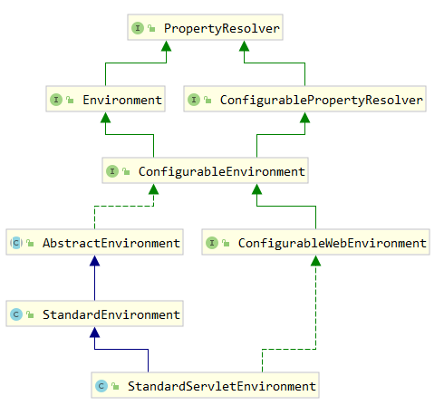

### prepareEnvironment()
`ConfigurableEnvironment environment = prepareEnvironment(listeners, applicationArguments);`
这一步是准备环境解释，点击进入了解
```java
private ConfigurableEnvironment prepareEnvironment(SpringApplicationRunListeners listeners,
        ApplicationArguments applicationArguments) {
    // Create and configure the environment
    // 创建和配置环境在，这里是SERVLET所以会 new StandardServletEnvironment(); 对象
    ConfigurableEnvironment environment = getOrCreateEnvironment();
    // 1. 配置应用转换服务ApplicationConversionService.sharedInstance = new ApplicationConversionService();
    // 把对象放入environment的conversionService成员变量
    // 2. configurePropertySources()方法没有走入判断
    // 3. configureProfiles()方法，配置此应用程序环境中哪些配置文件处于活动状态（或默认情况下处于活动状态）。 
    // 在配置文件处理期间，可以通过spring.profiles.active属性激活其他配置文件。
    configureEnvironment(environment, applicationArguments.getSourceArgs());
    ConfigurationPropertySources.attach(environment);
    // 执行监听器
    listeners.environmentPrepared(environment);
    bindToSpringApplication(environment);
    if (!this.isCustomEnvironment) {
        environment = new EnvironmentConverter(getClassLoader()).convertEnvironmentIfNecessary(environment,
                deduceEnvironmentClass());
    }
    ConfigurationPropertySources.attach(environment);
    return environment;
}
```

#### 上面执行监听器详情
`listeners.environmentPrepared(environment);`这步的解析

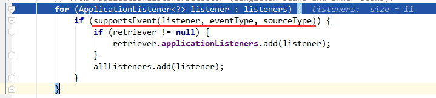

就像上面starting()一样从下面11个监听器中选出。

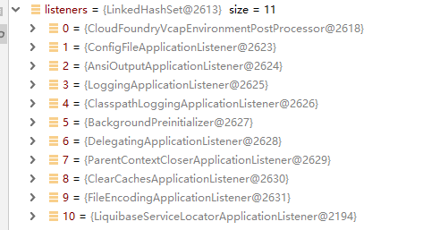

判断条件看注释说：
确定给定的侦听器是否支持给定的事件。默认实现检测SmartApplicationListener和GenericApplicationListener接口。
在标准ApplicationListener的情况下，将使用GenericApplicationListenerAdapter来内省目标侦听器的通用声明类型。
看下代码
```java
// supports：支持的意思
protected boolean supportsEvent(
        ApplicationListener<?> listener, ResolvableType eventType, @Nullable Class<?> sourceType) {
    // 指定listener是否是GenericApplicationListener类型，不是使用适配器转换
    GenericApplicationListener smartListener = (listener instanceof GenericApplicationListener ?
            (GenericApplicationListener) listener : new GenericApplicationListenerAdapter(listener));
    // 
    return (smartListener.supportsEventType(eventType) && smartListener.supportsSourceType(sourceType));
}
```
完成过滤后剩余7个监听器

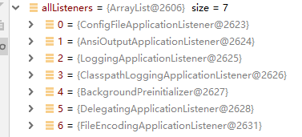

* ConfigFileApplicationListener：@since 1.0.0。算是重要的一个监听器。
* AnsiOutputApplicationListener：@since 1.2.0。让你的终端（可以是控制台、可以是日志文件）支持Ansi彩色输出，使其更具可读性。
* LoggingApplicationListener：@since 2.0.0。根据Enviroment环境完成initialize()初始化动作：日志等级、日志格式模版等
* 

### configureIgnoreBeanInfo(environment)
配置忽略Bean信息，点进去看详情
```java
public static final String IGNORE_BEANINFO_PROPERTY_NAME = "spring.beaninfo.ignore";

private void configureIgnoreBeanInfo(ConfigurableEnvironment environment) {
    // 系统配置中没有配置忽略Bean属性
    if (System.getProperty(CachedIntrospectionResults.IGNORE_BEANINFO_PROPERTY_NAME) == null) {
        // 从环境中取spring.beaninfo.ignore，如果没有设置默认为True
        Boolean ignore = environment.getProperty("spring.beaninfo.ignore", Boolean.class, Boolean.TRUE);
        // 设置忽略Bean属性为环境变量取出值
        System.setProperty(CachedIntrospectionResults.IGNORE_BEANINFO_PROPERTY_NAME, ignore.toString());
    }
}
```
> Java中System：System类代表系统，系统级的很多属性和控制方法都放置在该类的内部。该类位于java.lang包

### printBanner(environment)
打印旗帜
如果没有设置，就默认

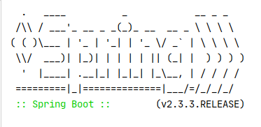


### createApplicationContext()
创建应用上下文，点进去看详情
```java
public static final String DEFAULT_SERVLET_WEB_CONTEXT_CLASS = "org.springframework.boot."
			+ "web.servlet.context.AnnotationConfigServletWebServerApplicationContext";
/**
    * 用于创建ApplicationContext策略方法。
    * 默认情况下，此方法将在回退到合适的默认值之前尊重任何显式设置的应用程序上下文或应用程序上下文类
    * @return the application context (not yet refreshed)
    * @see #setApplicationContextClass(Class)
    */
protected ConfigurableApplicationContext createApplicationContext() {
    Class<?> contextClass = this.applicationContextClass;
    if (contextClass == null) {
        try {
            // 根据web应用类型反射创建不同的 ApplicationContext
            switch (this.webApplicationType) {
            case SERVLET:
                // 我这里SpringBoot web启动走到了这里
                // org.springframework.boot.web.servlet.context.AnnotationConfigServletWebServerApplicationContext
                contextClass = Class.forName(DEFAULT_SERVLET_WEB_CONTEXT_CLASS);
                break;
            case REACTIVE:
                contextClass = Class.forName(DEFAULT_REACTIVE_WEB_CONTEXT_CLASS);
                break;
            default:
                contextClass = Class.forName(DEFAULT_CONTEXT_CLASS);
            }
        }
        catch (ClassNotFoundException ex) {
            throw new IllegalStateException(
                    "Unable create a default ApplicationContext, please specify an ApplicationContextClass", ex);
        }
    }
    return (ConfigurableApplicationContext) BeanUtils.instantiateClass(contextClass);
}
```
在实例化时做了reader和scaner的初始化

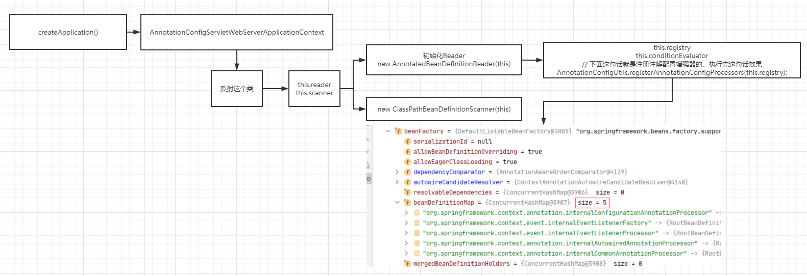

#### AnnotationConfigServletWebServerApplicationContext类
从这里就开始涉及到Spring IOC的知识
[点击查看Spring IOC 详细文章](./springioc.md)

先来用类图看下类之间的关系

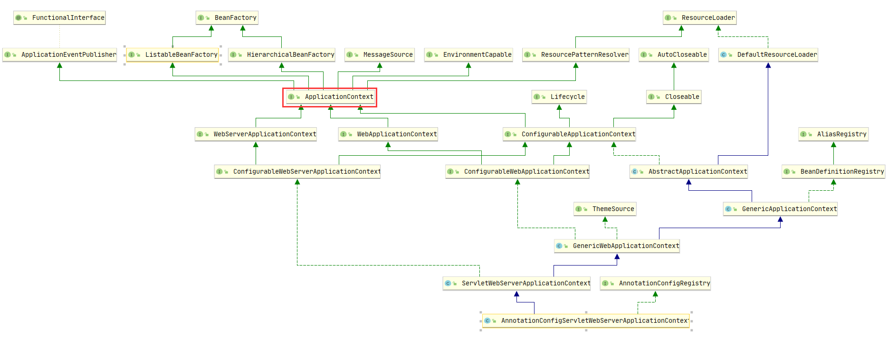

可以说是非常庞大，但不着急。
从一个点入手逐渐了解

### getSpringFactoriesInstances()
```java
// 异常记者
Collection<SpringBootExceptionReporter> exceptionReporters = new ArrayList<>();
// Spring Boot 异常报告器
exceptionReporters = getSpringFactoriesInstances(SpringBootExceptionReporter.class,
        new Class[] { ConfigurableApplicationContext.class }, context);
```
FailureAnalyzers是SpringBootExceptionReporter接口的唯一实现类

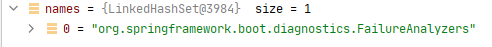

### prepareContext()
```java
// 准备上下文
prepareContext(context, environment, listeners, applicationArguments, printedBanner);
```
点进去看详情
```java
private void prepareContext(ConfigurableApplicationContext context, ConfigurableEnvironment environment,
        SpringApplicationRunListeners listeners, ApplicationArguments applicationArguments, Banner printedBanner) {
    // 设置环境变量
    context.setEnvironment(environment);
    // 应用任何相关的后期处理ApplicationContext 。 子类可以根据需要应用额外的处理。
    postProcessApplicationContext(context);
    // 在刷新之前将任何ApplicationContextInitializer到上下文。（应用初始化器）
    applyInitializers(context);
    // 各监听器完成动作后，ApplicationContext基本算是初步实例化完成，但是还剩下很重要的事没做。在下面
    listeners.contextPrepared(context);
    if (this.logStartupInfo) {
        //调用以记录启动信息，子类可能会覆盖以添加额外的日志记录。
        logStartupInfo(context.getParent() == null);
        logStartupProfileInfo(context);
    }
    // Add boot specific singleton beans
    ConfigurableListableBeanFactory beanFactory = context.getBeanFactory();
    // 注册springApplicationArguments Bean单例到Bean工厂里
    beanFactory.registerSingleton("springApplicationArguments", applicationArguments);
    if (printedBanner != null) {
        // 注册 springBootBanner Bean单例到Bean工厂里
        beanFactory.registerSingleton("springBootBanner", printedBanner);
    }
    if (beanFactory instanceof DefaultListableBeanFactory) {
        // 置是否应允许通过注册具有相同名称的不同定义来覆盖 bean 定义，自动替换前者。如果没有，将抛出异常。这也适用于覆盖别名。
        ((DefaultListableBeanFactory) beanFactory)
                .setAllowBeanDefinitionOverriding(this.allowBeanDefinitionOverriding);
    }
    // 若lazyInitialization = true延迟初始化
    if (this.lazyInitialization) {
        // 那就向Bean工厂放一个：new LazyInitializationBeanFactoryPostProcessor()
        // 该处理器的作用是：对所有的Bean延迟初始化，全部.setLazyInit(true);
        // (通过LazyInitializationExcludeFilter接口指定的排除在外)
        context.addBeanFactoryPostProcessor(new LazyInitializationBeanFactoryPostProcessor());
    }
    // Load the sources
    Set<Object> sources = getAllSources();
    Assert.notEmpty(sources, "Sources must not be empty");
    load(context, sources.toArray(new Object[0]));
    listeners.contextLoaded(context);
}
```
#### applyInitializers(context)
```java
protected void applyInitializers(ConfigurableApplicationContext context) {
    // 这就是在第一节SpringApplication的构造函数设置的7个Initializers
    for (ApplicationContextInitializer initializer : getInitializers()) {
        Class<?> requiredType = GenericTypeResolver.resolveTypeArgument(initializer.getClass(),
                ApplicationContextInitializer.class);
        Assert.isInstanceOf(requiredType, context, "Unable to call initializer.");
        // 执行初始化类
        initializer.initialize(context);
    }
}
```
#### listeners.contextPrepared(context)
触发这个事件<span style="color: red">ApplicationContextInitializedEvent</span>

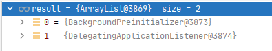

他们进入后都没满足判断条件，无动作

#### if (this.logStartupInfo)
执行完成后在控制台打印两行
```java
// 启动信息：启动项目 用户 PID 启动类目录 项目路径
2022-02-08 17:58:18.206  INFO 9328 --- [           main] l.LearnApplication                       : Starting LearnApplication on DESKTOP-M9HCL4H with PID 9328 (D:\learn\life\life-learn\target\classes started by fang.com in D:\learn\life)
// 打印使用的配置文件环境
2022-02-08 17:59:47.955  INFO 9328 --- [           main] l.LearnApplication                       : The following profiles are active: test
```
#### beanFactory.registerSingleton
2get注册单例Bean，springApplicationArguments、springBootBanner。(就是说可以使用@Autowired注入)

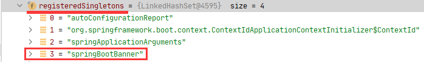

最终操作了Context里的4个变量
```java
synchronized (this.singletonObjects) {
        this.singletonObjects.put(beanName, singletonObject);
        this.singletonFactories.remove(beanName);
        this.earlySingletonObjects.remove(beanName);
        this.registeredSingletons.add(beanName);
    }
```

#### 加载所有资源
```java
Set<Object> sources = getAllSources();
load(context, sources.toArray(new Object[0]));
```

加载所有的资源，点进去看详情
```java
/**
 * 翻译下注释：返回当run(String…)被调用时将被添加到ApplicationContext的所有源的不可变集合。
 * 此方法将构造函数中指定的任何主源与显式设置的任何其他源组合在一起。
 */
public Set<Object> getAllSources() {
    Set<Object> allSources = new LinkedHashSet<>();
    if (!CollectionUtils.isEmpty(this.primarySources)) {
        allSources.addAll(this.primarySources);
    }
    if (!CollectionUtils.isEmpty(this.sources)) {
        allSources.addAll(this.sources);
    }
    return Collections.unmodifiableSet(allSources);
}
```
这里就一条返回

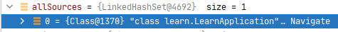

将 bean 加载到应用程序上下文中
```java
/**
 *
 * context 上下文
 * sources 上面得到的集合
 */
protected void load(ApplicationContext context, Object[] sources) {
    if (logger.isDebugEnabled()) {
        logger.debug("Loading source " + StringUtils.arrayToCommaDelimitedString(sources));
    }
    // 创建Bean定义加载器
    BeanDefinitionLoader loader = createBeanDefinitionLoader(getBeanDefinitionRegistry(context), sources);
    if (this.beanNameGenerator != null) {
        loader.setBeanNameGenerator(this.beanNameGenerator);
    }
    if (this.resourceLoader != null) {
        loader.setResourceLoader(this.resourceLoader);
    }
    if (this.environment != null) {
        loader.setEnvironment(this.environment);
    }
    loader.load();
}
```

Bean定义加载器的构造方法
```java
BeanDefinitionLoader(BeanDefinitionRegistry registry, Object... sources) {
    Assert.notNull(registry, "Registry must not be null");
    Assert.notEmpty(sources, "Sources must not be empty");
    this.sources = sources;
    // 支持基于注解
    this.annotatedReader = new AnnotatedBeanDefinitionReader(registry);
    // 支持基于XML
    this.xmlReader = new XmlBeanDefinitionReader(registry);
    if (isGroovyPresent()) {
        // 支持基于Groovy文件
        this.groovyReader = new GroovyBeanDefinitionReader(registry);
    }
    // 支持基于classpath中
    this.scanner = new ClassPathBeanDefinitionScanner(registry);
    this.scanner.addExcludeFilter(new ClassExcludeFilter(sources));
}
```

registry怎么获取？
```java
private BeanDefinitionRegistry getBeanDefinitionRegistry(ApplicationContext context) {
    if (context instanceof BeanDefinitionRegistry) {
        return (BeanDefinitionRegistry) context;
    }
    if (context instanceof AbstractApplicationContext) {
        return (BeanDefinitionRegistry) ((AbstractApplicationContext) context).getBeanFactory();
    }
    throw new IllegalStateException("Could not locate BeanDefinitionRegistry");
}
```

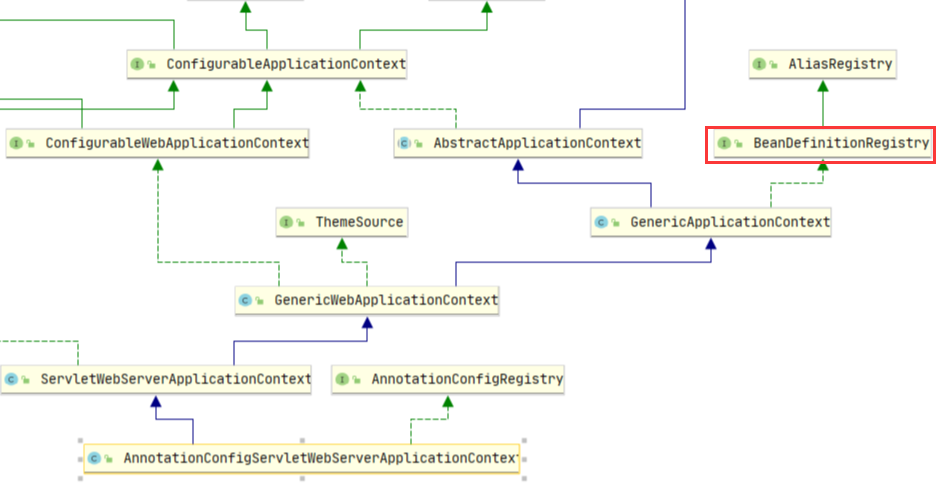

我们这里启动上下文是 AnnotationConfigServletWebServerApplicationContext 
从类图上看是实现了BeanDefinitionRegistry 所以直接`(BeanDefinitionRegistry) context`

#### listeners.contextLoaded(context)
调用监听器<span style="color :red " >ApplicationPreparedEvent</span>

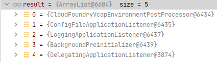

* CloudFoundryVcapEnvironmentPostProcessor：
* ConfigFileApplicationListener：向上下文注册一个new PropertySourceOrderingPostProcessor(context)。
  它的作用是：Bean工厂结束后对环境里的属性源进行重排序（把名字叫defaultProperties的属性源放在最末位）
* 该属性源是通过SpringApplication#setDefaultProperties API方式放进来的，一般不会使用到，留个印象即可
* LoggingApplicationListener：因为这时已经有Bean工厂了嘛，所以它做的事是：向工厂内放入Bean
  - “springBootLoggingSystem” -> loggingSystem
  - “springBootLogFile” -> logFile
  - “springBootLoggerGroups” -> loggerGroups
* BackgroundPreinitializer：没有满足判断条件，无动作
* RestartListener：Spring Cloud提供
* DelegatingApplicationListener：没有满足判断条件，无动作


<span style="color :green " >
至此ApplicationContext初始化完成，该赋值的赋值了，Bean定义信息也已全部加载完成。但是，单例Bean还没有被实例化，web容器依旧还没启动。
</span>

### refreshContext(context);解析
重要
[refreshContext(context);](./springboot_refreshContext.md) 

