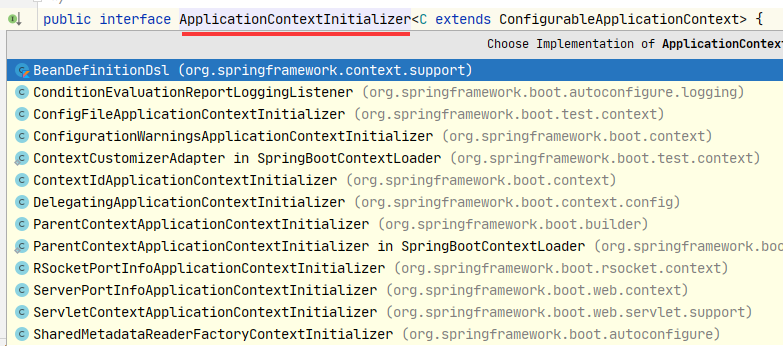

# SpringBoot Start
## SpringBoot对Bean的管理
Java的启动从main开始
```java
@SpringBootApplication
public class LearnApplication {
	public static void main(String[] args) {
		SpringApplication.run(LearnApplication.class, args);
	}
}
```
进入到run方法，run是SpringApplication类的静态方法
```java
public static ConfigurableApplicationContext run(Class<?> primarySource, String... args) {
    return run(new Class<?>[] { primarySource }, args);
}
```
传入两个参数，
    一个启动类构成的类数组
    一个main启动时传入的参数数组
```java
/**
    * 可用于使用默认设置从指定源运行SpringApplication的静态助手。
    * @param primarySource 要加载的主要来源
    * @param args 应用程序参数（通常从 Java 主方法传递）
    * @return 运行的 ApplicationContext 返回ConfigurableApplicationContext类型
    */
public static ConfigurableApplicationContext run(Class<?> primarySource,
        String... args) {
    return run(new Class<?>[] { primarySource }, args);
}
```
```java
/**
    * 静态助手，可用于使用默认设置和用户提供的参数从指定的源运行SpringApplication 。
    * @param primarySources the primary sources to load
    * @param args the application arguments (usually passed from a Java main method)
    * @return the running {@link ApplicationContext}
    */
public static ConfigurableApplicationContext run(Class<?>[] primarySources,
        String[] args) {
    return new SpringApplication(primarySources).run(args);
}
```
从上面代码可以看到这里分了2步。一SpringApplication的构造函数，二调用run方法
先来按下SpringApplication的构造函数
```java
/**
    * 创建一个新的SpringApplication实例. 应用上下文将从指定的主要来源加载beans
    * （详情看SpringApplication文档，这个实例能被定制在调用run之前）
    * @param primarySources 指定的主要来源
    */
public SpringApplication(Class<?>... primarySources) {
    this(null, primarySources);
}

@SuppressWarnings({ "unchecked", "rawtypes" })
public SpringApplication(ResourceLoader resourceLoader, Class<?>... primarySources) {
    // resourceLoader在初始运行时传入的null
    this.resourceLoader = resourceLoader;
    // 断言primarySources（指定的主要来源，启动类）是否null，是-抛出IllegalArgumentException异常
    Assert.notNull(primarySources, "PrimarySources must not be null");
    // 构造成Set结构放入成员变量 this.primarySources
    this.primarySources = new LinkedHashSet<>(Arrays.asList(primarySources));
    // 推断 Web 应用程序类型
    this.webApplicationType = deduceWebApplicationType();
    //设置将应用于 Spring ApplicationContextInitializer的ApplicationContext 。
    setInitializers((Collection) getSpringFactoriesInstances(
            ApplicationContextInitializer.class));
    setListeners((Collection) getSpringFactoriesInstances(ApplicationListener.class));
    this.mainApplicationClass = deduceMainApplicationClass();
}


/**
*推断Web应用程序类型方法做如下操作：
*1. 如果存在DispatcherHandler、不存在DispatcherServlet、不存在ResourceConfig
*   则该应用程序应作为反应式 Web 应用程序运行，并应启动嵌入式反应式 Web 服务器。
*2. 上述条件不符合，判断javax.servlet.Servlet、ConfigurableWebApplicationContext不存在，
*   如果其中一个成立该应用程序不应作为 Web 应用程序运行，也不应启动嵌入式 Web 服务器。
*3. 上述2个都没满足，返回 WebApplicationType.SERVLET
*   该应用程序应作为基于 servlet 的 Web 应用程序运行，并应启动嵌入式 servlet Web 服务器
*/
private WebApplicationType deduceWebApplicationType() {
    if (ClassUtils.isPresent(REACTIVE_WEB_ENVIRONMENT_CLASS, null)
            && !ClassUtils.isPresent(MVC_WEB_ENVIRONMENT_CLASS, null)
            && !ClassUtils.isPresent(JERSEY_WEB_ENVIRONMENT_CLASS, null)) {
        return WebApplicationType.REACTIVE;
    }
    for (String className : WEB_ENVIRONMENT_CLASSES) {
        if (!ClassUtils.isPresent(className, null)) {
            return WebApplicationType.NONE;
        }
    }
    return WebApplicationType.SERVLET;
}
```
实现接口的类

```java

```