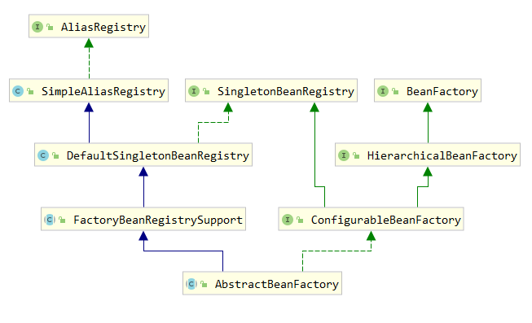

# spring DI 过程 

## 依赖注入
### 发生的时间
依赖注入有两种情况触发
1. 用户第一次调用getBean()方法时，IoC容器触发以来注入
2. 当属性设为懒加载时，容器在解析注册Bean定义时进行预实例化

## 寻找获取Bean的入口
BeanFactory接口定义了SpringIoC容器的基本功能规范。BeanFactory接口中定义了几个getBean()方法，用于用户向IoC容器索取被管理的Bean的方法。
BeanFactory是接口，具体情况看他的实现AbstractBeanFactory，类图如下：



```java
@Override
public Object getBean(String name) throws BeansException {
    return doGetBean(name, null, null, false);
}

@Override
public <T> T getBean(String name, Class<T> requiredType) throws BeansException {
    return doGetBean(name, requiredType, null, false);
}

@Override
public Object getBean(String name, Object... args) throws BeansException {
    return doGetBean(name, null, args, false);
}

/**
    * Return an instance, which may be shared or independent, of the specified bean.
    * 返回指定 bean 的一个实例，该实例可以是共享的，也可以是独立的。
    * @param name the name of the bean to retrieve
    * @param requiredType the required type of the bean to retrieve
    * @param args arguments to use when creating a bean instance using explicit arguments
    * (only applied when creating a new instance as opposed to retrieving an existing one)
    * @return an instance of the bean
    * @throws BeansException if the bean could not be created
    */
public <T> T getBean(String name, @Nullable Class<T> requiredType, @Nullable Object... args)
        throws BeansException {

    return doGetBean(name, requiredType, args, false);
}
```

干活的都do开头的，看下doGetBean
```java
/**
    * Return an instance, which may be shared or independent, of the specified bean.
    * 返回一个实例，它可以与指定的 bean 共享或独立
    * @param name  要检索的 bean 的名称
    * @param requiredType  要检索的 bean 的所需类型
    * @param args 使用显式参数创建 bean 实例时使用的参数
    * (仅在创建新实例而不是检索现有实例时应用)
    * @param typeCheckOnly 是否获取实例用于类型检查，不用于实际使用
    * @return bean 的一个实例
    * @throws BeansException 如果无法创建 bean
    */
@SuppressWarnings("unchecked")
protected <T> T doGetBean(
        String name, @Nullable Class<T> requiredType, @Nullable Object[] args, boolean typeCheckOnly)
        throws BeansException {

    // 返回 bean 名称，必要时去除工厂取消引用前缀，并将别名解析为规范名称
    String beanName = transformedBeanName(name);
    Object bean;

    // 从缓存中读取是否已经有被创建的单例模式的Bean
    Object sharedInstance = getSingleton(beanName);
    // 如果从手动注册的单例singletonObjects或earlySingletonObjects Map中找到
    if (sharedInstance != null && args == null) {
        if (logger.isTraceEnabled()) {
            // 在整个工厂内单例 bean 当前是否正在创建中 
            if (isSingletonCurrentlyInCreation(beanName)) {
                logger.trace("Returning eagerly cached instance of singleton bean '" + beanName +
                        "' that is not fully initialized yet - a consequence of a circular reference");
            }
            else {
                logger.trace("Returning cached instance of singleton bean '" + beanName + "'");
            }
        }
        // 获取 Bean 实例的对象。主要完成FactoryBean的相关处理。
        bean = getObjectForBeanInstance(sharedInstance, name, beanName, null);
    }

    else {
        // 原型 bean 当前前线程是否正在创建中（缓存中已经有原型模式的Bean)
        // 如果我们已经在创建这个 bean 实例，则失败： 我们可能在循环引用中
        if (isPrototypeCurrentlyInCreation(beanName)) {
            // 是在创建中则抛出Exception
            throw new BeanCurrentlyInCreationException(beanName);
        }

        // 检查此工厂中是否存在 bean 定义。
        BeanFactory parentBeanFactory = getParentBeanFactory();
        if (parentBeanFactory != null && !containsBeanDefinition(beanName)) {
            // Not found -> check parent.
            // 没有发现 则 检查其父
            String nameToLookup = originalBeanName(name);
            if (parentBeanFactory instanceof AbstractBeanFactory) {
                return ((AbstractBeanFactory) parentBeanFactory).doGetBean(
                        nameToLookup, requiredType, args, typeCheckOnly);
            }
            else if (args != null) {
                // Delegation to parent with explicit args.
                return (T) parentBeanFactory.getBean(nameToLookup, args);
            }
            else if (requiredType != null) {
                // No args -> delegate to standard getBean method.
                return parentBeanFactory.getBean(nameToLookup, requiredType);
            }
            else {
                return (T) parentBeanFactory.getBean(nameToLookup);
            }
        }

        if (!typeCheckOnly) {
            markBeanAsCreated(beanName);
        }

        try {
            // 根据指定Bean名称获取其父级Bean定义，主要解决Bean继承时子类和父类公共属性问题
            RootBeanDefinition mbd = getMergedLocalBeanDefinition(beanName);
            checkMergedBeanDefinition(mbd, beanName, args);

            // Guarantee initialization of beans that the current bean depends on.
            // 获取当前Bean所有依赖Bean的名称
            String[] dependsOn = mbd.getDependsOn();
            if (dependsOn != null) {
                for (String dep : dependsOn) {
                    if (isDependent(beanName, dep)) {
                        throw new BeanCreationException(mbd.getResourceDescription(), beanName,
                                "Circular depends-on relationship between '" + beanName + "' and '" + dep + "'");
                    }
                    // 把被依赖Bean注册给当前依赖的Bean
                    registerDependentBean(dep, beanName);
                    try {
                        getBean(dep);
                    }
                    catch (NoSuchBeanDefinitionException ex) {
                        throw new BeanCreationException(mbd.getResourceDescription(), beanName,
                                "'" + beanName + "' depends on missing bean '" + dep + "'", ex);
                    }
                }
            }

            // Create bean instance.
            // 创建一个单例模式的Bean的实例对象
            if (mbd.isSingleton()) {
                // 创建实例对象并注册给所依赖的对象
                sharedInstance = getSingleton(beanName, () -> {
                    try {
                        // 回调实现创建Bean实例对象
                        return createBean(beanName, mbd, args);
                    }
                    catch (BeansException ex) {
                        // Explicitly remove instance from singleton cache: It might have been put there
                        // eagerly by the creation process, to allow for circular reference resolution.
                        // Also remove any beans that received a temporary reference to the bean.
                        destroySingleton(beanName);
                        throw ex;
                    }
                });
                // 获取给定Bean的实例对象
                bean = getObjectForBeanInstance(sharedInstance, name, beanName, mbd);
            }

            else if (mbd.isPrototype()) {
                // It's a prototype -> create a new instance.
                // IoC容器创建原型模式的Bean的实例对象
                Object prototypeInstance = null;
                try {
                    beforePrototypeCreation(beanName);
                    prototypeInstance = createBean(beanName, mbd, args);
                }
                finally {
                    afterPrototypeCreation(beanName);
                }
                bean = getObjectForBeanInstance(prototypeInstance, name, beanName, mbd);
            }

            else {
                // 创建的Bean既不是单例的也不是原型模式的
                // 根据Bean定义资源中配置的方式
                String scopeName = mbd.getScope();
                if (!StringUtils.hasLength(scopeName)) {
                    throw new IllegalStateException("No scope name defined for bean ´" + beanName + "'");
                }
                Scope scope = this.scopes.get(scopeName);
                if (scope == null) {
                    throw new IllegalStateException("No Scope registered for scope name '" + scopeName + "'");
                }
                try {
                    Object scopedInstance = scope.get(beanName, () -> {
                        beforePrototypeCreation(beanName);
                        try {
                            return createBean(beanName, mbd, args);
                        }
                        finally {
                            afterPrototypeCreation(beanName);
                        }
                    });
                    bean = getObjectForBeanInstance(scopedInstance, name, beanName, mbd);
                }
                catch (IllegalStateException ex) {
                    throw new BeanCreationException(beanName,
                            "Scope '" + scopeName + "' is not active for the current thread; consider " +
                            "defining a scoped proxy for this bean if you intend to refer to it from a singleton",
                            ex);
                }
            }
        }
        catch (BeansException ex) {
            cleanupAfterBeanCreationFailure(beanName);
            throw ex;
        }
    }

    // 检查所需类型是否与实际 bean 实例的类型匹配。
    if (requiredType != null && !requiredType.isInstance(bean)) {
        try {
            T convertedBean = getTypeConverter().convertIfNecessary(bean, requiredType);
            if (convertedBean == null) {
                throw new BeanNotOfRequiredTypeException(name, requiredType, bean.getClass());
            }
            return convertedBean;
        }
        catch (TypeMismatchException ex) {
            if (logger.isTraceEnabled()) {
                logger.trace("Failed to convert bean '" + name + "' to required type '" +
                        ClassUtils.getQualifiedName(requiredType) + "'", ex);
            }
            throw new BeanNotOfRequiredTypeException(name, requiredType, bean.getClass());
        }
    }
    return (T) bean;
}

```

上面源码只定义了根据Bean定义的不同采取不同策略创建Bean实例，具体的Bean实例对象的创建过程是有实现了ObjectFactory接口的creatBean()方法完成。
具体实现类SpringBoot这里由其实现类AbstractAutowireCapableBeanFactory完成。看下源码：

```java
@Override
protected Object createBean(String beanName, RootBeanDefinition mbd, @Nullable Object[] args)
        throws BeanCreationException {

    if (logger.isTraceEnabled()) {
        logger.trace("Creating instance of bean '" + beanName + "'");
    }
    RootBeanDefinition mbdToUse = mbd;

    // Make sure bean class is actually resolved at this point, and
    // clone the bean definition in case of a dynamically resolved Class
    // which cannot be stored in the shared merged bean definition.
    // mbd是否有BeanClass 
    Class<?> resolvedClass = resolveBeanClass(mbd, beanName);
    if (resolvedClass != null && !mbd.hasBeanClass() && mbd.getBeanClassName() != null) {
        mbdToUse = new RootBeanDefinition(mbd);
        mbdToUse.setBeanClass(resolvedClass);
    }

    // 准备方法覆盖。
    try {
        mbdToUse.prepareMethodOverrides();
    }
    catch (BeanDefinitionValidationException ex) {
        throw new BeanDefinitionStoreException(mbdToUse.getResourceDescription(),
                beanName, "Validation of method overrides failed", ex);
    }

    try {
        // Give BeanPostProcessors a chance to return a proxy instead of the target bean instance.
        Object bean = resolveBeforeInstantiation(beanName, mbdToUse);
        if (bean != null) {
            return bean;
        }
    }
    catch (Throwable ex) {
        throw new BeanCreationException(mbdToUse.getResourceDescription(), beanName,
                "BeanPostProcessor before instantiation of bean failed", ex);
    }

    try {
        // 创建Bean的入口
        Object beanInstance = doCreateBean(beanName, mbdToUse, args);
        if (logger.isTraceEnabled()) {
            logger.trace("Finished creating instance of bean '" + beanName + "'");
        }
        return beanInstance;
    }
    catch (BeanCreationException | ImplicitlyAppearedSingletonException ex) {
        // A previously detected exception with proper bean creation context already,
        // or illegal singleton state to be communicated up to DefaultSingletonBeanRegistry.
        throw ex;
    }
    catch (Throwable ex) {
        throw new BeanCreationException(
                mbdToUse.getResourceDescription(), beanName, "Unexpected exception during bean creation", ex);
    }
}

// 真正创建Bean的方法
protected Object doCreateBean(String beanName, RootBeanDefinition mbd, @Nullable Object[] args)
        throws BeanCreationException {

    // 实例化Bean
    BeanWrapper instanceWrapper = null;
    if (mbd.isSingleton()) {
        // 是单例的话，从工厂 Bean 实例缓存移出这个beanName
        instanceWrapper = this.factoryBeanInstanceCache.remove(beanName);
    }
    if (instanceWrapper == null) {
        // 没得到的话，用适当的实例化策略为指定的 bean 创建一个新实例： 工厂方法、构造函数自动装配或简单实例化。
        instanceWrapper = createBeanInstance(beanName, mbd, args);
    }
    
    Object bean = instanceWrapper.getWrappedInstance();
    // 获取实例化的类型
    Class<?> beanType = instanceWrapper.getWrappedClass();
    if (beanType != NullBean.class) {
        mbd.resolvedTargetType = beanType;
    }

    // Allow post-processors to modify the merged bean definition.
    synchronized (mbd.postProcessingLock) {
        if (!mbd.postProcessed) {
            try {
                // 调用PostProcess后置处理器-增强器
                applyMergedBeanDefinitionPostProcessors(mbd, beanType, beanName);
            }
            catch (Throwable ex) {
                throw new BeanCreationException(mbd.getResourceDescription(), beanName,
                        "Post-processing of merged bean definition failed", ex);
            }
            mbd.postProcessed = true;
        }
    }

    // Eagerly cache singletons to be able to resolve circular references
    // even when triggered by lifecycle interfaces like BeanFactoryAware.
    // 向容器缓存中缓存单例模式的Bean对象，以防止循环引用
    // 是单例的 是支持循环引用的 是正在初始化的 则为 true
    boolean earlySingletonExposure = (mbd.isSingleton() && this.allowCircularReferences &&
            isSingletonCurrentlyInCreation(beanName));
    if (earlySingletonExposure) {
        if (logger.isTraceEnabled()) {
            logger.trace("Eagerly caching bean '" + beanName +
                    "' to allow for resolving potential circular references");
        }
        // 这里会添加一个回调 给到 singletonFactories。尽早持有引用
        addSingletonFactory(beanName, () -> getEarlyBeanReference(beanName, mbd, bean));
    }

    // Initialize the bean instance.
    // Bean的初始化，》》》》》》》》》》》》》》》**********  依赖注入在此触发 *******《《《《《《《《《《《《《《《
    Object exposedObject = bean;
    try {
        // 将Bean实例对象封装，并且将Bean定义中的配置的属性值赋值给实例对象
        populateBean(beanName, mbd, instanceWrapper);
        // 初始化Bean对象
        exposedObject = initializeBean(beanName, exposedObject, mbd);
    }
    catch (Throwable ex) {
        if (ex instanceof BeanCreationException && beanName.equals(((BeanCreationException) ex).getBeanName())) {
            throw (BeanCreationException) ex;
        }
        else {
            throw new BeanCreationException(
                    mbd.getResourceDescription(), beanName, "Initialization of bean failed", ex);
        }
    }

    if (earlySingletonExposure) {
        Object earlySingletonReference = getSingleton(beanName, false);
        if (earlySingletonReference != null) {
            if (exposedObject == bean) {
                exposedObject = earlySingletonReference;
            }
            else if (!this.allowRawInjectionDespiteWrapping && hasDependentBean(beanName)) {
                String[] dependentBeans = getDependentBeans(beanName);
                Set<String> actualDependentBeans = new LinkedHashSet<>(dependentBeans.length);
                for (String dependentBean : dependentBeans) {
                    if (!removeSingletonIfCreatedForTypeCheckOnly(dependentBean)) {
                        actualDependentBeans.add(dependentBean);
                    }
                }
                if (!actualDependentBeans.isEmpty()) {
                    throw new BeanCurrentlyInCreationException(beanName,
                            "Bean with name '" + beanName + "' has been injected into other beans [" +
                            StringUtils.collectionToCommaDelimitedString(actualDependentBeans) +
                            "] in its raw version as part of a circular reference, but has eventually been " +
                            "wrapped. This means that said other beans do not use the final version of the " +
                            "bean. This is often the result of over-eager type matching - consider using " +
                            "'getBeanNamesForType' with the 'allowEagerInit' flag turned off, for example.");
                }
            }
        }
    }

    // Register bean as disposable.
    try {
        registerDisposableBeanIfNecessary(beanName, bean, mbd);
    }
    catch (BeanDefinitionValidationException ex) {
        throw new BeanCreationException(
                mbd.getResourceDescription(), beanName, "Invalid destruction signature", ex);
    }

    return exposedObject;
}
```