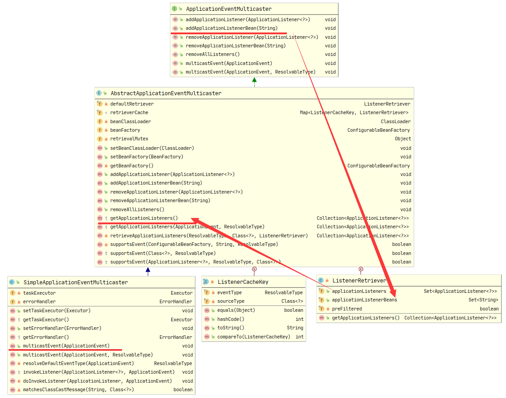
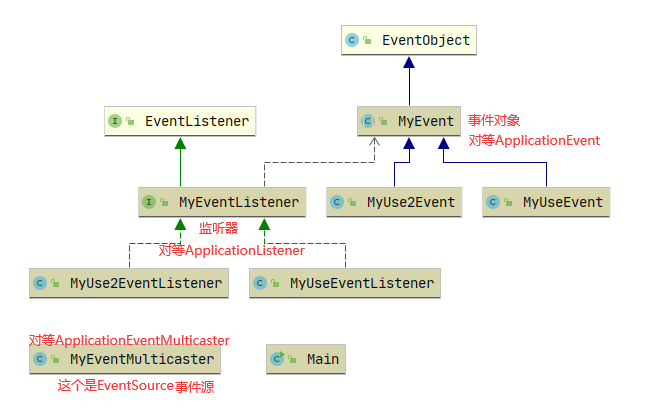

# Spring 事件驱动机制

## JDK1.1提供的发布订阅模式（EventListener和EventObject）
在接触Spring时间驱动机制之前先来看下JDK1.1提供的发布订阅模式（EventListener和EventObject）的使用，
来了解发布订阅模式。
时间机制一般包含三个部分：EventObject，EventListener和Source
`EventObject`：事件状态对象的基类，派生所有事件状态对象的根类。所有事件都是通过对对象“源”的引用来构建的，“源”在逻辑上被认为是所讨论事件最初发生在其上的对象
`EventListener`：所有事件侦听器接口都必须扩展的标记接口，实现了它表示标记它为一个监听器。
`Source`：一个普通的POJO对象类。事件最初发生的地方，他里面必须含有监听它的监听器们。


Spring提供了`ApplicationEventPublisher`接口作为事件发布者(`ApplicationContext`接口继承了该接口，担当着事件发布者的角色)。

Spring提供了`ApplicationEventMulticaster`接口，负责管理`ApplicationListener`和真正发布`ApplicationEvent`（ApplicationContext是委托给它完成的）
::: tip 
`ApplicationListener`实现了JDK的`EventListener`，但它抽象出一个onApplicationEvent方法，使用更方便。

`ApplicationEvent`继承自`EventObject`。

`ApplicationEventPublisher`最终都是委托给`ApplicationEventMulticaster`去完成的。当然你也可以自己去实现一个`ApplicationEventMulticaster`
:::

## Spring IOC容器refresh()涉及点
1. 第八步：initApplicationEventMulticaster()

2. 第十步：registerListeners()

3. 第十二步：inishRefresh()方法里的publishEvent(new ContextRefreshedEvent(this))都是和时间机制相关的方法

### initApplicationEventMulticaster()

在springboot的refresh()方法中调用`initApplicationEventMulticaster()`。
```java
public static final String APPLICATION_EVENT_MULTICASTER_BEAN_NAME = "applicationEventMulticaster";
/**
    * Initialize the ApplicationEventMulticaster.
    * Uses SimpleApplicationEventMulticaster if none defined in the context.
    * @see org.springframework.context.event.SimpleApplicationEventMulticaster
    */
protected void initApplicationEventMulticaster() {
    ConfigurableListableBeanFactory beanFactory = getBeanFactory();
    // 如果有包含applicationEventMulticaster的Bean
    if (beanFactory.containsLocalBean(APPLICATION_EVENT_MULTICASTER_BEAN_NAME)) {
        // 就取出用户自定义的事件管理
        this.applicationEventMulticaster =
                beanFactory.getBean(APPLICATION_EVENT_MULTICASTER_BEAN_NAME, ApplicationEventMulticaster.class);
        if (logger.isTraceEnabled()) {
            logger.trace("Using ApplicationEventMulticaster [" + this.applicationEventMulticaster + "]");
        }
    }
    else {
        // 否则创建默认的简单事件多播管理
        this.applicationEventMulticaster = new SimpleApplicationEventMulticaster(beanFactory);
        beanFactory.registerSingleton(APPLICATION_EVENT_MULTICASTER_BEAN_NAME, this.applicationEventMulticaster);
        if (logger.isTraceEnabled()) {
            logger.trace("No '" + APPLICATION_EVENT_MULTICASTER_BEAN_NAME + "' bean, using " +
                    "[" + this.applicationEventMulticaster.getClass().getSimpleName() + "]");
        }
    }
}
```
如果没有有指定事件多播，那么容器自动注册一个`SimpleApplicationEventMulticaster`。因此若希望手动控制事件的发布，是可以@Autowired进来的。

看下`SimpleApplicationEventMulticaster`的类图

可以看到`SimpleApplicationEventMulticaster`继承`AbstractApplicationEventMulticaster`，
`AbstractApplicationEventMulticaster`实现了`ApplicationEventMulticaster`

### registerListeners()

```java
/**
    * 添加实现 ApplicationListener 作为侦听器的 bean。 
    * 可以添加不是 bean 的，不会影响其他监听器，。
    */
protected void registerListeners() {
    // 首先注册静态指定的监听器
    for (ApplicationListener<?> listener : getApplicationListeners()) {
        // getApplicationEventMulticaster()就是上一节注册的简单事件多播管理
        getApplicationEventMulticaster().addApplicationListener(listener);
    }

    // 不要在这里初始化 FactoryBeans：我们需要让所有常规 bean 保持未初始化状态，以让后处理器应用于它们！

    // getBeanNamesForType()返回与给定对象类型（包括子类）匹配的bean
    // （或FactoryBeans创建的对象）的名称，如果没有则为空数组
    String[] listenerBeanNames = getBeanNamesForType(ApplicationListener.class, true, false);
    for (String listenerBeanName : listenerBeanNames) {
        // 添加一个侦听器 bean 以接收所有事件的通知。
        getApplicationEventMulticaster().addApplicationListenerBean(listenerBeanName);
    }

    // 发布早期应用程序事件，因为我们终于有了一个多播器....
    Set<ApplicationEvent> earlyEventsToProcess = this.earlyApplicationEvents;
    this.earlyApplicationEvents = null;
    if (!CollectionUtils.isEmpty(earlyEventsToProcess)) {
        for (ApplicationEvent earlyEvent : earlyEventsToProcess) {
            // multicastEvent()将给定的应用程序事件多播到适当的侦听器。
            getApplicationEventMulticaster().multicastEvent(earlyEvent);
        }
    }
}
```
哈哈对于上面开发者的有趣对话 `发布早期应用程序事件，因为我们终于有了一个多播器....`
是在refresh()第一步里有一个代码
```java
// 方法外的成员变量
private Set<ApplicationEvent> earlyApplicationEvents;
// Allow for the collection of early ApplicationEvents,
// to be published once the multicaster is available...
// 允许收集早期应用程序事件，一旦多播器可用就发布...
this.earlyApplicationEvents = new LinkedHashSet<>();
```

### finishRefresh()
```java
/**
    * 完成此上下文的刷新，调用 LifecycleProcessor 的 onRefresh() 方法并发布ContextRefreshedEvent 
    */
protected void finishRefresh() {
    // 清除上下文级别的资源缓存（例如扫描中的 ASM 元数据）。
    clearResourceCaches();

    // 为此上下文初始化生命周期处理器。
    initLifecycleProcessor();

    // 首先将刷新传播到生命周期处理器。
    getLifecycleProcessor().onRefresh();

    // 发布最终事件。
    publishEvent(new ContextRefreshedEvent(this));

    // 参与 LiveBeansView MBean（如果处于活动状态）
    LiveBeansView.registerApplicationContext(this);
}
```

来看`publishEvent(new ContextRefreshedEvent(this));`这段代码
`ContextRefreshedEvent`的类图

这里实际上使用的是JDK1.1的`EventObject`
在来看`publishEvent()`方法
```java {39}
/**
    * 将给定事件发布给所有侦听器。 
    * 注意：侦听器在 MessageSource 之后被初始化，以便能够在侦听器实现中访问它。
    * 因此，MessageSource 实现不能发布事件。
    * @param event the event to publish (may be application-specific or a
    * standard framework event)
    */
@Override
public void publishEvent(ApplicationEvent event) {
    publishEvent(event, null);
}
    /**
    * 发布给定事件给所有的监听者（listeners）
    * @param event 要发布的事件（可能是ApplicationEvent或要转换为PayloadApplicationEvent的有效负载对象）
    * @param eventType 已解决的事件类型（如果已知）
    * @since 4.2
    */
protected void publishEvent(Object event, @Nullable ResolvableType eventType) {
    Assert.notNull(event, "Event must not be null");

    // Decorate event as an ApplicationEvent if necessary
    // ApplicationEvent 继承了 EventObject
    ApplicationEvent applicationEvent;
    if (event instanceof ApplicationEvent) {
        applicationEvent = (ApplicationEvent) event;
    }
    else {
        applicationEvent = new PayloadApplicationEvent<>(this, event);
        if (eventType == null) {
            eventType = ((PayloadApplicationEvent<?>) applicationEvent).getResolvableType();
        }
    }

    // Multicast right now if possible - or lazily once the multicaster is initialized
    if (this.earlyApplicationEvents != null) {
        this.earlyApplicationEvents.add(applicationEvent);
    }
    else {
        getApplicationEventMulticaster().multicastEvent(applicationEvent, eventType);
    }

    // Publish event via parent context as well...
    if (this.parent != null) {
        if (this.parent instanceof AbstractApplicationContext) {
            ((AbstractApplicationContext) this.parent).publishEvent(event, eventType);
        }
        else {
            this.parent.publishEvent(event);
        }
    }
}
```


```java
@Override
public void multicastEvent(final ApplicationEvent event, @Nullable ResolvableType eventType) {
    ResolvableType type = (eventType != null ? eventType : resolveDefaultEventType(event));
    Executor executor = getTaskExecutor();
    for (ApplicationListener<?> listener : getApplicationListeners(event, type)) {
        if (executor != null) {
            executor.execute(() -> invokeListener(listener, event));
        }
        else {
            invokeListener(listener, event);
        }
    }
}
/**
    * 使用给定事件调用给定侦听器
    * @param listener the ApplicationListener to invoke
    * @param event the current event to propagate
    * @since 4.1
    */
protected void invokeListener(ApplicationListener<?> listener, ApplicationEvent event) {
    ErrorHandler errorHandler = getErrorHandler();
    if (errorHandler != null) {
        try {
            doInvokeListener(listener, event);
        }
        catch (Throwable err) {
            errorHandler.handleError(err);
        }
    }
    else {
        doInvokeListener(listener, event);
    }
}
private void doInvokeListener(ApplicationListener listener, ApplicationEvent event) {
    try {
        listener.onApplicationEvent(event);
    }
    catch (ClassCastException ex) {
        String msg = ex.getMessage();
        if (msg == null || matchesClassCastMessage(msg, event.getClass())) {
            // Possibly a lambda-defined listener which we could not resolve the generic event type for
            // -> let's suppress the exception and just log a debug message.
            Log logger = LogFactory.getLog(getClass());
            if (logger.isTraceEnabled()) {
                logger.trace("Non-matching event type for listener: " + listener, ex);
            }
        }
        else {
            throw ex;
        }
    }
}
```
综上代码，回顾整个流程
注册一个`SimpleApplicationEventMulticaster`，调用SimpleApplicationEventMulticaster的add方法（SimpleApplicationEventMulticaster里面有个List<>用来收集实现ApplicationListener类的数据）。
最后执行multicastEvent()方法处理应用程序事件。这个方法里的doInvokeListener方法会调用`ApplicationListener`接口的onApplicationEvent方法()处理应用程序事件。
onApplicationEvent方法会带一个`ApplicationEvent`(这个类继承了EventObject)

精简Spring里的逻辑，搞个例子出来学习下原理，先来看下几个类之间的关系

全部代码
```java
/**
 * @author WangWenLei
 * @DATE: 2022/1/27
 **/
public class Main {
    public static void main(String[] args) {
        MyEventMulticaster myEventMulticaster = new MyEventMulticaster();
        myEventMulticaster.addListener(new MyUseEventListener());
        myEventMulticaster.addListener(new MyUse2EventListener());
        myEventMulticaster.multicastEvent(new MyUseEvent(myEventMulticaster));
//        myEventMulticaster.multicastEvent(new MyUse2Event(myEventMulticaster));
    }
}

import java.util.EventListener;

/**
 * 这里对应的 Application
 * 把他标记为监听者
 * @author WangWenLei
 * @DATE: 2022/1/27
 **/
public interface MyEventListener<E extends MyEvent> extends EventListener {
    /**
     * Handle an application event.
     * 事件处理器做具体的事件响应工作
     * @param event the event to respond to
     */
    void onApplicationEvent(E event);
}

/**
 * @author WangWenLei
 * @DATE: 2022/1/27
 **/
public class MyUseEventListener implements MyEventListener<MyUseEvent>{
    @Override
    public void onApplicationEvent(MyUseEvent event) {
        System.out.println("使用类1" + event.getName());
    }
}

/**
 * @author WangWenLei
 * @DATE: 2022/1/27
 **/
public class MyUse2EventListener implements MyEventListener<MyUseEvent>{
    @Override
    public void onApplicationEvent(MyUseEvent event) {
        System.out.println("使用类2" + event.getName());
    }
}

import java.util.EventObject;

/**
     * 相当于 spring 中 ApplicationEvent
 * @author WangWenLei
 * @DATE: 2022/1/27
 **/
public abstract class MyEvent extends EventObject {
    /**
     * Constructs a prototypical Event.
     *
     * @param source The object on which the Event initially occurred.
     * @throws IllegalArgumentException if source is null.
     */
    public MyEvent(Object source) {
        super(source);
    }
}

/**
 * @author WangWenLei
 * @DATE: 2022/1/27
 **/
public class MyUseEvent extends MyEvent{
    private String name = "MyUse1Event";
    /**
     * Constructs a prototypical Event.
     * @param source The object on which the Event initially occurred.
     * @throws IllegalArgumentException if source is null.
     */
    public MyUseEvent(Object source) {
        super(source);
    }

    public String getName() {
        return name;
    }

    public void setName(String name) {
        this.name = name;
    }
}

/**
 * @author WangWenLei
 * @DATE: 2022/1/27
 **/
public class MyUse2Event extends MyEvent{
    private String name = "MyUse2Event";
    /**
     * Constructs a prototypical Event.
     * @param source The object on which the Event initially occurred.
     * @throws IllegalArgumentException if source is null.
     */
    public MyUse2Event(Object source) {
        super(source);
    }

    public String getName() {
        return name;
    }

    public void setName(String name) {
        this.name = name;
    }
}

import java.util.ArrayList;
import java.util.List;

/**
 * 事件收集器专门负责收集所有事件
 * @author WangWenLei
 * @DATE: 2022/1/27
 **/
public class MyEventMulticaster {
    private List<MyEventListener<?>> listeners = new ArrayList<>();

    public void addListener(MyEventListener<?> listener) {
        listeners.add(listener);
    }

    public List<MyEventListener<?>> getListeners() {
        return listeners;
    }

    /**
     * 事件发送器负责将收集器收集到的事件分发到目标对象中
     * @param event 事件
     */
    public void multicastEvent(MyEvent event) {
        for (MyEventListener<?> listener : listeners) {
            event(listener,event);
        }
    }
    @SuppressWarnings({"rawtypes", "unchecked"})
    public void event(MyEventListener listener,MyEvent event){
        listener.onApplicationEvent(event);
    }
}
```

