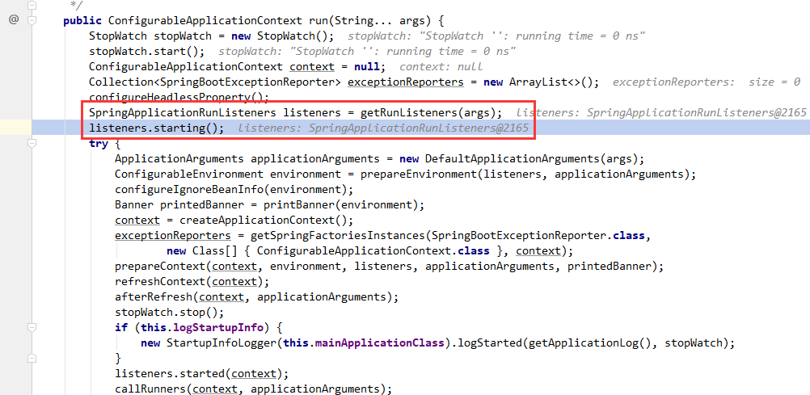
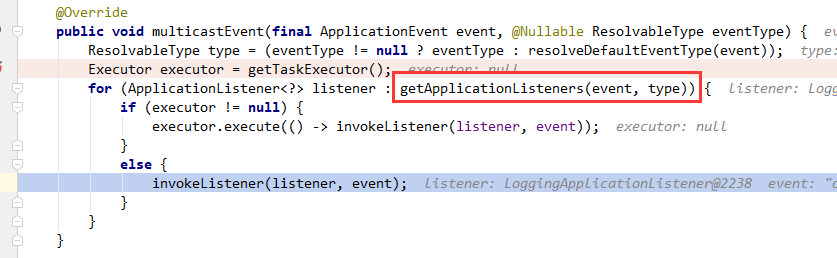
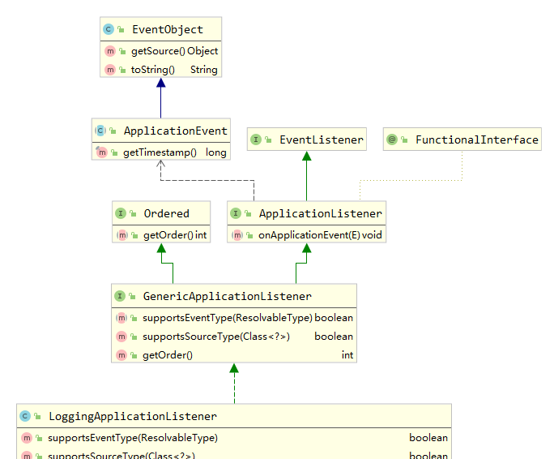
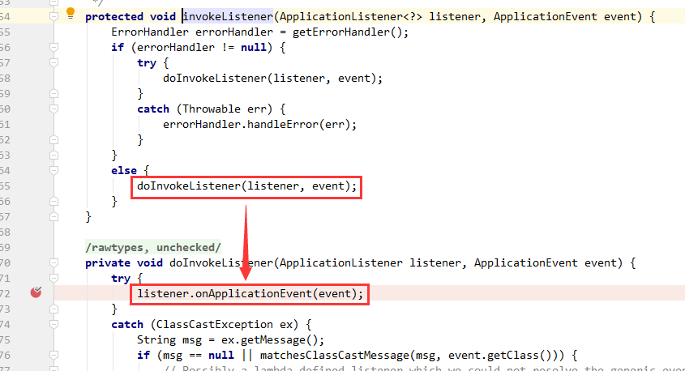
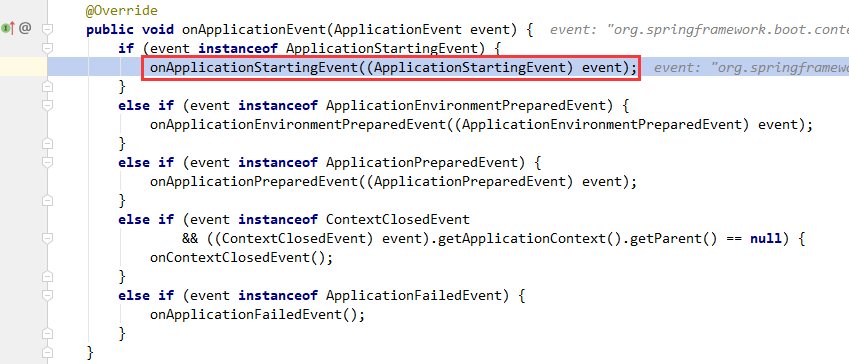
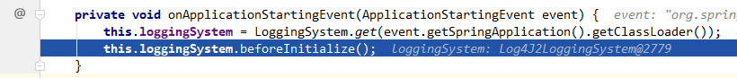

# SpringBoot使用的日志

## 1.执行过程
在SpringBoot启动过程中有这么两句话，[点击查看详细启动过程](./springbootstart.md)


在listeners.starting();执行中

getApplicationListeners(event, type)这个方法会获得LoggingApplicationListeners、BackgroundPreinitializer、DelegationgApplicationListener、LiquibaseServiceLocatorApplicationListener
这4个Listener，其中LoggingApplicationListeners负责的就是

配置LoggingSystem的ApplicationListener 。 如果环境包含logging.config属性，它将用于引导日志系统，否则使用默认配置。 无论如何，如果环境包含logging.level.*条目，日志级别将被自定义，并且可以使用logging.group定义日志组。
当环境包含未设置为"false"的debug或trace属性时，将启用 Spring、Tomcat、Jetty 和 Hibernate 的调试和跟踪日志记录（即，如果您使用 java -jar myapp.jar [--debug | --trace]）。 如果您喜欢忽略这些属性，您可以将parseArgs设置为false 。
默认情况下，日志输出仅写入控制台。 如果需要日志文件，可以使用logging.file.path和logging.file.name属性。
一些系统属性可能被设置为副作用，如果日志配置支持占位符（即 log4j 或 logback），这些可能很有用：
LOG_FILE设置为应该写入的日志文件的路径值（如果有）。
如果可以确定，则将PID设置为当前进程 ID 的值。


类之间的关系很简单



继承了ApplicationEvent，标志这个类是一个事件对象。这也就是为什么starting()方法为什么会调用到这个类的原因。
随后执行到


因为事件对象的关系随后就执行到`onApplicationEvent(ApplicationEvent event)`方法


进到`onApplicationStartingEvent(ApplicationStartingEvent event)`方法


看下这个方法的详情`this.loggingSystem = LoggingSystem.get(event.getSpringApplication().getClassLoader());`
这个方法在LoggingSystem这个类中

```java
public static final String SYSTEM_PROPERTY = LoggingSystem.class.getName();
public static final String NONE = "none";

private static final Map<String, String> SYSTEMS;

static {
    Map<String, String> systems = new LinkedHashMap<>();
    systems.put("ch.qos.logback.core.Appender", "org.springframework.boot.logging.logback.LogbackLoggingSystem");
    systems.put("org.apache.logging.log4j.core.impl.Log4jContextFactory",
            "org.springframework.boot.logging.log4j2.Log4J2LoggingSystem");
    systems.put("java.util.logging.LogManager", "org.springframework.boot.logging.java.JavaLoggingSystem");
    SYSTEMS = Collections.unmodifiableMap(systems);
}

public static LoggingSystem get(ClassLoader classLoader) {
    String loggingSystem = System.getProperty(SYSTEM_PROPERTY);
    // 从系统配置取org.springframework.boot.logging.LoggingSystem是否为空
    if (StringUtils.hasLength(loggingSystem)) {
        // 判断loggingSystem是否是none字符
        if (NONE.equals(loggingSystem)) {
            return new NoOpLoggingSystem();
        }
        return get(classLoader, loggingSystem);
    }
    // 如果系统没有配置走这步，
    // 过滤留下类名存在并且可以加载的元素
    // 调用get初始化类得到第一个返回。没有报No suitable logging system located错误
    return SYSTEMS.entrySet().stream().filter((entry) -> ClassUtils.isPresent(entry.getKey(), classLoader))
            .map((entry) -> get(classLoader, entry.getValue())).findFirst()
            .orElseThrow(() -> new IllegalStateException("No suitable logging system located"));
}

private static LoggingSystem get(ClassLoader classLoader, String loggingSystemClass) {
    try {
        Class<?> systemClass = ClassUtils.forName(loggingSystemClass, classLoader);
        Constructor<?> constructor = systemClass.getDeclaredConstructor(ClassLoader.class);
        constructor.setAccessible(true);
        return (LoggingSystem) constructor.newInstance(classLoader);
    }
    catch (Exception ex) {
        throw new IllegalStateException(ex);
    }
}
```

我这里加载到的是`Log4J2LoggingSystem`类


`this.loggingSystem.beforeInitialize();`代码中注释是：将记录系统重置为限制输出。 该方法可以在initialize(LoggingInitializationContext, String, LogFile)之前调用，以减少日志噪音，直到系统完全初始化。
到这里就全部执行完成，其余都是return了。
。。。这到底是干了个啥。。。

## 2.看下LoggingApplicationListener的全部代码
最后让我来看下这个类`LoggingApplicationListener`，代码不多从头看
```java
public class LoggingApplicationListener implements GenericApplicationListener {
    // 返回logging.level的ConfigurationPropertyName 
	private static final ConfigurationPropertyName LOGGING_LEVEL = ConfigurationPropertyName.of("logging.level");
    // 返回logging.group的ConfigurationPropertyName 
	private static final ConfigurationPropertyName LOGGING_GROUP = ConfigurationPropertyName.of("logging.group");
    // 创建String键和LogLevel值类型的新Bindable Map 
	private static final Bindable<Map<String, LogLevel>> STRING_LOGLEVEL_MAP = Bindable.mapOf(String.class,
			LogLevel.class);
    
	private static final Bindable<Map<String, List<String>>> STRING_STRINGS_MAP = Bindable
			.of(ResolvableType.forClassWithGenerics(MultiValueMap.class, String.class, String.class).asMap());

	/**
	 * The default order for the LoggingApplicationListener.
     * LoggingApplicationListener的默认顺序，整数最小值+20
	 */
	public static final int DEFAULT_ORDER = Ordered.HIGHEST_PRECEDENCE + 20;

	/**
	 * The name of the Spring property that contains a reference to the logging
	 * configuration to load.
     * Spring 属性的名称，其中包含对要加载的日志记录配置的引用。
	 */
	public static final String CONFIG_PROPERTY = "logging.config";

	/**
	 * The name of the Spring property that controls the registration of a shutdown hook
	 * to shut down the logging system when the JVM exits.
     * Spring 属性的名称，它控制注册关闭挂钩以在 JVM 退出时关闭日志记录系统
	 * @see LoggingSystem#getShutdownHandler
	 */
	public static final String REGISTER_SHUTDOWN_HOOK_PROPERTY = "logging.register-shutdown-hook";

	/**
	 * The name of the {@link LoggingSystem} bean.
     * LoggingSystem Bean 的名字
	 */
	public static final String LOGGING_SYSTEM_BEAN_NAME = "springBootLoggingSystem";

	/**
	 * The name of the {@link LogFile} bean.
     * LogFile bean 的名字
	 * @since 2.2.0
	 */
	public static final String LOG_FILE_BEAN_NAME = "springBootLogFile";

	/**
	 * The name of the{@link LoggerGroups} bean.
     * LoggerGroups bean 的名字
	 * @since 2.2.0
	 */
	public static final String LOGGER_GROUPS_BEAN_NAME = "springBootLoggerGroups";

	private static final Map<String, List<String>> DEFAULT_GROUP_LOGGERS;
	static {
        // 初始化默认的日志组
		MultiValueMap<String, String> loggers = new LinkedMultiValueMap<>();
		loggers.add("web", "org.springframework.core.codec");
		loggers.add("web", "org.springframework.http");
		loggers.add("web", "org.springframework.web");
		loggers.add("web", "org.springframework.boot.actuate.endpoint.web");
		loggers.add("web", "org.springframework.boot.web.servlet.ServletContextInitializerBeans");
		loggers.add("sql", "org.springframework.jdbc.core");
		loggers.add("sql", "org.hibernate.SQL");
		loggers.add("sql", "org.jooq.tools.LoggerListener");
		DEFAULT_GROUP_LOGGERS = Collections.unmodifiableMap(loggers);
	}

	private static final Map<LogLevel, List<String>> SPRING_BOOT_LOGGING_LOGGERS;
	static {
        // 初始化默认的SPRING_BOOT_LOGGING_LOGGERS
		MultiValueMap<LogLevel, String> loggers = new LinkedMultiValueMap<>();
		loggers.add(LogLevel.DEBUG, "sql");
		loggers.add(LogLevel.DEBUG, "web");
		loggers.add(LogLevel.DEBUG, "org.springframework.boot");
		loggers.add(LogLevel.TRACE, "org.springframework");
		loggers.add(LogLevel.TRACE, "org.apache.tomcat");
		loggers.add(LogLevel.TRACE, "org.apache.catalina");
		loggers.add(LogLevel.TRACE, "org.eclipse.jetty");
		loggers.add(LogLevel.TRACE, "org.hibernate.tool.hbm2ddl");
		SPRING_BOOT_LOGGING_LOGGERS = Collections.unmodifiableMap(loggers);
	}

	private static final Class<?>[] EVENT_TYPES = { ApplicationStartingEvent.class,
			ApplicationEnvironmentPreparedEvent.class, ApplicationPreparedEvent.class, ContextClosedEvent.class,
			ApplicationFailedEvent.class };

	private static final Class<?>[] SOURCE_TYPES = { SpringApplication.class, ApplicationContext.class };

	private static final AtomicBoolean shutdownHookRegistered = new AtomicBoolean(false);

	private final Log logger = LogFactory.getLog(getClass());
    // 使用的日志系统，在onApplicationStartingEvent()方法中赋值
	private LoggingSystem loggingSystem;

	private LogFile logFile;

	private LoggerGroups loggerGroups;

	private int order = DEFAULT_ORDER;

	private boolean parseArgs = true;

	private LogLevel springBootLogging = null;

	@Override
	public boolean supportsEventType(ResolvableType resolvableType) {
		return isAssignableFrom(resolvableType.getRawClass(), EVENT_TYPES);
	}

	@Override
	public boolean supportsSourceType(Class<?> sourceType) {
		return isAssignableFrom(sourceType, SOURCE_TYPES);
	}

	private boolean isAssignableFrom(Class<?> type, Class<?>... supportedTypes) {
		if (type != null) {
			for (Class<?> supportedType : supportedTypes) {
				if (supportedType.isAssignableFrom(type)) {
					return true;
				}
			}
		}
		return false;
	}

	@Override
	public void onApplicationEvent(ApplicationEvent event) {
		if (event instanceof ApplicationStartingEvent) {
            // listeners.starting();中的第一个Listener会执行到这个方法
			onApplicationStartingEvent((ApplicationStartingEvent) event);
		}
		else if (event instanceof ApplicationEnvironmentPreparedEvent) {
			onApplicationEnvironmentPreparedEvent((ApplicationEnvironmentPreparedEvent) event);
		}
		else if (event instanceof ApplicationPreparedEvent) {
			onApplicationPreparedEvent((ApplicationPreparedEvent) event);
		}
		else if (event instanceof ContextClosedEvent
				&& ((ContextClosedEvent) event).getApplicationContext().getParent() == null) {
			onContextClosedEvent();
		}
		else if (event instanceof ApplicationFailedEvent) {
			onApplicationFailedEvent();
		}
	}

	private void onApplicationStartingEvent(ApplicationStartingEvent event) {
        // 根据类加载器获取不同的日志系统。详情看下面详细介绍
		this.loggingSystem = LoggingSystem.get(event.getSpringApplication().getClassLoader());
		this.loggingSystem.beforeInitialize();
	}

	private void onApplicationEnvironmentPreparedEvent(ApplicationEnvironmentPreparedEvent event) {
		if (this.loggingSystem == null) {
			this.loggingSystem = LoggingSystem.get(event.getSpringApplication().getClassLoader());
		}
		initialize(event.getEnvironment(), event.getSpringApplication().getClassLoader());
	}

	private void onApplicationPreparedEvent(ApplicationPreparedEvent event) {
		ConfigurableListableBeanFactory beanFactory = event.getApplicationContext().getBeanFactory();
		if (!beanFactory.containsBean(LOGGING_SYSTEM_BEAN_NAME)) {
			beanFactory.registerSingleton(LOGGING_SYSTEM_BEAN_NAME, this.loggingSystem);
		}
		if (this.logFile != null && !beanFactory.containsBean(LOG_FILE_BEAN_NAME)) {
			beanFactory.registerSingleton(LOG_FILE_BEAN_NAME, this.logFile);
		}
		if (this.loggerGroups != null && !beanFactory.containsBean(LOGGER_GROUPS_BEAN_NAME)) {
			beanFactory.registerSingleton(LOGGER_GROUPS_BEAN_NAME, this.loggerGroups);
		}
	}

	private void onContextClosedEvent() {
		if (this.loggingSystem != null) {
			this.loggingSystem.cleanUp();
		}
	}

	private void onApplicationFailedEvent() {
		if (this.loggingSystem != null) {
			this.loggingSystem.cleanUp();
		}
	}

	/**
	 * Initialize the logging system according to preferences expressed through the
	 * {@link Environment} and the classpath.
	 * @param environment the environment
	 * @param classLoader the classloader
	 */
	protected void initialize(ConfigurableEnvironment environment, ClassLoader classLoader) {
		new LoggingSystemProperties(environment).apply();
		this.logFile = LogFile.get(environment);
		if (this.logFile != null) {
			this.logFile.applyToSystemProperties();
		}
		this.loggerGroups = new LoggerGroups(DEFAULT_GROUP_LOGGERS);
		initializeEarlyLoggingLevel(environment);
		initializeSystem(environment, this.loggingSystem, this.logFile);
		initializeFinalLoggingLevels(environment, this.loggingSystem);
		registerShutdownHookIfNecessary(environment, this.loggingSystem);
	}

	private void initializeEarlyLoggingLevel(ConfigurableEnvironment environment) {
		if (this.parseArgs && this.springBootLogging == null) {
			if (isSet(environment, "debug")) {
				this.springBootLogging = LogLevel.DEBUG;
			}
			if (isSet(environment, "trace")) {
				this.springBootLogging = LogLevel.TRACE;
			}
		}
	}

	private boolean isSet(ConfigurableEnvironment environment, String property) {
		String value = environment.getProperty(property);
		return (value != null && !value.equals("false"));
	}

	private void initializeSystem(ConfigurableEnvironment environment, LoggingSystem system, LogFile logFile) {
		LoggingInitializationContext initializationContext = new LoggingInitializationContext(environment);
		String logConfig = environment.getProperty(CONFIG_PROPERTY);
		if (ignoreLogConfig(logConfig)) {
			system.initialize(initializationContext, null, logFile);
		}
		else {
			try {
				ResourceUtils.getURL(logConfig).openStream().close();
				system.initialize(initializationContext, logConfig, logFile);
			}
			catch (Exception ex) {
				// NOTE: We can't use the logger here to report the problem
				System.err.println("Logging system failed to initialize using configuration from '" + logConfig + "'");
				ex.printStackTrace(System.err);
				throw new IllegalStateException(ex);
			}
		}
	}

	private boolean ignoreLogConfig(String logConfig) {
		return !StringUtils.hasLength(logConfig) || logConfig.startsWith("-D");
	}

	private void initializeFinalLoggingLevels(ConfigurableEnvironment environment, LoggingSystem system) {
		bindLoggerGroups(environment);
		if (this.springBootLogging != null) {
			initializeSpringBootLogging(system, this.springBootLogging);
		}
		setLogLevels(system, environment);
	}

	private void bindLoggerGroups(ConfigurableEnvironment environment) {
		if (this.loggerGroups != null) {
			Binder binder = Binder.get(environment);
			binder.bind(LOGGING_GROUP, STRING_STRINGS_MAP).ifBound(this.loggerGroups::putAll);
		}
	}

	/**
	 * Initialize loggers based on the {@link #setSpringBootLogging(LogLevel)
	 * springBootLogging} setting. By default this implementation will pick an appropriate
	 * set of loggers to configure based on the level.
	 * @param system the logging system
	 * @param springBootLogging the spring boot logging level requested
	 * @since 2.2.0
	 */
	protected void initializeSpringBootLogging(LoggingSystem system, LogLevel springBootLogging) {
		BiConsumer<String, LogLevel> configurer = getLogLevelConfigurer(system);
		SPRING_BOOT_LOGGING_LOGGERS.getOrDefault(springBootLogging, Collections.emptyList())
				.forEach((name) -> configureLogLevel(name, springBootLogging, configurer));
	}

	/**
	 * Set logging levels based on relevant {@link Environment} properties.
	 * @param system the logging system
	 * @param environment the environment
	 * @since 2.2.0
	 */
	protected void setLogLevels(LoggingSystem system, ConfigurableEnvironment environment) {
		BiConsumer<String, LogLevel> customizer = getLogLevelConfigurer(system);
		Binder binder = Binder.get(environment);
		Map<String, LogLevel> levels = binder.bind(LOGGING_LEVEL, STRING_LOGLEVEL_MAP).orElseGet(Collections::emptyMap);
		levels.forEach((name, level) -> configureLogLevel(name, level, customizer));
	}

	private void configureLogLevel(String name, LogLevel level, BiConsumer<String, LogLevel> configurer) {
		if (this.loggerGroups != null) {
			LoggerGroup group = this.loggerGroups.get(name);
			if (group != null && group.hasMembers()) {
				group.configureLogLevel(level, configurer);
				return;
			}
		}
		configurer.accept(name, level);
	}

	private BiConsumer<String, LogLevel> getLogLevelConfigurer(LoggingSystem system) {
		return (name, level) -> {
			try {
				name = name.equalsIgnoreCase(LoggingSystem.ROOT_LOGGER_NAME) ? null : name;
				system.setLogLevel(name, level);
			}
			catch (RuntimeException ex) {
				this.logger.error(LogMessage.format("Cannot set level '%s' for '%s'", level, name));
			}
		};
	}

	private void registerShutdownHookIfNecessary(Environment environment, LoggingSystem loggingSystem) {
		boolean registerShutdownHook = environment.getProperty(REGISTER_SHUTDOWN_HOOK_PROPERTY, Boolean.class, false);
		if (registerShutdownHook) {
			Runnable shutdownHandler = loggingSystem.getShutdownHandler();
			if (shutdownHandler != null && shutdownHookRegistered.compareAndSet(false, true)) {
				registerShutdownHook(new Thread(shutdownHandler));
			}
		}
	}

	void registerShutdownHook(Thread shutdownHook) {
		Runtime.getRuntime().addShutdownHook(shutdownHook);
	}

	public void setOrder(int order) {
		this.order = order;
	}

	@Override
	public int getOrder() {
		return this.order;
	}

	/**
	 * Sets a custom logging level to be used for Spring Boot and related libraries.
	 * @param springBootLogging the logging level
	 */
	public void setSpringBootLogging(LogLevel springBootLogging) {
		this.springBootLogging = springBootLogging;
	}

	/**
	 * Sets if initialization arguments should be parsed for {@literal debug} and
	 * {@literal trace} properties (usually defined from {@literal --debug} or
	 * {@literal --trace} command line args). Defaults to {@code true}.
	 * @param parseArgs if arguments should be parsed
	 */
	public void setParseArgs(boolean parseArgs) {
		this.parseArgs = parseArgs;
	}

}
```