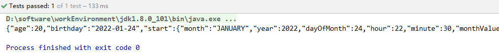
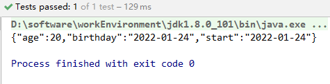
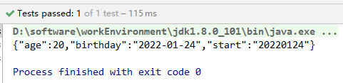
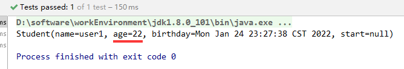

# jackson 的使用

## 引入包 
```xml
<!-- https://mvnrepository.com/artifact/com.fasterxml.jackson.core/jackson-core -->
<dependency>
    <groupId>com.fasterxml.jackson.core</groupId>
    <artifactId>jackson-core</artifactId>
    <version>2.13.1</version>
</dependency>
```
## 创建需要序列化的对象
```java
@Data
public class Student {
    private String name;
    private Integer age;
    private Date birthday;
    private LocalDateTime start;
}
```
## 序列化
```java
public class jacksonTest {
    private static ObjectMapper objectMapper = new ObjectMapper();
    static {
        // 设置JSON包含
        objectMapper.setSerializationInclusion(JsonInclude.Include.NON_NULL);
    }
    @Test
    void jacksonTest(){
        Student student = new Student();
        student.setAge(20);
        student.setBirthday(new Date());
        student.setStart(LocalDateTime.now());
        objectMapper.writerWithDefaultPrettyPrinter()

    }
}
```
### 处理NULL值
设置JSON是否包含null，有两种方式
1. 全局方式
`objectMapper.setSerializationInclusion(JsonInclude.Include.NON_NULL);`

2. 针对某一个类，使用注解`@JsonInclude(JsonInclude.Include.NON_NULL)`
```java {2}
@Data
@JsonInclude(JsonInclude.Include.NON_NULL)
public class Student {
    private String name;
    private Integer age;
    private Date birthday;
    private LocalDateTime start;
}
```

### 处理Date格式
#### 针对一个属性
在Bean对象的属性上使用`@JsonFormat(pattern = "yyyy-MM-dd",timezone = "GMT+8")`注解
```java {6,8}
@Data
public class Student {
    @JsonInclude(JsonInclude.Include.NON_NULL)
    private String name;
    private Integer age;
    @JsonFormat(pattern = "yyyy-MM-dd",timezone = "GMT+8")
    private Date birthday;
    @JsonFormat(pattern = "yyyyMMdd HH:mm:ss",timezone = "GMT+8")
    private LocalDateTime start;
}
```
标记完运行发现LocalDateTime类型对应的start是没有被序列化成想要的字符串

需要引入一个jsr310的包，是jackson对LocalDateTime等jar8时间日期处理的Model
在jackson中是作为Model生效的，Model需要注册。
1. 先引入jsr310的包
```xml
<dependency>
    <groupId>com.fasterxml.jackson.datatype</groupId>
    <artifactId>jackson-datatype-jsr310</artifactId>
    <version>2.13.1</version>
</dependency>
```
2. 注册
```java {7}
public class JasksonTest {
    private static ObjectMapper objectMapper = new ObjectMapper();
    static {
        // 设置JSON包含
        objectMapper.setSerializationInclusion(JsonInclude.Include.NON_NULL);
        // 自动通过SPI发现jackson的modle并注册
        objectMapper.findAndRegisterModules();
    }
    @Test
    void jasksonTest() throws JsonProcessingException {
        Student student = new Student();
        student.setAge(20);
        student.setBirthday(new Date());
        student.setStart(LocalDateTime.now());
        System.out.println(objectMapper.writeValueAsString(student));;

    }
}
```
3. 再次查看




#### LocalDateTime设置全局
```java {6,9,10,11}
public class JasksonTest {
    private static ObjectMapper objectMapper = new ObjectMapper();
    static {
        // 设置JSON包含
        objectMapper.setSerializationInclusion(JsonInclude.Include.NON_NULL);
        JavaTimeModule javaTimeModule = new JavaTimeModule();
        // 反序列化时使用
        javaTimeModule.addDeserializer(LocalDateTime.class,
            new LocalDateTimeDeserializer(DateTimeFormatter.ofPattern("yyyyMMdd HH:mm:ss")));
        // 序列化时使用
        javaTimeModule.addSerializer(LocalDateTime.class,
            new LocalDateTimeSerializer(DateTimeFormatter.ofPattern("yyyyMMdd HH:mm:ss")));
        objectMapper.registerModule(javaTimeModule);
    }
    @Test
    void jasksonTest() throws JsonProcessingException {
        Student student = new Student();
        student.setAge(20);
        student.setBirthday(new Date());
        student.setStart(LocalDateTime.now());
        System.out.println(objectMapper.writeValueAsString(student));;

    }
}
```
查看




::: danger 注意
LocalDateTime的时间格式是到yyyyMMdd HH:mm:ss的如果只是yyyyMMdd，反序列化会报错

Cannot deserialize value of type `java.time.LocalDateTime` from String "20220124"
:::
Date类型也可以但不建议使用
`objectMapper.setDateFormat(new SimpleDateFormat("yyyyMMdd HH:mm:ss"));`
SimpleDateFormat不是线程安全的，而ObjectMapper是线程安全的。这样设置导致ObjectMapper线程不安全。

#### 美化输出
`objectMapper.configure(SerializationFeature.INDENT_OUTPUT,true);`

## 反序列化
### 忽略不存在的key
`objectMapper.configure(DeserializationFeature.FAIL_ON_IGNORED_PROPERTIES,false);`
### 泛型
```java {29,30}
public class JasksonTest {
    private static ObjectMapper objectMapper = new ObjectMapper();
    static {
        // 设置JSON包含
        objectMapper.setSerializationInclusion(JsonInclude.Include.NON_NULL);
//        objectMapper.findAndRegisterModules();
        JavaTimeModule javaTimeModule = new JavaTimeModule();
//        // 反序列化时使用
        javaTimeModule.addDeserializer(LocalDateTime.class,
            new LocalDateTimeDeserializer(DateTimeFormatter.ofPattern("yyyyMMdd HH:mm:ss")));
//        // 序列化时使用
        javaTimeModule.addSerializer(LocalDateTime.class,
            new LocalDateTimeSerializer(DateTimeFormatter.ofPattern("yyyyMMdd HH:mm:ss")));
        objectMapper.registerModule(javaTimeModule);
        // 美化输出
        objectMapper.configure(SerializationFeature.INDENT_OUTPUT,true);
        // 反序列化时忽略不存在的key
        objectMapper
            .configure(DeserializationFeature.FAIL_ON_IGNORED_PROPERTIES,false);
    }
    @Test
    void jasksonTest() throws JsonProcessingException {
        Student student = new Student();
        student.setAge(20);
        student.setBirthday(new Date());
        student.setStart(LocalDateTime.now());
        ResponseDataBase<Student> response = new ResponseDataBase<>();
        response.setData(student);
        response.successful();
        String data = objectMapper.writeValueAsString(response);
        System.out.println(data);
        ResponseDataBase<Student> dataResult = 
        objectMapper
            .readValue(data, new TypeReference<ResponseDataBase<Student>>() {});
        System.out.println(dataResult.getData().toString());
    }
}
```

## 定制
### 驼峰转下划线
设置策略 userName 转成 user_name 输出
`// 蛇形命名法`
`objectMapper.setPropertyNamingStrategy(PropertyNamingStrategy.SNAKE_CASE);`
### 指定属性名称 
使用注解`@JsonProperty("address")`

### 指定忽略属性
使用注解`@JsonIgnore`

## 使用Jackson做对象更新
对象更新，对象的合并。如果后者属性有值，则用后者，否则的值不变。
```java
@Test
void jasksonTest2() throws JsonProcessingException {
    Student orgUser = new Student();
    orgUser.setName("user1");
    orgUser.setAge(20);
    orgUser.setBirthday(new Date());

    Student newUser = new Student();
    newUser.setName("user1");
    newUser.setAge(22);

    Student student = objectMapper.updateValue(orgUser, newUser);
    System.out.println(student.toString());
}
```
age值被更新


---
完~