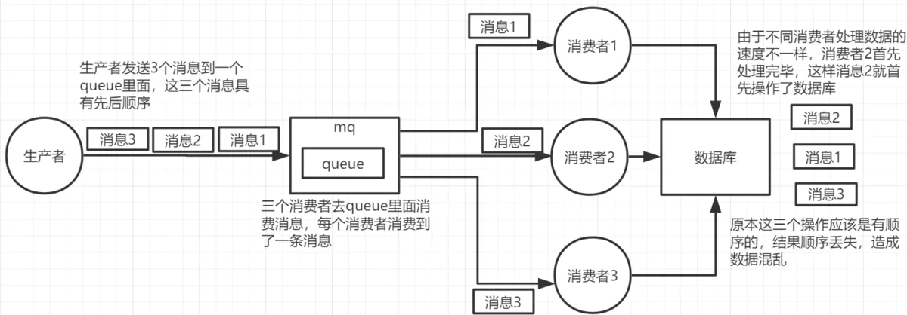
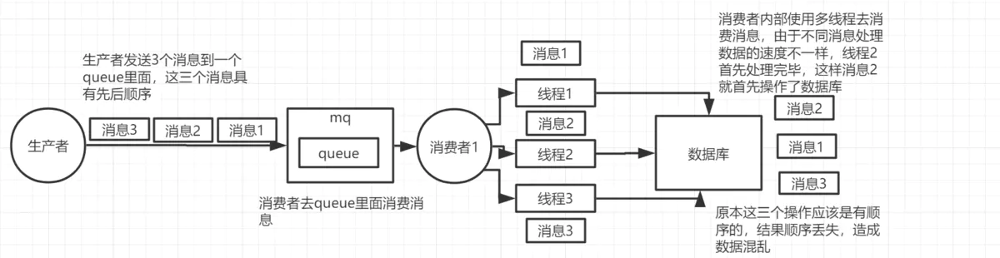
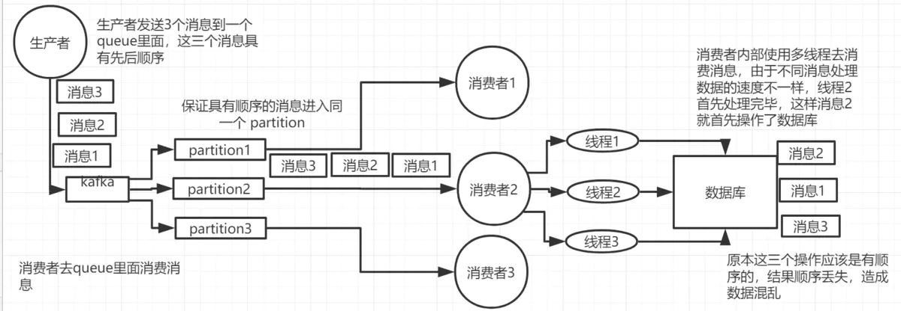
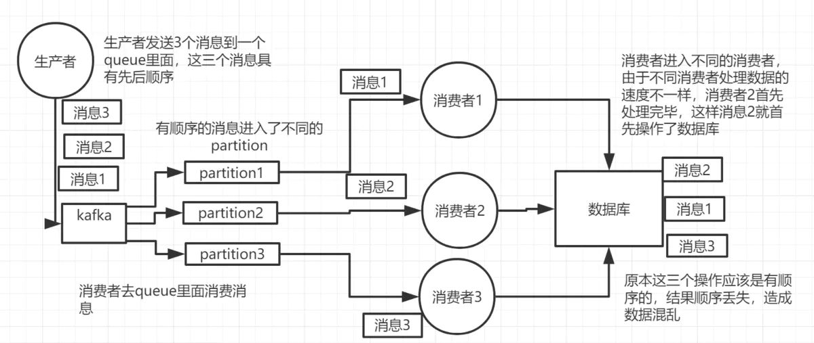
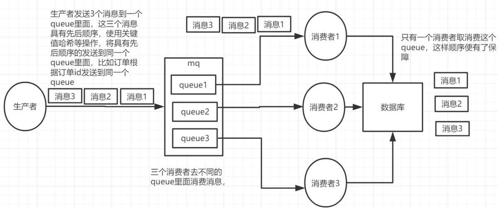
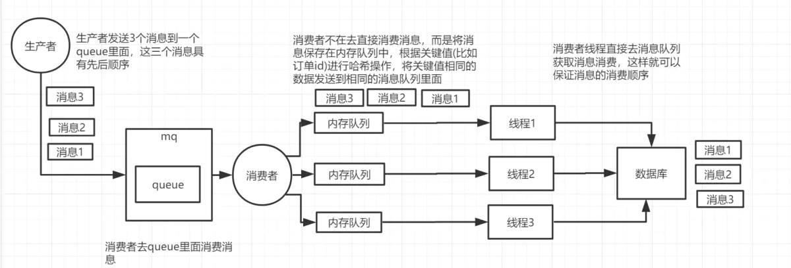
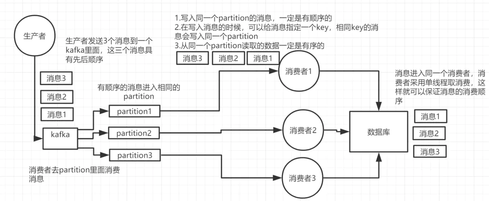
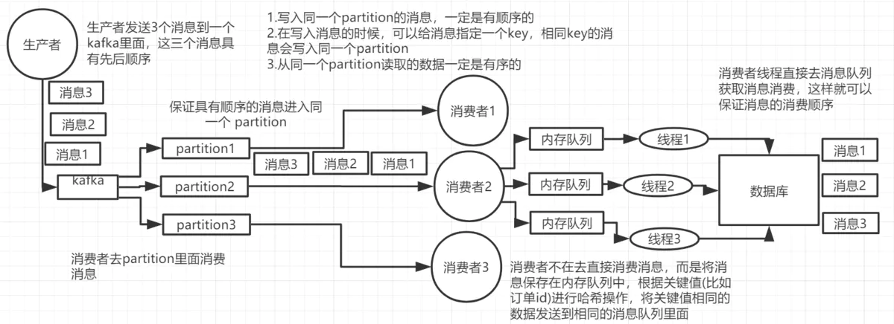
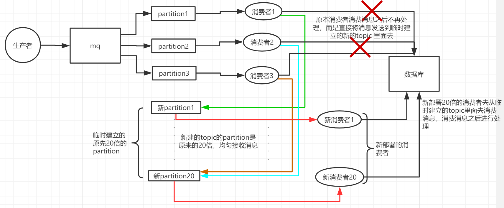

---
---
# Rabbitmq

## 使用消息队列的优缺点
使用消息队列的优缺点
优点：解耦、异步、削峰
缺点：
* 系统可用性降低，系统引入的外部依赖越多，越容易挂掉
* 系统复杂度提高
* 一致性问题

## 如何保证一致性

## 如何保证消息队列的高可用？
### RabbitMQ的高可用
RabbitMQ对于高可用是基于主从的方式进行实现的。其中有三种工作模式：单机模式、普通集群模式、镜像集群模式
1. 单机模式：就是 Demo 级别的，一般就是本地启动了玩玩儿，没人生产用单机模式。
2. 普通集群模式：在多台机器上启动多个RabbitMQ实例，每个机器启动一个。创建的每一个Queue，只会存在一个MQ实例上，但是每个实例都同步Queue的元数据（即Queue的标识信息）。消费时，就算连接到其他MQ实例上，也会根据内部Queue元数据从对应的Queue所在实例上拉取数据过来。（这种方式只是通过集群部署的方式提高了消息的吞吐量,但是并没有考虑到高可用）
3. 镜像集群模式：才是所谓的 RabbitMQ 的高可用模式。在镜像模式下，创建的Queue，无论元数据还是Queue里的消息都会存在于多个实例上。即每个RabbitMQ节点都有这个Queue的一个完整的镜像，包含Queue全部的数据。每次写消息到Queue时，都会自动把消息同步到多个实例上的Queue上。

优点：任何一个机器宕机，其他机器还包含了这个Queue的完整数据
缺点：
* 性能开销大，网络带宽
* 无法线性扩容: 因为每一个服务器中都包含整个集群服务节点中的所有数据, 这样如果一旦单个服务器节点的容量无法容纳了怎么办?.

### Kafka的高可用
Kafka 一个最基本的架构认识：由多个 broker 组成，每个 broker 是一个节点；你创建一个 topic，这个 topic 可以划分为多个 partition，每个 partition 可以存在于不同的 broker 上，每个 partition 就放一部分数据。
这就是天然的分布式消息队列，就是说一个 topic 的数据，是分散放在多个机器上的，每个机器就放一部分数据。

Kafka 0.8 以前，是没有 HA 机制的，就是任何一个 broker 宕机了，那个 broker 上的 partition 就废了，没法写也没法读，没有什么高可用性可言。

Kafka 0.8 以后，提供了 HA 机制，就是 replica（复制品） 副本机制。每个 partition 的数据都会同步到其它机器上，形成自己的多个 replica 副本。所有 replica 会选举一个 leader 出来，那么生产和消费都跟这个 leader 打交道，然后其他 replica 就是 follower。写的时候，leader 会负责把数据同步到所有 follower 上去，读的时候就直接读 leader 上的数据即可。为什么只能读写 leader？很简单，要是你可以随意读写每个 follower，那么就要 care 数据一致性的问题，系统复杂度太高，很容易出问题。Kafka 会均匀地将一个 partition 的所有 replica 分布在不同的机器上，这样才可以提高容错性。

这么搞，就有所谓的高可用性了，因为如果某个 broker 宕机了，没事儿，那个 broker 上面的 partition 在其他机器上都有副本的。如果这个宕机的 broker 上面有某个 partition 的 leader，那么此时会从 follower 中重新选举一个新的 leader 出来，大家继续读写那个新的 leader 即可。这就有所谓的高可用性了。

写数据的时候，生产者就写 leader，然后 leader 将数据落地写本地磁盘，接着其他 follower 自己主动从 leader 来 pull 数据。一旦所有 follower 同步好数据了，就会发送 ack 给 leader，leader 收到所有 follower 的 ack 之后，就会返回写成功的消息给生产者。（当然，这只是其中一种模式，还可以适当调整这个行为）
消费的时候，只会从 leader 去读，但是只有当一个消息已经被所有 follower 都同步成功返回 ack 的时候，这个消息才会被消费者读到。

## 如和保证幂等性？（如何保证消息不被重复消费）
首先，比如 RabbitMQ、RocketMQ、Kafka，都有可能会出现消息重复消费的问题，正常。因为这问题通常不是 MQ 自己保证的，是由我们开发来保证的。挑一个 Kafka 来举个例子，说说怎么重复消费吧。
Kafka 实际上有个 offset 的概念，就是每个消息写进去，都有一个 offset，代表消息的序号，然后 consumer 消费了数据之后，每隔一段时间（定时定期），会把自己消费过的消息的 offset 提交一下，表示“我已经消费过了，下次我要是重启啥的，你就让我继续从上次消费到的 offset 来继续消费吧”。
但是凡事总有意外，比如我们之前生产经常遇到的，就是你有时候重启系统，看你怎么重启了，如果碰到点着急的，直接 kill 进程了，再重启。这会导致 consumer 有些消息处理了，但是没来得及提交 offset，尴尬了。重启之后，少数消息会再次消费一次。

其实重复消费不可怕，可怕的是你没考虑到重复消费之后，怎么保证幂等性
幂等性，通俗点说，就一个数据，或者一个请求，给你重复来多次，你得确保对应的数据是不会改变的，不能出错
其实还是得结合业务来思考，我这里给几个思路：
* 比如你拿个数据要写库，你先根据主键查一下，如果这数据都有了，你就别插入了，update 一下好吧。
* 比如你是写 Redis，那没问题了，反正每次都是 set，天然幂等性。
* 比如你不是上面两个场景，那做的稍微复杂一点，你需要让生产者发送每条数据的时候，里面加一个全局唯一的 id，类似订单 id 之类的东西，然后你这里消费到了之后，先根据这个 id 去比如 Redis 里查一下，之前消费过吗？如果没有消费过，你就处理，然后这个 id 写 Redis。如果消费过了，那你就别处理了，保证别重复处理相同的消息即可。
* 比如基于数据库的唯一键来保证重复数据不会重复插入多条。因为有唯一键约束了，重复数据插入只会报错，不会导致数据库中出现脏数据。

## 如何保证消息的可靠性传输？（如何处理消息丢失的问题）

### RabbitMQ生产者丢了数据
生产者将数据发送到 RabbitMQ 的时候，可能数据就在半路给搞丢了，因为网络问题啥的，都有可能。
此时可以选择用 RabbitMQ 提供的事务功能，就是生产者发送数据之前开启 RabbitMQ 事务channel.txSelect，然后发送消息，如果消息没有成功被 RabbitMQ 接收到，那么生产者会收到异常报错，此时就可以回滚事务channel.txRollback，然后重试发送消息；如果收到了消息，那么可以提交事务channel.txCommit。
```java
// 开启事务
channel.txSelect
try {
    // 这里发送消息
} catch (Exception e) {
    channel.txRollback

    // 这里再次重发这条消息
}

// 提交事务
channel.txCommit
```
但是问题是，RabbitMQ 事务机制（同步）一搞，基本上吞吐量会下来，因为太耗性能。

所以一般来说，如果你要确保说写 RabbitMQ 的消息别丢，可以开启 confirm 模式，在生产者那里设置开启 confirm模式之后，你每次写的消息都会分配一个唯一的 id，然后如果写入了 RabbitMQ 中，RabbitMQ 会给你回传一个 ack 消息，告诉你说这个消息 ok 了。如果 RabbitMQ 没能处理这个消息，会回调你的一个 nack 接口，告诉你这个消息接收失败，你可以重试。而且你可以结合这个机制自己在内存里维护每个消息 id 的状态，如果超过一定时间还没接收到这个消息的回调，那么你可以重发。

事务机制和 confirm 机制最大的不同在于，事务机制是同步的，你提交一个事务之后会阻塞在那儿，但是 confirm 机制是异步的，你发送个消息之后就可以发送下一个消息，然后那个消息 RabbitMQ 接收了之后会异步回调你的一个接口通知你这个消息接收到了。

所以一般在生产者这块避免数据丢失，都是用 confirm 机制的。

### RabbitMQ弄丢了数据
就是 RabbitMQ 自己弄丢了数据，这个你必须开启 RabbitMQ 的持久化，就是消息写入之后会持久化到磁盘，哪怕是 RabbitMQ 自己挂了，恢复之后会自动读取之前存储的数据，一般数据不会丢。除非极其罕见的是，RabbitMQ 还没持久化，自己就挂了，可能导致少量数据丢失，但是这个概率较小。

设置持久化有两个步骤：

创建 queue 的时候将其设置为持久化 这样就可以保证 RabbitMQ 持久化 queue 的元数据，但是它是不会持久化 queue 里的数据的。
第二个是发送消息的时候将消息的 deliveryMode 设置为 2 就是将消息设置为持久化的，此时 RabbitMQ 就会将消息持久化到磁盘上去。
必须要同时设置这两个持久化才行，RabbitMQ 哪怕是挂了，再次重启，也会从磁盘上重启恢复 queue，恢复这个 queue 里的数据。

注意，哪怕是你给 RabbitMQ 开启了持久化机制，也有一种可能，就是这个消息写到了 RabbitMQ 中，但是还没来得及持久化到磁盘上，结果不巧，此时 RabbitMQ 挂了，就会导致内存里的一点点数据丢失。

所以，持久化可以跟生产者那边的 confirm 机制配合起来，只有消息被持久化到磁盘之后，才会通知生产者 ack 了，所以哪怕是在持久化到磁盘之前，RabbitMQ 挂了，数据丢了，生产者收不到 ack，你也是可以自己重发的。

### RabbitMQ消费端弄丢了数据
RabbitMQ 如果丢失了数据，主要是因为你消费的时候，刚消费到，还没处理，结果进程挂了，比如重启了，那么就尴尬了，RabbitMQ 认为你都消费了，这数据就丢了。

这个时候得用 RabbitMQ 提供的 ack 机制，简单来说，就是你必须关闭 RabbitMQ 的自动 ack，可以通过一个 api 来调用就行，然后每次你自己代码里确保处理完的时候，再在程序里 ack 一把。这样的话，如果你还没处理完，不就没有 ack 了？那 RabbitMQ 就认为你还没处理完，这个时候 RabbitMQ 会把这个消费分配给别的 consumer 去处理，消息是不会丢的。

### Kafka消费端弄丢了数据
唯一可能导致消费者弄丢数据的情况，就是说，你消费到了这个消息，然后消费者那边自动提交了 offset，让 Kafka 以为你已经消费好了这个消息，但其实你才刚准备处理这个消息，你还没处理，你自己就挂了，此时这条消息就丢咯。

这不是跟 RabbitMQ 差不多吗，大家都知道 Kafka 会自动提交 offset，那么只要关闭自动提交 offset，在处理完之后自己手动提交 offset，就可以保证数据不会丢。但是此时确实还是可能会有重复消费，比如你刚处理完，还没提交 offset，结果自己挂了，此时肯定会重复消费一次，自己保证幂等性就好了。

生产环境碰到的一个问题，就是说我们的 Kafka 消费者消费到了数据之后是写到一个内存的 queue 里先缓冲一下，结果有的时候，你刚把消息写入内存 queue，然后消费者会自动提交 offset。然后此时我们重启了系统，就会导致内存 queue 里还没来得及处理的数据就丢失了。

### Kafka弄丢了数据
这块比较常见的一个场景，就是 Kafka 某个 broker 宕机，然后重新选举 partition 的 leader。大家想想，要是此时其他的 follower 刚好还有些数据没有同步，结果此时 leader 挂了，然后选举某个 follower 成 leader 之后，不就少了一些数据？这就丢了一些数据啊。

生产环境也遇到过，我们也是，之前 Kafka 的 leader 机器宕机了，将 follower 切换为 leader 之后，就会发现说这个数据就丢了。

所以此时一般是要求起码设置如下 4 个参数：

给 topic 设置 replication.factor 参数：这个值必须大于 1，要求每个 partition 必须有至少 2 个副本。
在 Kafka 服务端设置 min.insync.replicas 参数：这个值必须大于 1，这个是要求一个 leader 至少感知到有至少一个 follower 还跟自己保持联系，没掉队，这样才能确保 leader 挂了还有一个 follower 吧。
在 producer 端设置 acks=all：这个是要求每条数据，必须是写入所有 replica 之后，才能认为是写成功了。
在 producer 端设置 retries=MAX（很大很大很大的一个值，无限次重试的意思）：这个是要求一旦写入失败，就无限重试，卡在这里了。
我们生产环境就是按照上述要求配置的，这样配置之后，至少在 Kafka broker 端就可以保证在 leader 所在 broker 发生故障，进行 leader 切换时，数据不会丢失。

### Kafka生产者丢数据
如果按照上述的思路设置了 acks=all，一定不会丢，要求是，你的 leader 接收到消息，所有的 follower 都同步到了消息之后，才认为本次写成功了。如果没满足这个条件，生产者会自动不断的重试，重试无限次

## 如何保证消息的顺序性？


1. 为什么要保证顺序
消息队列中的若干消息如果是对同一个数据进行操作，这些操作具有前后的关系，必须要按前后的顺序执行，否则就会造成数据异常。举例：
比如通过mysql binlog进行两个数据库的数据同步，由于对数据库的数据操作是具有顺序性的，如果操作顺序搞反，就会造成不可估量的错误。比如数据库对一条数据依次进行了 插入->更新->删除操作，这个顺序必须是这样，如果在同步过程中，消息的顺序变成了 删除->插入->更新，那么原本应该被删除的数据，就没有被删除，造成数据的不一致问题。

2. 出现顺序错乱的场景
    * rabbitmq
        - 一个queue，有多个consumer去消费，这样就会造成顺序的错误，consumer从MQ里面读取数据是有序的，但是每个consumer的执行时间是不固定的，无法保证先读到消息的consumer一定先完成操作，这样就会出现消息并没有按照顺序执行，造成数据顺序错误。
        
        - 一个queue对应一个consumer，但是consumer里面进行了多线程消费，这样也会造成消息消费顺序错误。
        
    * kafka
        - kafka一个topic，一个partition，一个consumer，但是consumer内部进行多线程消费，这样数据也会出现顺序错乱问题。
        
        - 具有顺序的数据写入到了不同的partition里面，不同的消费者去消费，但是每个consumer的执行时间是不固定的，无法保证先读到消息的consumer一定先完成操作，这样就会出现消息并没有按照顺序执行，造成数据顺序错误。
        

3. 保证消息的消费顺序
    * rabbitmq
        - 拆分多个queue，每个queue一个consumer，就是多一些queue而已，确实是麻烦点；这样也会造成吞吐量下降，可以在消费者内部采用多线程的方式去消费。
            
        - 或者就一个queue但是对应一个consumer，然后这个consumer内部用内存队列做排队，然后分发给底层不同的worker来处理
            
    * kafka
        - 确保同一个消息发送到同一个partition，一个topic，一个partition，一个consumer，内部单线程消费。
            
        - 写N个内存queue，然后N个线程分别消费一个内存queue即可
            

## 消息积压在消息队列里怎么办
* 如何解决消息队列的延时以及过期失效问题？
* 消息队列满了以后该怎么处理？
* 有几百万消息持续积压几小时，说说怎么解决？

你看这问法，其实本质针对的场景，都是说，可能你的消费端出了问题，不消费了；或者消费的速度极其慢。接着就坑爹了，可能你的消息队列集群的磁盘都快写满了，都没人消费，这个时候怎么办？或者是这整个就积压了几个小时，你这个时候怎么办？或者是你积压的时间太长了，导致比如 RabbitMQ 设置了消息过期时间后就没了怎么办？

所以就这事儿，其实线上挺常见的，一般不出，一出就是大 case。一般常见于，举个例子，消费端每次消费之后要写 mysql，结果 mysql 挂了，消费端 hang 那儿了，不动了；或者是消费端出了个什么岔子，导致消费速度极其慢。

### 大量消息在mq里积压了几个小时了还没解决
场景：几千万条数据在MQ里积压了七八个小时，从下午4点多，积压到了晚上很晚，10点多，11点多。线上故障了，这个时候要不然就是修复consumer的问题，让他恢复消费速度，然后傻傻的等待几个小时消费完毕。这个肯定不行。一个消费者一秒是1000条，一秒3个消费者是3000条，一分钟是18万条，1000多万条。
所以如果你积压了几百万到上千万的数据，即使消费者恢复了，也需要大概1小时的时间才能恢复过来。
这种时候只能操作临时扩容，以更快的速度去消费数据了。具体操作步骤和思路如下：
1. 先修复consumer的问题，确保其恢复消费速度，然后将现有consumer都停掉。
2. 临时建立好原先10倍或者20倍的queue数量(新建一个topic，partition是原来的10倍)。
3. 然后写一个临时分发消息的consumer程序，这个程序部署上去消费积压的消息，消费之后不做耗时处理，直接均匀轮询写入临时建好分10数量的queue里面。
4. 紧接着征用10倍的机器来部署consumer，每一批consumer消费一个临时queue的消息。
5. 这种做法相当于临时将queue资源和consumer资源扩大10倍，以正常速度的10倍来消费消息。
6. 等快速消费完了之后，恢复原来的部署架构，重新用原来的consumer机器来消费消息



### 消息设置了过期时间，过期就丢了怎么办
假设你用的是rabbitmq，rabbitmq是可以设置过期时间的，就是TTL，如果消息在queue中积压超过一定的时间就会被rabbitmq给清理掉，这个数据就没了。那这就是第二个坑了。这就不是说数据会大量积压在mq里，而是大量的数据会直接搞丢。
解决方案：
在流量低峰期(比如夜深人静时)，写一个程序，手动去查询丢失的那部分数据，然后将消息重新发送到mq里面，把丢失的数据重新补回来。

### 积压消息长时间没有处理，mq放不下了怎么办
如果走的方式是消息积压在mq里，那么如果你很长时间都没处理掉，此时导致mq都快写满了，咋办？这个还有别的办法吗？
解决方案：
这个就没有办法了，肯定是第一方案执行太慢，这种时候只好采用 “丢弃+批量重导” 的方式来解决了。
首先，临时写个程序，连接到mq里面消费数据，收到消息之后直接将其丢弃，快速消费掉积压的消息，降低MQ的压力，然后走第二种方案，在晚上夜深人静时去手动查询重导丢失的这部分数据。

## 如果让你设计一个MQ，你怎么设计
其实回答这类问题，说白了，起码不求你看过那技术的源码，起码你大概知道那个技术的基本原理，核心组成部分，基本架构构成，然后参照一些开源的技术把一个系统设计出来的思路说一下就好

比如说这个消息队列系统，我们来从以下几个角度来考虑一下

（1）首先这个mq得支持可伸缩性吧，就是需要的时候快速扩容，就可以增加吞吐量和容量，那怎么搞？设计个分布式的系统呗，参照一下kafka的设计理念，broker -> topic -> partition，每个partition放一个机器，就存一部分数据。如果现在资源不够了，简单啊，给topic增加partition，然后做数据迁移，增加机器，不就可以存放更多数据，提供更高的吞吐量了？

（2）其次你得考虑一下这个mq的数据要不要落地磁盘吧？那肯定要了，落磁盘，才能保证别进程挂了数据就丢了。那落磁盘的时候怎么落啊？顺序写，这样就没有磁盘随机读写的寻址开销，磁盘顺序读写的性能是很高的，这就是kafka的思路。

（3）其次你考虑一下你的mq的可用性啊？这个事儿，具体参考我们之前可用性那个环节讲解的kafka的高可用保障机制。多副本 -> leader & follower -> broker挂了重新选举leader即可对外服务。

（4）能不能支持数据0丢失啊？可以的，参考我们之前说的那个kafka数据零丢失方案

其实一个mq肯定是很复杂的，其实这是个开放题，就是看看你有没有从架构角度整体构思和设计的思维以及能力。


---


[参考文章](https://www.jianshu.com/p/02fdcb9e8784)
[参考文章](https://dunwu.github.io/javatech/mq/%E6%B6%88%E6%81%AF%E9%98%9F%E5%88%97%E9%9D%A2%E8%AF%95.html)