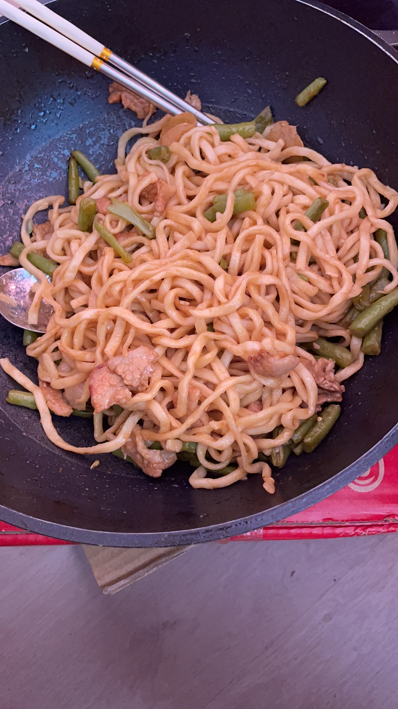

今天做了豆角焖面。叫了同事郭琴超来吃，他快要离职了，10月1号国庆就撤了。他人的性格还是挺好的，跟我相处也还挺愉快，他离开我还是有一点不舍的。现在人走的差不多了，我也不知道该留恋什么。我什么时候离开呀？上次面试的不好，就没有勇气，再尝试了吗？还是说你喜欢这种不需要再努力就能工作的日子，虽然你一直在读书打基础。那你什么时候出手啊？

软考是势在必行的。报考到现在也没做什么，准备什么时候开始准备啊。

是准备考完试，以后再着手准备换工作吗？

你能去了一个大厂吗？你想去一个大厂吗？你去一个大厂你的能力能应付的过来吗？你接受每天工作很晚的日子吗？

问自己这些目前还都没有答案，所以你是在混日子吗？

明天一定要去把门卫卡补回来。

