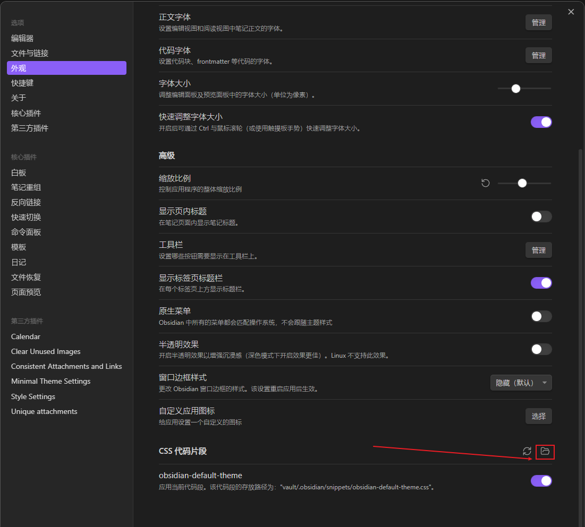

# 使用过程中遇到的问题记录
## 解决代码块不自动换行

先看这里提供了描述：[代码块如何不自动换行](https://forum-zh.obsidian.md/t/topic/3523)
看这里实际解决：[Disable word wrap for code blocks?](https://forum.obsidian.md/t/disable-word-wrap-for-code-blocks/13210)

# 不知道CSS文件应该创建在哪
点击这个按钮就打开了

# 好用的插件
Calendar 日历
Clear Unused Images 清除没有链接的图片
Unique attachments 重命名图片让格式统一
consistent attachments and links 移动文章附件跟着一起移动

Cubox作为Ob的最强搭档

