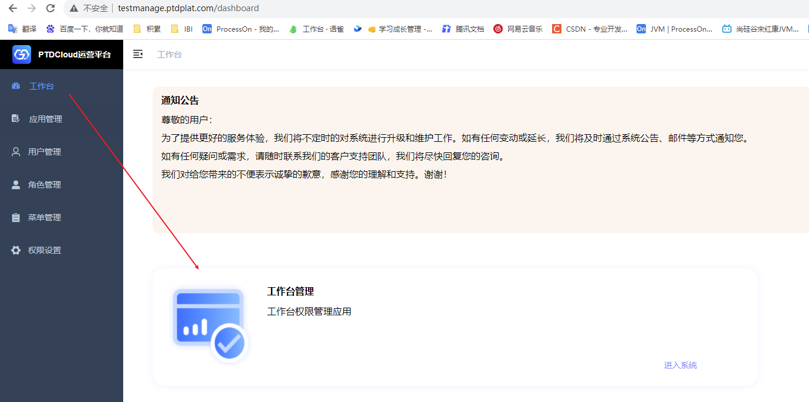
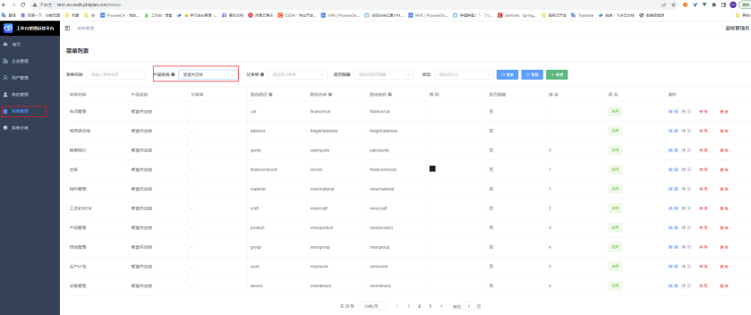
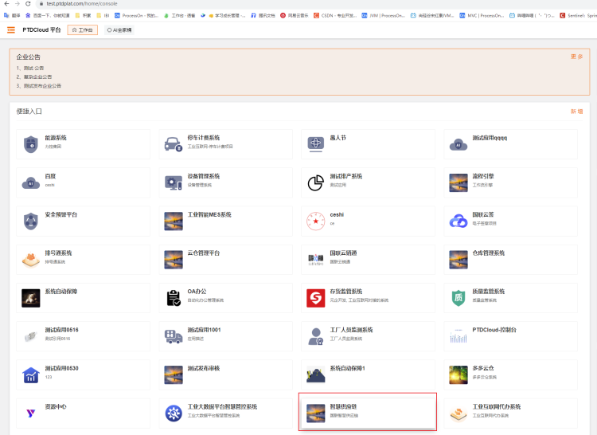

## 开发环境

### 开发服务器

192.168.2.194

### 开发redis

内网：r-2zed7wyvcokrt6w353.redis.rds.aliyuncs.com  
外网：r-2zed7wyvcokrt6w353pd.redis.rds.aliyuncs.com  
端口：6379  
密码：Acokrt6w353

### 开发库PolarDB

内网：pc-2zekx45w9zt17f887.mysql.polardb.rds.aliyuncs.com

公网：ibibusiness.mysql.polardb.rds.aliyuncs.com

端口：3306

#### 云仓库

用户：wareshoue-cloud  
密码：U19n7S9&w28a

#### 平台库

用户名：ibi-platform  
密码：ibi@603613#

#### 用户库

#### 智慧供应链-开发库

地址：ibibusiness.mysql.polardb.rds.aliyuncs.com

用户：ibi_ptd_scm

密码：ibi@603613

### Nacos密码

地址: [http://nacos.ptdplat.com/nacos](http://nacos.ptdplat.com/nacos)  
账号: nacos  
密码: ibi603613

### 云仓平台账号

货主 ： 17688881111/123456Aa-文石开发货主  
17699991111/123456Aa  
监管 ： 17688882222/123456Aa

WMS ： 15031367123、123456Aa

### 阿里云账号

[https://signin.aliyun.com/bjguolian.onaliyun.com/login.htm](https://signin.aliyun.com/bjguolian.onaliyun.com/login.htm?callback=https%3A%2F%2Faccount-devops.aliyun.com%2Flogin%3Fnext_url%3Dhttp%3A%2F%2Faccount-devops.aliyun.com%2Flogin%3Fnext_url%3Dhttps%253A%252F%252Fdevops.aliyun.com%252Forganization%252F5f5f0396769820a3e8184b5a&accounttraceid=bb2be263ebd840a1bbd748d42f255360ldfl&cspNonce=O97dzagczc&oauth_callback=https%3A%2F%2Faccount-devops.aliyun.com%2Flogin%3Fnext_url%3Dhttp%3A%2F%2Faccount-devops.aliyun.com%2Flogin%3Fnext_url%3Dhttps%253A%252F%252Fdevops.aliyun.com%252Forganization%252F5f5f0396769820a3e8184b5a&spma=a2c44&spmb=11131515#/main)  
用户登录名称 wangwenlei@bjguolian.onaliyun.com  
登录密码 Gdzi9L8)Fv4rxWRM$ONobEvClZ}3uAc%

## 测试环境

r-2zed7wyvcokrt6w353pd.redis.rds.aliyuncs.com

r-2zed7wyvcokrt6w353pd.redis.rds.aliyuncs.com

```
如果业务redis和中台授权redis不一个库，就增加以下配置
# Sa-Token 配置
sa-token: 
  # 配置 Sa-Token 单独使用的 Redis 连接 
  alone-redis:
    host: r-2zed7wyvcokrt6w353pd.redis.rds.aliyuncs.com
    port: 6379
    # 密码(如没有密码请注释掉)
    password: Acokrt6w353
    database: 16
    timeout: 10s
    ssl: false
    lettuce:
      pool:
        max-active: 8
        max-wait: -1
        max-idle: 8
        min-idle: 0
        shutdown-timeout: 4000 
```

### 测试数据库

#### 云仓数据库

industry.mysql.polardb.rds.aliyuncs.com  
u: industry  
p: Zet1584rn8ezs13k  
库：ibi-warehouse-cloud

#### 智慧供应链数据库

ibibusiness.mysql.polardb.rds.aliyuncs.com

3306

库： ibi-ptd-scm

用户：ibi_ptd_scm

密码：ibi@603613

#### 阿里时序数据库

外网地址：https://ts-2ze55o3pz6vl2hf6d.influxdata.rds.aliyuncs.com:3242  
内网地址：https://ts-2ze55o3pz6vl2hf6d.influxdata.tsdb.aliyuncs.com:8086  
账号：warehouse-device

密码：Fo_HZ'76Ne8TTs&8  
数据库名：ibi-warehouse-device

### 测试Redis

r-2zed7wyvcokrt6w353pd.redis.rds.aliyuncs.com

6379

Acokrt6w353

### 代码生成器地址

https://generator.ibiplat.com/#/login?redirect=%2Fdashboard  
admin/ ibi@admin

### 智慧供应链

[https://test-scm.ptdplat.com/](https://test-scm.ptdplat.com/)

华夏智造-MES http://47.240.54.105:8088/admin admin/123456

万界星空-MES https://mesv2.cloudmes.io/#/index 默认

#### 运营平台配置菜单

1.登录工业互联网运营平台（地址：http://testmanage.ptdplat.com/dashboard）

账号：chaihongyu/ibi603613

2.点击工作台管理去配置菜单



3.配置菜单列表，注意这里要进入到工作台管理的菜单管理，而不是直接点击菜单管理，这是2个不同的系统菜单



#### 进入到智慧供应链系统

1.进入到PTD云平台（地址：https://test.ptdplat.com/）

账号：（ptdtest/ibi603613）

进入到这个菜单



### 星纵网关

[星纵网关连接阿里云微队列（MQTT版）](https://www.milesight.cn/support/milesight-gateway-19/?p=39734)

### PTD开放云

[https://test-open.ptdplat.com/](https://test-open.ptdplat.com/)  
15120014195/验证码手机后6位

工业互联网-开放平台

https://test.ptdplat.com/

ptdtest/ibi603613

### 云仓账号

18519337879、123456Aa   测试公司

15633333333、Aa111111、丰台公司货主

16617777777、Ibi603613、监管

15516661777、123456Aa、仓管1  
13316666666 Ibi603613 仓管2

18866666666   123456Aa 河北仓管

15131209273 123456Aa 崔晨 货主

17699992222   Aa123456 文石仓管

13166778899、Ibi603613、监管 1.1.2测试公司

可以签章的账号：  
货主：18519337879   123456Aa  
监管：15633333333 Aa111111

CA证书测试企业用户

Huozhu11/123456Aa

### 测试环境接口地址

#### xxljob

https://schedule.ptdplat.com/xxl-job-admin/toLogin

## 生产环境

### 数据库

#### 云仓生产只读库

yuncang.mysql.polardb.rds.aliyuncs.com

端口：3306  
账号：read_only  
密码：ItOVObkPh+Azeg=2

### nacos信息

地址: http://nacos.ptdplat.com/nacos  
账号: nacos  
密码: ibi@603613

### 正式接口地址

#### wms

[https://wms.dodocang.com/#/login](https://wms.dodocang.com/#/login)  
testcangguan1/Ibi603613

#### 监管

[http://www.duoduocang.com/](http://www.duoduocang.com/)

testjianguan1/Ibi603613

#### 货主

[http://www.duoduocang.com/](http://www.duoduocang.com/)

testhuozhu1/Ibi603613

#### xxljob

[https://schedule.ptdcloud.com/xxl-job-admin/toLogin](https://schedule.ptdcloud.com/xxl-job-admin/toLogin)

wangwenlei/ibi603613

```sql
delete from `ibi-warehouse-cloud`.`global_order_apply` WHERE create_time > '2023-10-11';
delete from `ibi-warehouse-cloud`.`global_order_apply_item` WHERE create_time > '2023-10-11';
delete from `ibi-warehouse-cloud`.`wms_check_entry` WHERE create_time > '2023-10-11';
delete from `ibi-warehouse-cloud`.`wms_check_entry_item` WHERE create_time > '2023-10-11';
delete from `ibi-warehouse-cloud`.`wms_check_out` WHERE create_time > '2023-10-11';
delete from `ibi-warehouse-cloud`.`wms_check_out_item` WHERE create_time > '2023-10-11';
delete from `ibi-warehouse-cloud`.`wms_order_entry` WHERE create_time > '2023-10-11';
delete from `ibi-warehouse-cloud`.`wms_order_entry_item` WHERE create_time > '2023-10-11';
delete from `ibi-warehouse-cloud`.`wms_order_out` WHERE create_time > '2023-10-11';
delete from `ibi-warehouse-cloud`.`wms_order_out_item` WHERE create_time > '2023-10-11';
delete from `ibi-warehouse-cloud`.`wms_order_pound` WHERE create_time > '2023-10-11';
delete from `ibi-warehouse-cloud`.`wms_order_transport` WHERE create_time > '2023-10-11';

delete from `ibi-warehouse-cloud`.`settle_trade_base` WHERE create_time > '2023-10-11';
delete from `ibi-warehouse-cloud`.`settle_trade_lease` WHERE create_time > '2023-10-11';
delete from `ibi-warehouse-cloud`.`settle_trade_other` WHERE create_time > '2023-10-11';
delete from `ibi-warehouse-cloud`.`settle_trade_work` WHERE create_time > '2023-10-11';


delete from `ibi-warehouse-cloud`.`settle_record_lease` WHERE create_time > '2023-10-11';
delete from `ibi-warehouse-cloud`.`settle_record_other` WHERE create_time > '2023-10-11';
delete from `ibi-warehouse-cloud`.`settle_record_work` WHERE create_time > '2023-10-11';
```