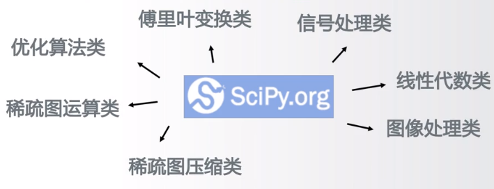

# Python从数据处理到人工智能简介
## 前言

## 对于数据分析
### 数据分析基本库Numpy
用于表达N维数组
* 使用C语言实现，使用python提供接口，计算速度优异
* 是Python数据分析及科学计算的基础库，比如支撑Pandas库等
* 提供直接的矩阵运算、广播函数、线性代数等功能

> [numpy官网：http://www.numpy.org](http://www.numpy.org)

==可以对数组直接进行运算==

### Python数据分析高层级应用库Pandas
* 提供了简单易用的数据结构和数分析工具
* 理解数据类型与索引的关系，操作索引即操作数据
* 基于Numpy开发

提供两种数据结构
* Series = 索引 + 一维数据
* DataFrame = 行列索引 + 二维数据
> [Pandas官网：http://pandas.pydata.org](http://pandas.pydata.org)

==对一维数据和二维数据的一种表示==

### 数学、科学和工程计算功能库SciPy
* 提供了一批数学算法及工程数据运算功能
* 类似Matlab，可用于傅里叶变换、信号处理等应用
* 是Python最主要用于科学计算功能库，基于Numpy开发

## 对于数据可视化

### 高质量的二维数据可视化功能库Matplotlib
* 提供了超过100种数据可视化展示效果
* 库展示效果非常多，所以子库也非常多
* 通过matplotlib.pyplot子库调用各可视化效果，可以理解为各可视化的快捷方式，它把所有有效的可视化展示方法汇聚到一个子库中
* 是Python最主要的数据库可视化库，基于Numpy开发

> [Matplotlib官网地址：http://matplotlib.org](http://matplotlib.org)

### 统计类数据可视化功能库Seaborn
* 提供了一批高层次的统计类数据可视化展示效果
* 主要展示数据间分布、分类和线性关系等内容
* 基于Matplotlib开发，支持Numpy和Pandas

> [Seaborn官网地址：http://seaborn.pydata.org](http://seaborn.pydata.org)

### 三维科学数据可视化功能库Mayavi
* 提供了一匹简单易用的3D科学计算数据可视化展示效果
* 目前版本是Mayavi2，三维可视化最主要的第三方库
* 支持Numpy、TVTK、Traits、Envisage等第三方库

> [Mayavi官网地址：http://docs.enthought.com/mayavi/mayavi/](http://docs.enthought.com/mayavi/mayavi/)

## Python库文本处理

### 处理PDF文件的工具集PyPDF2
* 提供了一批处理PDF文件的计算功能
* 支持获取信息、分割/整合文件、加密解密等
* 完全Python实现，不需要额外依赖，功能稳定
> [PyPDF2官网地址：http://mstamy2.github.io/PyPDF2](http://mstamy2.github.io/PyPDF2)

### 自然语言文本处理第三方库NLTK
* 提供了一批简单易用的自然语言文本处理功能
* 支持语言分类、标记、语法句法、语义分析等
* 最优秀的Python自然语言处理库
形成一个树形结构，然后分析语句逻辑

> [NLTK官网地址：http://nltk.org/](http://nltk.org/)

### Microsoft Word文件的第三方库
* 其中最优秀的是Python-docx
* 提供创建和更新.doc、.docx等文件的计算功能
* 增加并配置段落、图片、表格、文字等，功能全面

## Python库机器学习
### 机器学习方法工具集Scikit-learn
* 提供一批统一化的机器学习方法功能接口
* 提供聚类、分类、回归、强化学习等计算功能
* 机器学习最基本且最优秀的Python第三方库

> [Scikit-learn官方网站：http://scikit-learn.org](http://scikit-learn.org)

### AlphaGo背后的机器学习计算框架TensorFlow
* 谷歌公司推动的开源机器学习框架
* 将数据流图作为基础，图节点代表运算，边代表张量，进而形成机器学习的整体模式
* 应用机器学习方法的一种方式，支撑谷歌人工智能应用

> [TensorFlow官方网站：https://www.tensorflow.org/](https://www.tensorflow.org/)

### 深度学习计算框架MXNet
* 提供可扩展的神经网络及深度学习计算功能
* 可用于自动驾驶、机器翻译、语音识别等众多领域
* 是Python最重要的深度学习计算框架
