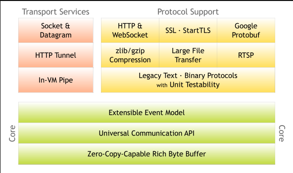

官网描述

Netty is an asynchronous event-driven network application framework

for rapid development of maintainable high performance protocol servers & clients.

Netty是一个异步的时间驱动的网络应用框架，为快速开发可维护的高性能的协议服务器和客户端。

---
#Netty #IO 
完~
