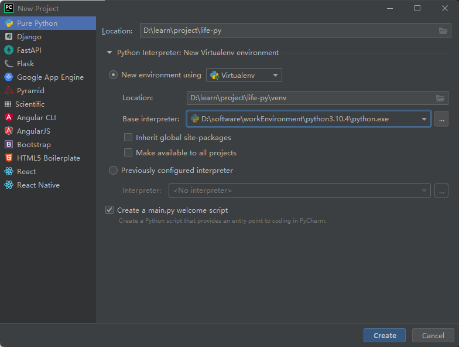
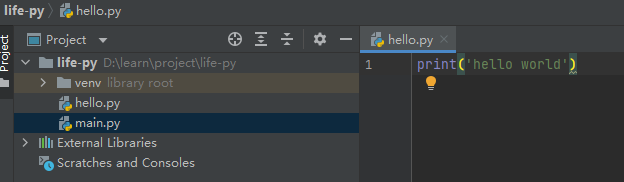
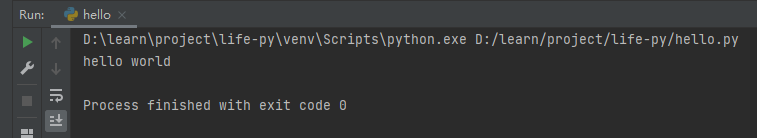
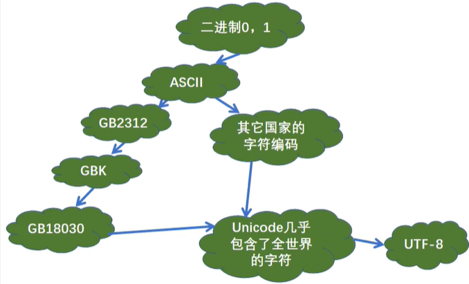
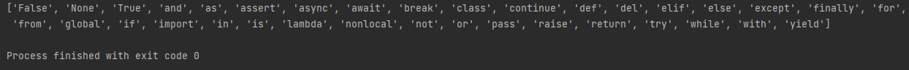

# 基础
## 开启新的征程



##  Hello Python（输出函数）

输出函数



```python
# 井号是行注释
# 输出字符串
print('hello world')

print("hello world")

# 含有运算符表达式
print(3 + 1)

# 将数据输出到文件中
fp = open('./text.txt','a+') # a+就是没有这个文件就创建
print('hello world',file=fp)
fp.close()

# 不换行输出
print('hello','world','Python')
```

右键运行，效果如下

 


## 转义字符

反斜杠+想要实现的转义功能首字母

```python
\n 换行
\r tab
\t 回车
\b 退一个字符

\\ 一个\
\\\\ 两个\\
\' 一个'
```


## 原字符

不希望字符串的转义字符起作用，就使用原字符：在字符串之前加r或R

```python
print(r'hello \n world')
```

> 注意：以后一个字符不能是一个反斜杠


## 二进制与字符编码




```python
print(chr(0b100111001))
```


## 标识符和保留字

查看python中的所有保留字

```python 
import keyword
print(keyword.kwlist)
```



['False', 'None', 'True', 'and', 'as', 'assert', 'async', 'await', 'break', 'class', 'continue', 'def', 'del', 'elif', 'else', 'except', 'finally', 'for', 'from', 'global', 'if', 'import', 'in', 'is', 'lambda', 'nonlocal', 'not', 'or', 'pass', 'raise', 'return', 'try', 'while', 'with', 'yield']

### 标识符

标识符：变量、函数、类、模块和其他对象的名字

规则：

* 包含字母、数字、下划线
* 不能以数字开头
* 不能是保留字
* 严格区分大小写


