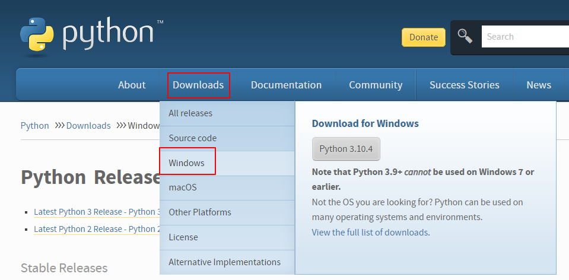
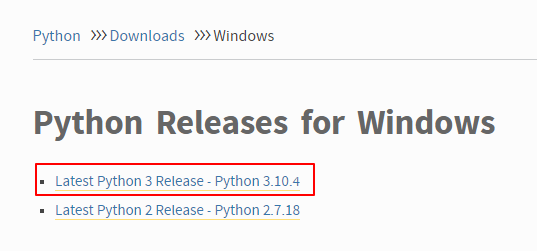
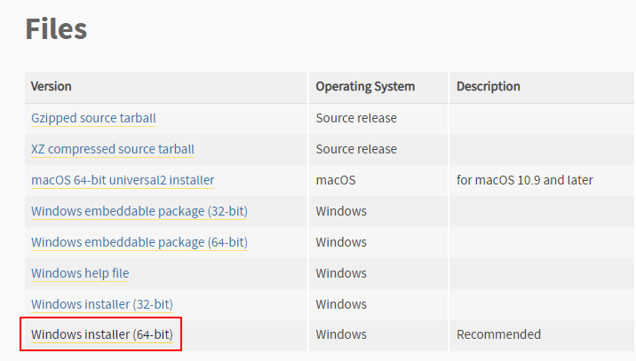
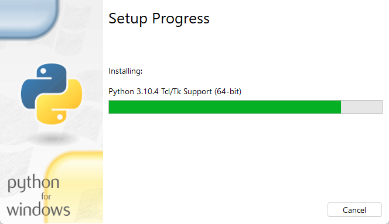
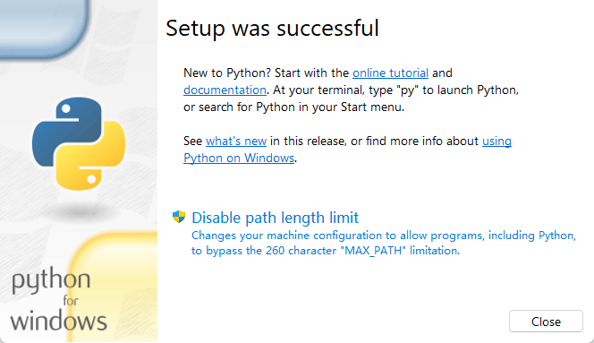
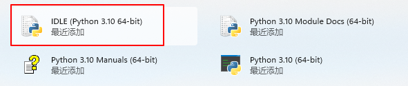
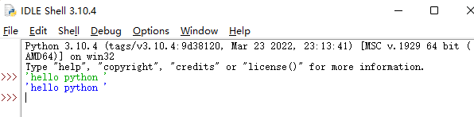
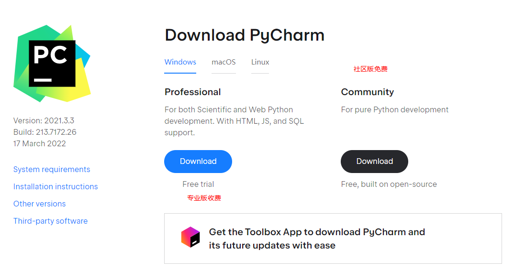
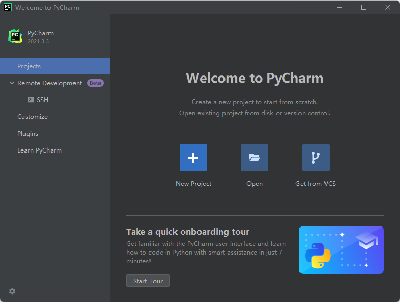

# python

## 简介

* 跨平台程序设计语言
* 解释型语言
* 交互式语言
* 面向对象

## 环境安装

### 解析器

https://www.python.org/

安装windows环境，最新版本吧

点击进入找到file，我这里操作系统是64位。

选择好自己的文件夹，一路向下就好

显示这样就成了

### 初体验

打开这个

输入

`'hello python'`

### IDE

使用PyCharm，官网下载即可

https://www.jetbrains.com/pycharm/download/#section=windows

完成安装

