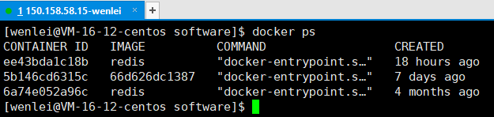
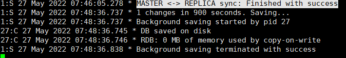
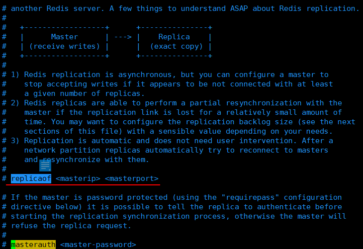

# 主从同步
在Redis的使用中没有使用集群，至少也会做主从。当主节点（Master）挂掉的时候，切换让从节点（Slave）接管，服务就可以继续。

如果没有节点需要经过数据恢复和重启的过程，可能会拖延很长时间，从而影响线上业务的持续服务。

## CAP原理
CAP原理是现代分布式系统的理论基石。
* C：Consistent，一致性
* A：Availability，可用性
* P：Partition tolerance，分区容忍性

分布式的结点往往都是分布在不同的机器上进行网络隔离开的，这意味着必然会有网络断开的风险。这个网络断开场景的专业词汇叫<span style="color:red">网络分区</span>

在网络分区发生时，两个分布式结点之间无法通信，我们对一个结点进行的修改操作将无法同步到另外一个节点，所以数据的<span style="color:red">一致性</span>将无法满足，
因为两个分布式节点的数据不再保持一致。

除非我们牺牲<span style="color:red">可用性</span>，也就是暂停分布式节点服务，在网络分区发生时，不再提供修改数据的功能，
直到网络状况完全恢复正常再继续对外提供服务。

用一句话概括：当网络分区发生时，一致性和可用性不可兼得。

## Redis的情况
Redis的主从数据是异步同步的，分布式的Redis系统并不满足`一致性`的要求。

当客户端在Redis的主节点修改数据后，立即返回。即使在主从网络断开的情况下，主节点依旧可以正常的对外提供修改服务，所以Redis满足`可用性`。

Redis保证`最终一致性`，从节点会努力追赶主节点，最终从节点的状态会和主节点的状态保持一致。如果网络断开了，主从节点出现大量不一致，但一旦网络恢复，从节点会采用多种策略努力追赶，继续尽力保持和主节点一致。

>Redis支持主从同步和从从同步，从从同步功能是Redis后续版本增加的功能，以减轻主节点的同步负担。

## 同步方式

### 增量同步
Redis同步的是指令流，主节点将产生修改影响的指令记录在环形buffer数组中，然后异步将buffer中的指令同步到从节点。从节点接收后操作自己并反馈自己同步到哪（偏移量）给主节点。

如果网络不好主从未能同步，环形buffer数组满后会覆盖前面的内容，但此时还没有同步就被后续指令覆盖，从节点将无法直接通过指令流进行同步，这时就需要用到快照同步。

### 快照同步
快照同步非常消耗资源。首先从主节点上进行一次bgsave，将内存的全部数据快照到磁盘，再将快照文件全部传送到从节点。从节点接收完毕后，立即执行一次全量加载。加载之前先将内存数据清空，加载完毕后通知主节点继续增量同步。

::: danger 注意
快照同步过程中，主节点记录buffer不停往前移动，如果buffer太小，快照同步期间再次发生覆盖，快照同步完成后无法进行增量复制，会再次发起快照同步，极有可能死循环。
:::

> 务必合理配置buffer大小

> 从节点刚加入集群时，必须进行一次快照同步，同步完成后进行增量同步。
### 无盘复制
主节点进行快照同步时，会进行很耗时的文件IO操作，在非SSD磁盘存储时，快照同步会对系统产生负载产生比较大的影响。特别是当系统正在进行AOF的fsync操作时，如果发生快照同步，fsync将会被推迟执行，就会严重影响主节点的服务效率。

从Redis2.8.18版本开始，Redis支持无盘复制。即：主服务器直接通过套接字将快照内容发送到从节点，生成快照是一个遍历的过程，主节点会一边遍历内存，一边将序列化的内容发送到从节点，从节点还是跟之前一样，先将接收的内容存储到磁盘中，再进行一次加载。

### wait指令
Redis的复制是异步进行的，Redis3.0以后出现wait指令，可以让异步复制变身成同步复制，确保系统的强一致性（不严格）。

wait提供两个参数，第一个参数是从节点的数量N，第二个参数是时间t，以毫秒为单位。

含义：等待wait指令指点的所有写操作同步到N个从节点，最多等待时间t。如果t=0，表示无限等待直到N个从节点完成同步。

## 主从同步的使用

### 使用命令实现
在目标从机的redis-cli里执行下面命令
```
slaveof IP PORT #设置本服务为从服务器
slaveof no one  #使服务器切换为独立主机
```



我这里有一个服务器，开启了3redis的docker进程。相当于我部署了3个redis

现在把他改成1主2从的模式。

1. 首先来到 ID 为`5b146cd6315c`的redis-cli

```
[wenlei@VM-16-12-centos software]$ docker exec -it 5b146cd6315c /bin/bash
root@5b146cd6315c:/data# redis-cli
127.0.0.1:6379>
```
2. 然后设置当前服务成为从服务，从属6379。我这里使用的Docker不能使用127.0.0.1，需要使用真实外网IP

```
127.0.0.1:6379> slaveof 150.158.58.15 6379
OK
127.0.0.1:6379>
```
::: danger 警告
第一次设置，发现控制台是报警的，提示如下

MASTER aborted replication with an error: NOAUTH Authentication required.

理解发现，我是设置了密码的


对于一个正在运行的服务器， 可以使用客户端输入以下命令：

`config set masterauth <password>`
:::

成功后再次查看控制台日志：`MASTER <-> REPLICA sync: Finished with success`即表示成功。
还会发现原本6379的所有key都复制到了该节点

3. 再使用set命令试下
```
127.0.0.1:6379> set a a
(error) READONLY You can't write against a read only replica.
127.0.0.1:6379> 
```
4. 得到所有的keys
```
127.0.0.1:6379> keys *
1) "k1"
127.0.0.1:6379> 
```
5. 去主节点添加一个key再回来看
主节点中本身有一个k1已经复制，再添加一个
控制台再上次成功的基础上再次添加日志



查看从节点keys发现果然同步过来
```
127.0.0.1:6379> keys *
1) "testSlave"
2) "k1"
127.0.0.1:6379> 
```

### 使用配置文件基本一致
在搜索配置文件时，没有slaveof发现新的`replicaof <masterip> <masterport>`



就使用这个配置
```
replicaof ip 6379
masterauth 密码
```
启动后直接显示
```
1:S 27 May 2022 08:12:12.312 * Ready to accept connections
1:S 27 May 2022 08:12:12.313 * Connecting to MASTER 150.158.58.15:6379
1:S 27 May 2022 08:12:12.313 * MASTER <-> REPLICA sync started
1:S 27 May 2022 08:12:12.317 * Non blocking connect for SYNC fired the event.
1:S 27 May 2022 08:12:12.321 * Master replied to PING, replication can continue...
1:S 27 May 2022 08:12:12.328 * Partial resynchronization not possible (no cached master)
1:S 27 May 2022 08:12:12.332 * Full resync from master: 5deb7ce9ef56de112eabbd7317bb2196d5881a41:2245
1:S 27 May 2022 08:12:12.350 * MASTER <-> REPLICA sync: receiving 204 bytes from master to disk
1:S 27 May 2022 08:12:12.350 * MASTER <-> REPLICA sync: Flushing old data
1:S 27 May 2022 08:12:12.351 * MASTER <-> REPLICA sync: Loading DB in memory
1:S 27 May 2022 08:12:12.368 * Loading RDB produced by version 6.2.6
1:S 27 May 2022 08:12:12.368 * RDB age 0 seconds
1:S 27 May 2022 08:12:12.368 * RDB memory usage when created 1.87 Mb
1:S 27 May 2022 08:12:12.368 # Done loading RDB, keys loaded: 2, keys expired: 0.
1:S 27 May 2022 08:12:12.368 * MASTER <-> REPLICA sync: Finished with success
```
去到redis-cli看keys
```
27.0.0.1:6379> keys *
1) "testSlave"
2) "k1"
127.0.0.1:6379>
```

在redis-cli里也能使用`info replication`看主从信息
```
127.0.0.1:6379> info replication
# Replication
role:slave
master_host:150.158.58.15
master_port:6379
master_link_status:up
master_last_io_seconds_ago:1
master_sync_in_progress:0
slave_read_repl_offset:2721
slave_repl_offset:2721
slave_priority:100
slave_read_only:1
replica_announced:1
connected_slaves:0
master_failover_state:no-failover
master_replid:5deb7ce9ef56de112eabbd7317bb2196d5881a41
master_replid2:0000000000000000000000000000000000000000
master_repl_offset:2721
second_repl_offset:-1
repl_backlog_active:1
repl_backlog_size:1048576
repl_backlog_first_byte_offset:2246
repl_backlog_histlen:476
127.0.0.1:6379> 
```

成了~
