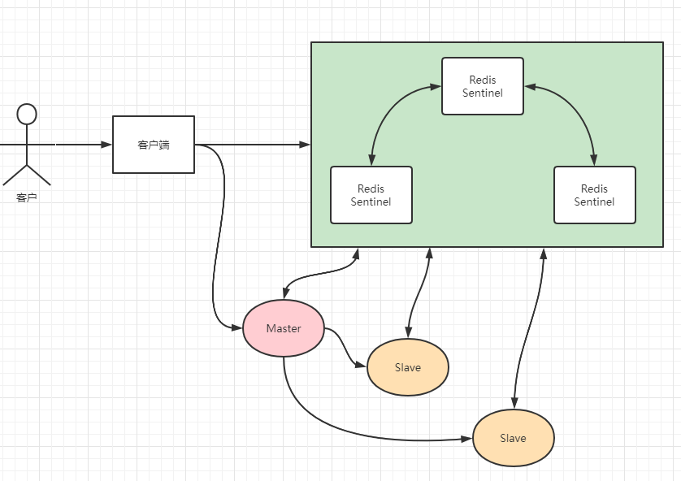
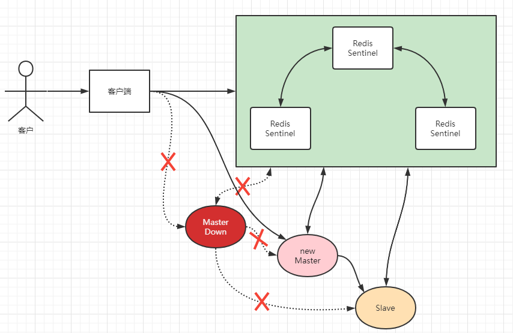

# Redis哨兵模式
Redis Sentinel是针对需要当发生故障时自动进行主从切换，程序可以不用重启的一个高可用的解决方案。

可以将Redis Sentinel集群看成是一个zookeeper集群，它是集群高可用的心脏，一般由3~5个节点组成，这样即使别的节点挂了，集群还是可以正常运转。

## 理解原理
一个正常的分布图



Sentinel负责持续监控主从节点的健康，当主节点挂掉时，自动选择一个最优的从节点切换称为主节点。

客户端来连接集群时，会首先连接Sentinel，通过Sentinel来查询主节点的地址，然后再连接主节点进行数据交互。

当主节点发生故障时，客户端会重新向Sentinel要地址，Sentinel会将最新的主节点地址告诉客户端。

如此应用程序将无序重启即可自动完成节点的切换。



如上图，如果主节点挂掉，原先的主从复制也断开，客户端和损坏的主节点也断开。一个从节点被提升为新的主节点，其他从节点开始和新的主节点建立复制关系。

客户端通过新节点继续进行交互。

Sentinel会持续监控已经挂掉的主节点，待它恢复后，集群会调整为从节点，从新的主节点那里建立复制关系。

## 消息丢失问题
Redis是采用异步复制，主节点挂掉，从节点可能没有收到全部的消息，未同步部分就丢失了。

Sentinel无法保证消息完全不丢失，但也能尽量保证消息少丢失。

通过2个选项限制主从延迟过大

```
# 表示主节点必须至少有一个从节点在进行正常复制，否则就停止对外写服务，丧失可用性。
# 是否正常取决于下一个参数
min-slaves-to-write 1   

# 但是是秒，表示如果10s内没有收到从节点的反馈，就意味着从节点同步不正常。
# 要么是网络断开了，要么是一直没有给反馈
min-slaves-max-lage 10  
```

## 一台服务器搭建一主二从三哨兵的集群
sentinel哨兵模式已经被集成在redis2.4之后的版本中。

一般建议sentinel采取奇数台，防止某一台sentinel无法连接到master导致误切换。
### 1.创建一个文件夹redis
里面放置3个文件。一个启动redis的docker配置文件；1一个主redis服务的配置文件，2个从redis服务的配置文件；
文件1：docker-compose.yml，这个文件时docker用来方便创建集群操作的配置文件。[详情可以查看](../../temp/learndockerfile.md#docker-compose)
```yml
services:
  redis1:
    image: redis
    container_name: redis
    ports:
      - 6379:6379
    command: redis-server /usr/local/etc/redis/redis.conf
    volumes:
      - ./redis.conf:/usr/local/etc/redis/redis.conf

  redis2:
    image: redis
    container_name: redis2
    ports:
      - 6380:6379
    command: redis-server /usr/local/etc/redis/redis_slave1.conf
    volumes:
      - ./redis_slave1.conf:/usr/local/etc/redis/redis_slave1.conf

  redis3:
    image: redis
    container_name: redis3
    ports:
      - 6381:6379
    command: redis-server /usr/local/etc/redis/redis_slave2.conf
    volumes:
      - ./redis_slave2.conf:/usr/local/etc/redis/redis_slave2.conf

```
主redis服务的配置文件
```{27,28,30}
# bind 127.0.0.1
timeout 0
tcp-keepalive 300
daemonize no
supervised no
pidfile /var/run/redis_6379.pid
loglevel notice
logfile ""
databases 16
always-show-logo yes
save 900 1
save 300 10
save 60 10000
stop-writes-on-bgsave-error yes
rdbcompression yes
rdbchecksum yes
dbfilename dump.rdb
rdb-del-sync-files no
dir ./
replica-serve-stale-data yes
replica-read-only yes
repl-diskless-sync no
repl-diskless-sync-delay 5
repl-diskless-load disabled
repl-disable-tcp-nodelay no
replica-priority 100
replica-announce-ip 150.158.58.15 # docker启动很重要的配置
replica-announce-port 6379 # docker启动很重要的配置
acllog-max-len 128
masterauth 密码 # 主也要写上这个密码，面对主机挂掉重新启动当从机连接别的主机使用
requirepass 密码
lazyfree-lazy-eviction no
lazyfree-lazy-expire no
lazyfree-lazy-server-del no
replica-lazy-flush no
lazyfree-lazy-user-del no
oom-score-adj no
oom-score-adj-values 0 200 800
appendonly no
appendfilename "appendonly.aof"
appendfsync everysec
no-appendfsync-on-rewrite no
auto-aof-rewrite-percentage 100
auto-aof-rewrite-min-size 64mb
aof-load-truncated yes
aof-use-rdb-preamble yes
lua-time-limit 5000
slowlog-log-slower-than 10000
slowlog-max-len 128
latency-monitor-threshold 0
notify-keyspace-events ""
hash-max-ziplist-entries 512
hash-max-ziplist-value 64
list-max-ziplist-size -2
list-compress-depth 0
set-max-intset-entries 512
zset-max-ziplist-entries 128
zset-max-ziplist-value 64
hll-sparse-max-bytes 3000
stream-node-max-bytes 4096
stream-node-max-entries 100
activerehashing yes
client-output-buffer-limit normal 0 0 0
client-output-buffer-limit replica 256mb 64mb 60
client-output-buffer-limit pubsub 32mb 8mb 60
hz 10
dynamic-hz yes
aof-rewrite-incremental-fsync yes
rdb-save-incremental-fsync yes
jemalloc-bg-thread yes
```
从1配置：
``` {23,24,32,33,35}
# bind 127.0.0.1
protected-mode no
port 6379
tcp-backlog 511
timeout 0
tcp-keepalive 300
daemonize no
supervised no
pidfile /var/run/redis_6379.pid
loglevel notice
logfile ""
databases 16
always-show-logo yes
save 900 1
save 300 10
save 60 10000
stop-writes-on-bgsave-error yes
rdbcompression yes
rdbchecksum yes
dbfilename dump.rdb
rdb-del-sync-files no
dir ./
replicaof 150.158.58.15 6379    # 配置监听150.158.58.15端口6379的主redis
masterauth 密码
replica-serve-stale-data yes
replica-read-only yes
repl-diskless-sync no
repl-diskless-sync-delay 5
repl-diskless-load disabled
repl-disable-tcp-nodelay no
replica-priority 100
replica-announce-ip 150.158.58.15 # docker启动很重要的配置
replica-announce-port 6380 # docker启动很重要的配置 从一服务的端口
acllog-max-len 128
requirepass 密码
lazyfree-lazy-eviction no
lazyfree-lazy-expire no
lazyfree-lazy-server-del no
replica-lazy-flush no
lazyfree-lazy-user-del no
oom-score-adj no
oom-score-adj-values 0 200 800
appendonly no
appendfilename "appendonly.aof"
appendfsync everysec
no-appendfsync-on-rewrite no
auto-aof-rewrite-percentage 100
auto-aof-rewrite-min-size 64mb
aof-load-truncated yes
aof-use-rdb-preamble yes
lua-time-limit 5000
slowlog-log-slower-than 10000
slowlog-max-len 128
latency-monitor-threshold 0
notify-keyspace-events ""
hash-max-ziplist-entries 512
hash-max-ziplist-value 64
list-max-ziplist-size -2
list-compress-depth 0
set-max-intset-entries 512
zset-max-ziplist-entries 128
zset-max-ziplist-value 64
hll-sparse-max-bytes 3000
stream-node-max-bytes 4096
stream-node-max-entries 100
activerehashing yes
client-output-buffer-limit normal 0 0 0
client-output-buffer-limit replica 256mb 64mb 60
client-output-buffer-limit pubsub 32mb 8mb 60
hz 10
dynamic-hz yes
aof-rewrite-incremental-fsync yes
rdb-save-incremental-fsync yes
jemalloc-bg-thread yes
```
从2配置：
``` {23,24,32,33,35}
# bind 127.0.0.1
protected-mode no
port 6379
tcp-backlog 511
timeout 0
tcp-keepalive 300
daemonize no
supervised no
pidfile /var/run/redis_6379.pid
loglevel notice
logfile ""
databases 16
always-show-logo yes
save 900 1
save 300 10
save 60 10000
stop-writes-on-bgsave-error yes
rdbcompression yes
rdbchecksum yes
dbfilename dump.rdb
rdb-del-sync-files no
dir ./
replicaof 150.158.58.15 6379    # 配置监听150.158.58.15端口6379的主redis
masterauth 密码
replica-serve-stale-data yes
replica-read-only yes
repl-diskless-sync no
repl-diskless-sync-delay 5
repl-diskless-load disabled
repl-disable-tcp-nodelay no
replica-priority 100
replica-announce-ip 150.158.58.15 # docker启动很重要的配置
replica-announce-port 6381 # docker启动很重要的配置 从一服务的端口，改这里就行其余不动
acllog-max-len 128
requirepass 密码
lazyfree-lazy-eviction no
lazyfree-lazy-expire no
lazyfree-lazy-server-del no
replica-lazy-flush no
lazyfree-lazy-user-del no
oom-score-adj no
oom-score-adj-values 0 200 800
appendonly no
appendfilename "appendonly.aof"
appendfsync everysec
no-appendfsync-on-rewrite no
auto-aof-rewrite-percentage 100
auto-aof-rewrite-min-size 64mb
aof-load-truncated yes
aof-use-rdb-preamble yes
lua-time-limit 5000
slowlog-log-slower-than 10000
slowlog-max-len 128
latency-monitor-threshold 0
notify-keyspace-events ""
hash-max-ziplist-entries 512
hash-max-ziplist-value 64
list-max-ziplist-size -2
list-compress-depth 0
set-max-intset-entries 512
zset-max-ziplist-entries 128
zset-max-ziplist-value 64
hll-sparse-max-bytes 3000
stream-node-max-bytes 4096
stream-node-max-entries 100
activerehashing yes
client-output-buffer-limit normal 0 0 0
client-output-buffer-limit replica 256mb 64mb 60
client-output-buffer-limit pubsub 32mb 8mb 60
hz 10
dynamic-hz yes
aof-rewrite-incremental-fsync yes
rdb-save-incremental-fsync yes
jemalloc-bg-thread yes
```

启动
```
docker-compose up -d
```


### 2.创建一个文件夹sentinel
里面放置4个文件。一个启动哨兵的docker配置文件；3个哨兵服务的配置文件。

文件1：docker-compose.yml，这个文件时docker用来方便创建集群操作的配置文件。[详情可以查看](../../temp/learndockerfile.md#docker-compose)
```yml
services:
  sentinel1:
    image: redis
    container_name: redis-sentinel-1
    ports:
      - 26379:26379
    command: redis-sentinel /usr/local/etc/redis/sentinel.conf
    volumes:
      - ./sentinel1.conf:/usr/local/etc/redis/sentinel.conf

  sentinel2:
    image: redis
    container_name: redis-sentinel-2
    ports:
      - 26380:26379
    command: redis-sentinel /usr/local/etc/redis/sentinel.conf
    volumes:
      - ./sentinel2.conf:/usr/local/etc/redis/sentinel.conf

  sentinel3:
    image: redis
    container_name: redis-sentinel-3
    ports:
      - 26381:26379
    command: redis-sentinel /usr/local/etc/redis/sentinel.conf
    volumes:
      - ./sentinel3.conf:/usr/local/etc/redis/sentinel.conf
```
文件2（3个哨兵服务的配置文件）：
sentinel1.conf、
``` {3}
port 26379
sentinel announce-ip 150.158.58.15
sentinel announce-port 26379
sentinel monitor mymaster 150.158.58.15 6379 2
# sentinel auth-pass mymaster 密码
sentinel down-after-milliseconds mymaster 30000
sentinel parallel-syncs mymaster 1
sentinel failover-timeout mymaster 180000
```
sentinel2.conf
``` {3}
port 26379
sentinel announce-ip 150.158.58.15
sentinel announce-port 26380
sentinel monitor mymaster 150.158.58.15 6379 2
# sentinel auth-pass mymaster 密码
sentinel down-after-milliseconds mymaster 30000
sentinel parallel-syncs mymaster 1
sentinel failover-timeout mymaster 180000
```
sentinel3.conf
``` {3}
port 26379
sentinel announce-ip 150.158.58.15
sentinel announce-port 26381
sentinel monitor mymaster 150.158.58.15 6379 2
# sentinel auth-pass mymaster 密码
sentinel down-after-milliseconds mymaster 30000
sentinel parallel-syncs mymaster 1
sentinel failover-timeout mymaster 180000
```

sentinel.conf配置注解
```
# 哨兵sentinel实例运行的端口 默认26379
port 26379

# 哨兵sentinel的工作目录
#dir /tmp

#sentinel容器映射到宿主机的端口和IP。docker启动时这个很重要
sentinel announce-ip 150.158.58.15
sentinel announce-port 26379

# 哨兵sentinel监控的redis主节点的 ip port
# master-name 可以自己命名的主节点名字 只能由字母A-z、数字0-9 、这三个字符".-_"组成。
# quorum 配置多少个sentinel哨兵统一认为master主节点失联 那么这时客观上认为主节点失联了
# 注意：如果 quorum 给的值过大， 超过主机数量， 可能会导致 master 主机挂掉之后， 没有新的 slave来替代 master
# sentinel monitor <master-name> <ip> <redis-port> <quorum>
sentinel monitor mymaster 150.158.58.15 6379 2

# 当在Redis实例中开启了requirepass foobared 授权密码 这样所有连接Redis实例的客户端都要提供密码
# 设置哨兵sentinel 连接主从的密码 注意必须为主从设置一样的验证密码
# sentinel auth-pass <master-name> <password>
sentinel auth-pass mymaster redis2716

# 指定多少毫秒之后 主节点没有应答哨兵sentinel 此时 哨兵主观上认为主节点下线 默认30秒
# sentinel down-after-milliseconds <master-name> <milliseconds>
sentinel down-after-milliseconds mymaster 30000

# 这个配置项指定了在发生failover主备切换时最多可以有多少个slave同时对新的master进行同步，这个数字越小，完成failover所需的时间就越长，但是如果这个数字越大，就意味着越 多的slave因为replication而不可用。可以通过将这个值设为 1 来保证每次只有一个slave 处于不能处理命令请求的状态。
# sentinel parallel-syncs <master-name> <numslaves>
sentinel parallel-syncs mymaster 1

# 故障转移的超时时间 failover-timeout 可以用在以下这些方面：
#1. 同一个sentinel对同一个master两次failover之间的间隔时间。
#2. 当一个slave从一个错误的master那里同步数据开始计算时间。直到slave被纠正为向正确的master那里同步数据时。
#3.当想要取消一个正在进行的failover所需要的时间。
#4.当进行failover时，配置所有slaves指向新的master所需的最大时间。不过，即使过了这个超时，slaves依然会被正确配置为指向master，但是就不按parallel-syncs所配置的规则来了
# 默认三分钟
# sentinel failover-timeout <master-name> <milliseconds>
sentinel failover-timeout mymaster 180000

# SCRIPTS EXECUTION
# 配置当某一事件发生时所需要执行的脚本，可以通过脚本来通知管理员，例如当系统运行不正常时发邮件通知相关人员。
# 对于脚本的运行结果有以下规则：
# 若脚本执行后返回1，那么该脚本稍后将会被再次执行，重复次数目前默认为10
# 若脚本执行后返回2，或者比2更高的一个返回值，脚本将不会重复执行。
# 如果脚本在执行过程中由于收到系统中断信号被终止了，则同返回值为1时的行为相同。
# 一个脚本的最大执行时间为60s，如果超过这个时间，脚本将会被一个SIGKILL信号终止，之后重新执行。
# 通知型脚本:当sentinel有任何警告级别的事件发生时（比如说redis实例的主观失效和客观失效等等），将会去调用这个脚本，这时这个脚本应该通过邮件，SMS等方式去通知系统管理员关于系统不正常运行的信息。调用该脚本时，将传给脚本两个参数，一个是事件的类型，一个是事件的描述。如果sentinel.conf配置文件中配置了这个脚本路径，那么必须保证这个脚本存在于这个路径，并且是可执行的，否则sentinel无法正常启动成功。
#通知脚本
# sentinel notification-script <master-name> <script-path>
# sentinel notification-script mymaster /var/redis/notify.sh

# 客户端重新配置主节点参数脚本
# 当一个master由于failover而发生改变时，这个脚本将会被调用，通知相关的客户端关于master 地址已经发生改变的信息。
# 以下参数将会在调用脚本时传给脚本:
# <master-name> <role> <state> <from-ip> <from-port> <to-ip> <to-port>
# 目前<state>总是“failover”,
# <role>是“leader”或者“observer”中的一个。
# 参数 from-ip, from-port, to-ip, to-port是用来和旧的master和新的master(即旧的slave)通信的
# 这个脚本应该是通用的，能被多次调用，不是针对性的。
# sentinel client-reconfig-script <master-name> <script-path>
# sentinel client-reconfig-script mymaster /var/redis/reconfig.sh
```

启动
```
docker-compose up -d
```
### 3.启动效果
来到一个sentinel服务里，使用info命令
得到了如下效果：
`master0:name=mymaster,status=ok,address=150.158.58.15:6379,slaves=2,sentinels=3`

### 4.主动挂掉redis主
先打开sentinel集群的日志，来到sentinel文件夹里执行`docker-compose logs -f`

干掉redis主`docker stop 6ac57c328423`，根据文件知道需要等待等待30s；

日志显示
```
redis-sentinel-2  | 1:X 01 Jun 2022 15:01:07.769 # +sdown slave 150.158.58.15:6379 150.158.58.15 6379 @ mymaster 150.158.58.15 6380
redis-sentinel-1  | 1:X 01 Jun 2022 15:01:07.773 # +sdown slave 150.158.58.15:6379 150.158.58.15 6379 @ mymaster 150.158.58.15 6380
redis-sentinel-3  | 1:X 01 Jun 2022 15:01:08.929 # +sdown slave 150.158.58.15:6379 150.158.58.15 6379 @ mymaster 150.158.58.15 6380
```

使用来到sentinel服务里再次使用info查看，发现master已经变成了6380

`master0:name=mymaster,status=ok,address=150.158.58.15:6380,slaves=2,sentinels=3`

### 5.再次启动刚好关闭的服务
`docker start 6ac57c328423`
得到日志
```
redis-sentinel-2  | 1:X 01 Jun 2022 15:01:07.769 # +sdown slave 150.158.58.15:6379 150.158.58.15 6379 @ mymaster 150.158.58.15 6380
redis-sentinel-1  | 1:X 01 Jun 2022 15:01:07.773 # +sdown slave 150.158.58.15:6379 150.158.58.15 6379 @ mymaster 150.158.58.15 6380
redis-sentinel-3  | 1:X 01 Jun 2022 15:01:08.929 # +sdown slave 150.158.58.15:6379 150.158.58.15 6379 @ mymaster 150.158.58.15 6380
```

搭建完成

## SpringBoot使用Redis哨兵集群
### Redisson使用
其余正常使用就行
```java
import org.redisson.Redisson;
import org.redisson.config.Config;
import org.springframework.context.annotation.Bean;
import org.springframework.context.annotation.Configuration;
@Configuration
public class RedissonConfig {

    @Bean
    public Redisson redisson () {
        Config config = new Config();
        config.useSentinelServers()
                .addSentinelAddress("redis://150.158.58.15:26379","redis://150.158.58.15:26380","redis://150.158.58.15:26381")
                .setMasterName("mymaster")
                .setPassword("密码");
        return (Redisson) Redisson.create(config);
    }
}
```

### 使用SpringBoot默认配置
其余正常使用就行
```yml
  redis:
    sentinel:
      master: mymaster
      nodes: 150.158.58.15:26379,150.158.58.15:26380,150.158.58.15:26381
      password: 密码
```