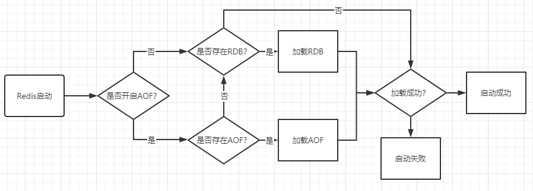

# Redis

## Redis所有命令集合
[Redis所有命令集合](http://doc.redisfans.com/)

## Redis挂了怎么办？
Redis是基于内存的非关系型K-V数据库，既然它是基于内存的，如果Redis服务器挂了，数据就会丢失。为了避免数据丢失了，Redis提供了持久化，即把数据保存到磁盘。
Redis提供了RDB和AOF两种持久化机制，它持久化文件加载流程如下：

RDB持久化，是指在指定的时间间隔内，执行指定次数的写操作，将内存中的数据集快照写入磁盘中，它是Redis默认的持久化方式。执行完操作后，在指定目录下会生成一个dump.rdb文件，Redis 重启的时候，通过加载dump.rdb文件来恢复数据。
* 优点
    - 适合大规模的数据恢复场景，如备份，全量复制等

* 缺点
    - 没办法做到实时持久化/秒级持久化。
    - 新老版本存在RDB格式兼容问题

AOF持久化，采用日志的形式来记录每个写操作，追加到文件中，重启时再重新执行AOF文件中的命令来恢复数据。它主要解决数据持久化的实时性问题。默认是不开启的。

* 优点
    - 数据一致性和完整性很高
* 缺点
    - AOF记录的越多，文件越大，数据恢复变慢

## 