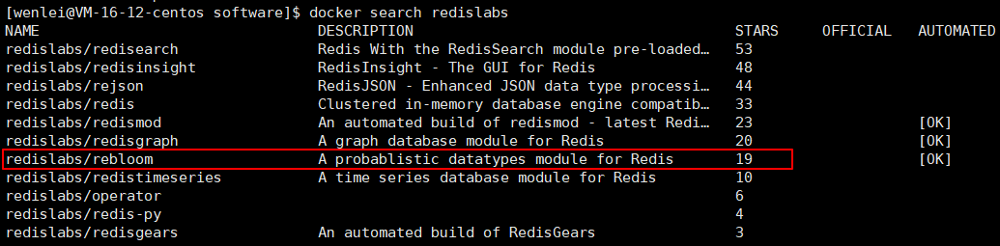
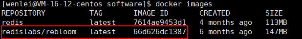
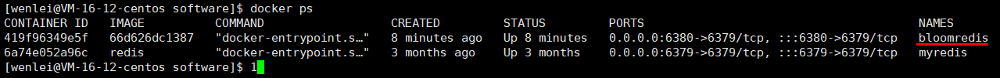
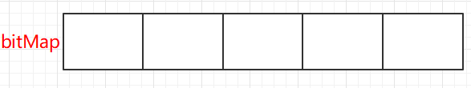
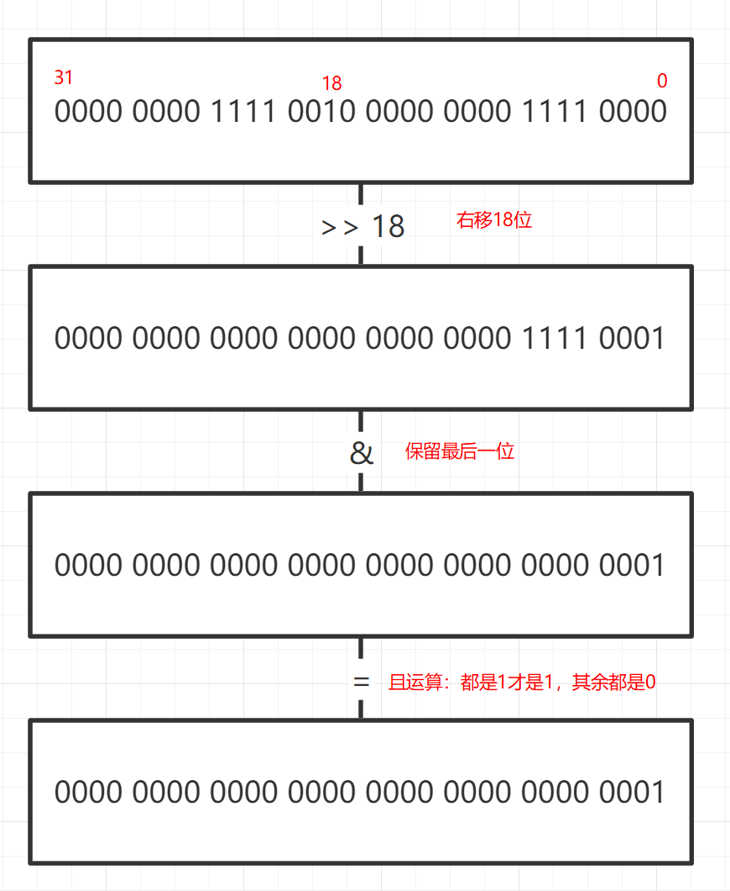

# Redis实现布隆过滤器（Bloom Filter）

## 布隆过滤器是什么？
可以把布隆过滤器理解成一个不怎么精准的Set结构。


### 特点
* 判断值存在，这个值可能不存在
* 判断值不存在，这个值一定不存在

## 常用场景
* 过滤用户已经看过的内容
* 过滤爬虫已经爬过的网页。每爬取一个网页先判断是否在布隆过滤器里，如果不在，肯定没有爬取过，爬取网页后把网址放入布隆过滤器；如果在就不爬取了，很小概率误伤，但对于庞大大网络页面系统少几个页面代价与没有这个过滤重复爬取的性能消耗代价比较无妨~~
* 过滤黑名单邮件
* 防恶意流量击穿缓存，把所有的注册用户放在布隆过滤器里，来一个用户先检测是否是我的用户。
如果布隆过滤器返回不在，则判断为恶意攻击；如果判断在，很小的可能性是恶意攻击，这部分很小的没啥问题，击穿又何妨~

## SpringBoot使用Redis布隆过滤器

让然啦，首先是安装。

Redis官方提供的布隆过滤器到Redis4.0提供了插件功能之后才正式登场。

布隆过滤器作为一个插件加载到Redis Server中，给Redis提供了强大的布隆去重功能。

下面我们体验下Redis4.0的布隆过滤器，
采用docker的安装方式
先获取镜像
`docker search redislabs`



拉取镜像，这样拉取是最新版本。

> 这个rebloom是一个已经安装布隆过滤器插件的Redis，所以我们拉取下来可以直接使用
>
> 理解成原本的Redis安装了插件环境，然后把整个环境进行了一个封装打包成了一个docker镜像

`docker pull redislabs/rebloom`

查看本地镜像列表
`docker images`



启动，因为我已经启动过一个Redis实例，所以我这里切换了端口号

`docker run -p 6380:6379 -d --name bloomredis 66d626dc1387 --requirepass "自己的想要设置的密码"`

* -p 前面是主机端口，后面是docker虚拟机端口
* -d 后台运行
* --name 实例名称
* --requirepass是redis的命令，设置密码

查看运行效果
`docker ps`



> 正常启动以后访问如果出现了不能连接的情况，请查看防火墙是否开放端口
>
> 如果是购买的服务器，去控制开查看是否开启了端口

### 方式一：使用Redisson的Jar包

#### 
引入包
```xml
<dependency>
    <groupId>org.redisson</groupId>
    <artifactId>redisson-spring-boot-starter</artifactId>
    <version>3.17.0</version>
</dependency>
```

配置类
```java
@Configuration
public class RedissonConfig {

    @Bean
    public Redisson redisson () {
        Config config = new Config();

        //单机模式
        config.useSingleServer()
            //配置地址
            .setAddress("redis://ip:6380")
            // 配置密码
            .setPassword("password")
            // 配置数据库
            .setDatabase(0);
        return (Redisson)Redisson.create(config);
    }
}
```

弄一个测试的Controller
```java
@Autowired
Redisson redisson;

@GetMapping("/bloomFilterCreate")
public String bloomFilterCreate () {
    System.out.println("开始创建");
    final RBloomFilter<Object> bloomFilter = redisson.getBloomFilter("bloom-filter-test");
    bloomFilter.tryInit(10000, 0.0001);
    for (int i = 0 ; i < 1000 ; i++) {
        bloomFilter.add(i);
    }
    return "bloomFilterCreate Over！" ;
}

@GetMapping("/bloomFilterTest")
public String bloomFilterTest (@RequestParam int id) {
    final RBloomFilter<Object> bloomFilter = redisson.getBloomFilter("bloom-filter-test");
    if (bloomFilter.contains(id)) {
        return ("bloomFilterTest Over！id存在:" + id);
    } else {
        return ("bloomFilterTest Over！id不存在:" + id);
    }
}
```
::: tip
这里启动时用了密码，依然可以使用bloomFilter

而经过下面一节的使用，发现如果带密码启动就不能使用Redis自带的`BF.ADD`等命令。猜测bloomFilter是自己实现的而不是使用Redis带的。

看下源码去：
点击add方法，一进去第一句`long[] hashes = hash(object);`果然，自己实现的

```java {2,12,17-19}
public boolean add(T object) {
    long[] hashes = hash(object);

    while (true) {
        if (size == 0) {
            readConfig();
        }

        int hashIterations = this.hashIterations;
        long size = this.size;

        long[] indexes = hash(hashes[0], hashes[1], hashIterations, size);

        CommandBatchService executorService = new CommandBatchService(commandExecutor);
        addConfigCheck(hashIterations, size, executorService);
        RBitSetAsync bs = createBitSet(executorService);
        for (int i = 0; i < indexes.length; i++) {
            bs.setAsync(indexes[i]);
        }
        try {
            List<Boolean> result = (List<Boolean>) executorService.execute().getResponses();

            for (Boolean val : result.subList(1, result.size()-1)) {
                if (!val) {
                    return true;
                }
            }
            return false;
        } catch (RedisException e) {
            if (e.getMessage() == null || !e.getMessage().contains("Bloom filter config has been changed")) {
                throw e;
            }
        }
    }
}
```

:::
> 这里特别注意下：使用bloomFilter存入的使用int类型，判断时也要是int类型才可以，不能使用String

### 方式二：Redis Lua脚本
> 什么是Lua脚本？
> Lua 是一种轻量小巧的脚本语言，用标准C语言编写并以源代码形式开放， 其设计目的是为了嵌入应用程序中，从而为应用程序提供灵活的扩展和定制功能。
>
> 其设计目的是为了嵌入应用程序中，从而为应用程序提供灵活的扩展和定制功能。
>
> 理解成一个黑盒的方法，有入参，有出参。

使用Redis的布隆过滤器插件

::: tip 需要知道 
Redis保证以原子方式执行脚本
:::

添加脚本命令
```lua
local bloomName = KEYS[1]
local value = KEYS[2]
local result = redis.call('BF.ADD',bloomName,value)
return result
```
判断脚本
```lua
local bloomName = KEYS[1]
local value = KEYS[2]

local result = redis.call('BF.EXISTS',bloomName,value)
return result
```
运行一个小实例，为了直观效果我直接在Controller里写
```java
@Autowired
RedisTemplate redisTemplate;

@GetMapping("/addBloomFilterLua")
public Boolean bloomFilterLua (@RequestParam Integer id) {
    DefaultRedisScript<Boolean> luaScript = new DefaultRedisScript<>();
    luaScript.setScriptSource(new ResourceScriptSource(new ClassPathResource("bf_add.lua")));
    luaScript.setResultType(Boolean.class);
    //封装传递脚本参数
    List<String> params = new ArrayList<>();
    params.add("bloom-filter-test");
    params.add("1001");
    return (Boolean)redisTemplate.execute(luaScript,params);
}

@GetMapping("/exitBloomFilterLua")
public Boolean exitBloomFilterLua (@RequestParam Integer id) {
    DefaultRedisScript<Boolean> LuaScript = new DefaultRedisScript<>();
    LuaScript.setScriptSource(new ResourceScriptSource(new ClassPathResource("bf_exist.lua")));
    LuaScript.setResultType(Boolean.class);
    //封装传递脚本参数
    ArrayList<String> params = new ArrayList<>();
    params.add("bloom-filter-test");
    params.add(String.valueOf(id));
    return (Boolean) redisTemplate.execute(LuaScript, params);
}
```

::: tip
经过运行结果发现`redislabs/rebloom`容器启动时，如果加上密码。执行上面脚本会报Unknown Redis command called from Lua script的错误。

把密码去掉直接使用`docker run -p 6380:6379 -d --name bloomredis 66d626dc1387`启动就可以使用

如果想设置密码，无密码启动后进入容器使用`config set requirepass 密码`设置
:::

```yml
# Redis数据库索引
  redis:
    # redis数据库索引(默认为0)，我们使用索引为3的数据库，避免和其他数据库冲突
    database: 0
    # redis服务器地址（默认为loaclhost）
    host: 150.158.58.15
    # redis端口（默认为6379）
    port: 6380
    # redis访问密码（默认为空）
#    password: 123456
    # redis连接超时时间（单位毫秒）
    timeout: 600
    # redis连接池配置
    pool:
      # 最大可用连接数（默认为8，负数表示无限）
      max-active: 8
      # 最大空闲连接数（默认为8，负数表示无限）
      max-idle: 8
      # 最小空闲连接数（默认为0，该值只有为正数才有用）
      min-idle: 0
      # 从连接池中获取连接最大等待时间（默认为-1，单位为毫秒，负数表示无限）
      max-wait: -1
```

::: danger 
如果发现

`(error) ERR Error running script (call to f_1a0d5cc7a3cb45884f991ede7af6c0063533bae1): @user_script:1: @user_script: 1: Unknown Redis command called from Lua script`

这个错误。用`docker exec -it 容器名或ID /bin/bash`命令去到docker容器里执行`redis-cli`，进入命令台。

`EVAL "redis.call('BF.ADD','bloom-filter-test',KEYS[1])" 1 1002`
执行这个试试，不能成功。

`BF.ADD bloom-filter-test 1002`
执行这个也不能成功。

我就知道了容器没有挂上插件

退出使用`exit`先退出控制台；再使用`exit;`退出容器

关闭删除容器，重新使用无密码开启容器。再试如上操作成功，运行代码成功。
:::


### 方式三：自己实现一个布隆过滤器
> [扩展阅读:SpringBoot+Redis布隆过滤器防恶意流量击穿缓存的正确姿势](https://blog.csdn.net/lifetragedy/article/details/103945885)
>
> 文章里使用的就是自己实现

#### 原理
##### 1. 储备知识位图（bit array 或 bit map）
比如说 `int [] bitMap = new int [5];`

就可以理解成，有5个格子



每个格子是4字节
$$

4B = 2^4 bit = 32bit

$$

也就是理解成5个格子，每个格子中有32个
|高位 0000 0000 0000 0000 0000 0000 0000 0000 低位|0000 0000 0000 0000 0000 0000 0000 0000|0000 0000 0000 0000 0000 0000 0000 0000|0000 0000 0000 0000 0000 0000 0000 0000|0000 0000 0000 0000 0000 0000 0000 0000|
|--|--|--|--|--|


这样大小为5的整型数组就能表示 $5 * 32 = 160bit$，如果没一个表示一个独立的信息，那么就能表示160个独立的信息；

同理能得出：大小为10的整型数组就能表示320个独立的信息。

如果要取出178位置上的信息，怎么取？

```java
// 定位去哪个数上找如下：就是说32、32、32我存到第几个32内，这个位置
int numIndex = 178 / 32;
// 这个数有32位，要找哪一位如下：就是说一个32，1位、1位、...存到第几个是我
int bitIndex = 178 % 32;

// 拿到位上的数
int s = ((arr[numIndex] >> bitIndex)) & 1;

// 把178位置上的值改为1。先把1左移到目标位，再与当前数组的值或，都是0才为0，其余全是1，1左移必然是1，则修改为0
arr[numIndex] = arr[numIndex] | (1 << (bitIndex)>>);

// 把178位置上的值改为0。0与任何且操作都是0,1与任何且操作都保留任何值
arr[numIdex] = arr[numIndex] & ( ~(1 << bitIndex) );
```
拿到位上的数逻辑
* 一次右移排除右侧所有干扰。
* 一次与1且操作，排除左侧干扰（0位前全都置为0）



##### 2.储备知识Hash函数
这是一个很严谨的数据问题，我这里只知道特征：
* 首先是一个标准的函数，有输入(in)、有输出（out）、有函数名f。即得函数$out = f (in)$
* 输入域无穷
* 输出域相对有限。如md5函数的输出就是0~$2^{64} - 1$
* 相同的输入一定返回相同的输出
* 存在不同的输入得到相同的输出（哈希碰撞）
* 离散性

一批输in，分别先哈希再对值模m，就能得到in均匀分布到0~m上

##### 3.布隆过滤器构造细节
1. 先创建一个位图大小为m
2. 放值。
输入1，先哈希，再模m得到在位图上的一个格子，把这个位置为1。进行k次，每次哈希函数不同
输入2，先哈希，再模m得到在位图上的一个格子，把这个位置为1。进行k次，每次哈希函数不同
3. 判断存在。
输入x，先哈希，再m得到位图上的位置，该位置值是否为1。进行k次，每次哈希函数不同。如果k次有一次位图上的值为0则不存在

##### 4.什么能决定失误率
1. 位图开多大，如果位图很大，失误了就很低。反之如果小，失误就上升。最差全部失误
2. K的地位，K表示采集一个值的几个特征。根据m以及样本量定出一个合适的k（m和样本量固定，随着k增大在一定值前失误减少，一定值后k增大失误上升）

允不允许有失误率？

[根据失误率和样本量得到k和m的网站](https://krisives.github.io/bloom-calculator/)

$$
m = -\frac{n \times \ln{p}}{(\ln2)^2}
$$

$$
k = \ln2 \times \frac{m}{n}
$$

$$
P_{true} = (1 - e^{- \frac{n \times k_{true}}{m_{true}}})^{k_{ture}}
$$

> [左神讲布隆过滤器原理1小时30分29秒](https://www.bilibili.com/video/BV13g41157hK?p=12&spm_id_from=333.1007.top_right_bar_window_history.content.click)

#### 简单实现

```java
package learn.note.redis;

import com.google.common.base.Charsets;
import com.google.common.hash.Hashing;

/**
 * @Author Wang WenLei
 * @Date 2022/5/23 11:25
 * @Version 1.0
 **/
public class BloomFilter {
    /**
     * hash函数执行次数
     */
    private int k;
    /**
     * 位图的大小
     */
    private int m;

    /**
     * @param n 样本容量n
     * @param p 容错率
     */
    BloomFilter(long n, double p) {
        // 用计算求得k和m
        this.m = getM(n,p);
        this.k = getK(n);
    }

    /**
     * 得到位图大小
     * @param n 样本容量
     * @param p 容错率
     * @return 位图大小
     */
    private int getM(long n, double p) {
        return (int) ((- n * Math.log(p)) / (Math.log(2) * Math.log(2)));
    }

    /**
     * @param n 样本容量
     * @return Hash函数执行次数
     */
    private int getK(long n) {
        return Math.max(1, (int) Math.round((double) m / n * Math.log(2)));
    }

    public long [] getBitMapIndex (String value) {
        long [] bitMapIndex = new long[this.k];

        long hash64 = Hashing.murmur3_128().hashString(value, Charsets.UTF_8).asLong();
        int hash = (int) hash64;
        int hash1 = (int) hash64;
        int hash2 = (int) (hash64 >>> 32);

        // 循环k次哈希函数
        for (int i = 0 ; i < k ; i++) {
            // & Long.MAX_VALUE 保证值是正数
            // 任何 & 0111111111111111111111111111111111111111111111111111111111111111
            bitMapIndex[i] = (hash & Long.MAX_VALUE) % this.m;
            // 随着i的增加有规律改变hash
            if (i % 2 == 0) {
                hash += hash2;
            } else {
                hash += hash1;
            }
        }
        // 得到的是应该在位图上标为1的位置数组
        return bitMapIndex;
    }
}
```
调用
```java
public class Test {
    public static void main(String[] args) {
        BloomFilter bf = new BloomFilter(10,0.1);
        long[] tests = bf.getBitMapIndex("test");
    }
}
```

----
总结：
列出的几个自己实现的代码，底层原理相似。