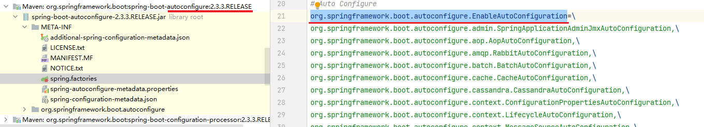

# 自动装配

摘自参考官网

Spring容器可以自动装配Beans之间的关系。可以让Spring通过检查`Application`容器自动的解析合作者（其他Beans）

自动装配具有以下优点：
* 自动装配可以显着减少指定属性或构造函数参数的需要。
* 随着对象的发展，自动装配可以更新配置。

自动装配限制和缺点：

自动装配在项目中一致使用时效果最佳。如果一般不使用自动装配，开发人员可能会混淆使用它来只装配一个或两个 bean 定义。

* `property`和设置中的显示依赖`constructor-arg`项总是覆盖自动装配。不能自动装配简单的属性，例如：基础属性、`String`，`Classes`（和一些简单的properties数组）。此限制是设计使然
* 自动装配不如显式装配精确。尽管如前表中所述，Spring 会小心避免猜测可能会产生意想不到的结果的歧义。Spring 管理的对象之间的关系不再明确记录。
* 从 Spring 容器生成文档的工具可能无法使用接线信息。
* 容器内的多个 bean 定义可能与要自动装配的 setter 方法或构造函数参数指定的类型匹配。对于数组、集合或 `Map`实例，这不一定是问题。但是，对于期望单个值的依赖项，这种歧义不会被任意解决。如果没有唯一的 bean 定义可用，则会引发异常。

> 最后一种情况，有多种选择：
>
> * 放弃自动装配以支持显式装配。
> * `autowire-candidate`通过将其属性设置为 来避免对 bean 定义进行自动装配`false`，
> * 通过将其元素的`primary`属性设置为`true`，将单个bean定义指定为主要的候选者
> * 使用基于注解的配置实现更细粒度的控制


## 我们常常使用的注解`@Autowired`


## SpringBoot启动注解里`@EnableAutoConfiguration`

进入这个注解里最关键的要属@Import(AutoConfigurationImportSelector.class)，借助AutoConfigurationImportSelector，@EnableAutoConfiguration注解可以帮助SpringBoot应用将所有符合条件的@Configuration配置都加载到当前SpringBoot创建并使用的IoC容器。

借助于Spring框架原有的一个工具类：SpringFactoriesLoader的支持，@EnableAutoConfiguration可以智能的自动配置功效才得以大功告成！


AutoConfigurationImportSelector的一部分：

这里这个AutoConfigurationImportSelector实现了DeferredImportSelector，这个类继承ImportSelect

而 <span style="color:red">AutoConfigurationImportSelector重写了selectImports</span> 方法，这个方法把String[]里的内容装载进Spring容器里

```java
// spring-boot-autoconfigure:2.3.3RELEASE版本如下：
@Override
public String[] selectImports(AnnotationMetadata annotationMetadata) {
    if (!isEnabled(annotationMetadata)) {
        return NO_IMPORTS;
    }
    AutoConfigurationEntry autoConfigurationEntry = getAutoConfigurationEntry(annotationMetadata);
    return StringUtils.toStringArray(autoConfigurationEntry.getConfigurations());
}

//spring-boot-autoconfigure2.0.5RELEASE如下，跟上面版本不一样。所以这里直接进入getCandidateConfigurations这个方法
// 把getAutoConfigurationEntry方法放在了selectImports里，这么一看猜测上面的版本更新
@Override
public String[] selectImports(AnnotationMetadata annotationMetadata) {
    if (!isEnabled(annotationMetadata)) {
        return NO_IMPORTS;
    }
    AutoConfigurationMetadata autoConfigurationMetadata = AutoConfigurationMetadataLoader
        .loadMetadata(this.beanClassLoader);
    AnnotationAttributes attributes = getAttributes(annotationMetadata);
    List<String> configurations = getCandidateConfigurations(annotationMetadata,
                                                             attributes);
    configurations = removeDuplicates(configurations);
    Set<String> exclusions = getExclusions(annotationMetadata, attributes);
    checkExcludedClasses(configurations, exclusions);
    configurations.removeAll(exclusions);
    configurations = filter(configurations, autoConfigurationMetadata);
    fireAutoConfigurationImportEvents(configurations, exclusions);
    return StringUtils.toStringArray(configurations);
}
```

spring-boot-autoconfigure:2.3.3RELEASE版本再向下进到`getAutoConfigurationEntry()`

```java
protected AutoConfigurationEntry getAutoConfigurationEntry(AnnotationMetadata annotationMetadata) {
    if (!isEnabled(annotationMetadata)) {
        return EMPTY_ENTRY;
    }
    AnnotationAttributes attributes = getAttributes(annotationMetadata);
	// 这里再向下就可以看到SpringFactoriesLoader
    List<String> configurations = getCandidateConfigurations(annotationMetadata, attributes);
    configurations = removeDuplicates(configurations);
    Set<String> exclusions = getExclusions(annotationMetadata, attributes);
    checkExcludedClasses(configurations, exclusions);
    configurations.removeAll(exclusions);
    configurations = getConfigurationClassFilter().filter(configurations);
    fireAutoConfigurationImportEvents(configurations, exclusions);
    return new AutoConfigurationEntry(configurations, exclusions);
}
```

进入`getCandidateConfigurations()`

```java
/**
	 * Return the auto-configuration class names that should be considered. By default
	 * this method will load candidates using {@link SpringFactoriesLoader} with
	 * {@link #getSpringFactoriesLoaderFactoryClass()}.
	 * @param metadata the source metadata
	 * @param attributes the {@link #getAttributes(AnnotationMetadata) annotation
	 * attributes}
	 * @return a list of candidate configurations
	 */
    protected List<String> getCandidateConfigurations(AnnotationMetadata metadata, AnnotationAttributes attributes) {
        // getSpringFactoriesLoaderFactoryClass()返回的是 EnableAutoConfiguration.class
        List<String> configurations = SpringFactoriesLoader.loadFactoryNames(getSpringFactoriesLoaderFactoryClass(),
                                                                             getBeanClassLoader());
        Assert.notEmpty(configurations, "No auto configuration classes found in META-INF/spring.factories. If you "
                        + "are using a custom packaging, make sure that file is correct.");
        return configurations;
    }
```

在AutoConfigurationImportSelector类中可以看到通过 SpringFactoriesLoader.loadFactoryNames()，这一步会把所有的“ META-INF / spring.factories”都拿到放在一个map里（从代码中我们可以知道，在这个方法中会遍历整个ClassLoader中所有jar包下的spring.factories文件。也就是说我们可以在自己的jar中配置spring.factories文件，不会影响到其它地方的配置，也不会被别人的配置覆盖。）。loadFactoryNames()方法是从“ META-INF / spring.factories”形成的map里取出名称为“<span style="color:orange">org.springframework.boot.autoconfigure.EnableAutoConfiguration</span>”的列表。然后把spring-boot-autoconfigure.jar/META-INF/spring.factories中每一个xxxAutoConfiguration文件都加载到容器中。

列举其中一个例子：



<span style="color:green">META-INF/spring.factories这个文件不是只是一个文件，每个start都有一个</span>

如源码：

```java
/**
	 * Load the fully qualified class names of factory implementations of the
	 * given type from {@value #FACTORIES_RESOURCE_LOCATION}, using the given
	 * class loader.
     * 翻译：使用给定的类加载器从“ META-INF / spring.factories”加载给定类型的工厂实现的标准类名
	 * @param factoryType the interface or abstract class representing the factory
	 * @param classLoader the ClassLoader to use for loading resources; can be
	 * {@code null} to use the default
	 * @throws IllegalArgumentException if an error occurs while loading factory names
	 * @see #loadFactories
	 */
public static List<String> loadFactoryNames(Class<?> factoryType, @Nullable ClassLoader classLoader) {
    String factoryTypeName = factoryType.getName();
    // 从“ META-INF / spring.factories”形成的map里取出名称为“org.springframework.boot.autoconfigure.EnableAutoConfiguration”
    //的列表
    return loadSpringFactories(classLoader).getOrDefault(factoryTypeName, Collections.emptyList());
}
/**
*这一步会把所有的“ META-INF / spring.factories”都拿到放在一个map里
*/
private static Map<String, List<String>> loadSpringFactories(@Nullable ClassLoader classLoader) {
    MultiValueMap<String, String> result = (MultiValueMap)cache.get(classLoader);
    if (result != null) {
        return result;
    } else {
        try {
            // 获取所有spring.factories的URL
            Enumeration<URL> urls = classLoader != null ? classLoader.getResources("META-INF/spring.factories") : ClassLoader.getSystemResources("META-INF/spring.factories");
            LinkedMultiValueMap result = new LinkedMultiValueMap();

            while(urls.hasMoreElements()) {
                URL url = (URL)urls.nextElement();
                UrlResource resource = new UrlResource(url);
                Properties properties = PropertiesLoaderUtils.loadProperties(resource);
                Iterator var6 = properties.entrySet().iterator();

                while(var6.hasNext()) {
                    Entry<?, ?> entry = (Entry)var6.next();
                    String factoryTypeName = ((String)entry.getKey()).trim();
                    String[] var9 = StringUtils.commaDelimitedListToStringArray((String)entry.getValue());
                    int var10 = var9.length;

                    for(int var11 = 0; var11 < var10; ++var11) {
                        String factoryImplementationName = var9[var11];
                        result.add(factoryTypeName, factoryImplementationName.trim());
                    }
                }
            }

            cache.put(classLoader, result);
            return result;
        } catch (IOException var13) {
            throw new IllegalArgumentException("Unable to load factories from location [META-INF/spring.factories]", var13);
        }
    }
}
```


## 注解`@CompanentScan`

会自动扫描包路径下面的所有@Controller、@Service、@Repository、@Component 的类

 

它里面的属性： value指定扫描的包，includeFilters包含那些过滤，excludeFilters不包含那些过滤，useDefaultFilters默认的过滤规则是开启的，如果我们要自定义的话是要关闭的。其中@Filters是一个过滤器的接口。

@Filters 指过滤规则，FilterType指定过滤的规则（

​      FilterType.ANNOTATION：按照注解

​      FilterType.ASSIGNABLE_TYPE：按照给定的类型；

​      FilterType.ASPECTJ：使用ASPECTJ表达式

​      FilterType.REGEX：使用正则指定

​      FilterType.CUSTOM：使用自定义规则）

classes指定过滤的类
