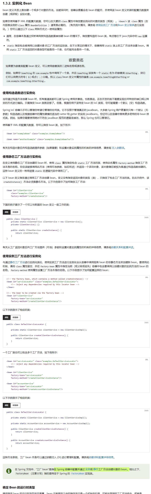

# BeanFactory与FactoryBean的区别

一直都说

BeanFactory是在 Spring 容器中配置并通过实例或静态工厂方法创建对象的 bean。

FactoryBean是管理Bean的仓库。

> 可以通过FactoryBean获取它已经管理好的dean

一直不太能理解，直到看到官网的这段话才恍然理解到原来就是字面的意思... （哈哈认知不到导致，看字面意思都看不懂）。

下面截图中“使用实例工厂方法进行实例化”  DefaultServiceLocator进入到Spring就是一个BeanFactory啊。

