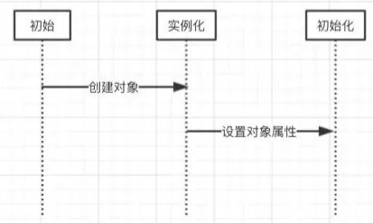

# Spring循环依赖

英文： Circular dependencies

## 引用
引用官网一段话

If you use predominantly constructor injection, it is possible to create an unresolvable circular dependency scenario.

For example: Class A requires an instance of class B through constructor injection, and class B requires an instance of class A through constructor injection. If you configure beans for classes A and B to be injected into each other, the Spring IoC container detects this circular reference at runtime, and throws a BeanCurrentlyInCreationException.

One possible solution is to edit the source code of some classes to be configured by setters rather than constructors. Alternatively, avoid constructor injection and use setter injection only. In other words, although it is not recommended, you can configure circular dependencies with setter injection.

Unlike the typical case (with no circular dependencies), a circular dependency between bean A and bean B forces one of the beans to be injected into the other prior to being fully initialized itself (a classic chicken-and-egg scenario).

> 译文：
> 如果主要使用构造函数注入，可能会创建无法解决的循环依赖的场景。
>
> 例如：A类通过构造函数注入需要B类的实例，B类通过构造函数注入需要A类的实例。如果你为类 A 和 B 配置 bean 以相互注入，Spring IoC 容器会在运行时检测到这个循环引用，并抛出一个 `BeanCurrentlyInCreationException`。
>
> 一种可能的解决方案是编辑某些类的源代码以由设置器而不是构造器配置。或者，避免构造函数注入并仅使用 setter 注入。也就是说，虽然不推荐，但是可以通过setter注入来配置循环依赖。
>
> 与典型情况（没有循环依赖关系）不同，bean A 和 bean B 之间的循环依赖关系强制其中一个 bean 在完全初始化之前注入另一个 bean（典型的先有鸡还是先有蛋的场景）。

## Spring是如何解决循环依赖的？
构造注入无法解决依赖问题，需要使用Setter注入的方式。

## 可能需要的知识

完全熟悉这篇文章可能需要

[1.关于InstantiationAwareBeanPostProcessor介绍看这篇文章，介绍对象创建过程中用到的几个回调方法](./replenish/InstantiationAwareBeanPostProcessor.md)

[2.如果需要详细知道流程，看这篇文章Spring DI 流程](./springdi.md)

## 对象的创建过程
对象的创建分为实例化和初始化两个部分，Java在这不明显



在Spring中，对象的实例化是通过反射实现的，而对象的属性则是在对象实例化之后通过一定的方式设置的。

在Spring中，Bean的实例化是通过BeanFactory.getBean()方法进行的。

如果要获取的对象依赖了另一个对象，那么其首先会创建当前对象，然后通过递归的调用ApplicationContext.getBean()方法来获取所依赖的对象，最后将获取到的对象注入到当前对象中。


## 实例化过程的分解
```java
@Component
public class A {
  private B b;
  public void setB(B b) {
    this.b = b;
  }
}
@Component
public class B {
  private A a;
  public void setA(A a) {
    this.a = a;
  }
}
```
以代码为例
1. 首先Spring尝试通过ApplicationContext.getBean()方法获取A对象的实例，由于Spring容器中还没有A对象实例，因而其会创建一个A对象
2. 然后发现其依赖了B对象，因而会尝试递归的通过ApplicationContext.getBean()方法获取B对象的实例，但是Spring容器中此时也没有B对象的实例，因而其还是会先创建一个B对象的实例。
3. 此时A对象和B对象都已经创建了，并且保存在Spring容器中，只不过A对象的属性b和B对象的属性a都还没有设置进去。
4. Spring创建B对象之后，Spring发现B对象依赖了属性A，因而还是会尝试递归的调用ApplicationContext.getBean()方法获取A对象的实例，可以获取到半成品的Bean（A对象的实例化）
5. 将实例化A对象设置到B对象的属性a中
6. A调用ApplicationContext.getBean()方法获取B对象递归的返回，也就是将B对象的实例返回，将返回实例B设置到A对象的属性b中

::: tip 
这里的A对象其实和前面设置到实例B中的半成品A对象是同一个对象，其引用地址是同一个
:::

## 源码分析
对于Spring处理循环依赖问题的方式，我们这里通过上面的很容易就可以理解

需要注意的一个点，Spring是如何标记开始生成的A对象是一个半成品，并且是如何保存A对象的。

<span style="color:red">这里的标记工作Spring是使用ApplicationContext的属性`Set<String> singletonsCurrentlyInCreation`来保存的，
而半成品的A对象则是通过MapsingletonFactories来保存的</span>

> 单词的学习不能停
> singletons	singleton
>
> CurrentlyIn
>
> Creation

在AbstractBeanFactory.doGetBean()方法中获取对象的方法，详细看：[doGetBean()方法详解](./springdi.md#2整体调用逻辑)

### 关键方法doGetBean()

我们这里关注方法中的2个调用，缩减一下doGetBean()方法里的内容

```java
protected  T doGetBean(final String name, @Nullable final Class requiredType,
    @Nullable final Object[] args, boolean typeCheckOnly) throws BeansException {
    // ...
    // 尝试通过bean名称获取目标bean对象，比如这里的A对象
    // 第一个关注方法：尝试从缓存中获取目标对象，如果没有获取到，则尝试获取半成品的目标对象；
    // 这里面就涉及到从3层缓存中取对象的逻辑
    Object sharedInstance = getSingleton(beanName);
    // ...
    // 我们这里的目标对象都是单例的
    if (mbd.isSingleton()) {
        // 第二个关注方法：尝试创建目标对象
        // 只要上面的getSingleton()方法返回值为空，则会调用这里的getSingleton()方法来创建
        
        sharedInstance = getSingleton(beanName, () -> {
            try {
                // 尝试创建目标对象
                return createBean(beanName, mbd, args);
            } catch (BeansException ex) {
                throw ex;
            }
        });
    }
    // ...
    return (T) bean;
}
```


> 第二个关注方法的第二个参数传的就是一个ObjectFactory类型的对象，这里是使用Java8的lamada表达式书写的回调方法。[使用查看：Java回调函数 + 使用案例](../java//base/callback.md)

### 第一个关注方法

```java
/** singleton objects的缓存对象 : bean名字（bean name） --> Bean的初始化对象（bean instance） */
private final Map<String, Object> singletonObjects = new ConcurrentHashMap<>(256);
/** 早期singleton objects的缓存对象 : bean名字（bean name） --> Bean的初始化对象（bean instance） */
private final Map<String, Object> earlySingletonObjects = new HashMap<>(16);
/** singleton factories的缓存 : bean名字（bean name） --> 对象工厂（ObjectFactory） */
private final Map<String, ObjectFactory<?>> singletonFactories = new HashMap<>(16);
@Override
@Nullable
public Object getSingleton(String beanName) {
    // 上面示例第1步调用
    return getSingleton(beanName, true);
}

/**
 * Return the (raw) singleton object registered under the given name.
 * <p>Checks already instantiated singletons and also allows for an early
 * reference to a currently created singleton (resolving a circular reference).
 * @param beanName the name of the bean to look for
 * @param allowEarlyReference whether early references should be created or not
 * @return the registered singleton object, or {@code null} if none found
 */
@Nullable
protected Object getSingleton(String beanName, boolean allowEarlyReference) {
    // 从缓存中取beanName对象
    Object singletonObject = this.singletonObjects.get(beanName);
    // 没有去到并且对象正在创建
    // 上面示例第1步过程。这2个条件都不成立，本方法返回null
    // 如果没有取到 & 这个Bean正在创建（singletonsCurrentlyInCreation这个Set<String>缓存里包含这个beanName，就是正在创建）
    if (singletonObject == null && isSingletonCurrentlyInCreation(beanName)) {
        synchronized (this.singletonObjects) {
            // 就从早期单例对象集合里尝试取这个对象
            singletonObject = this.earlySingletonObjects.get(beanName);
            // 没取到 & 要求允许创建早期引用（allowEarlyReference=true）
            if (singletonObject == null && allowEarlyReference) {
                // 尝试从单例工厂的缓存中取到创建对象的工厂对象
                ObjectFactory<?> singletonFactory = this.singletonFactories.get(beanName);
                // 取到
                if (singletonFactory != null) {
                    // 创建目标对象
                    singletonObject = singletonFactory.getObject();
                    // 把目标对象放到早期单例对象集合中 ===> 这里找到第二层缓存put时机 <===
                    this.earlySingletonObjects.put(beanName, singletonObject);
                    // 从单例工厂的缓存集合中移除
                    this.singletonFactories.remove(beanName);
                }
            }
        }
    }
    return singletonObject;
}

```

### 第二个关注方法

```java
// Create bean instance.在 AbstractBeanFactory 类里
if (mbd.isSingleton()) {
    // 在这个方法里，实例化之前会标记为目前正在创建和创建对象和向一级缓存put数据
    sharedInstance = getSingleton(beanName, () -> {
        try {
            // 看下面调用详情
            return createBean(beanName, mbd, args);
        }
        catch (BeansException ex) {
            // 从单例缓存中显式删除实例：它可能已被创建过程急切地放在那里，以允许循环引用解析。
            // 还要删除任何接收到对 bean 的临时引用的 bean。
            destroySingleton(beanName);
            throw ex;
        }
    });
    bean = getObjectForBeanInstance(sharedInstance, name, beanName, mbd);
}

```

DefaultSingletonBeanRegistry 类里上面getSingleton()方法

```java
public Object getSingleton(String beanName, ObjectFactory<?> singletonFactory) {
    Assert.notNull(beanName, "Bean name must not be null");
    synchronized (this.singletonObjects) {
        Object singletonObject = this.singletonObjects.get(beanName);
        if (singletonObject == null) {
            // ...
            // 标记为目前正在创建,==> 给singletonsCurrentlyInCreation.add(beanName) <==
            beforeSingletonCreation(beanName);
            // ...
            try {
                // 执行回调
                singletonObject = singletonFactory.getObject();
                newSingleton = true;
            }
            // ...
            if (newSingleton) {
                //对象实例化和初始化都完成 ===> 给第一层缓存赋值 <===
                addSingleton(beanName, singletonObject);
            }
        }
        return singletonObject;
    }
}
```

AbstractAutowireCapableBeanFactory 类里


```java

// ----------------------------------- AbstractAutowireCapableBeanFactory 类里
// Capable 有能力的
@Override
protected Object createBean(String beanName, RootBeanDefinition mbd, @Nullable Object[] args)
    throws BeanCreationException {
	//...
    try {
        // 重点看这里
        Object beanInstance = doCreateBean(beanName, mbdToUse, args);
        if (logger.isDebugEnabled()) {
            logger.debug("Finished creating instance of bean '" + beanName + "'");
        }
        return beanInstance;
    }
    // ...
}

protected Object doCreateBean(final String beanName, final RootBeanDefinition mbd, final @Nullable Object[] args)
    throws BeanCreationException {

    // Instantiate the bean.
    BeanWrapper instanceWrapper = null;
    // 是否是单例的
    if (mbd.isSingleton()) {
        // 从工厂Bean初始化缓存中取出并移除
        instanceWrapper = this.factoryBeanInstanceCache.remove(beanName);
    }
    if (instanceWrapper == null) {
        // 在缓存中没有找到或不是单例的就实例化Bean，看下面详情
        instanceWrapper = createBeanInstance(beanName, mbd, args);
    }
    final Object bean = instanceWrapper.getWrappedInstance();
    Class<?> beanType = instanceWrapper.getWrappedClass();
    if (beanType != NullBean.class) {
        mbd.resolvedTargetType = beanType;
    }

    // Allow post-processors to modify the merged bean definition.
    synchronized (mbd.postProcessingLock) {
        if (!mbd.postProcessed) {
            try {
                applyMergedBeanDefinitionPostProcessors(mbd, beanType, beanName);
            }
            catch (Throwable ex) {
                throw new BeanCreationException(mbd.getResourceDescription(), beanName,
                                                "Post-processing of merged bean definition failed", ex);
            }
            mbd.postProcessed = true;
        }
    }

    // Eagerly cache singletons to be able to resolve circular references
    // even when triggered by lifecycle interfaces like BeanFactoryAware.
    boolean earlySingletonExposure = (mbd.isSingleton() && this.allowCircularReferences &&
                                      isSingletonCurrentlyInCreation(beanName));
    if (earlySingletonExposure) {
        if (logger.isDebugEnabled()) {
            logger.debug("Eagerly caching bean '" + beanName +
                         "' to allow for resolving potential circular references");
        }
        // 添加工厂方法到singletonFactories缓存集合  ===> 这里找到第三层缓存put时机 <===
        addSingletonFactory(beanName, () -> getEarlyBeanReference(beanName, mbd, bean));
    }

    // Initialize the bean instance.
    Object exposedObject = bean;
    try {
        // 这里处理为实例的属性赋值，会把所有的InstantiationAwareBeanPostProcessor都触发，肯定包括AutowiredAnnotationBeanPostProcessor啦
        // 解决循环依赖的递归调用就在这里其中的一步
        // 递归调用：descriptor.resolveCandidate(autowiredBeanName, type, this);
        populateBean(beanName, mbd, instanceWrapper);
        // 实例化
        exposedObject = initializeBean(beanName, exposedObject, mbd);
    }
    catch (Throwable ex) {
        if (ex instanceof BeanCreationException && beanName.equals(((BeanCreationException) ex).getBeanName())) {
            throw (BeanCreationException) ex;
        }
        else {
            throw new BeanCreationException(
                mbd.getResourceDescription(), beanName, "Initialization of bean failed", ex);
        }
    }
	// ...

    return exposedObject;
}

```
