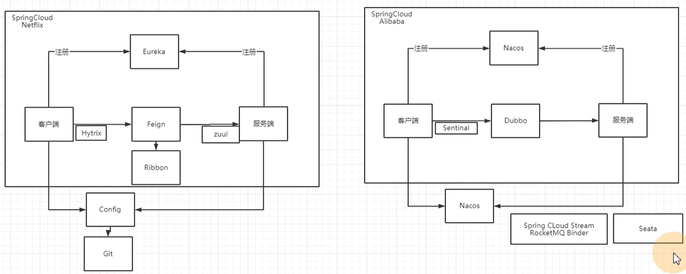

# 概述

## SpringCloud Netflix与SpringCloud Alibaba

## 分布式事务如何处理？怎么保证事务的一致性？
### 什么是分布式事务
就是要将不同节点上的事务操作，提供操作原子性保证，同时成功或同时失败。

分布式第一个要点：要在原本没有直接关联的事务之间建立联系

1. HTTP连接：最大努力通知，要加事后补偿。最终一致性
2. MQ，事务消息机制
3. Redis
4. Seata：是通过TC来在多个事务之间建立联系

Seata

两阶段：AT、XA 就在于要锁资源

三阶段：TCC 在两阶段基础上增加一个准备阶段，在准备阶段是不锁资源的

SAGA模式：类似于熔断。业务自己实现正向操作和补偿操作的逻辑