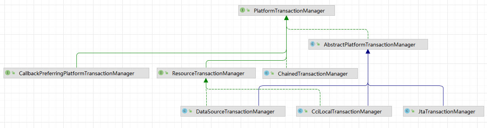

# Spring 事务管理

## Spring事务管理和数据库事务的关系
通过对Spring事务操作来达到Java代码不同逻辑的使用数据库事务。

Java变成语言连接和使用数据库是通过JDBC(一个标准Java API)

## 数据库事务
一组操作，要么都执行，要么都不执行。

[详情查看](../mysql/transaction.md)

## 事务的特性(ACID)
### 原子性
一个事务中的所有操作，或者全部完成、或者全部不完成，不会结束在中间某个环节。事务在执行过程中发生错误，会被回滚到事务开始的状态。

事务不可分割、不可约减

### 一致性
事务开始之前和结束以后，数据库完整性没有配破坏

### 隔离性
数据库允许并发执行事务同时对其数据进行读写和修改的能力，隔离性可以防止多个事务并发执行时由于交叉执行而导致数据不一致。

### 持久性
事务处理结束后，对数据的修改就是永久的

## Spring支持两种方式的事务管理

### 编程式事务管理

通过 TransactionTemplate或者TransactionManager手动管理事务，实际应用中很少使用，但是对于理解 Spring 事务管理原理有帮助。
使用TransactionTemplate 进行编程式事务管理的示例代码如下：

```java
@Autowired
private TransactionTemplate transactionTemplate;
public void testTransaction() {

        transactionTemplate.execute(new TransactionCallbackWithoutResult() {
            @Override
            protected void doInTransactionWithoutResult(TransactionStatus transactionStatus) {

                try {

                    // ....  业务代码
                } catch (Exception e){
                    //回滚
                    transactionStatus.setRollbackOnly();
                }

            }
        });
}

```

使用 TransactionManager 进行编程式事务管理的示例代码如下：
```java
@Autowired
private PlatformTransactionManager transactionManager;

public void testTransaction() {
    TransactionStatus status = transactionManager.getTransaction(new DefaultTransactionDefinition());
    try {
        // ....  业务代码
        transactionManager.commit(status);
    } catch (Exception e) {
        transactionManager.rollback(status);
    }
}

```

### 声明式事务管理
推荐使用（代码侵入性最小），实际是通过 AOP 实现（基于@Transactional 的全注解方式使用最多）。

使用 @Transactional注解进行事务管理的示例代码如下：
```java
@Transactional(propagation=propagation.PROPAGATION_REQUIRED)
public void aMethod {
    //do something
    B b = new B();
    C c = new C();
    b.bMethod();
    c.cMethod();
}

```
## Spring 事务管理接口介绍
Spring 框架中，事务管理相关最重要的 3 个接口如下：
* PlatformTransactionManager： （平台）事务管理器，Spring 事务策略的核心。
* TransactionDefinition： 事务定义信息(事务隔离级别、传播行为、超时、只读、回滚规则)。
* TransactionStatus： 事务运行状态。

可以把 PlatformTransactionManager 接口可以被看作是事务上层的管理者

TransactionDefinition 和 TransactionStatus 这两个接口可以看作是事务的描述。

PlatformTransactionManager 会根据 TransactionDefinition 的定义比如事务超时时间、隔离级别、传播行为等来进行事务管理，
而 TransactionStatus 接口则提供了一些方法来获取事务相应的状态比如是否新事务、是否可以回滚等等。

### PlatformTransactionManager
Spring 并不直接管理事务，而是提供了多种事务管理器 。

Spring 事务管理器的接口是： PlatformTransactionManager 。

通过这个接口，Spring 为各个平台如 JDBC(DataSourceTransactionManager)、Hibernate(HibernateTransactionManager)、
JPA(JpaTransactionManager)等都提供了对应的事务管理器，但是具体的实现就是各个平台自己的事情了。



PlatformTransactionManager接口中定义了三个方法：
```java
package org.springframework.transaction;

import org.springframework.lang.Nullable;

public interface PlatformTransactionManager {
    //获得事务
    TransactionStatus getTransaction(@Nullable TransactionDefinition var1) throws TransactionException;
    //提交事务
    void commit(TransactionStatus var1) throws TransactionException;
    //回滚事务
    void rollback(TransactionStatus var1) throws TransactionException;
}
```

### TransactionDefinition
事务管理器接口 PlatformTransactionManager 通过 getTransaction(TransactionDefinition definition) 方法来得到一个事务，
这个方法里面的参数是 TransactionDefinition 类 ，这个类就定义了一些基本的事务属性（事务属性可以理解成事务的一些基本配置，描述了事务策略如何应用到方法上。）。

接口中定义了 5 个方法以及一些表示事务属性的常量比如隔离级别、传播行为等等


事务属性包含了 5 个方面：
* 隔离级别
* 传播行为
* 回滚规则
* 是否只读
* 事务超时


### TransactionStatus
TransactionStatus接口用来记录事务的状态 该接口定义了一组方法,用来获取或判断事务的相应状态信息

PlatformTransactionManager.getTransaction(…)方法返回一个 TransactionStatus 对象。
```java
public interface TransactionStatus{
    boolean isNewTransaction(); // 是否是新的事务
    boolean hasSavepoint(); // 是否有恢复点
    void setRollbackOnly();  // 设置为只回滚
    boolean isRollbackOnly(); // 是否为只回滚
    boolean isCompleted; // 是否已完成
}
```


## TransactionDefinition中属性
际业务开发中，大家一般都是使用 @Transactional 注解来开启事务，很多人并不清楚这个参数里面的参数是什么意思，有什么用
### 事务传播行为
事务传播行为是为了解决业务层方法之间互相调用的事务问题。

当事务方法被另一个事务方法调用时，必须指定事务应该如何传播。

举个例子：我们在 A 类的aMethod（）方法中调用了 B 类的 bMethod() 方法。这个时候就涉及到业务层方法之间互相调用的事务问题。
如果我们的 bMethod()如果发生异常需要回滚，如何配置事务传播行为才能让 aMethod()也跟着回滚呢？这个时候就需要事务传播行为的知识
```java
Class A {
    @Transactional(propagation=propagation.xxx)
    public void aMethod {
        //do something
        B b = new B();
        b.bMethod();
    }
}

Class B {
    @Transactional(propagation=propagation.xxx)
    public void bMethod {
       //do something
    }
}
```

在TransactionDefinition定义中包括了如下几个表示传播行为的常量。
```java
public interface TransactionDefinition {
    int PROPAGATION_REQUIRED = 0;
    int PROPAGATION_SUPPORTS = 1;
    int PROPAGATION_MANDATORY = 2;
    int PROPAGATION_REQUIRES_NEW = 3;
    int PROPAGATION_NOT_SUPPORTED = 4;
    int PROPAGATION_NEVER = 5;
    int PROPAGATION_NESTED = 6;
    ......
}
```
不过为了方便使用，Spring 会相应地定义了一个枚举类：Propagation
```java
package org.springframework.transaction.annotation;

import org.springframework.transaction.TransactionDefinition;

public enum Propagation {

    REQUIRED(TransactionDefinition.PROPAGATION_REQUIRED),

    SUPPORTS(TransactionDefinition.PROPAGATION_SUPPORTS),

    MANDATORY(TransactionDefinition.PROPAGATION_MANDATORY),

    REQUIRES_NEW(TransactionDefinition.PROPAGATION_REQUIRES_NEW),

    NOT_SUPPORTED(TransactionDefinition.PROPAGATION_NOT_SUPPORTED),

    NEVER(TransactionDefinition.PROPAGATION_NEVER),

    NESTED(TransactionDefinition.PROPAGATION_NESTED);

    private final int value;

    Propagation(int value) {
        this.value = value;
    }

    public int value() {
        return this.value;
    }

}
```

#### 一览
|类型|读法|解释|
|--|--|--|
|[REQUIRED](#required)|required(必须的)：|注解默认使用，使用的最多的一个事务传播行为。如果当前存在事务，则加入该事务；如果当前没有事务，则创建一个新的事务。|
|SUPPORTS|supports(支持):| 如果当前存在事务，则加入该事务；如果当前没有事务，则以非事务的方式继续运行。|
|[MANDATORY](#mandatory)|mandatory(强制的):|如果当前存在事务，则加入该事务；如果当前没有事务，则抛出异常。用的不多|
|[REQUIRES_NEW](#requires-new)|requires_new|创建一个新的事务，如果当前存在事务，则把当前事务挂起|
|NOT_SUPPORTED|not_supported(不支持)|以非事务方式运行，如果当前存在事务，则把当前事务挂起|
|NEVER|never(从不)|以非事务方式运行，如果当前存在事务，则抛出异常|
|[NESTED](#nested)|nested(嵌套的)|如果当前存在事务，就在嵌套一个新事务内执行；如果当前没有事务，就执行与TransactionDefinition.PROPAGATION_REQUIRED类似的操作。|

#### REQUIRED
* 如果外部方法没有开启事务的话，Propagation.REQUIRED修饰的内部方法会新开启自己的事务，且开启的事务相互独立，互不干扰。
* 如果外部方法开启事务并且被Propagation.REQUIRED的话，所有Propagation.REQUIRED修饰的内部方法和外部方法均属于同一事务 ，只要一个方法回滚，整个事务均回滚。

#### REQUIRES_NEW
创建一个新的事务，如果当前存在事务，则把当前事务挂起。也就是说不管外部方法是否开启事务，
Propagation.REQUIRES_NEW修饰的内部方法会新开启自己的事务，且开启的事务相互独立，互不干扰。

举个例子：如果我们上面的bMethod()使用PROPAGATION_REQUIRES_NEW事务传播行为修饰，aMethod还是用PROPAGATION_REQUIRED修饰的话。
如果aMethod()发生异常回滚，bMethod()不会跟着回滚，因为 bMethod()开启了独立的事务。
但是，如果 bMethod()抛出了未被捕获的异常并且这个异常满足事务回滚规则的话,aMethod()同样也会回滚，因为这个异常被 aMethod()的事务管理机制检测到了。
```java
Class A {
    @Transactional(propagation=propagation.PROPAGATION_REQUIRED)
    public void aMethod {
        //do something
        B b = new B();
        b.bMethod();
    }
}

Class B {
    @Transactional(propagation=propagation.REQUIRES_NEW)
    public void bMethod {
       //do something
    }
}
```
#### NESTED

如果当前存在事务，就在嵌套事务内执行；如果当前没有事务，就执行与TransactionDefinition.PROPAGATION_REQUIRED类似的操作。也就是说：

* 在外部方法开启事务的情况下,在内部开启一个新的事务，作为嵌套事务存在。
* 如果外部方法无事务，则单独开启一个事务，与 PROPAGATION_REQUIRED 类似。

这里还是简单举个例子：如果 bMethod() 回滚的话，aMethod()也会回滚。
```java
Class A {
    @Transactional(propagation=propagation.PROPAGATION_REQUIRED)
    public void aMethod {
        //do something
        B b = new B();
        b.bMethod();
    }
}

Class B {
    @Transactional(propagation=propagation.PROPAGATION_NESTED)
    public void bMethod {
       //do something
    }
}
```

#### MANDATORY
如果当前存在事务，则加入该事务；如果当前没有事务，则抛出异常。（mandatory：强制性）

### 事务隔离级别
TransactionDefinition 接口中定义了五个表示隔离级别的常量
```java
public interface TransactionDefinition {
    ......
    // 默认：使用后端数据库默认的隔离级别。
    int ISOLATION_DEFAULT = -1;
    // 读未提交
    int ISOLATION_READ_UNCOMMITTED = 1;
    // 读已提交
    int ISOLATION_READ_COMMITTED = 2;
    // 可重复读
    int ISOLATION_REPEATABLE_READ = 4;
    // 可串行化
    int ISOLATION_SERIALIZABLE = 8;
    ......
}
```
#### 默认
使用后端数据库默认的隔离级别。
#### 读未提交
最低的隔离级别，允许读取尚未提交的数据变更，可能会导致脏读、幻读或不可重复读。
#### 读已提交
允许读取并发事务已经提交的数据，可以阻止脏读，但是幻读或不可重复读仍有可能发生。
#### 可重复读
对同一字段的多次读取结果都是一致的，除非数据是被本身事务自己所修改，可以阻止脏读和不可重复读，但幻读仍有可能发生。
> MySQL 默认采用的 REPEATABLE_READ 隔离级别 Oracle 默认采用的 READ_COMMITTED 隔离级别
> MySQL InnoDB 的 REPEATABLE-READ（可重读）并不保证避免幻读，需要应用使用加锁读来保证。而这个加锁读使用到的机制就是 Next-Key Locks。
#### 可串行化
最高的隔离级别，完全服从 ACID 的隔离级别。所有的事务依次逐个执行，这样事务之间就完全不可能产生干扰，也就是说，该级别可以防止脏读、不可重复读以及幻读。

### 事务超时属性

所谓事务超时，就是指一个事务所允许执行的最长时间，如果超过该时间限制但事务还没有完成，则自动回滚事务。
在 TransactionDefinition 中以 int 的值来表示超时时间，其单位是秒，默认值为-1。

### 事务只读属性
```java
package org.springframework.transaction;

import org.springframework.lang.Nullable;

public interface TransactionDefinition {
    ......
    // 返回是否为只读事务，默认值为 false
    boolean isReadOnly();

}
```
对于只有读取数据查询的事务，可以指定事务类型为 readonly，即只读事务。只读事务不涉及数据的修改，数据库会提供一些优化手段，适合用在有多条数据库查询操作的方法中。

为什么我一个数据查询操作还要启用事务支持呢？
>MySQL 默认对每一个新建立的连接都启用了autocommit模式。在该模式下，每一个发送到 MySQL 服务器的sql语句都会在一个单独的事务中进行处理，
>执行结束后会自动提交事务，并开启一个新的事务。

如果你给方法加上了Transactional注解的话，这个方法执行的所有sql会被放在一个事务中。如果声明了只读事务的话，数据库就会去优化它的执行，并不会带来其他的什么收益。

## 事务回滚规则
这些规则定义了哪些异常会导致事务回滚而哪些不会。默认情况下，事务只有遇到运行期异常（RuntimeException 的子类）时才会回滚，
Error 也会导致事务回滚，但是，在遇到检查型（Checked）异常时不会回滚。

想要回滚你定义的特定的异常类型的话，可以这样：
```java
@Transactional(rollbackFor= MyException.class)
```

## @Transactional 注解使用详解

### @Transactional 的作用范围
1. 方法 ：推荐将注解使用于方法上，不过需要注意的是：该注解只能应用到 public 方法上，否则不生效。
2. 类 ：如果这个注解使用在类上的话，表明该注解对该类中所有的 public 方法都生效。
3. 接口 ：不推荐在接口上使用。

### @Transactional 的常用配置参数
|属性名|说明|
|--|--|
|propagation|事务的传播行为，默认值为 REQUIRED，可选的值在上面介绍过|
|isolation|事务的隔离级别，默认值采用 DEFAULT，可选的值在上面介绍过|
|timeout|事务的超时时间，默认值为-1（不会超时）。如果超过该时间限制但事务还没有完成，则自动回滚事务。|
|readOnly|指定事务是否为只读事务，默认值为 false。|
|rollbackFor|用于指定能够触发事务回滚的异常类型，并且可以指定多个异常类型。|

## @Transactional 事务注解原理


> 文章摘自：https://juejin.cn/post/6844903608224333838
> 
> 作者：JavaGuide