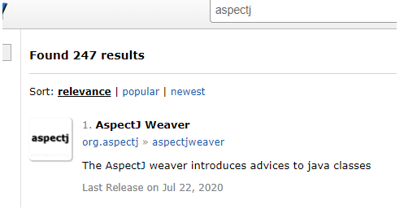
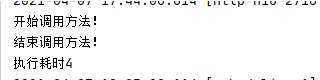

# spring AOP

## 一、AOP概念及使用

### 1.定义

切面（Aspect）：跨多个类的关注点的模块化。在 Spring AOP 中，方面是通过使用常规类（基于模式的方法）或使用 `@Aspect`注解注释的常规类（@AspectJ样式）来实现的。（切面是通知和切点的结合）

连接点（Join point）：表示应用执行过程中能够插入切面的一个点，这个点可以是方法的调用、异常的抛出。在 Spring AOP 中，一个连接点总是代表一个方法调用执行。

通知（Advice）：AOP 框架中的增强处理。通知描述了切面何时执行以及如何执行增强处理。

切点（Pointcut）：可以插入增强处理的连接点。

引入（Introduction）：引入允许我们向现有的类添加新的方法或者属性。

织入（Weaving）：将增强处理添加到目标对象中，并创建一个被增强的对象，这个过程就是织入。

目标对象（Target object）：一个或多个方面通知的对象。也称“advised object”。由于 Spring AOP 是使用运行时代理实现的，因此该对象始终是代理对象。

AOP代理（AOP proxy）：由 AOP 框架创建的对象，用于实现方面协定（建议方法执行等）。在 Spring Framework 中，AOP 代理是 JDK 动态代理或 CGLIB 代理。

### 2.Spring AOP包含以下类型的advice

* 之前通知（Before advice）：advice在连接点之前运行但不能阻止执行流继续到连接点的通知（除非它抛出异常）。
* 返回后通知（After returning advice）：在连接点正常完成后运行的advice（例如，如果方法返回而没有引发异常）。
* 抛出后通知（After throwing advice）：如果方法因抛出异常而退出，则运行advice。
* 之后（最终）通知（After (finally) advice）：无论连接点以何种方式退出（正常或异常返回），都将运行advice。
* 环绕通知（Around advice）：围绕连接点的advice，例如方法调用。这是最有力的advice。环绕通知可以在方法调用之前和之后执行自定义行为。它还负责选择是继续到连接点还是通过返回自己的返回值或抛出异常来缩短advice的方法执行。

形象的表述：

```java
try{
    try{
        //@Before
        method.invoke(..);
    }finally{
        //@After 不论是否异常都会执行
    }
    //@AfterReturning
}catch(){
    //@AfterThrowing
}
```


环绕通知是最一般的建议。由于 Spring AOP 与 AspectJ 一样，提供了全方位的通知类型，因此我们建议您使用可以实现所需行为的最不强大的通知类型。

所有建议参数都是静态类型的，因此您可以使用适当类型的建议参数（例如，方法执行的返回值的类型）而不是`Object`数组。

切入点匹配的连接点的概念是 AOP 的关键，这将它与仅提供拦截的旧技术区分开来。切入点使建议的目标独立于面向对象的层次结构。例如，您可以将提供声明性事务管理的环绕建议应用到一组跨越多个对象（例如服务层中的所有业务操作）的方法。

### 3.AOP代理使用注解实现

Spring AOP代理使用标准的JDK动态代理。这使得任何接口（或一组接口）都可以被代理。

Spring AOP也可以使用CGLIB代理。这是代理类而不是接口所必需的。默认情况下，如果业务对象未实现接口，则使用 CGLIB。由于对接口而不是类进行编程是一种很好的做法，因此业务类通常实现一个或多个业务接口。在那些（希望很少见）需要advice未在接口上声明的方法或需要将代理对象作为具体类型传递给方法的情况下，可以强制使用CGLIB。

[动态代理看这个篇文章了解](../java/base/proxy.md)

#### 3.1启用@AspectJ支持

要在Spring配置需要启用配置基于@AspectJ切面的Spring AOP和Spring支持使用@AspectJ切面。可以通过XML或Java样式配置启用@AspectJ支持。无论哪种情况，您都需要确保AspectJ的`aspectjweaver.jar`库位于应用程序的类路径（版本1.8或更高版本）上。

我是SpringBoot项目

先使用Maven添加包支持，去这个网站找：https://mvnrepository.com/



找个用的人多的

```xml
<!-- https://mvnrepository.com/artifact/org.aspectj/aspectjweaver -->
<dependency>
    <groupId>org.aspectj</groupId>
    <artifactId>aspectjweaver</artifactId>
    <version>1.9.6</version>
</dependency>
```

##### 我这里通过Java配置启用@AspectJ支持

```java
package com.wenwen.blog.config;

import org.springframework.context.annotation.Configuration;
import org.springframework.context.annotation.EnableAspectJAutoProxy;

/**
 * @author WangWenLei
 * @DATE: 2021/4/7
 **/
@Configuration
@EnableAspectJAutoProxy
public class AopConfig {
}
```

也可以通过XML配置启用@AspectJ支持，我这里不是这种方式

```xml
<aop:aspectj-autoproxy/>
```

#### 3.2声明切面

```java
/**
 * 声明一个切面：统计每个方法执行的时间
 * @author WangWenLei
 * @DATE: 2021/4/7
 **/
@Aspect
@Component
public class PerformSpendTimeAspect {
 
}
```

#### 3.3声明切点

常见的切入点：

1. 任何公共方法的执行：  `execution(public * *(..))` 
2. 名称以“set”开头的任何方法的执行： `execution(* set*(..))` 
3. `AccountService`接口定义的任何方法的执行： `execution(* com.xyz.service.AccountService.*(..))` 
4. 服务包中定义的任何方法的执行： ` execution(* com.xyz.service.*.*(..))` 
5. 服务包或子包中定义的任何方法的执行： ` execution(* com.xyz.service..*.*(..))` 
6. 服务包中的任何连接点（仅在Spring AOP中执行方法）： ` within(com.xyz.service.*) ` 
7. 服务包或子包中的任何连接点（仅在Spring AOP中执行方法）： ` within(com.xyz.service..*)` 
8. 代理实现`AccountService`接口的任何连接点（仅在Spring AOP中是方法执行） ： ` this(com.xyz.service.AccountService)` 'this'通常以绑定形式使用

```java
package com.wenwen.blog.util.aop;

import org.aspectj.lang.ProceedingJoinPoint;
import org.aspectj.lang.annotation.After;
import org.aspectj.lang.annotation.Around;
import org.aspectj.lang.annotation.Aspect;
import org.aspectj.lang.annotation.Before;
import org.springframework.stereotype.Component;

/**
 * 声明一个切面：统计每个方法执行的时间
 * @author WangWenLei
 * @DATE: 2021/4/7
 **/
@Aspect
@Component
public class PerformSpendTimeAspect {
    @Before("execution(* com.wenwen.blog.controller..*.*(..))")
    public void startMethod(){
        System.out.println("开始调用方法！");
    }
    @After("execution(* com.wenwen.blog.controller..*.*(..))")
    public void endMethod(){
        System.out.println("结束调用方法！");
    }
    /**
     * 切面表达式：
     * execution 代表所要执行的表达式主体
     * 第一处 * 代表方法返回类型 *代表所有类型
     * 第二处 包名代表aop监控的类所在的包
     * 第三处 .. 代表该包以及其子包下的所有类方法
     * 第四处 * 代表类名，*代表所有类
     * 第五处 *(..) *代表类中的方法名，(..)表示方法中的任何参数
     *
     * @param joinPoint
     */
    @Around("execution(* com.wenwen.blog.controller..*.*(..))")
    public void performMethod(ProceedingJoinPoint joinPoint) throws Throwable {
        final long start = System.currentTimeMillis();
        // 执行目标 service
        Object result = joinPoint.proceed();
        final long end = System.currentTimeMillis();
        System.out.println("执行耗时" + (end - start));
    }

}
```

*execution* *代表所要执行的表达式主体:*

- *第一处* *** *代表方法返回类型* ****代表所有类型*
- *第二处 包名代表**aop**监控的类所在的包*
- *第三处* *..* *代表该包以及其子包下的所有类方法*
- *第四处* *** *代表类名，*****代表所有类*
- *第五处* **(..) ***代表类中的方法名，**(..)**表示方法中的任何参数*


*运行展示：*




## 二、Spring AOP实现原理

上文我们已经建立了一个切面`PerformSpendTimeAspect`

> Spring没有自己定义切面相关的注解，而是使用来自`org.aspectj`这个Jar包里面的注解。但没用aspectj的技术解析。
>
> aspectj还有很多注解，但Spring支持的是：`@Aspect、@Before、@After、@AfterReturning、@AfterThrowing、@Around` 其余的注解Spring都是不予解析（由AspectJ内部技术去解析）