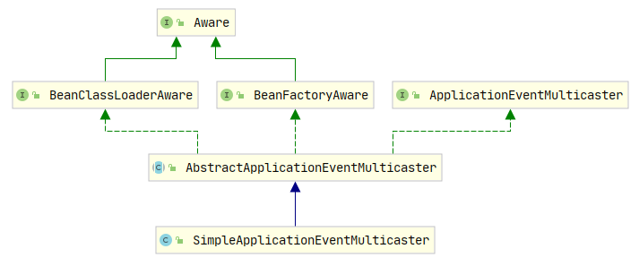
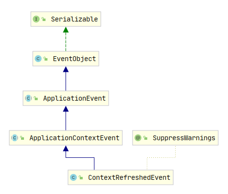
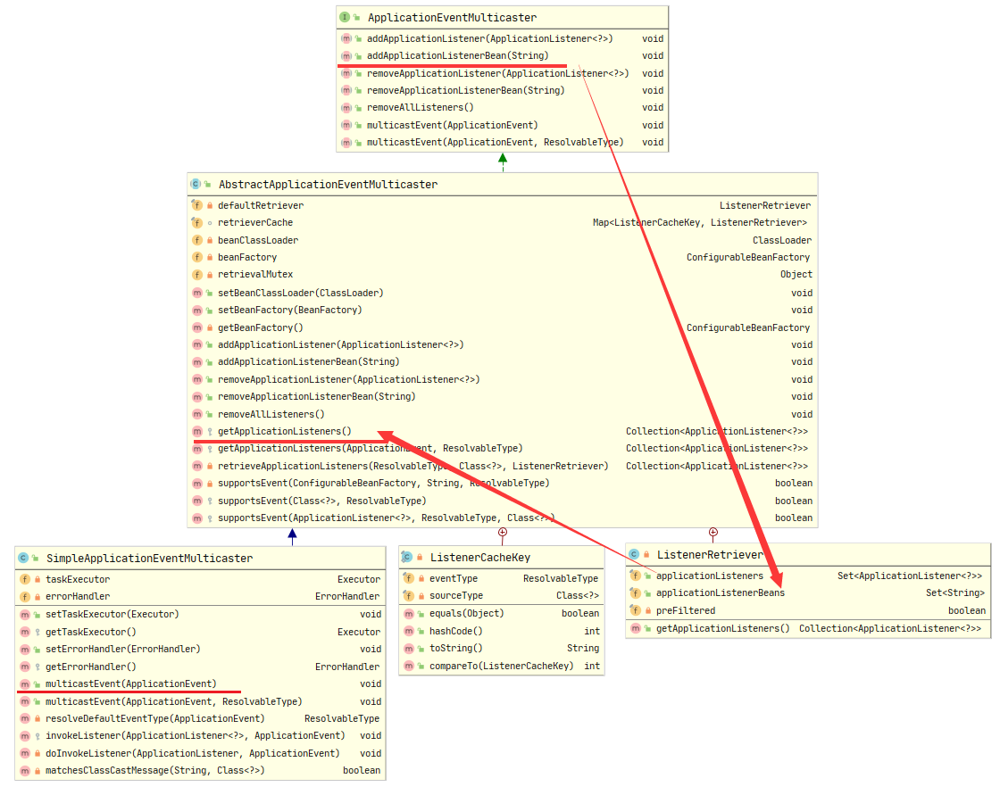
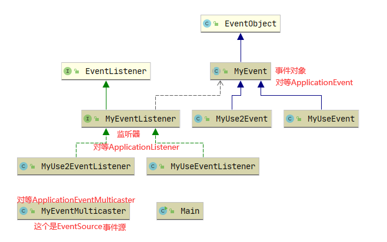

# Spring 事件驱动机制

## 1.理解JDK1.1提供的发布订阅模式（EventListener和EventObject）
在接触Spring时间驱动机制之前先来看下JDK1.1提供的发布订阅模式（EventListener和EventObject）的使用，
来了解发布订阅模式。
时间机制一般包含三个部分：EventObject，EventListener和Source
`EventObject`：事件状态对象的基类，派生所有事件状态对象的根类。所有事件都是通过对对象“源”的引用来构建的，“源”在逻辑上被认为是所讨论事件最初发生在其上的对象
`EventListener`：所有事件侦听器接口都必须扩展的标记接口，实现了它表示标记它为一个监听器。
`Source`：一个普通的POJO对象类。事件最初发生的地方，他里面必须含有监听它的监听器们。


Spring提供了`ApplicationEventPublisher`接口作为事件发布者(`ApplicationContext`接口继承了该接口，担当着事件发布者的角色)。

Spring提供了`ApplicationEventMulticaster`接口，负责管理`ApplicationListener`和真正发布`ApplicationEvent`（ApplicationContext是委托给它完成的）
::: tip 
`ApplicationListener`实现了JDK的`EventListener`，但它抽象出一个onApplicationEvent方法，使用更方便。

`ApplicationEvent`继承自`EventObject`。

`ApplicationEventPublisher`最终都是委托给`ApplicationEventMulticaster`去完成的。当然你也可以自己去实现一个`ApplicationEventMulticaster`
:::

## 2.看下Spring IOC容器refresh()如何使用它
1. 第八步：initApplicationEventMulticaster()

2. 第十步：registerListeners()

3. 第十二步：inishRefresh()方法里的publishEvent(new ContextRefreshedEvent(this))都是和时间机制相关的方法

### initApplicationEventMulticaster()

在springboot的refresh()方法中调用`initApplicationEventMulticaster()`。
```java
public static final String APPLICATION_EVENT_MULTICASTER_BEAN_NAME = "applicationEventMulticaster";
/**
    * Initialize the ApplicationEventMulticaster.
    * Uses SimpleApplicationEventMulticaster if none defined in the context.
    * @see org.springframework.context.event.SimpleApplicationEventMulticaster
    */
protected void initApplicationEventMulticaster() {
    ConfigurableListableBeanFactory beanFactory = getBeanFactory();
    // 如果有包含applicationEventMulticaster的Bean
    if (beanFactory.containsLocalBean(APPLICATION_EVENT_MULTICASTER_BEAN_NAME)) {
        // 就取出用户自定义的事件管理
        this.applicationEventMulticaster =
                beanFactory.getBean(APPLICATION_EVENT_MULTICASTER_BEAN_NAME, ApplicationEventMulticaster.class);
        if (logger.isTraceEnabled()) {
            logger.trace("Using ApplicationEventMulticaster [" + this.applicationEventMulticaster + "]");
        }
    }
    else {
        // 否则创建默认的简单事件多播管理
        this.applicationEventMulticaster = new SimpleApplicationEventMulticaster(beanFactory);
        beanFactory.registerSingleton(APPLICATION_EVENT_MULTICASTER_BEAN_NAME, this.applicationEventMulticaster);
        if (logger.isTraceEnabled()) {
            logger.trace("No '" + APPLICATION_EVENT_MULTICASTER_BEAN_NAME + "' bean, using " +
                    "[" + this.applicationEventMulticaster.getClass().getSimpleName() + "]");
        }
    }
}
```
如果没有有指定事件多播，那么容器自动注册一个`SimpleApplicationEventMulticaster`。因此若希望手动控制事件的发布，是可以@Autowired进来的。

看下`SimpleApplicationEventMulticaster`的类图

可以看到`SimpleApplicationEventMulticaster`继承`AbstractApplicationEventMulticaster`，
`AbstractApplicationEventMulticaster`实现了`ApplicationEventMulticaster`

### registerListeners()

```java
/**
    * 添加实现 ApplicationListener 作为侦听器的 bean。 
    * 可以添加不是 bean 的，不会影响其他监听器，。
    */
protected void registerListeners() {
    // 首先注册静态指定的监听器
    for (ApplicationListener<?> listener : getApplicationListeners()) {
        // getApplicationEventMulticaster()就是上一节注册的简单事件多播管理
        getApplicationEventMulticaster().addApplicationListener(listener);
    }

    // 不要在这里初始化 FactoryBeans：我们需要让所有常规 bean 保持未初始化状态，以让后处理器应用于它们！

    // getBeanNamesForType()返回与给定对象类型（包括子类）匹配的bean
    // （或FactoryBeans创建的对象）的名称，如果没有则为空数组
    String[] listenerBeanNames = getBeanNamesForType(ApplicationListener.class, true, false);
    for (String listenerBeanName : listenerBeanNames) {
        // 添加一个侦听器 bean 以接收所有事件的通知。
        getApplicationEventMulticaster().addApplicationListenerBean(listenerBeanName);
    }

    // 发布早期应用程序事件，因为我们终于有了一个多播器....
    Set<ApplicationEvent> earlyEventsToProcess = this.earlyApplicationEvents;
    this.earlyApplicationEvents = null;
    if (!CollectionUtils.isEmpty(earlyEventsToProcess)) {
        for (ApplicationEvent earlyEvent : earlyEventsToProcess) {
            // multicastEvent()将给定的应用程序事件多播到适当的侦听器。
            getApplicationEventMulticaster().multicastEvent(earlyEvent);
        }
    }
}
```
哈哈对于上面开发者的有趣对话 `发布早期应用程序事件，因为我们终于有了一个多播器....`
是在refresh()第一步里有一个代码
```java
// 方法外的成员变量
private Set<ApplicationEvent> earlyApplicationEvents;
// Allow for the collection of early ApplicationEvents,
// to be published once the multicaster is available...
// 允许收集早期应用程序事件，一旦多播器可用就发布...
this.earlyApplicationEvents = new LinkedHashSet<>();
```

### finishRefresh()
```java
/**
    * 完成此上下文的刷新，调用 LifecycleProcessor 的 onRefresh() 方法并发布ContextRefreshedEvent 
    */
protected void finishRefresh() {
    // 清除上下文级别的资源缓存（例如扫描中的 ASM 元数据）。
    clearResourceCaches();

    // 为此上下文初始化生命周期处理器。
    initLifecycleProcessor();

    // 首先将刷新传播到生命周期处理器。
    getLifecycleProcessor().onRefresh();

    // 发布最终事件。
    publishEvent(new ContextRefreshedEvent(this));

    // 参与 LiveBeansView MBean（如果处于活动状态）
    LiveBeansView.registerApplicationContext(this);
}
```

来看`publishEvent(new ContextRefreshedEvent(this));`这段代码
`ContextRefreshedEvent`的类图

这里实际上使用的是JDK1.1的`EventObject`
在来看`publishEvent()`方法

```java {39}
/**
    * 将给定事件发布给所有侦听器。 
    * 注意：侦听器在 MessageSource 之后被初始化，以便能够在侦听器实现中访问它。
    * 因此，MessageSource 实现不能发布事件。
    * @param event the event to publish (may be application-specific or a
    * standard framework event)
    */
@Override
public void publishEvent(ApplicationEvent event) {
    publishEvent(event, null);
}
    /**
    * 发布给定事件给所有的监听者（listeners）
    * @param event 要发布的事件（可能是ApplicationEvent或要转换为PayloadApplicationEvent的有效负载对象）
    * @param eventType 已解决的事件类型（如果已知）
    * @since 4.2
    */
protected void publishEvent(Object event, @Nullable ResolvableType eventType) {
    Assert.notNull(event, "Event must not be null");

    // Decorate event as an ApplicationEvent if necessary
    // ApplicationEvent 继承了 EventObject
    ApplicationEvent applicationEvent;
    if (event instanceof ApplicationEvent) {
        applicationEvent = (ApplicationEvent) event;
    }
    else {
        applicationEvent = new PayloadApplicationEvent<>(this, event);
        if (eventType == null) {
            eventType = ((PayloadApplicationEvent<?>) applicationEvent).getResolvableType();
        }
    }

    // Multicast right now if possible - or lazily once the multicaster is initialized
    if (this.earlyApplicationEvents != null) {
        this.earlyApplicationEvents.add(applicationEvent);
    }
    else {
        getApplicationEventMulticaster().multicastEvent(applicationEvent, eventType);
    }

    // Publish event via parent context as well...
    if (this.parent != null) {
        if (this.parent instanceof AbstractApplicationContext) {
            ((AbstractApplicationContext) this.parent).publishEvent(event, eventType);
        }
        else {
            this.parent.publishEvent(event);
        }
    }
}
```


```java
@Override
public void multicastEvent(final ApplicationEvent event, @Nullable ResolvableType eventType) {
    ResolvableType type = (eventType != null ? eventType : resolveDefaultEventType(event));
    Executor executor = getTaskExecutor();
    for (ApplicationListener<?> listener : getApplicationListeners(event, type)) {
        if (executor != null) {
            executor.execute(() -> invokeListener(listener, event));
        }
        else {
            invokeListener(listener, event);
        }
    }
}
/**
    * 使用给定事件调用给定侦听器
    * @param listener the ApplicationListener to invoke
    * @param event the current event to propagate
    * @since 4.1
    */
protected void invokeListener(ApplicationListener<?> listener, ApplicationEvent event) {
    ErrorHandler errorHandler = getErrorHandler();
    if (errorHandler != null) {
        try {
            doInvokeListener(listener, event);
        }
        catch (Throwable err) {
            errorHandler.handleError(err);
        }
    }
    else {
        doInvokeListener(listener, event);
    }
}
private void doInvokeListener(ApplicationListener listener, ApplicationEvent event) {
    try {
        listener.onApplicationEvent(event);
    }
    catch (ClassCastException ex) {
        String msg = ex.getMessage();
        if (msg == null || matchesClassCastMessage(msg, event.getClass())) {
            // Possibly a lambda-defined listener which we could not resolve the generic event type for
            // -> let's suppress the exception and just log a debug message.
            Log logger = LogFactory.getLog(getClass());
            if (logger.isTraceEnabled()) {
                logger.trace("Non-matching event type for listener: " + listener, ex);
            }
        }
        else {
            throw ex;
        }
    }
}
```
综上代码，回顾整个流程
注册一个`SimpleApplicationEventMulticaster`，调用SimpleApplicationEventMulticaster的add方法（SimpleApplicationEventMulticaster里面有个List<>用来收集实现ApplicationListener类的数据）。
最后执行multicastEvent()方法处理应用程序事件。这个方法里的doInvokeListener方法会调用`ApplicationListener`接口的onApplicationEvent方法()处理应用程序事件。
onApplicationEvent方法会带一个`ApplicationEvent`(这个类继承了EventObject)


## 3.精简Spring里的逻辑，搞个例子出来学习下原理

先来看下几个类之间的关系

全部代码

```java
/**
 * @author WangWenLei
 * @DATE: 2022/1/27
 **/
public class Main {
    public static void main(String[] args) {
        MyEventMulticaster myEventMulticaster = new MyEventMulticaster();
        myEventMulticaster.addListener(new MyUseEventListener());
        myEventMulticaster.addListener(new MyUse2EventListener());
        myEventMulticaster.multicastEvent(new MyUseEvent(myEventMulticaster));
//        myEventMulticaster.multicastEvent(new MyUse2Event(myEventMulticaster));
    }
}

import java.util.EventListener;

/**
 * 这里对应的 Application
 * 把他标记为监听者
 * @author WangWenLei
 * @DATE: 2022/1/27
 **/
public interface MyEventListener<E extends MyEvent> extends EventListener {
    /**
     * Handle an application event.
     * 事件处理器做具体的事件响应工作
     * @param event the event to respond to
     */
    void onApplicationEvent(E event);
}

/**
 * @author WangWenLei
 * @DATE: 2022/1/27
 **/
public class MyUseEventListener implements MyEventListener<MyUseEvent>{
    @Override
    public void onApplicationEvent(MyUseEvent event) {
        System.out.println("使用类1" + event.getName());
    }
}

/**
 * @author WangWenLei
 * @DATE: 2022/1/27
 **/
public class MyUse2EventListener implements MyEventListener<MyUseEvent>{
    @Override
    public void onApplicationEvent(MyUseEvent event) {
        System.out.println("使用类2" + event.getName());
    }
}

import java.util.EventObject;

/**
     * 相当于 spring 中 ApplicationEvent
 * @author WangWenLei
 * @DATE: 2022/1/27
 **/
public abstract class MyEvent extends EventObject {
    /**
     * Constructs a prototypical Event.
     *
     * @param source The object on which the Event initially occurred.
     * @throws IllegalArgumentException if source is null.
     */
    public MyEvent(Object source) {
        super(source);
    }
}

/**
 * @author WangWenLei
 * @DATE: 2022/1/27
 **/
public class MyUseEvent extends MyEvent{
    private String name = "MyUse1Event";
    /**
     * Constructs a prototypical Event.
     * @param source The object on which the Event initially occurred.
     * @throws IllegalArgumentException if source is null.
     */
    public MyUseEvent(Object source) {
        super(source);
    }

    public String getName() {
        return name;
    }

    public void setName(String name) {
        this.name = name;
    }
}

/**
 * @author WangWenLei
 * @DATE: 2022/1/27
 **/
public class MyUse2Event extends MyEvent{
    private String name = "MyUse2Event";
    /**
     * Constructs a prototypical Event.
     * @param source The object on which the Event initially occurred.
     * @throws IllegalArgumentException if source is null.
     */
    public MyUse2Event(Object source) {
        super(source);
    }

    public String getName() {
        return name;
    }

    public void setName(String name) {
        this.name = name;
    }
}

import java.util.ArrayList;
import java.util.List;

/**
 * 事件收集器专门负责收集所有事件
 * @author WangWenLei
 * @DATE: 2022/1/27
 **/
public class MyEventMulticaster {
    private List<MyEventListener<?>> listeners = new ArrayList<>();

    public void addListener(MyEventListener<?> listener) {
        listeners.add(listener);
    }

    public List<MyEventListener<?>> getListeners() {
        return listeners;
    }

    /**
     * 事件发送器负责将收集器收集到的事件分发到目标对象中
     * @param event 事件
     */
    public void multicastEvent(MyEvent event) {
        for (MyEventListener<?> listener : listeners) {
            event(listener,event);
        }
    }
    @SuppressWarnings({"rawtypes", "unchecked"})
    public void event(MyEventListener listener,MyEvent event){
        listener.onApplicationEvent(event);
    }
}
```


## 4.标准和自定义事件

通过上面的理解与分析得出：`ApplicationContext`中的事件处理是通过`ApplicationEvent`类和`ApplicationListener`接口提供的。

### Spring提供的标准内置事件

| 事件                         | 解释                                                         |
| :--------------------------- | :----------------------------------------------------------- |
| `ContextRefreshedEvent`      | 在初始化或刷新时发布`ApplicationContext`（例如，通过使用接口`refresh()`上的方法`ConfigurableApplicationContext`）。这里，“初始化”意味着所有 bean 都已加载，后处理器 bean 被检测并激活，单例被预先实例化，并且`ApplicationContext`对象已准备好使用。只要上下文没有关闭，就可以多次触发刷新，前提是所选择的`ApplicationContext`实际支持这种“热”刷新。例如，`XmlWebApplicationContext`支持热刷新，但 `GenericApplicationContext`不支持。 |
| `ContextStartedEvent`        | 使用接口上的方法 `ApplicationContext`启动时发布。在这里，“已启动”意味着所有 bean 都接收到一个明确的启动信号。通常，此信号用于在显式停止后重新启动 bean，但它也可用于启动尚未配置为自动启动的组件（例如，尚未在初始化时启动的组件）。`start()``ConfigurableApplicationContext``Lifecycle` |
| `ContextStoppedEvent`        | 使用接口上的方法 `ApplicationContext`停止时发布。在这里，“停止”意味着所有 的 bean 都会收到一个明确的停止信号。可以通过 调用重新启动已停止的上下文。`stop()``ConfigurableApplicationContext``Lifecycle``start()` |
| `ContextClosedEvent`         | 在`ApplicationContext`使用接口`close()`上的方法`ConfigurableApplicationContext`或通过 JVM 关闭挂钩关闭时发布。在这里，“关闭”意味着所有的单例 bean 都将被销毁。一旦上下文关闭，它就到了生命的尽头，无法刷新或重新启动。 |
| `RequestHandledEvent`        | 一个特定于 Web 的事件，告诉所有 bean 一个 HTTP 请求已得到服务。此事件在请求完成后发布。此事件仅适用于使用 Spring 的 Web 应用程序`DispatcherServlet`。 |
| `ServletRequestHandledEvent` | 它的子类`RequestHandledEvent`添加了 Servlet 特定的上下文信息。 |

### 使用一、自己发布自定义事件

[来源Spring官网](https://docs.spring.io/spring-framework/docs/current/reference/html/core.html#beans-factory-scopes-custom)

#### 1.自定义事件

显示扩展Spring `ApplicationEvent`基类：

```java
package learn.note.springlearn.event;
import org.springframework.context.ApplicationEvent;

public class BlockedListEvent extends ApplicationEvent {
    private String address;
    private String content;

    /**
     * 创建一个 {@code BlockedListEvent}.
     *
     * @param source 事件最初发生的对象或与事件相关联的对象（从不为null ）
     * @param address 带一个参数，地址
     * @param content 带一个参数，内容
     */
    public BlockedListEvent(Object source, String address, String content) {
        super(source);
        this.address = address;
        this.content = content;
    }
}
```

#### 2.发布自定义事件

要发布自定义`ApplicationEvent`，在 `ApplicationEventPublisher`对象上调用`publishEvent()`。

通常，通过创建一个实现 `ApplicationEventPublisherAware`并将其注册为 Spring bean 的类来完成。

```java
package learn.note.springlearn.event.v1;
import org.springframework.context.ApplicationEventPublisher;
import org.springframework.context.ApplicationEventPublisherAware;
import java.util.List;

public class EmailService implements ApplicationEventPublisherAware {
    private List<String> blockedList;
    private ApplicationEventPublisher publisher;

    public void setBlockedList(List<String> blockedList) {
        this.blockedList = blockedList;
    }

    @Override
    public void setApplicationEventPublisher(ApplicationEventPublisher publisher) {
        this.publisher = publisher;
    }

    public void sendEmail(String address,String content) {
        if (blockedList.contains(address)) {
            publisher.publishEvent(new BlockedListEvent(this,address,content));
            return;
        }
    }
}
```

在配置时Spring容器检测到`EmailService`实现`ApplicationPublisherAware`会自动调用`setApplicationEventPublisher()`。实际上，传入的参数是Spring容器本身。

#### 3.接收/监听

要接收这个自定义事件，可以创建一个实现`ApplicationLinstener`并将其注册为Spring Bean的类。如示例：

```java
package learn.note.springlearn.event.v1;
import org.springframework.context.ApplicationListener;

public class BlockedListNotifier implements ApplicationListener<BlockedListEvent> {
    private String notificationAddress;

    public void setNotificationAddress(String notificationAddress) {
        this.notificationAddress = notificationAddress;
    }

    @Override
    public void onApplicationEvent(BlockedListEvent event) {

    }
}
```

注意：`ApplicationListener`通常使用自定义事件的类型进行参数化。意味着`onApplicationEvent()`方法可以保持类型安全，避免任何向下转换的需要。

可以根据需要注册任意数量的事件侦听器（默认情况下，事件侦听器会同步接收事件。这意味着该`publishEvent()`方法会阻塞，直到所有侦听器都完成了对事件的处理）

同步和单线程方法的优点：当侦听器接收到事件时，如果事务上下文可用，它会在发布者的事务上下文中运行。

#### 4.注册和配置Bean

对应XML，用于注册和配置上述的每个类的Bean

```xml
<bean id="emailService" class="example.EmailService">
    <property name="blockedList">
        <list>
            <value>known.spammer@example.org</value>
            <value>known.hacker@example.org</value>
            <value>john.doe@example.org</value>
        </list>
    </property>
</bean>

<bean id="blockedListNotifier" class="example.BlockedListNotifier">
    <property name="notificationAddress" value="blockedlist@example.org"/>
</bean>
```

#### 5.使用

当bean `emailService`调用`senEmail()`方法时（如果有任何电子邮件消息应该被阻止），`BlockedListEvent`则会发布一个自定义类型的事件。

Bean `blockedListNotifier`被注册为一个应用监听器并且接收`BlockedListEvent`，就在这时`blockedListNotifier`能通知适当的事件

### 使用二、基于注解的事件监听器

#### 监听

您可以使用`@EventListener`注解在托管 bean 的任何方法上注册事件侦听器 。

```java
public class BlockedListNotifier {

    private String notificationAddress;

    public void setNotificationAddress(String notificationAddress) {
        this.notificationAddress = notificationAddress;
    }

    @EventListener
    public void processBlockedListEvent(BlockedListEvent event) {
        // notify appropriate parties via notificationAddress...
    }
}
```

方法虚参（签名）声明了它所侦听的事件类型。使用了一个灵活的名称并且没有实现特定的侦听器接口。只要实际事件类型在其实现层次结构中解析您的泛型参数，也可以通过泛型来缩小事件类型。

如果您的方法应该监听多个事件，或者如果您想在没有参数的情况下定义它，也可以在注解本身上指定事件类型。

```java
@EventListener({ContextStartedEvent.class, ContextRefreshedEvent.class})
public void handleContextStart() {
    // ...
}
```

如果您需要发布一个事件作为处理另一个事件的结果，您可以更改方法签名以返回应该发布的事件（异步监听器不支持此功能），如以下示例所示：

```java
@EventListener
public ListUpdateEvent handleBlockedListEvent(BlockedListEvent event) {
    // notify appropriate parties via notificationAddress and
    // then publish a ListUpdateEvent...
}
```

该方法为每一个`BlockedListEvent`处理的 `handleBlockedListEvent()`发布一个新的`ListUpdateEvent`。如果您需要发布多个事件，则可以改为返回一个`Collection`或一组事件。

如果您需要在调用另一个侦听器之前调用一个侦听器，则可以将`@Order` 注释添加到方法声明中，如以下示例所示：

```java
@EventListener
@Order(42)
public void processBlockedListEvent(BlockedListEvent event) {
    // notify appropriate parties via notificationAddress...
}
```


#### 异步监听器

如果您希望特定侦听器异步处理事件，则可以重用`@Async`

```java
@EventListener
@Async
public void processBlockedListEvent(BlockedListEvent event) {
    // BlockedListEvent is processed in a separate thread
}
```

使用异步事件时请注意以下限制：

* 如果异步事件侦听器抛出`Exception`，它不会传播给调用者。
* 异步事件侦听器方法不能通过返回值来发布后续事件。如果您需要发布另一个事件作为处理的结果，请注入一个`ApplicationEventPublisher`手动发布事件。
