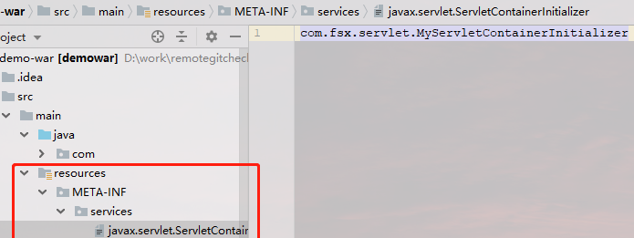
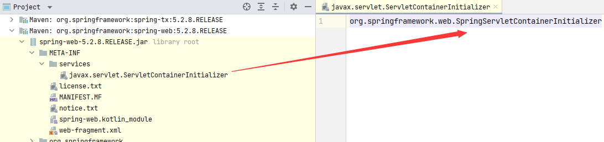
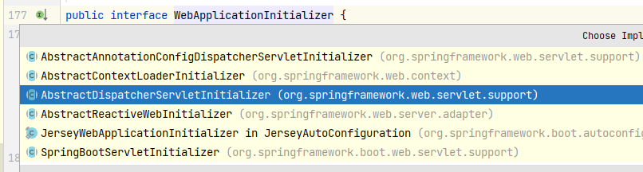
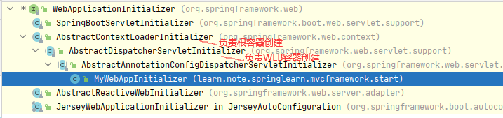
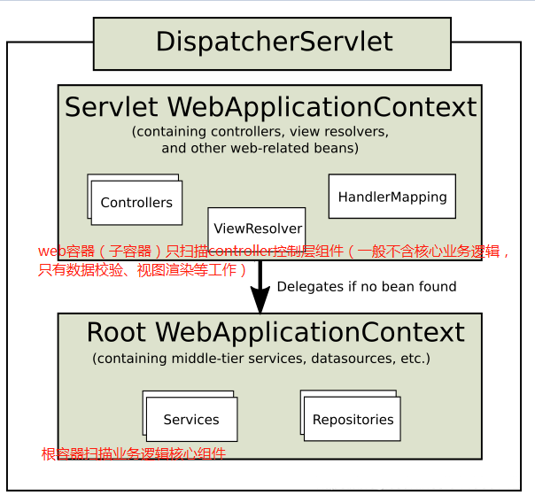
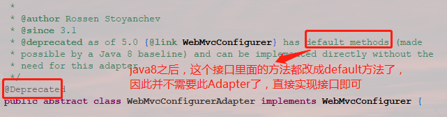
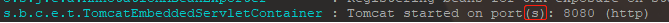
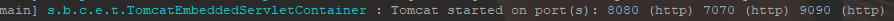

# Spring MVC 注解驱动开发

## 0.前言

Servlet3.0是一次Java EE规范的一次重要升级。支持到可以全部采用注解驱动，大大简化了配置web.xml的麻烦。现在启动一个web容器并不强制依赖于web.xml部署描述符了。

以前我们在使用Spring MVC的时候，`DispatcherServlet`是必须要要在web.xml里配置，现在以全注解驱动整合Spring MVC。

下面逐步看Spring如何整合Spring MVC而不需要web.xml的。

> Spring Boot中集成和使用Spring MVC会方便得多得多，因为它都已经帮我们配置好了，但理解了这篇文章的原理，再去理解Boot，可谓就非常顺畅了~

## 1. ServletContainerInitializer

首先来了解一个概念`ServletContainerInitializer`

Servlet3.0给我们提供的特别特别重要的一个类`ServletContainerInitializer`来整个其它模块组件。

它有如下能力：
Shared libraries（共享库） / runtimes pluggability（运行时插件能力）

Servlet容器启动会扫描，当前应用里面每一个jar包ServletContainerInitializer的实现
coder可以自己提供ServletContainerInitializer的实现类；然后自己书写逻辑。但是，但是，但是要记住，一定要必须绑定在，META-INF/services/javax.servlet.ServletContainerInitializer这个文件里，文件内容为就是ServletContainerInitializer实现类的全类名；
这样web容器在启动的时候，就会执行该接口的实现方法，从而我们就可以书写我们自己的模块初始化的一些逻辑。

举个例子：

```java
//容器启动的时候会将@HandlesTypes指定的这个类型下面的子类（实现类，子接口等）传递过来；
@HandlesTypes(value = {HelloService.class})
public class MyServletContainerInitializer implements ServletContainerInitializer {

    /**
     * 应用启动的时候，会运行onStartup方法；
     * <p>
     * Set<Class<?>> c：感兴趣的类型的所有子类型；
     * ServletContext ctx:代表当前Web应用的ServletContext；一个Web应用一个ServletContext；
     * <p>
     */
    @Override
    public void onStartup(Set<Class<?>> c, ServletContext ctx) throws ServletException {
  		//这里的c会把所有我们感兴趣的类型都拿到
        System.out.println("感兴趣的类型：");
        for (Class<?> claz : c) {
            System.out.println(claz);
        }

		//==========================编码形式注册三大组件============================
        注册组件  ServletRegistration  
        //ServletRegistration.Dynamic servlet = ctx.addServlet("userServlet", new UserServlet());
        配置servlet的映射信息
        //servlet.addMapping("/user");
        //
        注册Listener
        //ctx.addListener(UserListener.class);
        //
        注册Filter  FilterRegistration
        //FilterRegistration.Dynamic filter = ctx.addFilter("userFilter", UserFilter.class);
        配置Filter的映射信息
        //filter.addMappingForUrlPatterns(EnumSet.of(DispatcherType.REQUEST), true, "/*");
    }

}
```

自己的实现，Servlet会找到




启动容器，我们会看到把我们关心的接口子类型（**包含子接口**、抽象类、实现类）都放进来了。但是需要注意：不包含自己


## 2.整合Spring MVC

整合Spring MVC是重中之重。前面已经说过`ServletContainerInitializer`了，相信大家能够想到Spring是怎么做的了吧？

我们可以看下Spring官方文档，链接如下：

https://docs.spring.io/spring/docs/5.1.5.RELEASE/spring-framework-reference/web.html#mvc-servlet


我们看看Spring-web包jar包内：Servlet也会找到



显然的发现，Spring MVC也是通过这种方式和Servlet容器进行整合的。web容器在启动的时候，就会自动去加载`org.springframework.web.SpringServletContainerInitializer`这个类。

源码：

```java
package org.springframework.web;

import java.lang.reflect.Modifier;
import java.util.LinkedList;
import java.util.List;
import java.util.ServiceLoader;
import java.util.Set;

import javax.servlet.ServletContainerInitializer;
import javax.servlet.ServletContext;
import javax.servlet.ServletException;
import javax.servlet.annotation.HandlesTypes;

import org.springframework.core.annotation.AnnotationAwareOrderComparator;
import org.springframework.lang.Nullable;
import org.springframework.util.ReflectionUtils;

@HandlesTypes(WebApplicationInitializer.class)
public class SpringServletContainerInitializer implements ServletContainerInitializer {

	@Override
	public void onStartup(@Nullable Set<Class<?>> webAppInitializerClasses, ServletContext servletContext)
			throws ServletException {

		List<WebApplicationInitializer> initializers = new LinkedList<>();

		if (webAppInitializerClasses != null) {
			for (Class<?> waiClass : webAppInitializerClasses) {
				// Be defensive: Some servlet containers provide us with invalid classes,
				// no matter what @HandlesTypes says...
				if (!waiClass.isInterface() && !Modifier.isAbstract(waiClass.getModifiers()) &&
						WebApplicationInitializer.class.isAssignableFrom(waiClass)) {
					try {
						initializers.add((WebApplicationInitializer)
								ReflectionUtils.accessibleConstructor(waiClass).newInstance());
					}
					catch (Throwable ex) {
						throw new ServletException("Failed to instantiate WebApplicationInitializer class", ex);
					}
				}
			}
		}

		if (initializers.isEmpty()) {
			servletContext.log("No Spring WebApplicationInitializer types detected on classpath");
			return;
		}

		servletContext.log(initializers.size() + " Spring WebApplicationInitializers detected on classpath");
		AnnotationAwareOrderComparator.sort(initializers);
		for (WebApplicationInitializer initializer : initializers) {
			initializer.onStartup(servletContext);
		}
	}

}
```

步骤分析：

1. Spring的应用一启动会加载感兴趣的WebApplicationInitializer接口下的所有组件；

2. 为WebApplicationInitializer组件创建对象（**条件判断组件不是接口，不是抽象类**）放入`List<WebApplicationInitializer> initializers`的列表里

   

   




* AbstractContextLoaderInitializer：创建根容器；createRootApplicationContext()；
* AbstractDispatcherServletInitializer：
  - 创建一个web的ioc容器；createServletApplicationContext();
  - 创建了DispatcherServlet；createDispatcherServlet()；
  - 将创建的DispatcherServlet添加到ServletContext中；
  - -----------抽象方法：getServletMappings();
* AbstractAnnotationConfigDispatcherServletInitializer：**注解方式配置的DispatcherServlet初始化器（本文重点）**
  - 创建根容器：createRootApplicationContext()
  - ------------getRootConfigClasses();传入一个配置类（用户自定义）
  - 创建web的ioc容器： createServletApplicationContext();
  - ------------获取配置类；getServletConfigClasses();


在Spring MVC中Spring容器推荐使用父子容器概念：




从上面分析得知，我们要使用注解驱动的话。只需要我们自己实现`AbstractAnnotationConfigDispatcherServletInitializer`这个抽象类就行了，这样web容器启动的时候就能处理我们实现的这个类的内容。

示例：

```java
// 备注：此处@ControllerAdvice、RestControllerAdvice 这个注解不要忘了，属于Controller层处理全局异常的，应该交给web去扫描
@ComponentScan(value = "com.fsx", excludeFilters = {
        @Filter(type = FilterType.ANNOTATION, classes = {Controller.class, ControllerAdvice.class, RestControllerAdvice.class})
})
@Configuration //最好标注上，若不标注，可能扫描不生效
public class RootConfig {

}

// 此处记得排除掉@Controller和@ControllerAdvice、@RestControllerAdvice
@ComponentScan(value = "com.fsx", useDefaultFilters = false,
        includeFilters = {@Filter(type = FilterType.ANNOTATION, classes = {Controller.class, ControllerAdvice.class, RestControllerAdvice.class})}
)
@Configuration //最好标注上，若不标注，可能扫描不生效
public class AppConfig {

}
```

> @RestControllerAdvice是Spring4.3后提供的注解。@ControllerAdvice是Spring3.2提供的
> 它俩的区别就像@Controller和@RestController的区别。（也就是说`@RestControllerAdvice`可以省略`@ResponseBody`不用写了

> `useDefaultFilters`默认值为`true`，表示默认情况下`@Component`、`@Repository`、`@Service`、`@Controller`都会扫描
> `useDefaultFilters=false`加上`includeFilters`我们就可以只扫描指定的组件了，比如Spring MVC的web子容器只扫描Controller组件
> `excludeFilters`的时候，就不需要去设置`useDefaultFilters=false`，这样子我们直接排除掉即可
>
>  
>
> **特别注意**：`useDefaultFilters`的正确使用，不要造成重复扫描。否则很有可能造成`事务不生效`，并且你还非常不好定位这个错误


然后我们自己来实现`AbstractAnnotationConfigDispatcherServletInitializer`一个初始化实体类：

```java
/**
 * 自己实现 基于注解驱动的ServletInitializer来初始化DispatcherServlet
 */
public class MyWebAppInitializer extends AbstractAnnotationConfigDispatcherServletInitializer {

    /**
     * 根容器的配置类；（Spring的配置文件）   父容器；
     */
    @Override
    protected Class<?>[] getRootConfigClasses() {
        return new Class<?>[]{RootConfig.class};
    }

    /**
     * web容器的配置类（SpringMVC配置文件）  子容器；
     */
    @Override
    protected Class<?>[] getServletConfigClasses() {
        return new Class<?>[]{AppConfig.class};
    }

    //获取DispatcherServlet的映射信息
    // 注意： /：拦截所有请求（包括静态资源（xx.js,xx.png）），但是不包括*.jsp；
    //  	 /*：拦截所有请求；连*.jsp页面都拦截；jsp页面是tomcat的jsp引擎解析的；
    @Override
    protected String[] getServletMappings() {
        return new String[]{"/"};
    }

    // 若你想定制化父类的一些默认行为  这里都是可以复写父类的protected方法的~~~~
    // Spring MVC也推荐你这么干~
    @Override
    protected FrameworkServlet createDispatcherServlet(WebApplicationContext servletAppContext) {
        DispatcherServlet dispatcherServlet = (DispatcherServlet) super.createDispatcherServlet(servletAppContext);
        // dispatcherServlet.setDetectAllHandlerAdapters(false); 
        return dispatcherServlet;
    }

}
```


> web容器中的Spring的应用 **一启动就会** 加载感兴趣的`WebApplicationInitializer`接口的下的所有组件，并且为WebApplicationInitializer组件创建对象（组件不是接口，不是抽象类）。


特别注意的是：
按照上面的配置，我偶然的发现了，RootConfig仍然还是去扫描了我的controller，导致我的controller被扫描了两次，怎么回事呢？？？

找了好久，终于找到原因了，并不是@ComponentScan或者excludeFilters的问题，而是因为咱们在执行RootConfig的时候，虽然不去扫描Controller注解了，但是它会扫描AppConfig.java这个配置类，从而间接的又去扫描了@Controller了，因此最正确的做法应该

```java
@ComponentScan(value = "com.fsx", excludeFilters = {
        @Filter(type = FilterType.ANNOTATION, classes = {Controller.class}),
        //排除掉web容器的配置文件，否则会重复扫描
        @Filter(type = FilterType.ASSIGNABLE_TYPE, classes = {AppConfig.class})
})
@Configuration
public class RootConfig {
}
```

这样子，我们的Controller就只会被扫描一次了，容器也就非常的干净了，强烈建议这么干。

::: tip 注意 这里是Spring MVC
SpringBoot与Spring MVC对容器的使用不一样。SpringBoot没有父子容器的概念，SpringBoot就一个容器。

SpringBoot直接在在启动时创建一个AnnotationConfigServletWebServerApplicationContext的容器，进而在后续时加载Servlet时使用容器。

Spring MVC是通过web.xml加载Servlet，Servlet使用ServletContainerInitializer加载目标对象完成父子容器的创建等操作。

:::


## 3.父子容器隔离

1. 父子容器的关系就行内部类的关系一样。子容器能得到父容器的Bean，但是父容器得不到子容器的Bean
2. 父子容器中，属性值都不是互通的。@Value注入的时候需要注意一下子

## 4.定制Spring MVC

之前我们使用xml文件的时候，我们可以配置Spring MVC等相关选项。
比如视图解析器、视图映射、静态资源映射、拦截器。。。

首先：在配置文件里加上注解`@EnableWebMvc`:开启SpringMVC定制配置功能；

其次： 实现`WebMvcConfigurer`接口。通过这个接口我们可以发现，里面有很多方法，但大多数情况下我们并不需要配置这么多项，因此Spring MVC也考虑到了这一点，提供给我们一个`WebMvcConfigurerAdapter`来extends就行，Adapter都是空实现~，这样我们需要配置什么，复写对应方法就行



从上可以看出，如果你的项目是构建在Spring5.0(基于java8)以上的，直接实现接口即可。不用再继承此Adapter了

```java
@EnableWebMvc
@Configuration //一定要说明这个文件是个配置文件
public class WebMvcConfig implements WebMvcConfigurer {

    //视图解析器
    @Override
    public void configureViewResolvers(ViewResolverRegistry registry) {
        //默认所有的页面都从 /WEB-INF/ xxx .jsp
        //registry.jsp();
        registry.jsp("/WEB-INF/views/", ".jsp");
    }
    
    // 开启静态资源的请求转发到默认servlet上,不配置页面报错404,(默认servlet不是DispatcherServlet!理解的)
    @Override
    public void configureDefaultServletHandling(DefaultServletHandlerConfigurer configurer) {
        configurer.enable();
    }

    //自定义添加拦截器=========这个比较常用
    @Override
    public void addInterceptors(InterceptorRegistry registry) {
        //registry.addInterceptor(new MyFirstInterceptor()).addPathPatterns("/**");
    }

}
```

## 5. Spring MVC中WebMvcConfigurerAdapter、WebMvcConfigurationSupport与WebMvcConfigurer

我们还能看到还有一个类：`WebMvcConfigurationSupport`。小伙伴们查看很多文章，但此处我只推荐一个老铁的文章，说到了点上：[WebMvcConfigurationSupport与WebMvcConfigurer的关系](https://www.jianshu.com/p/d47a09532de7)

**结论可以摆在此处**：最佳实践还是继承直接实现接口WebMvcConfigurer(或WebMvcConfigurerAdapter，Adapter在5.0开始弃用),只不过要多加一个@EnableWebMvc注解而已。备注：若是SpringBoot环境，请不要加@EnableWebMvc注解，因为springboot已经实例化了WebMvcConfigurationSupport，如果添加了该注解，默认的WebMvcConfigurationSupport配置类是不会生效的

## 5. HandlerInterceptor与WebRequestInterceptor的异同

> `WebRequestInterceptor`间接**实现了**`HandlerInterceptor`，只是他们之间使用`WebRequestHandlerInterceptorAdapter`适配器类联系。

这两个Spring MVC的拦截器接口比较就比较简单了。直接给结论吧：

1. 两个接口都可用于Contrller层请求拦截，接口中定义的方法作用也是一样的。
2. WebRequestInterceptor的入参WebRequest是包装了HttpServletRequest 和HttpServletResponse的，通过WebRequest获取Request中的信息更简便直接
3. WebRequestInterceptor的preHandle是没有返回值的，说明该方法中的逻辑并不影响后续的方法执行，所以这个接口实现就是为了获取Request中的信息，没有阻止请求的作用
4. HandlerInterceptor的功能更强大也更基础，可以在preHandle方法中就直接拒绝请求进入controller方法。

最佳实践：`HandlerInterceptor`能够实现所有`WebRequestInterceptor`做的事，更偏底层些。因此建议使用HandlerInterceptor


## 6. Filter的执行顺序问题

在web.xml中，我们知道，执行顺序是谁在前边执行谁。但是现在没有这个web.xml了，肿么定这个执行顺序呢？

若是在Spring Boot环境，我们很好的确定Bean的执行顺序，我们可以用`@Order`注解：

```java
@Bean
@Order(Integer.MAX_VALUE)
```

也可这么来：

```java
registration.setOrder(Integer.MAX_VALUE);
```

> Spring boot 会按照order值的大小，**从小到大的顺序**来依次过滤。也就是说，数字越小，越先执行

那么问题来了，现在我们只根据@WebFilter来排序Filter的执行顺序，怎么破呢？很多人曾经给出答案说没办法，是无序的。

其实不然，经过我的实践发现，servlet容器是按照Filter的类名按照自然顺序排序的。什么意思呢？比如我有两个Filter：UserLoginFilter和ApiLog。因为这两个文件的首字母A排U之前，所以每次都会限制性ApiLog。

那么我们就是想先要执行UserLoginFilter怎么办呢？这里有个小技巧，我们可以这么来写即可：

```java
Filter0_UserLogin.java
Filter1_ApiLog.java
```

完美。但是在Spring Boot环境下的话，还是用Order来控制哦，更加优雅~

## 7.总结

从Servlet3.0开始，Spring3.2开始，就推荐全部使用注解来驱动应用了。在当下流行的SpringBoot环境中，注解驱动可以说体现的淋漓尽致，完全摒弃了之前的xml配置文件，化简为繁。

本文能帮助理解web容器对Spring MVC的集成。（Spring Boot不同的地方在于它是Spring容器驱动web容器（默认情况下）。而本文是web容器驱动Spring容器）

启动Spring容器有三种方式：这里推荐这篇文章：[spring容器启动的三种方式](https://www.cnblogs.com/duanxz/p/5074584.html)


## 附：Tomcat监听多端口 / SpringBoot监听多端口

Spring Boot 在启动时会打印



这个`s`，说明SpringBoot铁定是支持监听多个端口的

先看看单体的Tomcat容器：**stand-alone的tomcat当然是可以的**。Tomcat的架构中，一个Connecter监听一个端口。 如果是stand-alone的Tomcat，只需要在server.xml中添加一个即可，

```xml
<Connector port="8080" redirectPort="8443" acceptCount="100" debug="0" connectionTimeout="20000" />
<Connector port="9090" redirectPort="8443" acceptCount="100" debug="0" connectionTimeout="20000" />
```

再看看SpringBoot的嵌入式容器：它使用了`使用了Embedded Tomcat`。同时提供了`EmbeddedServletContainerCustomizer`接口让用户对各种`EmbeddedServletContainer`进行配置。因此我们可以加上如下配置：

```java
@Configuration
public class ServerConfig implements EmbeddedServletContainerCustomizer {

    @Override
    public void customize(ConfigurableEmbeddedServletContainer container) {

        // 此处只处理Tomcat类型的嵌入式容器
        if (container instanceof TomcatEmbeddedServletContainerFactory) {
            TomcatEmbeddedServletContainerFactory tomcat = (TomcatEmbeddedServletContainerFactory) container;

            // 此处一般是读取配置文件~~~此处我就偷懒了~~~
            //String[] portsArray = ports.split(",");
            String[] portsArray = {"7070", "9090"};
            for (String portStr : portsArray) {
                int port = Integer.parseInt(portStr);
                // Tomcat中，一个Connecter监听一个端口 指定协议为HTTP/1.1
                Connector httpConnector = new Connector("HTTP/1.1");
                httpConnector.setPort(port);
                // 添加一个额外的端口  和server.port不冲突~
                tomcat.addAdditionalTomcatConnectors(httpConnector);
            }
        }
    }
}
```



