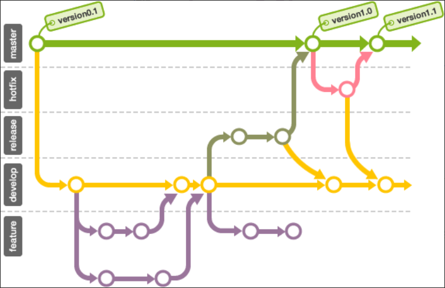

# Git分支规则

### 规则

1. 维护develop针对日常开发分支
2. feature分支自定义名字，完成需求后删除
3. 线上紧急BUG修改使用hotfix-开头的分支从master上建立分支
4. 待发布上线分支使用release-开头分支

### 详细描述

强烈建议阅读「A successful Git branching model」一文。它列出了现在最常用来管理Git分支的方法。

A successful Git branching model 英文原文网址:

http://nvie.com/posts/a-successful-git-branching-model/

根据文章的建议，我们将分支分为四种类型，每个都有不同的角色。

- Main分支
- Feature分支（亦可称Topic分支）
- Release分支
- Hot fix分支

分别使用四个种类的分支来进行开发。

### **Main分支**

主要分支有两种： master 分支和develop 分支。

- **Master**

Master 分支只负责管理发布的状态。当准备好发布指定版本时，最后的提交会给予一个发布版本标签。

- **Develop**

Develop 分支是针对日常开发的分支。所有新功能开发最终都会合并到这里，类似刚才已经讲解过的integration分支的功用。

### **Feature分支**

Feature分支就是在前面讲解过的topic分支的功用。

这个分支是新功能的开发或修复错误的时候从develop 分支分开出来的。Feature分支的操作基本上不需要共享，所以不需要在远端数据库建立分支，当完成开发后，合并回develop 分支后发布。

### **Release分支**

Release分支是为了发布而准备的。通常这种分支的名称最前面会加上"release-" 。

一般的开发是在develop 分支上进行，到了快要可以发布的状态时才会建立release分支，release分支主要是做发布前最后错误修复所建立的分支。成员可以在这个分支里进行最后的调整，而其他成员依旧可以在develop 分支上进行功能开发，不会相互干扰而影响最后发布。

到了可以发布的状态时，请将release分支合并到master 分支，并在合并提交里添加release版本号标签。

最好将release分支所作的修改合并到develop 分支，以确保develop 分支和master 分支同步到release分支的最新错误修复/变更。

### **Hot fix分支**

Hot fix分支是在发布的产品需要紧急修改时，从master 分支建立的分支。通常会在分支名称的最前面会加上"hotfix-"。

例如，在develop 分支上的开发还不完整，需要紧急修改，这个时候在develop 分支建立可以发布的版本要花许多的时间，所以最好从master 分支直接建立分支进行修改，然后再合并分支。

请注意，修改时建立的hot fix分支，也要合并回develop 分支喔。