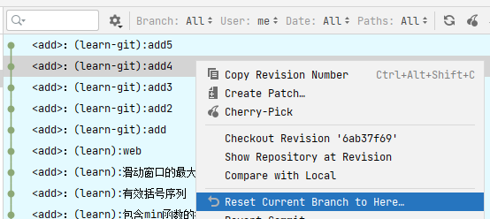
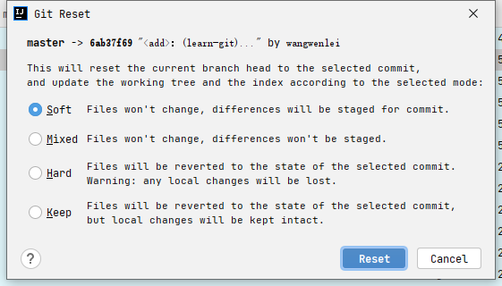
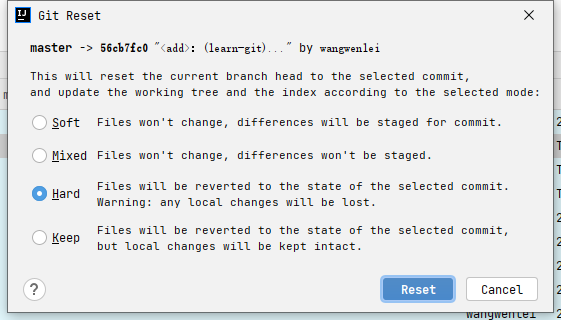
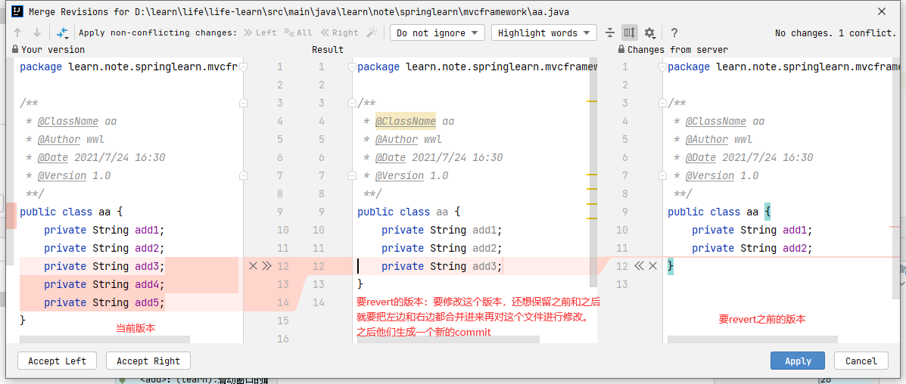
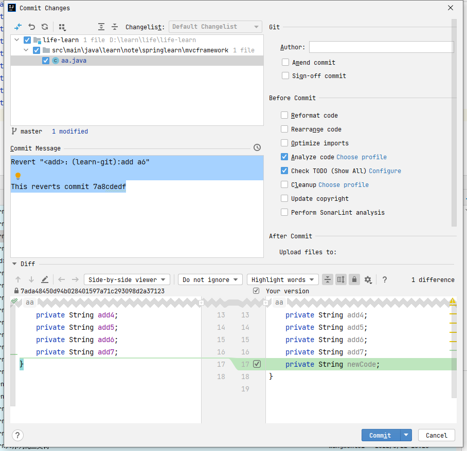

# git reset与revert的区别

## 0.基础知识铺垫
搞懂了三个区域，才能更好理解这些Git命令是在干什么

* Workspace：工作区
* Index / Stage：暂存区
* Repository：仓库区（或本地仓库）（或版本库）

左侧为工作区，右侧为版本库。

在版本库中标记为 "index" 的区域是暂存区（stage/index）

标记为 "master" 的是 master 分支所代表的目录树。

直观理解下
一个文件添加改动

感觉这里IDEA自动把文件使用了 `git add .`了
文件使用`git add .`会把文件放入暂存区

## 1. reset
### reset命令的作用？
reset命令把当前分支指向另外一个位置（提交的ID版本号），并且有选择性的变动暂存区和工作区的内容。

原理是基于本地仓库的文件去覆盖暂存区或工作区的内容

当执行 git reset HEAD 命令时，暂存区的目录树会被重写，被 master 分支指向的目录树所替换，但是工作区不受影响。

### 3个

* mixed（默认）
默认的时候，只有暂存区变化
soft参数告诉Git重置HEAD到另外一个commit，但也到此为止。如果你指定--soft参数，Git将停止在那里而什么也不会根本变化。这意味着stage(index),Workspace都不会做任何变化，所有的在original HEAD和你重置到的那个commit之间的所有变更集都放在stage(index)区域中。

* hard参数
如果使用--hard参数，那么工作区也会变化

* soft
如果使用--soft参数，那么暂存区和工作区都不会变化
mixed是reset的默认参数，也就是当你不指定任何参数时的参数。它将重置HEAD到另外一个commit,并且重置index以便和HEAD相匹配，但是也到此为止。Workspace不会被更改。所有该branch上从original HEAD（commit）到你重置到的那个commit之间的所有变更将作为local modifications保存在working area中，（被标示为local modification or untracked via git status)，但是并未staged的状态，你可以重新检视然后再做修改和commit

### 分别举例子
准备几个提交的分支，如下

#### 1. soft 软的（暂存区和工作区都不会变化）
这个不会变化是保持现在没有回滚前的文件不变
先针对4的提交进行回退使用`soft`
用IDE看下使用效果

点击`Soft`，后点击`Reset`

发现，暂存区保留了回滚版本的代码，变成了待`commit`的状态（这个是跟版本库比较）

#### 2. hard 硬的（暂存区和工作区都变化）

步骤一致选择Hard

发现，任何本地的文件都回退，没有任何保留，直接到目标commit

#### 3. mixed 混合的（只有暂存区变化）

步骤一致选择Mixed

发现，暂存区保留了回滚版本的代码，变成了待`commit`的状态（这个是跟版本库比较）

#### 小结
这么看来，Mixed和Soft好像没什么区别，其实不然。他们对Index和Workspace的影响不同

> 详情查看：https://www.cnblogs.com/kidsitcn/p/4513297.html

## revert

`revert`命令撤销指定的`commit`并且新建一个`commit`，新建`comment`的内容由指定`commit`前一个提交内容保持一致

一种情况：

再一种情况：

回滚到a6，看下b2是否还在

发现b2还在，表示不会影响到别的提交

