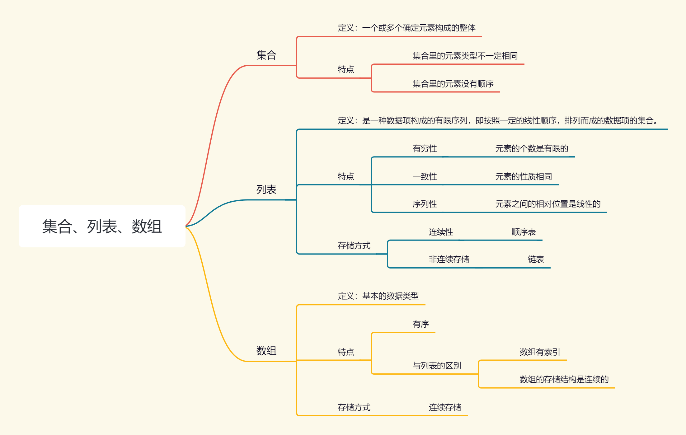

# 集合、列表、数组

## 集合、列表、数组的区别



## 数组的操作
数组作为基础的数据类型，需要熟悉并掌握它的创建、查询、修改、新增、删除

### 创建数组

使用Java语言以整型创建一个数组
```java
public class Test {
    public static void main(String[] args) {
        int[] arr = {9, 8, 7, 6, 5, 4, 3, 2, 1, 0};
    }
}
```


### 查询

要查询 数组中数字3所在的位置代码如下
```java
public class Test {
    public static void main(String[] args) {
        int[] arr = {9, 8, 7, 6, 5, 4, 3, 2, 1, 0};
        for (int i = 0; i < arr.length; i++) {
            if (arr[i] == 3) {
                System.out.println("当前数字在第" + i + "个位置");
            }
        }
    }
}
```

### 新增到第i个位置
这个需要分两种情况分别处理。一种是插入到数组的最后面，直接找到最后面位置插入。另一种是插入到中间，找到位置把数据插入，原来这之后每个位置向后移动一个。

> 数组创建之后大小固定，如果要插入需要重新创建一个比当前数组大一个的数组，重新给新数组每个位置赋值。

```java
import java.util.Scanner;

public class Test {
    public static void main(String[] args) {
        int[] arr = {9, 8, 7, 6, 5, 4, 3, 2, 1, 0};

        Scanner scanner = new Scanner(System.in);
        int i = scanner.nextInt();
        System.out.println("读到插入位置为：" + i);
        int data = scanner.nextInt();
        System.out.println("读到插入数据为：" + data);

        int[] arrCopy = addArray(arr, i, data);
        for (int i1 : arrCopy) {
            System.out.print(i1 + " ");
        }

    }

    private static int[] addArray(int[] arr, int index, int data) {
        if (index > arr.length + 1) {
            System.out.println("插入位置超出长度");
            return arr;
        }
        int[] copyArr = new int[arr.length + 1];
        if (index == arr.length + 1) {
            System.arraycopy(arr, 0, copyArr, 0, arr.length);
            copyArr[index - 1] = data;
            return copyArr;
        }

        int realIndex = index - 1;
        for (int i = 0; i < arr.length + 1; i++) {
            if (i < realIndex) {
                copyArr[i] = arr[i];
            } else if (i == realIndex) {
                copyArr[i] = data;
            } else {
                copyArr[i] = arr[i - 1];
            }
        }
        return copyArr;
    }
}
```

### 删除
删除也是两种情况。一种删除最后一个元素，找到位置把前面数据都复制到一个新的数组。另一种在中间删除，需要找到位置把他后面的数据都往前一位。

```java
import java.util.Scanner;

public class Test {
    public static void main(String[] args) {
        int[] arr = {9, 8, 7, 6, 5, 4, 3, 2, 1, 0};

        Scanner scanner = new Scanner(System.in);
        int i = scanner.nextInt();
        System.out.println("读到删除位置为：" + i);

        int[] arrCopy = delArray(arr, i);
        for (int i1 : arrCopy) {
            System.out.print(i1 + " ");
        }

    }

    private static int[] delArray(int[] arr, int index) {
        if (index > arr.length || index < 0) {
            System.out.println("删除位置异常");
            return arr;
        }
        // 创建一个比当前数组少一个的新数组
        int[] copyArr = new int[arr.length - 1];
        if (arr.length == index) {
            System.arraycopy(arr, 0, copyArr, 0, arr.length - 1);
            return copyArr;
        }

        int realIndex = index - 1;
        for (int i = 0; i < arr.length - 1; i++) {
            if (i < realIndex) {
                copyArr[i] = arr[i];
            } else {
                copyArr[i] = arr[i + 1];
            }
        }
        return copyArr;
    }
}
```

