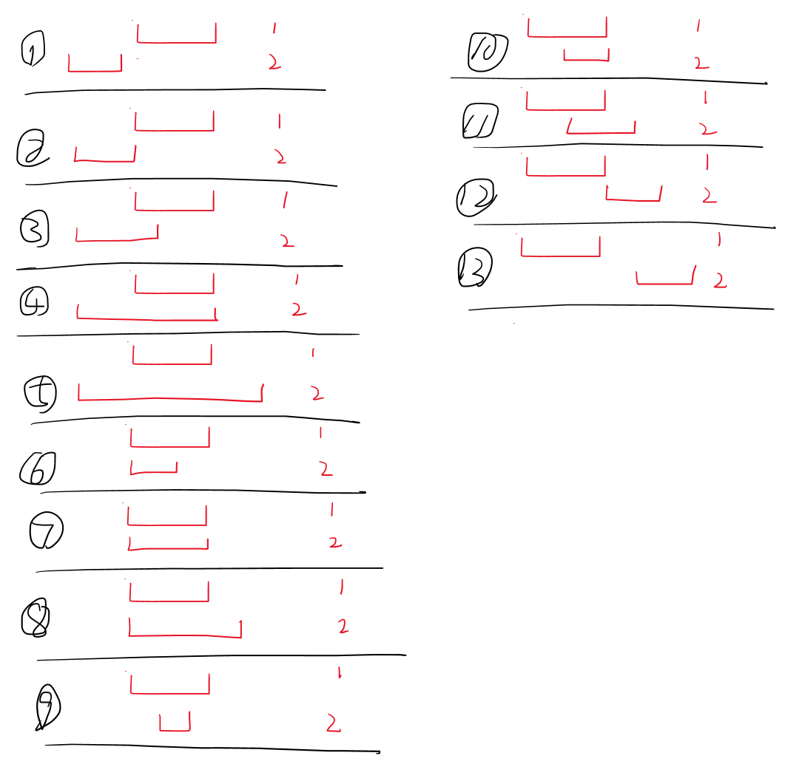
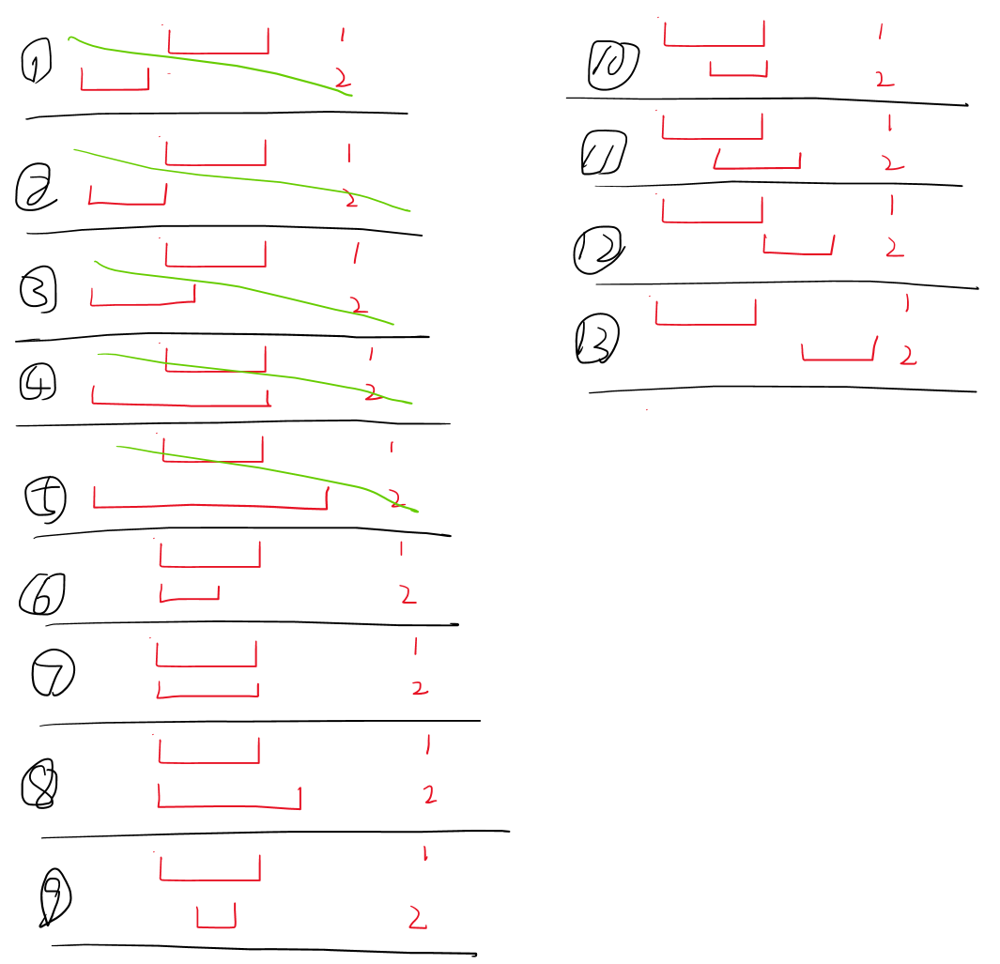

# 合并区间

以数组 intervals 表示若干个区间的集合，其中单个区间为 intervals[i] = [starti, endi] 。请你合并所有重叠的区间，并返回 一个不重叠的区间数组，该数组需恰好覆盖输入中的所有区间 。

 

> 示例 1：
> 输入：intervals = [[1,3],[2,6],[8,10],[15,18]]
> 输出：[[1,6],[8,10],[15,18]]
> 解释：区间 [1,3] 和 [2,6] 重叠, 将它们合并为 [1,6].

> 示例 2：
> 输入：intervals = [[1,4],[4,5]]
> 输出：[[1,5]]
> 解释：区间 [1,4] 和 [4,5] 可被视为重叠区间。
 

> 提示：
> 1 <= intervals.length <= 104
> intervals[i].length == 2
> 0 <= starti <= endi <= 104


## 实现

思路：
给出的数组出现顺序不定，会有如下几种情况


所以先把每个数组出现的顺序按照左边大小排列一下。

排列完成后只会出现如下情况：


从左往右遍历，从第二个节点开始
1. 考虑13的情况，如果此节点开始比前一个节点的结束大封存前一个节点
2. 考虑第6、7、8的情况，排序结束后此节点的开始跟前一个节点的开始一致，取前一个节点的开始即可。结束需要取当前节点的结束与前一个节点的结束的最大值
3. 到了9、10、11的情况，前一个节点的范围是最广的取前一个节点的开始即可。结束需要取当前节点的结束与前一个节点的结束的最大值
4. 考虑12的情况，前一个节点的范围是最广的取前一个节点的开始即可。结束需要取当前节点的结束，这样可以与第三个合并考虑。


```java
public class MergeArr {
    public static void main(String[] args) {
        int[][] merge = merge(new int[][]{{1, 6}, {8, 10}, {15, 18}});
        if (merge != null) {
            for (int[] ints : merge) {
                System.out.println(ints[0] + "," + ints[1]);
            }
        }
    }
    public static int[][] merge(int[][] intervals) {
        if (intervals == null || intervals.length == 0) {
            return null;
        }
        if (intervals.length == 1) {
            return intervals;
        }
        Arrays.sort(intervals, Comparator.comparingInt(i -> i[0]));
        int[][] arr = new int[intervals.length][2];
        int index = 0;
        arr[index] = intervals[0];

        for (int i = 1 ; i < intervals.length ; i++) {
            int[] ints = intervals[i];
            if (ints[0] < arr[index][1]) {
                arr[index][1] = Math.max(arr[index][1], ints[1]);
            } else {
                index++;
                arr[index] = ints;
            }
        }
        return Arrays.copyOfRange(arr, 0,index + 1);
    }
}
```

---

题目来源作者：LeetCode
链接：https://leetcode.cn/leetbook/read/array-and-string/c5tv3/
来源：力扣（LeetCode）
著作权归作者所有。商业转载请联系作者获得授权，非商业转载请注明出处。