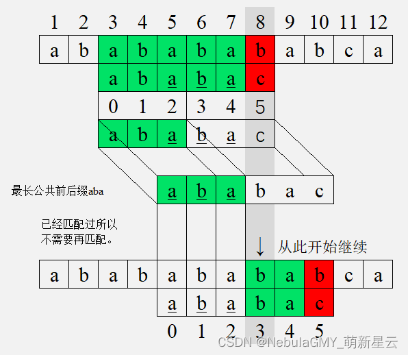
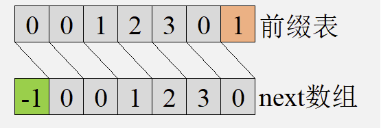

# KMP算法

## 什么是KMP算法？

KMP算法是一种改进的字符串匹配算法，由D.E.Knuth，J.H.Morris和V.R.Pratt提出的，因此人们称它为克努特—莫里斯—普拉特操作（简称KMP算法）。

KMP算法的核心是利用匹配失败后的信息，尽量减少模式串与主串的匹配次数以达到快速匹配的目的。具体实现就是通过一个next()函数实现，函数本身包含了模式串的局部匹配信息。KMP算法的时间复杂度 `O(m+n)`。

[文章讲的很详细](https://cloud.tencent.com/developer/article/2235837)

[这个原理用图示比较清晰](https://kb.cnblogs.com/page/176818/)
#### 字符串的前缀和后缀

首先我们需要知道字符串的前缀和后缀： 对于字符串`ababc`来说，它的前缀有`[a,ab,aba,abab]`，也就是以字符串第一个字符作为开头，同时不包括最后一个字符的所有子串，同理它的后缀有`[c,bc,abc,babc]`，也就是以字符串最后一个字符作为结尾，同时不包括第一个字符的所有字串。

#### 字符串的最长公共前后缀

了解了这个，我们再来说什么是字符串的**最长公共前后缀**，说白了，也就是前缀和后缀这2个集合中的相同部分，同时取最长的那个，就是这个字符串的**最长公共前后缀**。显然，在这个例子中，`ababc`是没有公共前后缀的。但是对于`abab`，它的前缀和后缀分别是`[a,ab,aba]`和`[b,ab,bab]`，那么它的**最长公共前后缀**就是`ab`。

现在，我们的目标就是取得`ababc`所有子串`[a,ab,aba,abab,ababc]`的**最长公共前后缀**的长度，分别保存在`next`数组中，我们只要知道最大长度即可，并不用关心串具体是什么，而我们目前通过观察即可得出next数组这里是`[0,0,1,2,0]`，我们先知道这个结果即可，此计算方法后续会说明。

取一个萌新星云博主分享的一个图片，很形象的说明这个匹配逻辑：

已经匹配过的aba就不用再次进行匹配，而是从index=3的b继续匹配，相较于BF算法节省了大量匹配操作。在KMP算法中，每次移动的位置都由在此处匹配的字符其前缀的最长公共前后缀决定。



### next数组

> [摘自NebulaGMY_萌新星云](https://blog.csdn.net/gmynebula/article/details/125239503)

前缀表存储每一个前缀的最长公共前后缀的长度，next数组存储的是模式串向右移动到next值的位置，这个值与前缀的最长公共前后缀的长度有关，所以next数组是可以由前缀表生成的。

用前缀表生成一个next数组很容易，将前缀表每一位都向后移动1位（最后一位舍去）并在第一位补一个-1就得到了next数组。



-1,0开头与0, 1开头的next数组本质是一样的。实际上，以0, 1开头的next数组就是以-1,0开头的next数组每一项加1得到的。

出现这种情况的原因在于模式串起始的索引值：在程序中，一个数组的索引的起始值为0；然而在考试和书中给的模式串起始值是多从1开始。

所以在考试中遇到的next数组通常是以0, 1开头；而一些程序或教程中的next数组是以-1, 0开头。

[摘自关于next函数区分](https://blog.csdn.net/2301_76768325/article/details/134933251)
有的博主讲的next函数前两个值分别为0 1
有的博主讲的next函数前两个值分别为-1 0

在这里我做一下区分，首先说明两种都是对的，只不过是两种不同的方法

* 第一种：前两个值为0 1是在将字符串编号时候从1开始往后编，这种情况的next函数前两个值必须是0 1
* 第二种：前两个值为-1 0是在将字符串编号时候从0开始往后编，这种情况的next函数前两个值必须是-1 0

用第二种方法求出来next数组的值之后整体都加1之后就和第一种方法求出的next数组值相同了

觉得下面这两个解释的更精准

> https://kb.cnblogs.com/page/176818/

> http://jakeboxer.com/blog/2009/12/13/the-knuth-morris-pratt-algorithm-in-my-own-words/

## 暴力破解版

实现思路：两层循环，外层循环控制主串，内层循环控制模式串。所以需要两个变量 i 和 j ，它们都是从 0  开始。如果如果匹配上就都往后走一步，依次。没有匹配上模式串重头开始，主串返回到开始匹配的下一个字符，重新遍历。直到都匹配上返回匹配的起点或都没有匹配上返回 -1 。

```java
package learn.note.algorithm.arr;

/**
 * @author Wang WenLei
 * @version 1.0
 * @since 2024/1/18 10:16
 */
public class Kmp {
    public static void main(String[] args) {
        char [] str = new char[] {'a','b','c','a','b','c','a','d'};
        char [] pattern = new char[] {'a','b','c','a','d'};

        System.out.println(forceMethod(str, pattern));
    }

    public static int forceMethod(char [] str, char [] pattern) {
        if (str == null || str.length == 0 || pattern == null || pattern.length == 0) {
            return -1;
        }

        int i = 0;
        int j = 0;

        while (i < str.length) {
            while (j < pattern.length) {
                if (str[i] == (pattern[j])) {
                    i++;
                    j++;
                } else {
                    i = i - j + 1;
                    j = 0;
                    break;
                }
            }
            if (j == pattern.length) {
                return i - j;
            }
        }
        return -1;
    }
}
```

## 最朴素的KMP算法实现

思想：对比暴力实现，提前做一些处理，让 i 永远不回退，只回退 j 来使得匹配效率有所提升

