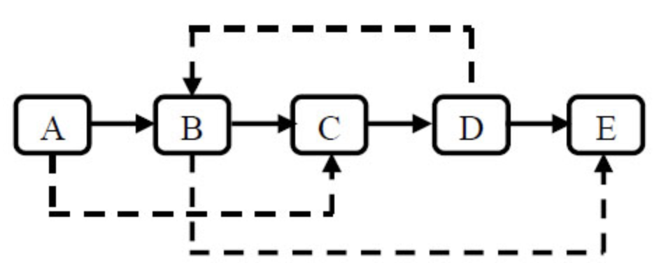

# 复杂链表的复制

## 描述
输入一个复杂链表（每个节点中有节点值，以及两个指针，一个指向下一个节点，另一个特殊指针random指向一个随机节点），请对此链表进行深拷贝，并返回拷贝后的头结点。（注意，输出结果中请不要返回参数中的节点引用，否则判题程序会直接返回空）。 下图是一个含有5个结点的复杂链表。图中实线箭头表示next指针，虚线箭头表示random指针。为简单起见，指向null的指针没有画出。



## 解题思路

### 使用Hash结构
1. 把所有节点都放在Map里，k使用当前链表节点，v使用new出来的节点
2. 循环Map，每个元素都找他的next和random，分别给value赋值

### 不使用Hash结构
1. 每个节点都拷贝一个放在该节点的后面
2. 再循环一次，需要拷贝random是该random的next
3. 循环一次奇偶拆分链表

## 实现代码

### 使用Hash结构
```java
import java.util.Map;
import java.util.HashMap;
public class Solution {
    public RandomListNode Clone(RandomListNode pHead) {
        if (pHead == null) {
            return null;
        }
        Map<RandomListNode,RandomListNode> map = new HashMap<>();
        RandomListNode next = pHead;
        while (next != null) {
            map.put(next,new RandomListNode(next.label));
            next = next.next;
        }
        map.forEach((k,v) -> {
            RandomListNode caypNext = map.get(k.next);
            if (caypNext != null) {
                v.next = caypNext;
            }
            RandomListNode caypRandom = map.get(k.random);
            if (caypNext != null) {
                v.random = caypRandom;
            }
        });
        RandomListNode head = map.get(pHead);
        return head;
    }
}
```

### 不使用Hash结构
```java
public class Solution {
    public RandomListNode Clone(RandomListNode pHead) {
        if (pHead == null) {
            return null;
        }
        RandomListNode next = pHead;
        while (next != null) {
            RandomListNode after = next.next;
            RandomListNode capy = new RandomListNode(next.label);
            next.next = capy;
            capy.next = after;
            next = after;
        }
        next = pHead;
        while (next != null) {
            RandomListNode random = next.random;
            if (random != null) {
                next.next.random = next.random.next;
            } else {
                next.next.random = null;
            }
            next = next.next.next;
        }
        RandomListNode res = pHead.next;
        RandomListNode cur = pHead;
        RandomListNode clone = pHead.next;
        //拆分两个链表
        while(cur != null){
            //cur.next必定不为空
            cur.next = cur.next.next;
            cur = cur.next;
            //检查末尾节点
            if(clone.next != null)
                clone.next = clone.next.next;
            clone = clone.next;
        }
        return res;
    }
}
```
