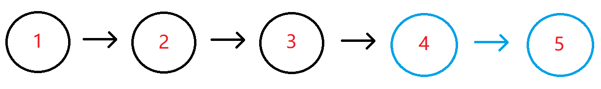

# 链表中倒数最后k个结点
[[toc]]
## 描述
输入一个长度为 n 的链表，设链表中的元素的值为 ai ，返回该链表中倒数第k个节点。
如果该链表长度小于k，请返回一个长度为 0 的链表。


数据范围：0 <= n <= 10^5，0 <= a_i <= 10^9，0 <= k <= 10^9
 
要求：空间复杂度 O(n)，时间复杂度 O(n)

进阶：空间复杂度 O(1)，时间复杂度 O(n)

例如输入{1,2,3,4,5},2时，对应的链表结构如下图所示：



其中蓝色部分为该链表的最后2个结点，所以返回倒数第2个结点（也即结点值为4的结点）即可，系统会打印后面所有的节点来比较。

## 解题思路
### 要求版本
把所有结点压入栈中，弹出K个，第k个就是。

### 进阶版本
循环计算总计有多少节点，用总计减去k得到前面的节点。再次循环到这个结点就是目标结点

## 代码
### 要求版
```java
import java.util.*;
public class Solution {
    public ListNode FindKthToTail (ListNode pHead, int k) {
        if (pHead == null || k == 0) {
            return null;
        }
        Stack<ListNode> stack = new Stack<>();
        ListNode next = pHead;
        while (next != null) {
            stack.push(next);
            next = next.next;
        }
        if (stack.size() < k) {
            return null;
        } else {
            for (int i = 0; i < k ; i++) {
                next = stack.pop();
            }
            return next;
        }
        
    }
}
```

### 进阶版
```java
import java.util.*;
public class Solution {
    public ListNode FindKthToTail (ListNode pHead, int k) {
        if (pHead == null || k == 0) {
            return null;
        }
        ListNode next = pHead;
        int i = 0;
        while (next != null) {
            i++;
            next = next.next;
        }
        if (k > i) {
            return null;
        } else {
            int num = i - k;
            next = pHead;
            for (int j = 0 ; j < num ; j++) {
                next = next.next;
            }
            return next;
        }
    }
}
```
