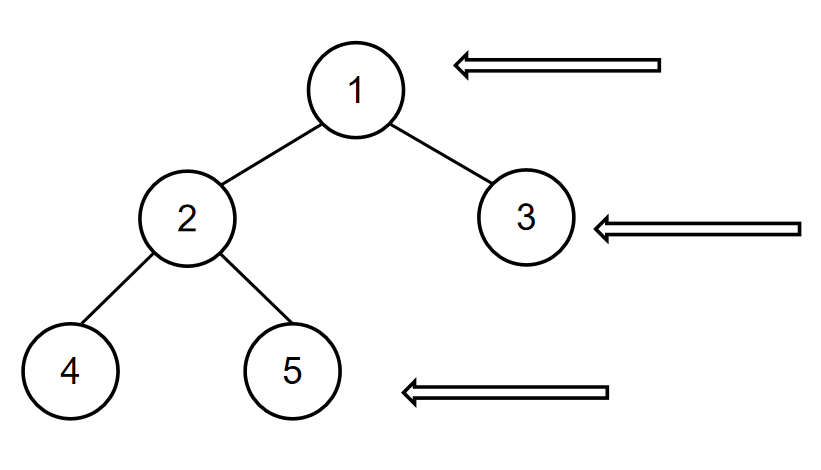

# 二叉树的右视图
[[toc]]

## 0.题目
请根据二叉树的前序遍历，中序遍历恢复二叉树，并打印出二叉树的右视图

数据范围： 0≤n≤10000
要求： 空间复杂度 O(n)，时间复杂度 O(n)

如输入[1,2,4,5,3],[4,2,5,1,3]时，通过前序遍历的结果[1,2,4,5,3]和中序遍历的结果[4,2,5,1,3]可重建出以下二叉树：



所以对应的输出为[1,3,5]。

示例1
```
输入：
[1,2,4,5,3],[4,2,5,1,3]
返回值：
[1,3,5]
```

> 备注：
> 二叉树每个节点的值在区间[1,10000]内，且保证每个节点的值互不相同。

## 1.思路
1. 根据先序遍历和中序遍历重构出二叉树
2. 基本是层序遍历（宽度遍历）的思想
3. 第一版本使用Map记录每层里的结点，结果空间超了。就直接使用2层循环让每层里的每个结点都完成取这一层的最后一个元素的值就是这一层右视图的值。

## 2.代码
```java
public class Bm41_solve {
    public static void main(String[] args) {

    }

    public int[] solve (int[] xianxu, int[] zhongxu) {
        // 构建二叉树
        TreeNode tree = re(xianxu, zhongxu);
        if (tree == null) {
            return new int[]{};
        }

        // 层序
        Queue<TreeNode> queue = new LinkedList<>();
        queue.add(tree);
        List<Integer> list = new ArrayList<>();
        TreeNode poll =  null;
        // 层
        while (!queue.isEmpty()) {
            int size = queue.size();
            // 每层结点直接循环完
            while (size > 0) {
                size--;
                poll = queue.poll();
                if (poll.left != null) {
                    queue.add(poll.left);
                }
                if (poll.right != null) {
                    queue.add(poll.right);
                }
            }
            // 层的最后一个结点的值
            list.add(poll.val);
        }
        int [] arr = new int[list.size()];
        for (int i = 0 ; i < list.size() ; i++) {
            arr[i] = list.get(i);
        }
        return arr;
    }

    public TreeNode re(int[] xianxu, int[] zhongxu) {
        if (xianxu == null || xianxu.length == 0) {
            return null;
        }

        if (zhongxu == null || zhongxu.length == 0) {
            return null;
        }

        TreeNode root = new TreeNode(xianxu[0]);

        for (int i = 0 ; i < zhongxu.length ; i++) {
            if (xianxu[0] == zhongxu[i]) {
                root.left = re(Arrays.copyOfRange(xianxu,1,i + 1),Arrays.copyOfRange(zhongxu,0,i));
                root.right = re(Arrays.copyOfRange(xianxu,i + 1,xianxu.length),Arrays.copyOfRange(zhongxu,i + 1,zhongxu.length));
            }
        }
        return root;
    }
}
```
