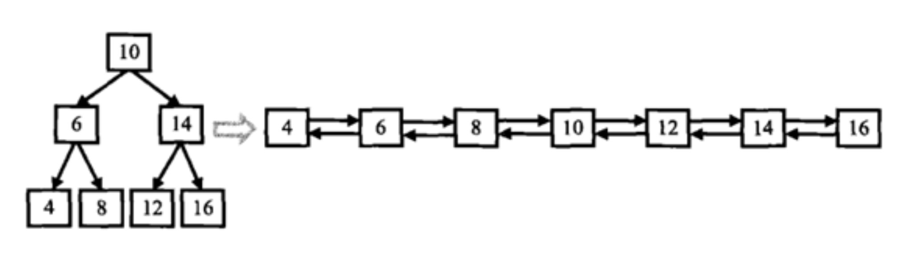

# 二叉树与双向链表
[[toc]]
## 0. 题目
题目来自牛客网
输入一棵二叉搜索树，将该二叉搜索树转换成一个排序的双向链表。如下图所示



数据范围：输入二叉树的结点数 0 <= n <= 10000≤n≤1000，二叉树中每个结点的值 0<= val <= 10000≤val≤1000
要求：空间复杂度O(1)（即在原树上操作），时间复杂度 O(n)

注意:
1.要求不能创建任何新的结点，只能调整树中结点指针的指向。当转化完成以后，树中结点的左指针需要指向前驱，树中结点的右指针需要指向后继
2.返回链表中的第一个结点的指针
3.函数返回的TreeNode，有左右指针，其实可以看成一个双向链表的数据结构
4.你不用输出双向链表，程序会根据你的返回值自动打印输出

输入描述：
二叉树的根结点
返回值描述：
双向链表的其中一个头结点。

示例1
```
输入：
{10,6,14,4,8,12,16}
返回值：
From left to right are:4,6,8,10,12,14,16;From right to left are:16,14,12,10,8,6,4;
说明：
输入题面图中二叉树，输出的时候将双向链表的头结点返回即可。     
```

示例2
```
输入：
{5,4,#,3,#,2,#,1}
返回值：
From left to right are:1,2,3,4,5;From right to left are:5,4,3,2,1;
说明：
                    5
                  /
                4
              /
            3
          /
        2
      /
    1
树的形状如上图  
```

## 1.准备
* 前驱结点：中序遍历，一个结点的前一个结点为前驱结点
* 后驱结点：中序遍历，一个结点的后一个结点为后驱结点


## 2.非递归解法
### 2.1思路
1.需要一个变量pre保存前驱结点。
2.编写非递归中序遍历的代码
3.因为弹出栈中的结点已经不再使用，所以可以直接修改它的指针，周而复始全部结点的指针都修改。就可已完成

修改指针思路：
一开始没有前驱结点，pre=null;
弹出结点的左指针指向前驱结点pro；
如果前驱结点不为空，前驱结点右指针指向当前结点（即从第二次开始生效）；

### 2.2代码
```java
package learn.note.algorithm.binarytree;

import java.util.Stack;

/**
 * @Author Wang WenLei
 * @Date 2022/3/13 11:38
 * @Version 1.0
 **/
public class Bm30_ConvertList {
    public static void main(String[] args) {
        TreeNode tree = CreateTree.createTree();

        TreeNode convert = convert(tree);
        System.out.println(convert);
    }

    public static TreeNode convert(TreeNode pRootOfTree) {
        if (pRootOfTree == null) {
            return null;
        }
        Stack<TreeNode> stack = new Stack<>();

        TreeNode pre = null;
        TreeNode cur = pRootOfTree;
        TreeNode head = null;

        while (!stack.empty() || cur != null) {
            if (cur != null) {
                stack.push(cur);
                cur = cur.left;
            } else {
                cur = stack.pop();

                if (pre != null) {
                    pre.right = cur;
                    cur.left = pre;
                } else {
                    head = cur;
                    cur.left = null;
                }
                pre = cur;
                cur = cur.right;
            }
        }

        return head;
    }
}
```

## 3.递归实现
### 3.1思路
改成递归方式
